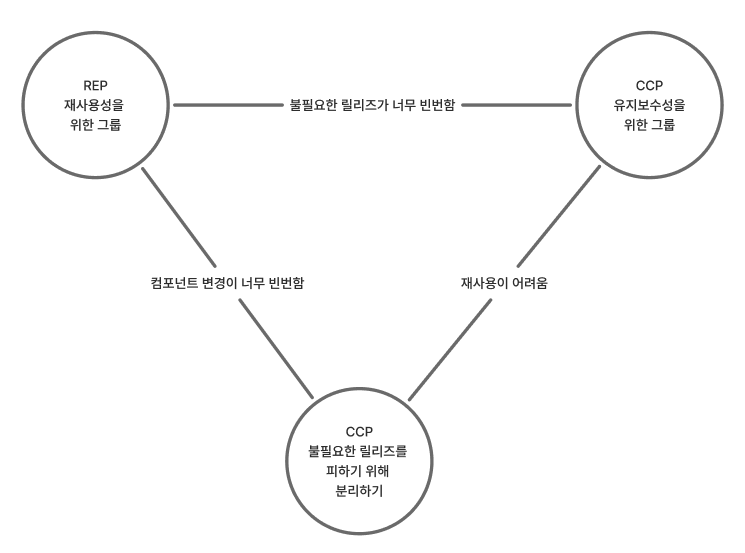

# 작성일

- 2025-11-23

# 컴포넌트

컴포넌트는 하나의 배포 단위다. 자바의 경우 jar, 닷넷의 경우 DLL이 하나의 컴포넌트다.

자바에서는 여러 컴포넌트를 묶어 war 같은 단일 아카이브로 만들 수 있다. 잘 설계된 컴포넌트는 반드시 독립적으로 배포 가능하고 개발 가능한 구조를 갖춰야 한다.

이 처럼 컨포넌트 안에는 여러 클래스와 모듈이 들어간다.

클린 아키텍처의 핵심은 컴포넌트안에 존재하는 클래스와 모듈들 간의 의존성에 지대한 관심을 가진다. 이것이 아키텍처의 시작이기 때문이다.
이를 컴포넌트 응집도 라고 표현한다.

# 컴포넌트 응집도

어떤 클레스가 어떤 클래스를 포함해야할지 원칙을 가지고 컴포넌트를 구현한다.

## 컴포넌트 응집도 3원칙

- REP(Reuse/Release Equivalence Principle): 재사용/릴리즈 등가원칙
  - 하나의 컴포넌트로 묶인 클래스와 모듈은 반드시 함께 릴리즈할 수 있어야 하며 같은 버전을 갖는다.
- CCP(Common Closure Principle): 공통 폐쇄 원칙
  - 변경되는 컴포넌트가 영향을 받는 범위에 대한 원칙
  - 동일한 시점에 변경되는 클래스는 같은 컴포넌트로 묶어라.
  - 서로 다른 시점에 변경되는 클래스는 다른 컴포넌트로 묶어라.
  - 같은 이유로 변경될 수 있는 클래스는 모두 하나의 컴포넌트로 묶어라.
- CRP(Common Reuse Principle): 공통 재사용 원칙
  - 클래스와 모듈을 어느 위치에 위치시킬지 결정할 때 도움이 되는 원칙
  - 재사용되는 경향이 있는 클래스와 모듈은 같은 컴포넌트에 포함 해야 한다.
  - ISP는 사용하지 않는 메서드가 있는 클래스에 의존하지 말라고 조언한다.

## 컴포넌트 응집도에 대한 균형 다이어그램

REP와 CCP는 포함(inclusive) 원칙이다. 두 원칙은 컴포넌트 사이즈를 크게 만든다. 반대로 CRP은 배제(exclusive) 원칙이다. 의미 그대로 컴포넌트를 작게 만드는 원칙이다.

이 3가지 원칙들이 균형을 이루지 못하면 다음과 같은 부작용이 발생한다.

위 다이어그램과 같이 균형을 잃었을 경우 REP와 CRP에만 중점을 두면 사소한 변경이 생겼을 때 너무 많은 컴포넌트에 영향을 미친다.

### REP, CRP에만 집중할 경우 발생하는 현상

컴포넌트 변경이 너무 빈번해진다.
