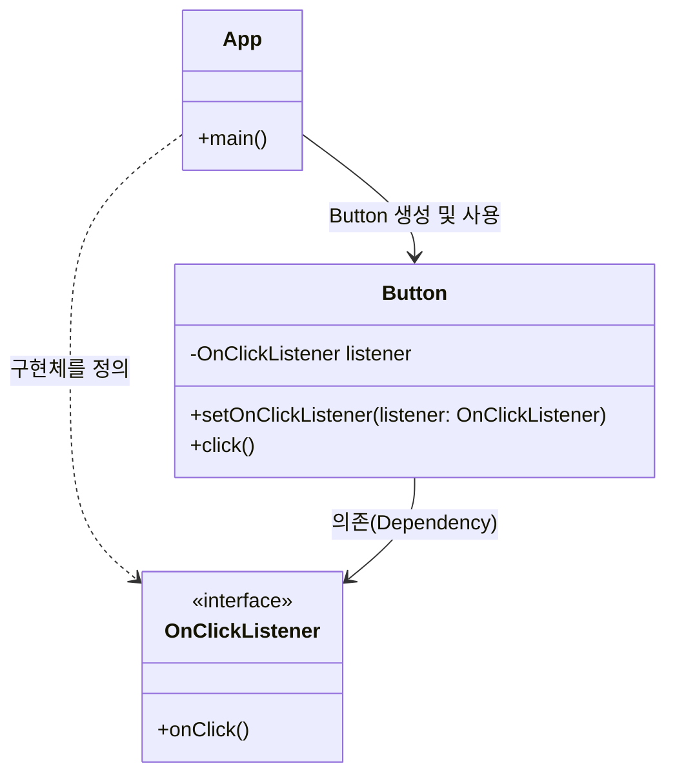

# 작성일

- 2025-11-19

# 다형성

다형성은 OO의 4대 원칙 중 하나다.
다양한 형태로 프로그램을 정의함으로써 사람이 이해하는 방향으로 코드를 확장해 나갈 수 있다는 장점이 있다. 그러나 그 기저에는 여전히 함수를 호출하여 프로그램을 실행시키는
시스템콜 들이 존재하기 때문에 결국은 함수 호출이라는 비판적인 시선도 존재했다.

유닉스에서 컴퓨터의 모든 자원은 FILE이다. 쓰레드와 프로세스는 물론 모니터와 프린터 심지어 소켓 조차도 FILE로 인지하고 메모리에 존재하는 파일을 열고, 닫고, 읽고, 쓰고, 찾는 기능으로 정의가 된다.

여기서 강조 되는 것은 함수를 가리키는 포인터를 응용한 것이 다형성이라는 점이다.

다음은 다형성의 근간이 되는 기법을 파일을 통해 옅볼 수 있다.

```c
struct FILE {
    void (*open)(char* name, int mode);
    void(*close)();
    int (*read)();
    void (*write)(char);
    void (*seek)(long index, int mode);
};

#include "file.h"

void open(char* name, int mode){/*...*/}
void close(){/*...*/}
int read(){int c; /*...*/ return c;}
void write(char c){/*...*/}
void seek(long index, int mode){/*...*/}

extern struct FILE* STDIN;

int getcher(){
    return STDIN->read();
}
```

위와 같이 호출하면 getchar() 는 STDIN으로 참조되는 FILE 데이터 구조의 read 포인터가 가리키는 함수를 단순히 호출하는 것 뿐이다.

그렇다면 왜 결국은 단순한 I/O 행위일 뿐인 것을 복잡하게 OO가 필요하며 어려운 방식으로 프로그래밍을 하는 것일까?

이유는 세상이 그렇게 간단하게 돌아가지 않기 때문이 아닐까. 수많은 변수가 존재하고 수많은 이벤트와 행위 들에의해 세상이 돌아간다. 컴퓨터는 세상을 추상적으로 표현하여 디지털화된 데이터를 적재적소에 사용함으로써 가치를 만들어 낸다.

단순히 파일에 함수를 호출해 값을 바꾸는 것이 컴퓨터와 소프트웨어의 전부가 아니기 때문에 다양한 언어들에서 OO를 통해 세상을 추상화하고 우리는 그 세계에서 살아가고있다.

OO언어는 다형성을 만들지 못했지만 포인터에 대한 불편한 개념을 가지고 프로그래밍을 하는 내내 에너지를 빼앗기는 현상을 제거해 주었고 안전한 규칙안에서 제어의 흐름을 간접적으로 전환하는 규칙을 부과 했다.

# 의존성 역전

초기 프로그램은 의존성이 한쪽 방향으로 흘렀다. Main에서 함수를 호출하고 함수는 다시 고수준 함수를 호출하는 방식으로 제어 흐름에 따라 의존성 방향이 흘렀다.

하지만 다형성이 등장하고 인터페이스가 생김으로써 하위 모듈에서 인터페이스로 호출 방향이 역전되는 현상이 발생하기 시작했다.

클릭 리스너를 구현하는 예제로 의존성 역전을 살펴보자.

```java
// 라이브러리쪽 하위 모듈
public interface OnClickListener {
    void onClick();
}

public class Button {
    private OnClickListener listener;

    // setter를 통해서 의존성을 주입받는다.
    public void setOnClickListener(OnClickListener listener){
        this.listener = listener;
    }

    // 클릭이벤트가 발생하면
    public void click(){
        if(listener != null) {
            listener.onClick(); // 여기서 상위 모듈이 구현한 코드를 호출
        }
    }
}

public class App {
    public static void main(String[] args) {
        Button button = new Button();
        // 상위 모듈에서 의존성 객체를 생성해 실제 동작을 구현한다.
        button.setOnClickListener(new OnClickListener() {
            @Override
            public void onClick() {
                System.out.println("버튼 클릭됨!");
            }
        });

        button.click(); // 상위 -> 하위로 시작
    }
}

```

위 예제의 호출 흐름을 보면 다음과 같이 호출이 발생한다.

1. App.main (상위) -> button.click() (하위)
2. Button.click() (하위) -> listener.click() (인터페이스를 통해 상위 코드 호출)

기존과 같이 상위에서 하위를 호출하지 않고 App과 Button이 OnClickListener를 서로 의존하고 있는 상태가 되므로 결합되지 않지만 의존하는 형태가 만들어진다.



상위 모듈과 하위 모듈이 구체 클래스에 직접적으로 의존하지 않고 인터페이스를 통해 의존 하도록 함으로써 구현이 이루어 지는 것을 DIP(Dependency Inversion Principle)이라 하며 DIP로 인해 제어의 역전이 성립될 수 있게된 것이다.

제어의 역전을 Inversion of Control이라고 하며 줄여셔 IoC라 표현하는데 프레임워크에서 내가 정의한 코드를 대신 호출하도록 하는 것이 가능해진다.

우리가 흔하게 접하는 예시로 스프링 프레임워크에서는 우리가 객체 생성과 의존 관계를 직접 new로 연결하지 않고, 어떤 빈이 필요하고 어떤 의존성을 요구하는지만 선언해 두면,
IoC 컨테이너가 런타임에 적절한 구현체를 생성하고 의존성을 주입해 준다.

다음과 같이 DIP(원칙), IoC(설계 개념), DI(구현 기법)를 정리해보자.

## DIP (Dependency Inversion Principle, 의존성 역전 원칙)

의존성 역전 원칙은 상위 모듈이 하위 모듈의 구체 구현에 의존하지 않고, 상위·하위 모두 추상(인터페이스, 추상 클래스)에 의존하도록 하라는 원칙이다.
이때 구체 구현(세부 사항)이 오히려 추상에 의존하게 되어 의존성의 방향이 뒤집힌다는 점에서 ‘역전(Inversion)’이라는 이름이 붙는다.
이를 통해 상위 모듈은 구체 기술(DB, 라이브러리, 프레임워크 등)에 덜 묶이고, 구조가 변경과 확장에 더 유연해진다.

## IoC (Inversion of Control, 제어의 역전)

제어의 역전은 애플리케이션의 제어 흐름 주도권을 프레임워크나 컨테이너가 가져가고, 우리가 작성한 코드는 그 안에 콜백·핸들러·빈(Bean) 형태로 등록되어 있다가 프레임워크에 의해 호출되는 설계 방식이다.
즉, “내 코드가 라이브러리를 호출하는 구조”에서 “프레임워크가 내 코드를 호출하는 구조”로 제어 흐름이 뒤집힌 상태를 말한다.
IoC는 DIP, DI 같은 개념과 잘 어울리며, 현대 프레임워크들이 동작하는 기본 철학이다.

## DI (Dependency Injection, 의존성 주입)

의존성 주입은 객체가 스스로 의존 대상을 생성하거나 찾지 않고,
필요한 의존 객체를 외부(컨테이너, 팩토리, 설정 코드 등)에서 전달받는 방식을 말한다.
Spring과 같은 IoC 컨테이너에서는 우리가 “이 클래스가 어떤 인터페이스를 필요로 한다”는 사실만 선언해 두면, 컨테이너가 런타임에 적절한 구현체를 생성하고 생성자/세터/필드를 통해 주입한다.

> DIP는 “추상에 의존하라” 는 설계 원칙이고,
> IoC는 “제어권을 프레임워크가 가진다” 는 전체 구조의 방향이며,
> DI는 이런 IoC·DIP를 실제 코드에서 구현하는 **구체적인 메커니즘(기술)**이라고 보면 된다.
