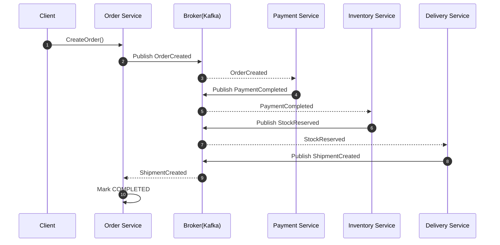
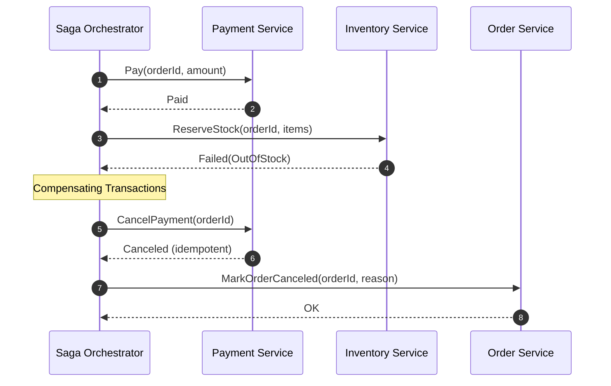
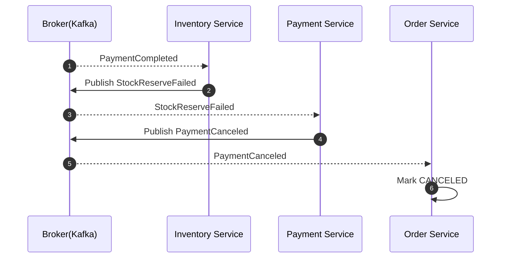

# 작성일

- 2025-12-12

# 예제 시퀀스 다이어그램

## 1. 오케스트레이션 Saga (Orchestrator 중심)

오케스트레이션(Orchestration)

**중앙 지휘자(Orchestrator)**가 있고, 각 서비스에 “다음 단계 실행/보상”을 명령해.

> 흐름: Orchestrator → 결제 → 재고 → 배송 … (실패 시 Orchestrator가 보상 호출)

**장점**

- 전체 플로우가 한 곳에 있어 이해/디버깅/운영이 쉬움
- 복잡한 비즈니스(결제/쿠폰/정산)에서 제어가 명확
- 타임아웃/리트라이/보상 정책을 중앙에서 관리 가능

**단점**

- Orchestrator가 커지면 God Orchestrator 위험
- 중앙 컴포넌트가 장애/변경의 핵이 될 수 있음(HA 필요)

복잡한 업무 흐름, 강한 제어 필요, 장애 분석이 중요한 경우(대부분의 핵심 트랜잭션).

### 1.1. 정상 흐름

## 실패 + 보상(예: 재고 예약 실패) 흐름

## 2. 코레오그래피 Saga (이벤트 기반)

중앙 지휘자 없이 **이벤트 브로커(Kafka 등)**를 통해 각 서비스가 이벤트를 듣고 자기 역할만 수행하면서 다음 이벤트를 발행해.
즉, “명령”이 아니라 “신호”로 움직여.

> 흐름: OrderCreated 이벤트 → Payment가 듣고 처리 → PaymentCompleted 이벤트 → Inventory가 듣고 처리 …

**장점**

- 중앙이 없어 결합도가 낮고 확장에 유리
- 서비스가 독립적으로 진화하기 쉬움

**단점**

- 플로우가 여기저기 흩어져 전체 흐름 추적/디버깅이 어려움
- 이벤트가 많아지면 “이 이벤트 누가 듣지?” 같은 스파게티 이벤트 위험
- 관측성(TraceID, SagaID) 설계가 없으면 운영 난이도 급상승

플로우가 단순하고 이벤트 중심이며 팀이 관측성/이벤트 거버넌스가 갖춰진 경우.

### 2.1. 정상 흐름

### 2.1. 실패 + 보상 이벤트 흐름(예: 재고 실패)

# 꼬리질문

## 1. 그럼 오케스트레이션이랑 코레오그래피를 섞어 써도 되나요?

**답변**

> “네, 실무에선 섞어 쓰는 게 오히려 일반적입니다.
> 핵심 트랜잭션은 오케스트레이션으로 제어하고,
> 그 결과를 **파생 처리(통계, 알림, 로그)**는 코레오그래피로 흘립니다.”

**이유**

- 핵심 흐름: 명확한 제어/보상 필요
- 파생 흐름: 느슨한 결합/확장성 중요

예를 들어 결제 성공/실패는 Saga 오케스트레이션으로 관리하고 결제 완료 후 통계 알림은 코레오그래피로 관리할 수 있다.

## 2. 오케스트레이터가 죽으면 전체 플로우가 멈추지 않나요?

**답변**

> “그래서 오케스트레이터는 상태 머신 + 영속화가 필수입니다.
> 프로세스 상태를 DB에 저장하고, 재시작 시 중단 지점부터 재개할 수 있게 설계합니다.”

**핵심 포인트**

- Saga 상태 테이블 예:

  - STARTED
  - PAYMENT_COMPLETED
  - INVENTORY_RESERVED
  - COMPENSATING

- 각 단계는 멱등성 보장
- 재시작 시:
  - 마지막 성공 단계부터 재시도 or 보상

> “오케스트레이터는 stateless 서비스가 아니라 재시작 가능한 상태 머신입니다.”

## 3. 이벤트가 중복되거나 순서가 바뀌면 어떻게 하나요?

**모범 답변**

> “이벤트는 중복·순서 꼬임을 전제로 설계합니다.
> 그래서 소비자는 항상 멱등하게 만들고, 필요하면 버전이나 상태 체크로 가드합니다.”

**실무에서 쓰는 장치들**

- eventId, sagaId로 중복 처리 방지
- DB에 processed_events 테이블
- 상태 전이 검증:
  - PAYMENT_COMPLETED 상태에서만 INVENTORY_RESERVED 허용
  - Kafka 파티션 키를 orderId로 → 순서 보장

**한 줄**

“Exactly-once를 믿지 않고, At-least-once를 전제로 멱등성을 설계합니다.”

## 4. 보상 트랜잭션도 실패하면요?

**모범 답변**

> “보상도 실패할 수 있기 때문에, 자동 복구의 한계 지점을 명확히 둡니다.
> 일정 횟수 재시도 후에는 DLQ로 보내고, 사람이 개입 가능한 상태로 남깁니다.”

**핵심 마인드**

- 실패가 발생하면 무한 자동화를 하지 않고 사람이 개입하는 확실한 처리를 한다.
- 운영자가 이해 가능한 상태로 남기는 게 중요

**한 줄**

“보상 실패는 기술 문제가 아니라 운영 프로세스 문제로 넘깁니다.”
