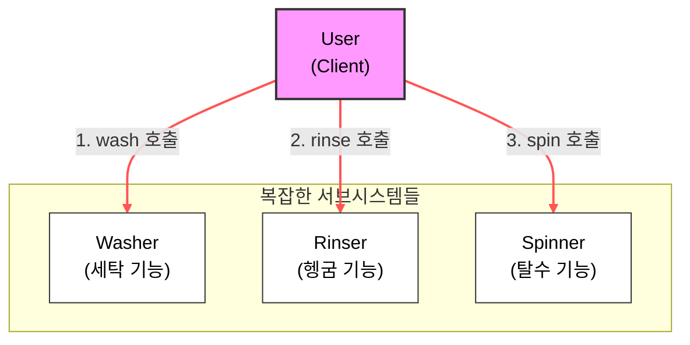
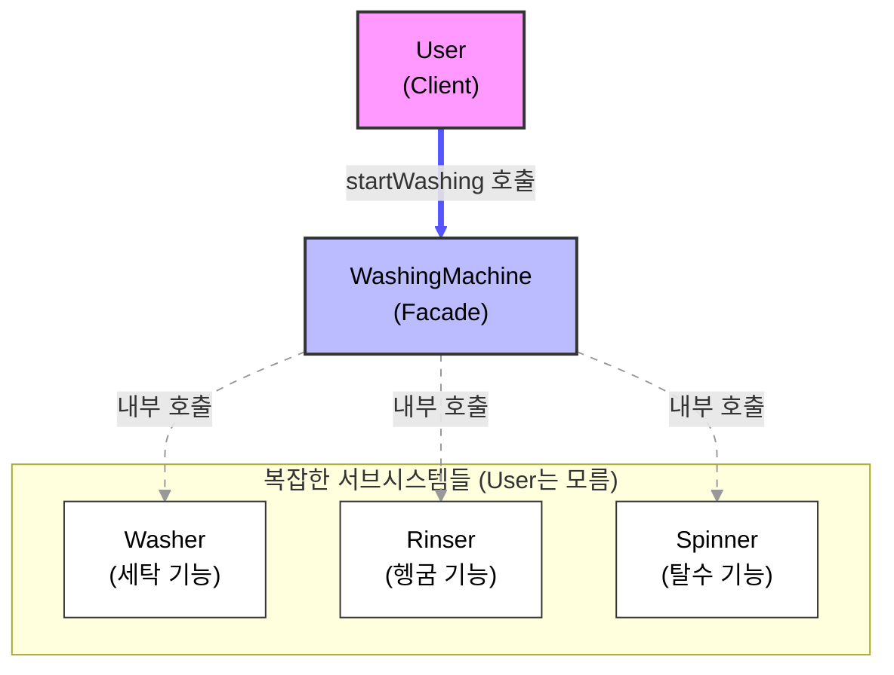

# 작성일

- 2025-11-30

# 파사드 패턴

파사드 패턴을 사용하여 결합도를 낮추고 의존성은 그대로 유지하면서 단일 책임 원칙 지키는 방법을 정리한다.

예제로는 사용자가 세탁을 하는 과정을 WashingMachine으로 추상화하여 결합도를 낮추고 간단하게 버튼을 눌러 세탁을 할 수 있는 과정으로 정리해보려 한다.

## 사용자가 세탁기를 돌리는 동작을 추상화한 코드

```java
class User {
    public void doLaundry(){
        Washer washer = new Washer();
        Rinser rinser = new Rinser();
        Spinner spinner = new Spinner();

        washer.washing();
        rinser.rinsing();
        spinner.spinning();
        // 만약 세탁 기능 중 다른 기능들이 추가되면 User 클래스를 변경해야한다.
    }
}
```

위 코드를 다이어그램으로 보다 시각적으로 표현하면 다음과 같이 보여지게 된다.



위 코드의 문제점은 Washer, Rinser, Spinner 클래스의 동작들이 모두 User 클래스와 강결합 되어있는 특징을 가지고있다.

이는 결합도가 높고 의존도는 낮은 말그대로 변경에 취약한 코드가 된다. 만약 세탁 기능 중 다른 기능들이 추가되면 User 클래스를 변경해야한다.

이는 SRP와, OCP를 위반하는 원칙이다.

이상적인 SOLID 원칙을 사용했다면 단일 책임 원칙에 의해 사용자가 세탁을 하는 것이 아니라 세탁기가 세탁을하고 사용자는 세탁기를 시작만 시키면 되는 형태로 나뉘어지게 만들어 의존성을 높이고 결합도는 낮추도록 하여 세탁 기능이 추가되더라도 세탁기 클래스에 기능을 추가 할 수 있도록 하는 방향이 좋은 설계 방향일 것이다.

파사드 패턴을 사용하면 이런 상황에서 보다 SOLID한 처리를 할 수 있게 된다.

## 세탁기 클래스 정의를 통한 파사드 활용

```java
class WashingMachine {
    public void startLaundry {
        Washer washer = new Washer();
        Rinser rinser = new Rinser();
        Spinner spinner = new Spinner();

        washer.washing();
        rinser.rinsing();
        spinner.spinning();
    }
}

class User {
    public void doLaundry() {
        WashingMachine washingMachine = new WashingMachine();
        washingMachine.startLaundry();
    }
}
```

시각적으로 다음 다이어그램을 보면 WashingMachine이 파사드가 되어 User와 세탁 동작간의 결합도를 낮추어 준것을 확인할 수 있다.



# 정리

공통적인 특징을 하나의 클래스로 추상화하고 책임들을 묶어 SOLID의 SRP를 충족하면서 변경에 용이한 디자인 패턴인 FACADE에 대해 알아보았다. 예제에서는 OCP를 충족하기 위해 세부 동작들을 인터페이스로 추상화하는 방법도 있을 것이고 DIP를 활용하여 클래스간 의존성 제어를 프레임워크에 역전 시키는 방법도 가능하다.

깊이 있게 파고들며 넓어질 수 있도록 방향을 잡아야 한다.
