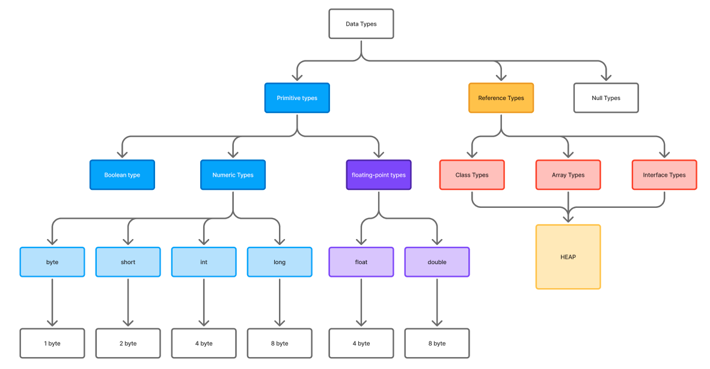

# jvm document study

# 2.2 data types

data type은 크게 세 개의 타입으로 분리된다.

- 타입 분류
  - [Primitive Types](#Primitive-Types)
    - [Boolean Type](#Boolean-Type)
    - [Numeric Types](#Numeric-Types)
      - [byte](#byte)
      - [short](#short)
      - [int](#int)
      - [long](#long)
      - [char](#char)
    - [Floating-point types](#Floating-point-types)
      - [float](#float)
      - [double](#double)
  - [Reference Types](#Reference-Types)
    - [Class](#Class)
    - [Array](#Array)
    - [Interface](#Interface)

## Primitive Types

Reference 타입이 아닌 순수한 값을 지닌 타입을 의미한다.

### Boolean Type

Boolean 값은 0과 1이지만 이 또한 실제 사용되는 값은 아니고 추상적인 타입이라 보아도 무방하고 실제 사용시 int와 같은 `4byte` 크기를 갖는다. 그 이유는 성능적인 측면에서 bit packing이라고 하는 작업이 많은 오버헤드를 주기 때문에 일정부분 메모리를 포기하고 성능의 트레이드오프를 택했다고 생각하면 된다.

자바의 모든 숫자형은 이진수 (two's complement integers)로 표현된다.

### Numeric Types

숫자 형 타입을 의미하며 정수, 소수, 음수 등 모든 숫자형 데이터가 여기에 포함된다.

- byte 8비트, short 16비트, int 32비트, long 64비트

#### char

그림상 표현하지는 않았지만 문자 타입 역시 이진수로 표현되며 UTF-16 유니코드 문자들이 모여 문자열을 형성한다.

### Floating-point types

부동 소수점 값 타입

- float binary32, double binary64 (부호/지수/가수 비트로 나뉨, NaN/∞/±0 존재)

### Reference Types

참조 타입들은 모두 Method area에 정의된 symbol에 따라 런타임시 Heap에 생성된 인스턴스들이다.

모든 참조타입의 기본값은 null이고 아무 값도 Heap에 존재하지 않을 때 null 값을 가진다.

#### Class

#### Array

#### Interface
