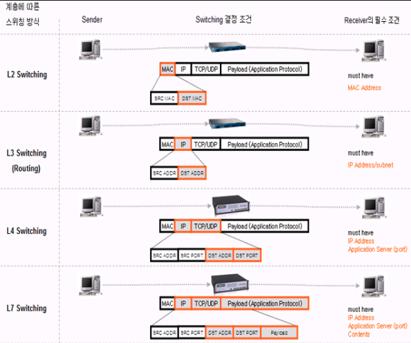

# 작성일

- 2025-12-12

# 태그

- 면접 질문

# L2,L4,L7 스위치의 차이점

프로토콜의 차이, 패킷 정보의 차이

프로토콜의 차이는 L2를 사용하면 (Address Resolving Protocol) MAC 주소를 찾을 수 있고 프래픽이 L2스위치에 도착하면 ARP 프로토콜을 통해 알아낸 MAC 주소로 도착지를 찾아 트래픽을 보내준다.

L4는 분산처리 장치로 TCP/UDP 프로토콜을 사용하는데 IP/PORT 정보 그리고 5-tuple(도착지/출발지/IP/PORT/프로토콜) 기반으로 패킷을 식별해서 트래픽을 분산 처리하는 로드벨런서 역할을 한다.

L7은 HTTP 프로토콜을 사용해서 헤더정보, Path, Header, Cookie 기반 요청을 서버로 보내게 된다.

## 질문의 의도

패킷의 개념과 트레픽의 흐름 그리고 계층별 어떤 정보들이 오가는지 확인을 하기 위함.
또한 계층별 사용되는 프로토콜을 알고있는지 물어보는 의도
