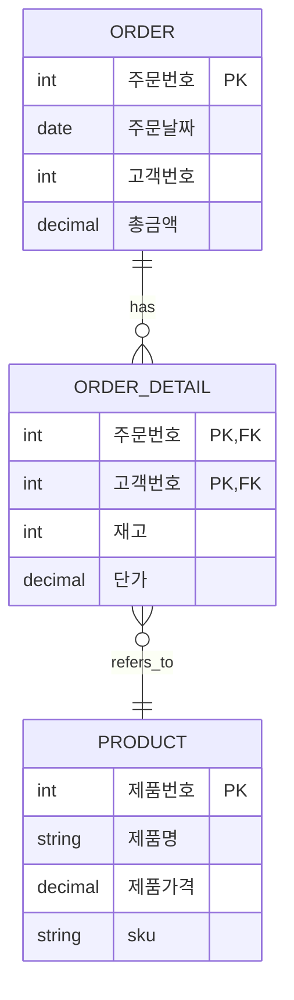
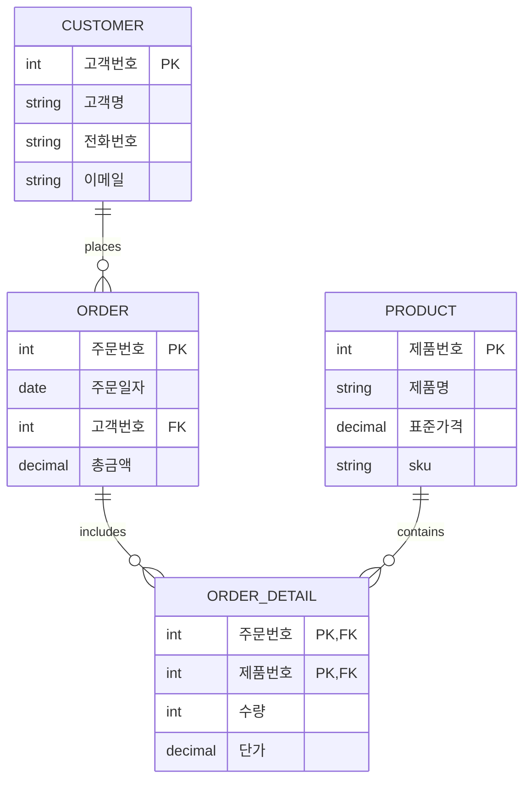

# 작성일

- 2025-11-09

# DB 정규형 (Normal form)

데이터베이스는 집합 또는 데이터의 묶음, 그룹 이라고도 할 수 있으며 수학적인 개념들이 많이 사용되는 데이터 저장에 대한 방법론다.

정규형이란 데이터베이스에서 발생하는 데이터의 중복과 이상현상을 줄이기 위해 거치는 가공 과정이다.
1차 부터 5차, 6차까지 방법들이 존재하지만 현업에서는 3NF 많게는 BCNF 까지 사용한다.

정규형을 이야기 하기 위해 빠질 수 없는 몇가지 개념이 존재하는데 함수적 의존성이 대표적인 예이다.

## 함수적 의존성 (Functional Dependency)

함수적 의존성은 `X -> Y` 라는 공식으로 많이 이야기 된다. X를 결정자 Y를 종속자 라고 이야기 하며 이는 다른게 아니라 Key와 Value로 보면 이해가 쉽다.

## 릴레이션

릴레이션이란 관계라는 의미로 특정 값들이 갖는 관계를 의미한다. 이를 하나의 테이블로 표현하여 데이터베이스를 형성한다.

## 1NF (도메인 원자성 유지)

1차 정규형은 도메인 원자성을 성립하도록 하는 작업이다.
도메인 원자성이란 하나의 속성에 대한 값은 반드시 하나여야 한다는 의미이다.
예를 들어 이름이라는 속성이 있을 때 한사람의 이름만 들어가야하는 성질을 이야기 하며 두사람의 이름이 하나의 속성에 포함되어있다면 이는 도메인 원자성을 위반한 것이다.

1NF에서는 중복된 데이터들을 Row로 분리하고 Primary Key를 기준으로 테이블을 나누는 작업을 하게된다.

## 2NF (부분적 함수 종속 제거 및 완전 함수 종속 처리)

함수적 의존성을 기준으로 테이블을 대표하는 ID값에 속하는 하위값들이 섞여 있는 경우가 발생한다.

### 부분 함수적 종속

기본키가 아닌 다른 속성에 의존하는 것을 의미한다. 또는 기본키가 여러개로 복합키 형태를 띌때 키를 구성하는 속성 일부만 종속하는 것을 의미한다.

#### [주문 상세 릴레이션]

| 주문번호 | 상품번호 | 상품명                 |
| -------- | -------- | ---------------------- |
| 1        | 256      | SQL 전문가 가이드      |
| 2        | 257      | 데이터 아키텍처 가이드 |
| 3        | 256      | SQL 전문가 가이드      |
| 4        | 258      | 데이터 분석            |

예를 들어 위와 같은 데이터가 있다고 하면 주문번호와 상품 번호가 릴레이션의 결정자가 된다. 이때 상품 명은 상품 번호에만 함수정 종속성을 만든다.
그 이유는 `256` 이라는 번호에 `SQL 전문가 가이드`라는 상품이 종속되어있는 관계(매핑 되어있는 것을 보고 힌트를 얻는다.)이기 때문이다.

주문번호도 결정자 이지만 주문번호와 상품명은 직접적인 관계가 없기 때문에 주문번호->상품명 관계가 성립하지 않는다. 이런 현상을 부분만 함수적으로 종속되어있다고 해서 `부분 함수적 종속` 관계 라고 한다.

2NF의 관계를 풀다보면 관계를 나타내는 테이블이 자연스럽게 형성된다. 예를 들어 주문상세 테이블을 2NF 하다보면 다대다 테이블이 형성 되는 것을 볼 수 있다.

### 완전 함수적 종속

기본키 하나에만 다른 값들이 종속하는 형태를 의미하며 완전 함수적 종속을 만족할 때 가장 이상적으로 릴레이션이 형성되었다고 판단 할 수 있다.

상품 ID에 상품명, 수량 등이 종속하여 있는 형태를 예로들 수 있다.

## 3NF

릴레이션에서 X,Y,Z 라는 3개의 속성이 있을 때 X->Y, Y->Z 인 경우 X-Z가 성립될때 이를 이행적 함수 종속이라고 한다.

주문과 고객번호가 묶여 있을 때 고객 닉네임이 변경된다면 주문 릴레이션을 수정해야한다. 이런 상황을 방지하기 위해 엔티티간의 종속을 분리하는 3NF를 진행한다.

즉 하나의 키로

