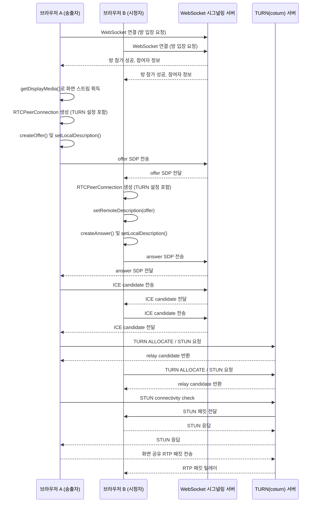

# WebRTC란?

peer to peer 통신을 통해 실시간으로 오디오, 비디오, 화면 공유와 같은 미디어 데이터를 공유할 수 있도록 지원하는 프로토콜로 영상 통화 기능 등에 사용됨.

# 용어 정리

## STUN (Session Traversal Utilities for NAT)

직역하면 NAT를 위한 세션 전송 유틸리티라는 의미로 클라이언트가 NAT 환경에 있을때, 자신의 Public IP와 포트를 알아내는 용도의 프로토콜이다.

STUN 클라이언트는 외부에 위치한 STUN 서버에게 자신의 Private IP를 담은 STUN 패킷을 보내면 STUN 서버는 실제 전달받은 IP와 Port 를 비교 및 판단 후 응답 메세지에 Public IP를 담아 클라이언트에 전송한다. 클라이언트는 그렇게 얻은 자신 Public IP를 활용하여 P2P 통신을 할 수 있게 된다.

하지만 두 단말이 같은 환경에 있을 때와 어플리케이션 별로 NAT 테이블을 갱신하는 Symmentric NAT 환경의 사설망에서는 STUN을 사용할 수 없다. 이런 경우 TURN(Traversal Using Relays around NAT) 프로토콜을 사용한다.

###

## TURN (Traversal Using Relays around NAT)

직역하면 릴레이를 이용해 NAT를 우회한다. 라고 해석할 수 있다. 의미 그대로 TURN은 어플리케이션 별로 테이블을 갱신하는 NAT 를 우회할 수 있는 프로토콜이다.
TURN 클라이언트가 외부 인터넷에 위치한 TURN 서버에게 패킷을 전달하면 서버가 패킷을 목적지로 릴레이 하는 방식이다.

### TURN 동작 원리

TURN 이 동작하는 원리는 다음과 같다. 두개의 Peer가 외부 인터넷 망에 위치한 TURN 서버로 아웃바운드 하면 TURN 서버는 RTP 패킷을 중간에서 받아 상대방에게 다시 보내주는 릴레이 역할을 한다.

만날 수 없는 두개의 클라이언트가 만날 약속 장소를 정해두고 아웃바운드로 정해둔 곳까지 연결을 시도한다. 이후 자신의 위치까지 통신을 릴레이 하는 작업을 TURN 서버에게 위임하는 원리로 동작한다.

```text
브라우저 A  ---->  TURN 서버  <----  브라우저 B
    (둘 다 아웃바운드)       (둘 다 아웃바운드)
```

즉, TURN 서버는

> “둘이 직접 못 만나니,
> 각자 집에서 역까지 와.
> 역에서 내가 둘 사이를 중계해 줄게.”

와 같은 느낌으로 통신을 릴레이해준다고 묘사할 수 있다.

### TURN 서버 없이 동작하는 이유

Peer to Peer 가 서로 만나지 못하는 이유는 **NAT + 방화벽 정책때문에 외부에서 직접 들어오는 UDP 트래픽이 차단되어있기 때문**이다.

## SDP (Session Description Protocol)

WebRTC 통신을 할때 어떤 방식으로 통신할지 정하는 프로토콜로 다음과 같은 정보들을 공유한다.

1. 사용할 미디어 방식
   - 오디오 / 비디오 / 화면 공유 등
2. 코덱
   - H.246 / VP8 / OPUS 등
3. 암호화 정보
   - DTLS fingerprint 등
4. ICE 관련 정보
   - `a=ice-ufrag`, `a=ice-pwd`, `a=condidate` 등

## ICE(Interactive Connectivity Establishment)

> 두 클라이언트가 실제 통신 가능한 경로를 찾아내는 알고리즘/프로토콜

P2P 통신에서 상호간 접근할 수 있는 경로를 알아내기 위해 실행되는 절차

1. 후보 주소들 모으기 (gathering candidate)
   - host
   - srflx(server reflexive) candidate
     - STUN 서버를 통해 알아낸 외부에서 보이는 내 IP 포트
   - Relay candidate
     - TURN 으로부터 할당받은 릴레이용 주소
2. 상대 후보 리스트 교환
   - 이때 ICE 관련 정보가 SDP 안에 들어감
   - SDP 안에 a=ice-ufrag, a=ice-pwd, a=candidate 로 들어감
   - 해당 SDP를 WebSocket 시그널링 서버가 전달
3. 각 후보 조합으로 실제 패킷을 쏴보면 통신가능한 경로 체크
   - A host <-> B Host
   - A srflx <-> B Host
   - A relay <-> B relay
   - 이런 동작들을 connectivity check라고 부름
     - STUN을 통해 요청/응답으로 검사
4. 경로 선택
   - 가능한 직접 경로를 선택
   - 안되면 relay(TURN) 후보 선택
     - coturn이 RTP를 릴레이 한다.

> 경로 선택시 어떤 경로가 선택될지는 상황에 따라 다르기 때문에 coturn 서버를 통한 릴레이가 될 수도 있고 내부망이나 NAT로도 통신이 가능한 경우가 있다.
> 이때 coturn없이 동작해도 된다는 착각을 할수있게된다.

# 요약

- SDP

  - “세션 설정 정보”를 표현하는 포맷/프로토콜
  - 미디어 종류, 코덱, 방향, 암호화, 그리고 ICE 정보까지 담긴 “문서”

- ICE

  - 실제 네트워크 경로를 찾는 절차/알고리즘/프로토콜
  - 이 과정에서 필요한 정보(ufrag, pwd, candidate)를
    - → SDP 안에 a= 라인으로 실어서 주고받음

# WebRTC 시퀀스



# TURN (Trafix)

# 참조 링크

- 
