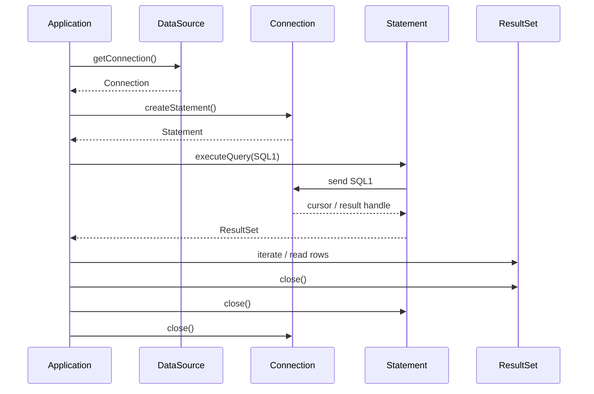
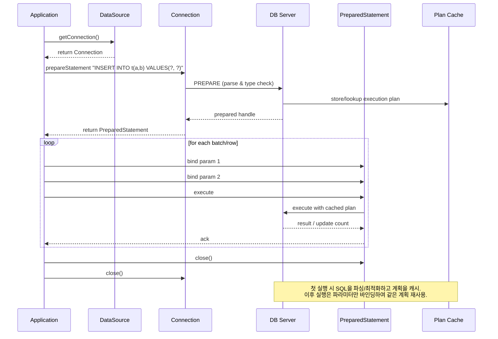

# JDBC 중요 개념

- 2025-11-09

JDBC 를 정리하면서 기본적인 개념과 중요 개념이라 생각되는 부분들을 정리한다.

# JDBC 란?

Java Database Connectivity의 약자로 Java 어플리케이션에서 DB에 접근하는 방법을 추상화하여 여러가지 DB들을 하나의 방법으로 처리할 수 있도록 함으로써 반복 작업을 줄일 수 있도록 도와주는 기능이다.

## JDBC Driver Manager

JDBC가 제공하는 Driver Manager 각 DB 별로 Driver를 통해 커넥션을 맺을 수 있도록 관리해준다.

Connection 을 맺도록 도와주는 시작점이라고 볼 수 있다.

# DB SQL 요청 순서

JDBC가 쿼리를 통해 응답을 가지고 오기 위해 DB 커넥션을 맺고 Statement를 요청하여 실행시키고 결과로 ResultSet을 반환한다.

## 요청 순서

다음 다이어그램을 통해 application 이 어떻게 쿼리를 요청하고 받는지 표현핸다.

그림에서 볼 수 있듯 커넥션 부터 쿼리를 실행했다가 반대 순서대로 close시키는 것을 볼 수 있다.

---

# Statement vs PrepareStatement

Statement는 SQL 쿼리를 실행시키는 클래스다. JDBC에서 제공하는 statement 객체 중 PreparedStatement 라는 클래스가 있다.
이는 Statement와 다르게 `?` 를 이용해서 파라미터를 받을 수 있는 기능을 제공하고 캐시를 사용해서 반복적인 SQL을 저장함으로써 성능적으로 유리한 처리를 할 수있게 해준다.
JPA에서는 Hibernate가 Statement를 사용해서 처리를 대신해 주는데 JPQL 또는 Repository에 직접 쿼리를 작성할 때 `?` 를 사용해서 id를 넘겨본 경험이 있을 것이다.
이때 내부적으로는 PreparedStatement를 사용해서 캐시에서 SQL을 처리한다.

아래 그림과 같이 첫 실행 시 SQL을 파싱/최적화하고 계획을 캐시하며 이후 실행은 파라미터만 바인딩하여 같은 계획 재사용 하게된다.

# Datasource & DB Connection Pool

## Datasource

Datasource는 앞서 말했던 DriverManager가 커넥을 맺을 때 DB와 커넥션을 추상화 해놓은 interface이다. 커넥션을 맺을 때 DataSource 구현체를 사용하여 커넥션을 맺게 된다.

## Connection Pool

CP라고도 하는 커넥션 풀은 요청이 들어오기 전 DB와 연결된 커넥션을 관리하는 풀이다. 쓰레드 풀에서 쓰레드를 관리하고 있다가 요청이 들어오면 쓰레드 하나가 요청을 처리하고 완료가 되면 반환하여 풀에서 대기하는 개념과 같다.
