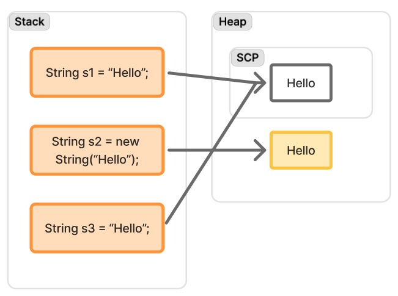

# String API

# 작성일

    - 2025-10-18

Java에서 가장 많이 사용되는 API 중 하나인 String API는 단순히 문자열을 생성해주는 클래스지만 알고있어야하는 요소들이 있다.

# final class

String 은 final 키워드를 사용하여 구현된 확장 불가 클래스이다. 때문에 extends를 사용하여 상속의 개념을 사용할 수 없다.

# String Constant Pool

Java에서 기본적으로 리터럴을 사용하여 문자열을 생성할 수 있다. `"Value"`와 같은 리터럴 문자열을 코드를 작성한다면 컴파일시 Heap 메모리 안에 있는 SCP(String Constant Pool)에 저장된다. 이는 중복된 문자열이 메모리 상에 존재하는 것을 최소하기 위한 수단이며 문자열 뿐만 아니라 상수로 취급되는 모든 값들은 SCP에 적재되어 중복된 상수값을 사용하는 코드에서 사용된다.
하지만 String 생성자를 통해 생성한 값은 SCP에도 저장이 되지만 하나의 인스턴스로 Heap에 위치하게 된다.



# immutable String을 수정하고 싶을 때 사용하는 StringBuffer와 StringBuilder

- StringBuffer는 Thread Safe하다.
- StringBuilder는 Thread Safe하지 않다.
  - 속도는 Thread Safe하지 않은 StringBuilder가 더 빠르다.

## Thread Safe란?

Java는 기본적으로 Multithreaded 환경에서 동작하는 언어로 동시에 특정 값에 접근할때 Thread 간 경쟁을 하여 값에 대한 처리를 하게된다. 때문에 Thread간 lock을 걸어 특정 값에 동시에 접근하는 것을 피하는 기법이 있는데 이를 Thread Safe하다고 표현한다.
즉 MultiThreads 간에 경쟁이 벌어지지 않는 상태를 Thread Safe라고 하는 것이다.

### StringBuffer

- 모든 변경 메서드(`append`,`insert`,`delete`,`toString`)가 `synchronized`(인스턴스 락) 이다.
- 한 시점에 **동일 인스턴스의 하나의 Thread만 진입**하여 내부 버퍼를 수정한다.
- `synchronized`는 상호 배제뿐 아니라 가시성 보장(락 해제 -> 이후 락 획득 사이에 happens-before)도 제공 한다. 즉, 어떤 Thread가 append한 결과는 다음에 같은 인스턴스 락을 잡는 Thread에서 정상적으로 보인다.

### StringBuilder

- `synchronized`가 없다. 내부 버퍼는 **동시 접근 시 경쟁 상태(race)**로 동시성이 보장되지 않을 수 있다.
- 단, 단일 Thread에 제한적으로 사용한다면(Thread confinement) 빠르고 안전하다.

> 포인트: `volatile`로 참조만 표시해도 내부 변경의 원자성과 가시성은 보장되지 않는다. 내부는 여전히 락에 의한 동기화 처리가 필요.

## Lock의 범위와 한계

- StringBuffer의 synchronized는 메서드 단위의 원자성만 제공한다.
- 예) `if (buf.length() < 10) buf.append("X");` 같은 **검사 후 동작(check-then-act)**는 원자적이지 않음. 두 쓰레드가 동시에 검사/수정하면 논리적 레이스가 가능하다.
  - 이런 구문은 외부에서 같은 인스턴스에 대해 `synchronized(buf) { ... }`로 블록 단위로 감싸야 논리적 원자성이 확보된다.
- 락은 인스턴스별이며, 서로 다른 `StringBuffer` 인스턴스 끼리는 동시에 수정 가능하다.

## 메모리 모델 관점 (happens-before)

- 쓰레드 A가 `append` 후 락을 풀면, 쓰레드 B가 같은 객체의 메서드를 호출하며 락을 획득할 때 A의 변경이 가시화된다.
- `toString()`도 `StringBuffer`에서는 동기화되어 있어, 일관된 스냅샷을 얻게 된다.(메서드 내에서 생성한 String은 불변이라 이후에는 안전).

## 왜 StringBuilder가 더 빠를까?

- `synchronized` 오버헤드(락 획득/해제 + 메모리 장벽)가 없다.
- JIT이 내부 루프를 더 과감히 최적화(벡터화/인라이닝)할 여지가 크다.
- 싱글스레드·핫루프라면 StringBuilder ≫ StringBuffer. 다만 최신 JVM에서 락 경합이 없으면 락 경량화가 잘 되어 차이가 과장될 때도 있다. 그래도 기본 선택지는 StringBuilder.

### StringBuilder 최적화

`synchronized` 가 없다는 의미는 동기화시 발생하는 락 획득/해제와 메모리장벽(acquire/release)이 없다는 의미가 됩니다. 만약 `synchronized`가 존재한다면 JIT 컴파일러가 코드 재배치 및 루프 변형을 보수적으로 진행한다(성능에 불리함). 반면 `StringBuilder`는 이런 제약이 없어서 최적화가 더 적극적으로 이루어진다.

#### 1) 인라이닝(inlining) & 디버추얼라이제이션

- `append(char)`,`append(String)`, `ensureCapacity` 같은 짧은 메서드들이 호출자에 인라인이 되기 쉽다.
  - 인라인이 되면 그 안에 분기 및 경계검사도 상수 전파/GC 제거 대상으로 들어가고, 다음 항목들(루프 변형, 백터화, 배열 복사 합치기)이 연쇄적으로 걸리게 된다.

#### 2) 탈출 분석(Escape Analysis) -> 할당 제거 / 스칼라 치환

- StringBuilder 인스턴스가 스레드 밖으로 "탈출하지 않음"(지역변수로만 쓰이고 반환하지 않음) 으로 판정되면
  - 객체를 스택상 스칼라 변수로 쪼개기(Scalar Replacement) 하여 new 자체를 없앰.
  - 내부 byte[] 버퍼 길이가 충분히 추정되면 재할당(확장)도 제거되거나, 한번만 크게 잡도록 재배치 된다.

## Thread Safe 패턴들

1. 단일 쓰레드 전용
   - StringBuilder 사용.
1. 멀티쓰레드지만 공유하지 않기
   - 쓰레드마다 StringBuilder 생성 후 최종에 합치기.
   - ThreadLocal<StringBuilder>를 써서 재사용(GC 압박 완화)도 가능.
1. 병렬 스트림/수집기
   - 직접 StringBuilder 합치기는 위험. **Collectors.joining()**을 쓰면 내부적으로 쓰레드별 빌더를 만들고 안전하게 결합.
1. 불가피하게 같은 인스턴스를 공유해야 하면
   - StringBuffer 사용.
   - StringBuilder를 외부에서 synchronized(builder) { ... }로 블록 동기화.
1. 원자적 시퀀스가 필요한 경우
   - 메서드 한 번으로 충분치 않다면, 바깥에서 동일 락으로 전체 시퀀스를 감싸기.

## 자주 나오는 오해 정리

- “volatile이면 되나요?” → 아니요. 내부 변경 작업의 원자성과 일관성은 보장 못 합니다.
- “StringBuffer면 무조건 안전?” → 메서드 단위는 안전. 하지만 여러 호출을 아우르는 논리적 원자성은 외부 동기화 필요.
- “toString은 싸요?” → 둘 다 새 String을 만들어 복사합니다(자바 9+에서는 AbstractStringBuilder가 byte[] 기반; 어쨌든 복사 비용은 듭니다).

## 빠른 코드 스니펫

```java
// 위험: 두 쓰레드가 같은 builder를 공유하면 깨질 수 있음
StringBuilder sb = new StringBuilder();
Runnable r = () -> {
for (int i = 0; i < 1000; i++) sb.append('x'); // 데이터 손상 가능
};

// 안전 대안 1: StringBuffer
StringBuffer safe = new StringBuffer();

// 안전 대안 2: 외부 동기화
synchronized (sb) {
// 검사-후-동작 같은 복합 시퀀스도 여기서 처리
if (sb.length() < 10) sb.append("X");
}
```

## 언제 무엇을 써야 하나?

- 99%: 공유하지 않는 문자열 빌드 → StringBuilder
- 레거시 API/공유 인스턴스가 반드시 필요 → StringBuffer 또는 외부 동기화
- 병렬 수집/조인 → 컬렉터(Collectors.joining) 같은 검증된 조합기 사용

---

요약:

- StringBuffer = 메서드 단위 synchronized로 상호 배제 + 가시성 보장 (하지만 복합 시퀀스는 외부 동기화 필요).
- StringBuilder = 동기화 없음, 대신 단일 쓰레드/쓰레드별 사용을 전제로 최고 성능.
- 병렬로 합칠 땐 직접 공유/결합하지 말고 안전한 수집기 패턴을 활용할 것.

---

# 정리

String을 깊게 파면 끝이 없을 정도로 깊이가 있는 부분이다. 특히나 StringBuffer와 StringBuilder의 차이를 파고 내려가다보면 Thread 동기화 부터 메소드가 반환하는 스칼라치환 까지 해서 Java의 끝까지 파고 내려갈 수 있었다.

String이라는 간단한 기능을 통해 기초를 다져나갈 수 있는 지식들을 공부할 수 있는 시작점이 될 수 있다는 것을 깨달았다.

신입 개발자때 이런것들을 깨달았더라면 더 빠르게 좋은 개발자가 되었을 것이라는 아쉬움과 지금이라도 이런 부분들을 잡아나갈 수 있다는 다행이라는 생각.
