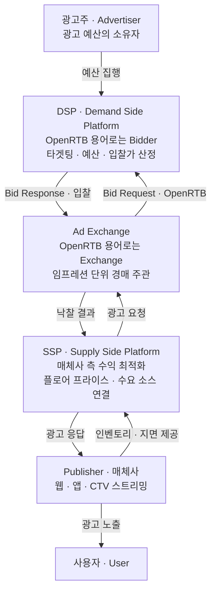
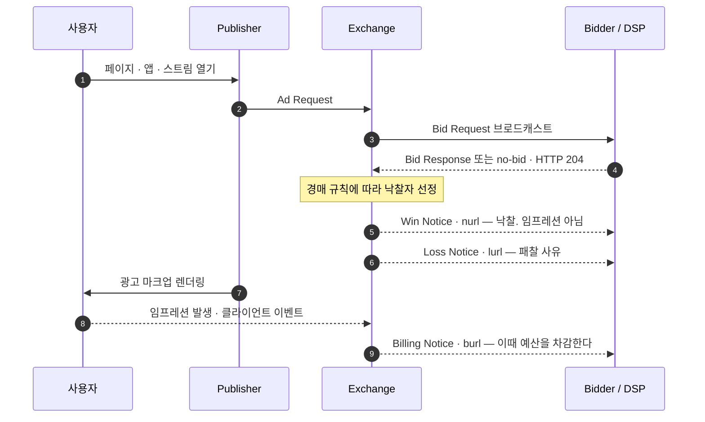

# 01. 광고 생태계와 프로그래매틱 기초

> 출처: [IAB Tech Lab OpenRTB 2.6 (GitHub 정본)](https://github.com/InteractiveAdvertisingBureau/openrtb2.x/blob/main/2.6.md) · [OpenRTB 3.0](https://github.com/InteractiveAdvertisingBureau/openrtb/blob/main/OpenRTB%20v3.0%20FINAL.md) · [AdCOM 1.0](https://github.com/InteractiveAdvertisingBureau/AdCOM/blob/master/AdCOM%20v1.0%20FINAL.md)
>
> 정리 기준일: 2026-09-25

---

## 1. 왜 이 구조가 생겼나

전통적인 광고는 "매체사 영업 ↔ 광고주 구매"의 사람 대 사람 계약이었다.
인벤토리(광고 지면)가 웹/앱/CTV로 폭증하면서 **모든 임프레션 1건을 개별적으로, 사용자가 페이지를 기다리는 동안 실시간 경매에 부치는 방식**이 등장했다. 이것이 RTB(Real-Time Bidding)이고, 이 통신 규약의 업계 표준이 OpenRTB다.

OpenRTB 스펙의 자기 선언:

> "The mission of OpenRTB is to spur growth in Real-Time Bidding (RTB) marketplaces by providing open industry standards for communication between buyers of advertising and sellers of publisher inventory."
> "The overall goal of OpenRTB is and has been to create a *lingua franca* for communicating between buyers and sellers. The intent is not to regulate exactly how each business operates."
>
> **번역**: OpenRTB의 사명은 광고 구매자와 퍼블리셔 인벤토리 판매자 간 통신을 위한 개방형 업계 표준을 제공해 실시간 입찰(RTB) 시장의 성장을 촉진하는 것이다. OpenRTB의 전반적인 목표는 예나 지금이나 구매자와 판매자가 소통하는 *공통 언어*를 만드는 것이다. 각 비즈니스가 정확히 어떻게 운영되는지를 규제하려는 의도는 없다.

여기서 중요한 포인트 — **OpenRTB는 "누가 어떻게 장사하는지"를 규정하지 않는다. 오직 메시지 포맷만 규정한다.** 즉 입찰 전략, 예산 배분, 타겟팅 알고리즘은 전부 각 회사의 경쟁력 영역이고, 그래서 엔지니어가 파고들 여지가 크다.

---

## 2. 핵심 플레이어 (역할 기준)

OpenRTB 2.6 §1.5 Terminology가 정의하는 공식 용어:

| 용어 | 정의 (스펙 원문 기준) |
|---|---|
| `RTB` | 사용자가 기다리는 동안 개별 임프레션 단위로 실시간 입찰하는 것 |
| `Exchange` | 임프레션마다 입찰자들 사이의 경매를 주관하는 서비스 |
| `Bidder` | 임프레션을 획득하기 위해 실시간 경매에 참여하는 주체 |
| `Seat` | 임프레션을 사고 싶어하며 Bidder를 대리인으로 쓰는 광고 주체(광고주/대행사). **보통 광고 예산의 소유자** |
| `Publisher` | 하나 이상의 사이트를 운영하는 주체 |
| `Site` | 웹과 앱을 포함한 광고 지원 콘텐츠 |
| `Deal` | Publisher와 Seat 사이에 특정 조건으로 임프레션을 구매하기로 사전 합의한 계약 |

### 2.1. 통상적인 업계 용어로 매핑

- **DSP**: 광고주/대행사(Seat)를 대신해 입찰한다. 캠페인 관리, 타겟팅, 예산·페이싱, 빈도 제어(frequency capping), 입찰가 산정(bid shading 등)을 담당. **지연 예산(latency budget)이 가장 빡빡한 곳.**
- **SSP**: 매체사를 대신해 인벤토리를 판다. 플로어 프라이스(최저가) 설정, 수요 소스 연결, 수익 최적화를 담당.
- **Ad Exchange**: 경매를 실행한다. 실무에서 SSP와 Exchange는 한 회사 안에서 합쳐져 있는 경우가 많다.
- **Ad Server**: 낙찰된 광고를 실제로 서빙하고, 노출/클릭을 집계하고, 전달 목표(delivery pacing)를 보장한다. 매체사 애드서버(1st party)와 광고주 애드서버(3rd party)가 따로 있고, **둘의 숫자가 다른 것이 "대사(reconciliation)" 문제의 출발점**이다 → `06_광고이벤트_트래킹과_정산대사.md`

---

## 3. 경매가 도는 전체 시퀀스

OpenRTB 2.6 §2 "OpenRTB Basics"의 참조 모델:

1. 사용자가 페이지/앱/스트림을 연다 → Publisher에서 **Ad Request** 발생
2. Exchange가 들어온 Ad Request마다 **Bid Request를 여러 Bidder에게 브로드캐스트**
3. Bidder들이 **Bid Response** 반환 (또는 no-bid)
4. Exchange가 경매 규칙에 따라 낙찰자 선정
5. **Win Notice (`nurl`)** — 낙찰 사실을 Bidder에게 통지
6. **Billing Notice (`burl`)** — 실제로 과금 가능한 상태가 됐을 때 통지
7. **Loss Notice (`lurl`)** — 패찰 사유 통지

> 스펙의 핵심 구분:
> "The win notice informs the bidder's pricing algorithms of a success, whereas the billing notice indicates that spend should actually be applied."
>
> **번역**: 낙찰 통지(win notice)는 입찰자의 가격 산정 알고리즘에 성공을 알리는 것이고, 과금 통지(billing notice)는 실제로 비용을 집행해야 함을 나타낸다.

**이 구분이 실무에서 제일 중요하다.**
- `nurl` (낙찰) = "경매에서 이겼다". **임프레션이 실제로 발생했다는 뜻이 아니다.**
- `burl` (과금) = "돈을 써도 된다". 예산 차감은 여기서 일어나야 한다.

스펙은 아주 강한 어조로 못 박는다:

> **"Win notice URLs should never be used to count impressions or tracked ads."**
>
> **번역**: **낙찰 통지 URL은 임프레션이나 트래킹 광고를 집계하는 데 절대 사용해서는 안 된다.**

이유: 낙찰 이후에도 downstream 경매(client-side header bidding)가 또 있거나, 비디오/오디오 미디어 재생 자체가 실패할 수 있어서, **낙찰 건 중 일부만 실제 임프레션이 된다.**

> 💡 **포트폴리오 연결점**: Budget Pacing Service가 `nurl` 기준으로 예산을 차감하면 실제 집행액보다 과다 차감되어 캠페인이 조기 소진된 것처럼 보인다. `burl` 기준으로 차감하면 정확하지만 지연이 생긴다. 이 트레이드오프(낙관적 차감 후 보정 vs. 확정 차감)를 설계 근거와 함께 설명할 수 있으면 도메인 이해도를 바로 증명할 수 있다.

---

## 4. 전송 계층 — 성능 요구사항이 스펙에 박혀 있다

OpenRTB 2.6 §2.1 ~ §2.5:

| 항목 | 스펙 규정 |
|---|---|
| 프로토콜 | HTTP. **Bid Request는 반드시 POST** (payload가 크고 바이너리 표현을 허용하기 위해). Win notice는 Exchange 재량으로 GET/POST |
| 상태 코드 | 내용 반환 시 `200`, no-bid 등 내용 없을 때 `204`, 잘못된 요청은 내용 없이 `400` |
| 보안 | HTTPS가 기술적 필수는 아니지만 **강력 권고** |
| 데이터 포맷 | JSON 권장 (`Content-Type: application/json`). **선택적으로 ProtoBuf / Avro / 압축 JSON 같은 바이너리 표현 허용** — "can be more efficient in terms of transmission time and bandwidth" *번역: 전송 시간과 대역폭 측면에서 더 효율적일 수 있다* |
| 압축 | 양방향 gzip 권장. Response는 `accept-encoding: gzip` → `content-encoding: gzip`. **Request도 `content-encoding: gzip`으로 압축 전송 가능** (단, 사전에 양자 합의 필요) |
| 버전 헤더 | `x-openrtb-version: 2.6` |

그리고 스펙이 직접 BEST PRACTICE로 명시한 것:

> "One of the simplest and most effective ways of improving connection performance is to enable **HTTP Persistent Connections, also known as Keep-Alive.** This has a profound impact on overall performance by reducing connection management overhead as well as CPU utilization on both sides of the interface."
>
> **번역**: 커넥션 성능을 개선하는 가장 간단하고 효과적인 방법 중 하나는 **HTTP 지속 연결, 즉 Keep-Alive를 켜는 것이다.** 이는 커넥션 관리 오버헤드와 인터페이스 양쪽의 CPU 사용량을 줄여 전체 성능에 지대한 영향을 준다.

> 💡 **포트폴리오 연결점**: "저지연·고처리량"을 어필할 때 "Netty 썼습니다"보다 **"스펙이 요구하는 Keep-Alive 커넥션 풀 관리, gzip 양방향 압축, 바이너리 직렬화(ProtoBuf) 옵션을 어떤 근거로 선택/배제했는가"**를 말하는 편이 훨씬 강하다. 출처가 IAB 스펙이기 때문에 근거가 분명하다.

---

## 5. 버저닝 정책 — 실무 파서 설계에 직접 영향

OpenRTB 2.6-202211부터 버저닝 정책이 바뀌었다 (§2.6):

- **버전 번호는 breaking change가 있을 때만 올린다.** 비파괴적 개선(새 필드, 새 객체, enum 값 추가)은 **월 1회 정도 같은 2.6 안에서 릴리스**된다.
- 따라서 구현자에게 요구되는 계약:
  - **"Bidders and exchanges must tolerate receiving new or unexpected fields and enumerated list values gracefully, treating them as unknown or ignoring them"** — *번역: **입찰자와 거래소는 새롭거나 예상치 못한 필드·열거형 값을 받더라도 알 수 없는 값으로 취급하거나 무시하며 문제없이 처리해야 한다***
  - **"Bidders and exchanges should freely transmit new fields or enumerated list values"** — *번역: **입찰자와 거래소는 새 필드나 열거형 값을 자유롭게 전송해야 한다***

즉 **파서는 unknown field에 대해 절대 예외를 던지면 안 된다.** Jackson이라면 `FAIL_ON_UNKNOWN_PROPERTIES=false`, enum은 미지의 값을 `UNKNOWN`으로 흡수하는 커스텀 디시리얼라이저가 사실상 필수다.

- 모든 열거형(enumerated list)은 2.6부터 OpenRTB 본문이 아니라 **AdCOM 1.0**에서 관리된다. AdCOM에 값이 추가돼도 OpenRTB 버전은 그대로다.
- 확장 필드는 어떤 객체에든 `ext`라는 이름으로 일관되게 넣는다.

---

## 6. 거래 유형 — 오픈 옥션만 있는 게 아니다

| 유형 | 설명 | OpenRTB 상의 표현 |
|---|---|---|
| Open Auction (RTB) | 누구나 참여하는 공개 경매 | `Imp` 기본 형태 |
| Private Marketplace (PMP) | 초대된 Seat만 참여하는 비공개 경매 | `Imp.pmp` → `Pmp.deals[]` |
| Preferred Deal / Programmatic Guaranteed | 사전 합의된 단가·물량 | `Deal` 객체 + `Bid.dealid` |
| Direct (비 RTB) | 전통적 직접 계약 | OpenDirect 등 별도 스펙 |

`Bid.dealid`는 요청의 `deal.id`를 그대로 되돌려주는 필드다. **PMP 딜에 응찰할 때 dealid를 안 붙이면 오픈 옥션 입찰로 간주되어 딜 우선권을 못 받는다** — 흔한 버그.

---

## 7. 경매 방식 — 1st price vs 2nd price

OpenRTB 2.6 §4.4.1의 `${AUCTION_MIN_TO_WIN}` 설명에 두 방식의 차이가 예시로 명확히 나온다. (플로어 $0.85 가정)

**First-price auction**

| 입찰가 | `${AUCTION_PRICE}` (낙찰가) | `${AUCTION_MIN_TO_WIN}` |
|---|---|---|
| $1.00 | $1.00 | $0.90 |
| $0.90 | (빈 문자열) | $1.00 |
| $0.80 | (빈 문자열) | $1.00 |

**Second-price auction** (차순위가 + $0.01이 낙찰가라고 가정)

| 입찰가 | `${AUCTION_PRICE}` | `${AUCTION_MIN_TO_WIN}` |
|---|---|---|
| $1.00 | $0.91 | $0.90 |
| $0.90 | (빈 문자열) | $0.91 |
| $0.80 | (빈 문자열) | $0.91 |

업계는 대체로 **1st price로 이동**했고, 그래서 DSP 쪽에 **bid shading**(낙찰은 하되 필요 이상으로 비싸게 내지 않도록 입찰가를 깎는 기법)이라는 문제 영역이 생겼다. `${AUCTION_MIN_TO_WIN}` 매크로는 이 학습을 위한 피드백 신호다.

또한 주의:

> "the exchange in question may not be the final decision-maker. It may propagate two or more bids into a second auction."
>
> **번역**: 해당 거래소가 최종 결정권자가 아닐 수 있다. 두 개 이상의 입찰을 2차 경매로 넘길 수도 있다.

즉 **내가 이긴 경매가 최종 경매가 아닐 수 있다.** 헤더 비딩 환경에서는 SSP 경매 → 매체사 애드서버 경매로 다단계다. 이것이 `nurl`을 임프레션으로 세면 안 되는 또 다른 이유다.

---

## 8. 프라이버시 신호 (스펙 §2.7)

OpenRTB가 전달을 지원하는 프라이버시 관련 정보:

- Do Not Track 헤더 상태 (`Device` 객체)
- 사이트/앱의 프라이버시 정책 존재 여부 (`Site`, `App` 객체)
- 적용된다고 판단되는 규제 (`Regs` 객체)
- 동의 문자열: **GPP (Global Privacy Platform)**, **US Privacy String**, **TCF (Transparency and Consent Framework)** — `Regs`, `User` 객체

단, 스펙은 면책한다: "each implementer is responsible to ensure that their implementation complies with any applicable laws." — *번역: 각 구현자는 자신의 구현이 적용되는 모든 법률을 준수하는지 확인할 책임이 있다.*

> 한국 맥락에서는 개인정보보호법 및 정보통신망법상 행태정보 수집 동의가 대응된다. 글로벌 SSP/DSP와 연동하는 서비스라면 TCF/GPP 문자열 파싱과 전파가 실제 구현 과제가 된다.

---

## 9. 다음 문서

- 입찰 요청/응답 객체 구조 상세 → `02_OpenRTB_실시간입찰_프로토콜.md`
- 비디오 광고 응답 포맷 → `03_VAST_비디오광고_표준.md`
- 광고 브레이크 스케줄 → `04_VMAP_VPAID_SIMID_OMID.md`
- 서버사이드 광고 삽입 → `05_SSAI_CSAI_광고삽입.md`
- 이벤트/정산 → `06_광고이벤트_트래킹과_정산대사.md`
- 공급망 투명성 (ads.txt / sellers.json / SupplyChain) → `07_공급망_투명성_ads.txt_sellers.json.md`
- 저지연·고처리량 아키텍처 → `08_저지연_고처리량_아키텍처.md`
