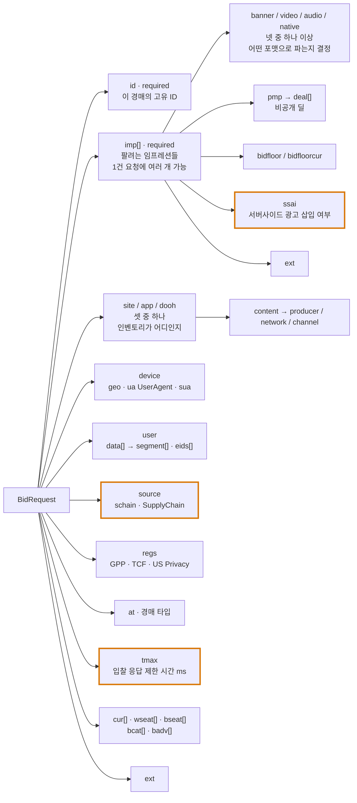
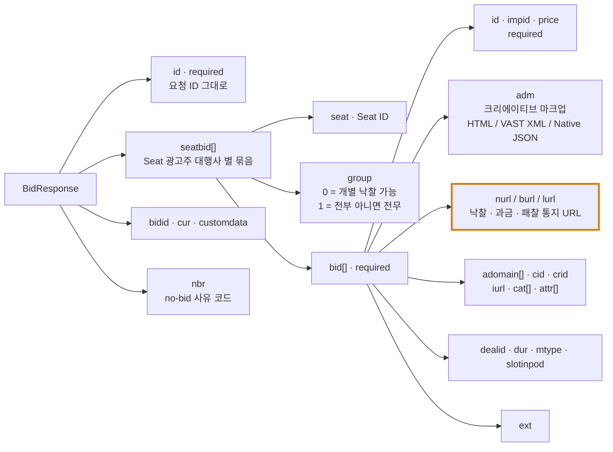

# 02. OpenRTB — 실시간 입찰 프로토콜

> 출처: [OpenRTB 2.6 정본 (GitHub)](https://github.com/InteractiveAdvertisingBureau/openrtb2.x/blob/main/2.6.md) · [OpenRTB 2.6 Implementation Notes](https://github.com/InteractiveAdvertisingBureau/openrtb2.x/blob/main/implementation.md) · [AdCOM 1.0](https://github.com/InteractiveAdvertisingBureau/AdCOM/blob/master/AdCOM%20v1.0%20FINAL.md) · [OpenRTB 3.0](https://github.com/InteractiveAdvertisingBureau/openrtb/blob/main/OpenRTB%20v3.0%20FINAL.md)
>
> 정리 기준일: 2026-09-25 / 기준 버전: OpenRTB 2.6 (2022-04 최초 릴리스, 이후 월간 비파괴 업데이트)

---

## 0. 버전 지형 먼저

- **2.5** — 헤더 비딩, `burl`/`lurl`(과금·패찰 통지), Flex Ads, 임프레션 메트릭 지원
- **2.6** — **CTV용 Ad Pod**, 구조화된 User-Agent 객체(UA-CH 대응). 2022년 4월 릴리스
- **3.0** — 별도 브랜치. 레이어 분리(transaction layer / domain layer), AdCOM 사용. **실무 채택률은 여전히 2.x가 압도적**

현업 면접에서 "OpenRTB 3.0 쓰나요?"라는 질문이 나오면 정답은 "대부분 2.6이고, 3.0의 개념(AdCOM 분리)은 2.6에 역수입되었다"이다. 실제로 2.6부터 모든 열거형이 AdCOM으로 이관됐다.

---

## 1. Bid Request 객체 모델



### 1.1. `tmax` — 지연 예산이 요청에 직접 실려 온다

`BidRequest.tmax`는 **Exchange가 응답을 기다려 주는 최대 밀리초**다. 이걸 넘기면 입찰은 그냥 버려진다. 실무 값은 보통 **100~300ms** 수준이고, 그 안에서 DSP는 네트워크 왕복·타겟팅 평가·예산 확인·입찰가 산정을 전부 끝내야 한다.

> 💡 **포트폴리오 연결점**: "P99 Latency 12ms 달성"보다 **"tmax 120ms 환경에서 내부 처리 예산을 네트워크 20ms / 타겟팅 30ms / 예산조회 10ms / 입찰산정 20ms로 쪼개고, 각 구간에 타임아웃을 걸어 예산 초과 시 즉시 no-bid(HTTP 204)로 빠지게 설계했다"**가 훨씬 도메인에 밀착한 서술이다. 광고 입찰에서 **늦은 정답은 오답**이다.

### 1.2. `Imp` 객체 — 주요 필드

| 필드 | 의미 | 실무 포인트 |
|---|---|---|
| `id` | 요청 내 임프레션 고유 ID (보통 "1"부터 증가) | Bid에서 `impid`로 참조 |
| `bidfloor` / `bidfloorcur` | 최저 입찰가 (CPM) | 기본 통화 USD. 이 아래로 넣으면 버려짐 |
| `instl` | 전면 광고(interstitial) 여부 | |
| `secure` | HTTPS 크리에이티브 필수 여부 (0/1) | 미지정이면 unknown |
| `rwdd` | **리워드 광고** 여부 (게임 목숨 제공 등) | 2.6 추가 |
| **`ssai`** | **서버사이드 광고 삽입 상태** | `0`=unknown, `1`=전부 클라이언트, `2`=에셋은 서버 stitching이지만 **트래킹 픽셀은 클라이언트에서 발화**, `3`=전부 서버사이드 |
| `exp` | 경매와 실제 임프레션 사이 예상 경과 초 | 프리페치 환경에서 중요 |
| `qty` | 1건이 여러 명에게 노출되는 경우의 배수 (DOOH) | |
| `dt` | 임프레션 예상 충족 시각 (Unix ms) | DOOH |
| `tagid` | 지면/태그 식별자 | 디버깅·최적화용 |
| `displaymanager(ver)` | 렌더링 담당 SDK/플레이어 이름·버전 | 비디오/앱에서 권장 |

`ssai` 값은 **측정 신뢰도에 직결**된다. `3`(전부 서버사이드)이면 클라이언트 신호가 없으므로 뷰어빌리티 측정이 사실상 불가하고, IVT(invalid traffic) 판정 로직도 달라져야 한다. → `05_SSAI_CSAI_광고삽입.md`

### 1.3. `Video` 객체 — CTV 시대의 핵심

`mimes`만 required이고 나머지는 선택이지만, 실무에서 중요한 것들:

| 필드 | 의미 |
|---|---|
| `minduration` / `maxduration` | 광고 길이 범위(초). **`rqddurs`와 상호 배타** |
| `rqddurs[]` | **정확히 허용되는 길이 배열.** Live TV처럼 dead air가 생기면 안 되는 경우 |
| `startdelay` | pre-roll / mid-roll / post-roll 구분 (AdCOM Start Delay Modes) |
| `protocols[]` | 지원 VAST 버전 (AdCOM Creative Subtypes - Audio/Video) |
| **`plcmt`** | **비디오 지면 유형. 2.6-202303부터 `placement`를 대체** |
| `linearity` | linear / nonlinear. **"기대되는 VAST 응답의 유형"이지 플레이어 인벤토리 유형이 아님** (그건 `plcmt`) |
| `skip` / `skipmin` / `skipafter` | 스킵 가능 여부와 조건 |
| **`podid`** | 같은 값이면 **같은 Ad Pod(광고 브레이크)에 속함** |
| `podseq` | 콘텐츠 스트림 내 pod의 순서 |
| `slotinpod` | pod 내 슬롯 위치 보장 (첫 번째/마지막/무관) |
| `poddur` | dynamic pod 전체 채울 수 있는 총 시간(초) |
| `maxseq` | dynamic pod에 들어갈 수 있는 최대 광고 수 |
| `mincpmpersec` | **초당 최소 CPM.** dynamic pod의 길이 비례 플로어 |
| `durfloors[]` | 길이 구간별 플로어 가격 |
| `companionad[]` | 컴패니언 배너 (VAST Companion) |
| `api[]` | 지원 API 프레임워크 (OMID=7, SIMID=8 등) |

#### `plcmt` 값 (AdCOM: Plcmt Subtypes - Video)

| 값 | 이름 | 정의 요지 |
|---|---|---|
| 1 | **Instream** | 사용자가 요청한 스트리밍 비디오 콘텐츠의 pre/mid/post-roll. **플레이어 시작 시 기본 sound-on이거나 시청 의도가 명확해야 함.** 비디오가 페이지의 주 콘텐츠여야 함 |
| 2 | **Accompanying Content** | 텍스트/그래픽 사이에 로드되는 플레이어. **뷰포트 진입 시에만 재생 시작** |
| 3 | **Interstitial** | 비디오 콘텐츠 없이 재생. 뷰포트 대부분을 차지하고 스크롤로 벗어날 수 없음 |
| 4 | **No Content / Standalone** | 스트리밍 콘텐츠 없이 재생 (슬라이드쇼, 네이티브 피드, sticky/floating) |
| 5 | **Pause** | 재생 일시정지 시 노출 |
| 6 | **Screensaver** | OS/앱 화면보호기 시작 시 |
| 7 | **Overlay** | 광고 브레이크 밖에서 콘텐츠 **위에** 겹쳐 표시 (배너/PIP) |
| 8 | **Squeezeback** | L자/더블박스. **콘텐츠를 리사이즈해서 화면을 나눠 쓴다** (overlay와의 결정적 차이 — 콘텐츠를 가리지 않음) |
| 9 | **In-scene** | 콘텐츠 영상 안에 브랜드 요소를 합성 (가상 PPL) |

> `placement`는 **deprecated**다. 레거시 시스템 연동 시 `placement`와 `plcmt`를 동시에 받게 되는 과도기 처리가 필요하다.

---

## 2. Ad Pod — CTV/오디오의 광고 브레이크 입찰

OpenRTB 2.6의 간판 기능. Implementation Notes §7.6.

> "An ad pod is the term describing an ad break of the type you'd see in a TV-like viewing experience or hear on a radio stream."
>
> **번역**: Ad Pod는 TV 같은 시청 환경에서 보거나 라디오 스트림에서 듣게 되는 형태의 광고 브레이크를 가리키는 용어다.

### 2.1. 세 가지 Pod 구조

| 구조 | 정의 |
|---|---|
| **Structured Pod** | 슬롯 개수, pod 내 위치, 길이가 **모두 사전에 고정**. 판매자가 완전히 정의된 구조를 제시 |
| **Dynamic Pod** | 광고 수와 개별 길이가 **미정**. 단 **총 길이(`poddur`)와 최대 광고 수(`maxseq`)는 제한**됨. 입찰자가 유연하게 최적 조합을 구성할 수 있음 |
| **Hybrid Pod** | 고정 슬롯 + 동적 구간의 혼합 |

### 2.2. 스펙이 명시한 권고 사항

- 판매자는 pod의 첫/마지막 슬롯을 **절대적으로 보장할 수 있을 때만** `slotinpod`에 1, 2, -1을 넣어야 한다
- 구매자는 **dynamic 구간에 대해서만** `slotinpod`를 응답에 넣어야 한다. structured pod은 `impid`가 이미 슬롯을 특정하므로 불필요
- 판매자는 `rqddurs`(정확한 길이) **또는** `maxduration`/`minduration` 중 하나만 보내야 한다. 둘 다 보내면 안 된다
- 구매자는 `mincpmpersec`가 있으면 그것을, 없으면 `bidfloor`를 본다
- **핵심 주의:**
  > "Buyers should expect that final pod construction is done by the seller. Buyers who submit N bids for a particular pod may find that the seller selects anywhere between 0 to N of those bids to construct the pod... Furthermore, the seller may co-mingle bids from other buyers in that pod."
  >
  > **번역**: 구매자는 최종 Pod 구성을 판매자가 한다는 점을 예상해야 한다. 특정 Pod에 N개의 입찰을 제출한 구매자는 판매자가 그중 0개에서 N개 사이 어느 수만큼을 골라 Pod를 구성한다는 것을 알게 될 수 있다... 더 나아가 판매자는 그 Pod에 다른 구매자의 입찰을 섞어 넣을 수도 있다.

즉 **N개 입찰해도 0~N개만 채택될 수 있고, 다른 구매자 광고와 섞인다.** DSP 입장에서 경쟁사 광고와 같은 브레이크에 나란히 붙는 경우(competitive separation 위반)를 통제하기 어렵다는 뜻이고, 이래서 `Imp.video`의 블록 카테고리(`bcat`)와 `Bid.cat` 관리가 중요해진다.

### 2.3. Structured Pod 요청 예시 (스펙 발췌)

```json
{
  "imp": [
    {
      "id": "1",
      "video": {
        "podid": "pod_1",
        "podseq": 1,
        "slotinpod": 1,
        "mimes": ["video/mp4", "video/ogg", "video/webm"],
        "linearity": 1,
        "maxduration": 60,
        "minduration": 0
      },
      "exp": 7200,
      "bidfloor": 8,
      "bidfloorcur": "USD"
    },
    {
      "id": "2",
      "video": {
        "podid": "pod_1",
        "podseq": 1,
        "slotinpod": 0,
        "mimes": ["video/mp4", "video/ogg", "video/webm"],
        "linearity": 1,
        "maxduration": 30,
        "minduration": 0
      },
      "exp": 7200
    }
  ]
}
```

> 💡 **포트폴리오 연결점**: Pod 입찰은 **"단일 임프레션 최적화"가 아니라 "제약 조건 하의 조합 최적화"**다. 총 길이 제약 안에서 가치를 최대화하는 문제는 배낭 문제(knapsack)와 같은 형태다. Bidder Service에 이걸 구현하면 "OpenRTB 파싱했습니다" 수준을 확실히 넘어선다.

---

## 3. Bid Response 객체 모델



### 3.1. No-bid 표현 두 가지

1. **HTTP 204** + 빈 본문 — 가장 가볍다
2. `BidResponse`만 반환하고 `nbr`에 사유 코드

대부분의 요청은 no-bid가 된다(입찰률이 몇 % 수준인 경우도 흔하다). 따라서 **no-bid 경로가 가장 빠른 경로여야 한다.** 204 반환이 JSON 직렬화 비용 0이라는 점은 고처리량 설계에서 의미가 있다.

### 3.2. `mtype` — 크리에이티브 타입

`1`=Banner, `2`=Video, `3`=Audio, `4`=Native.
`Imp`의 어느 하위 객체에 대응하는 입찰인지 명시한다. 멀티포맷 임프레션에서 필수적이다.

### 3.3. 마크업 전달 두 가지 방식과 트레이드오프

스펙 §4.3.3이 장단점을 직접 비교한다.

**(A) Win Notice에 마크업 반환 (`nurl` 응답 본문)**
- *Reduced Bandwidth Costs*: 이겼을 때만 마크업을 보내므로 대역폭 절감이 크다. 응답당 다중 입찰을 보낼 때 특히
- *Additional Bidder Flexibility*: 낙찰가가 확정된 **뒤에** 어떤 광고를 낼지 결정할 여지

**(B) Bid에 마크업 포함 (`bid.adm`)**
- *Reduced Risk of Forfeiture*: forfeit(이겼는데 마크업 서빙 실패로 몰수)의 위험을 줄인다. HTTP 실패 지점이 하나 줄어듦
- *Potential Concurrency*: Exchange가 마크업 반환과 win notice 호출을 **동시에** 할 수 있어 UX 개선

`adm`과 `nurl` 본문이 둘 다 있으면 **`adm`이 우선**한다.

> 💡 **포트폴리오 연결점**: 이건 그대로 트레이드오프 서술 재료다. "입찰률이 낮고 응답 크기가 큰 비디오(VAST XML) 환경에서는 nurl 방식이 대역폭상 유리하나 forfeit 리스크가 있어, 낙찰률 X% 이상 구간에서는 adm 방식으로 전환하도록 설계"처럼 정량 조건을 붙이면 좋다.

---

## 4. 치환 매크로 (Substitution Macros)

`nurl` / `burl` / `lurl` / 마크업 안에 넣으면 Exchange가 호출 직전에 치환한다.

| 매크로 | 의미 |
|---|---|
| `${AUCTION_ID}` | 요청 ID |
| `${AUCTION_BID_ID}` | `BidResponse.bidid` |
| `${AUCTION_IMP_ID}` | 낙찰된 임프레션 ID |
| `${AUCTION_SEAT_ID}` | 입찰한 Seat ID |
| `${AUCTION_AD_ID}` | `bid.adid` |
| **`${AUCTION_PRICE}`** | **낙찰가(clearing price).** 할인 반영 후 최종가 |
| `${AUCTION_CURRENCY}` | 통화 확인용 |
| `${AUCTION_MBR}` | Market Bid Ratio = 낙찰가 / 입찰가 |
| `${AUCTION_LOSS}` | 패찰 사유 코드 |
| **`${AUCTION_MIN_TO_WIN}`** | 이기기 위한 최소 입찰가. **bid shading 학습 신호** |
| `${AUCTION_MULTIPLIER}` | 낙찰된 임프레션 총 수량 (DOOH) |
| `${AUCTION_IMP_TS}` | 임프레션 충족 시각 (Unix ms). **즉시 통지가 불가능한 플랫폼용** |
| `${AUCTION_DISCOUNT_PCT}` / `${AUCTION_DISCOUNT_CPM}` | 판매자 할인 |

규칙:
- 치환은 **단순 문자열 치환**이다. 문법 검증 없이 발견되는 족족 바꾼다
- 값이 없는 선택 파라미터는 **길이 0 문자열로 대체**(그냥 사라진다)
- 암호화가 필요하면 `${AUCTION_PRICE:B64}`처럼 `:X` 접미사. **알고리즘은 스펙이 정하지 않고 당사자 간 합의**
- 테스트/품질 검수 렌더링 시 값을 모르면 **`"AUDIT"`을 치환값으로** 사용 권고
- BEST PRACTICE: **인코딩은 아껴 쓸 것.** Exchange↔Bidder 직접 통신에는 보통 불필요(처리 오버헤드)

> ⚠️ `${AUCTION_PRICE}`가 마크업을 통해 브라우저까지 흘러가면 **낙찰가가 외부에 노출**된다. 그래서 암호화 옵션이 존재한다. 보안 리뷰 포인트.

---

## 5. 임프레션 만료 (`exp`)

Implementation Notes §7.2. `Imp.exp`(판매자 제시)와 `Bid.exp`(구매자 희망)는 **경매와 실제 임프레션 사이에 얼마나 시간이 뜰 수 있는가**를 나타낸다.

이게 왜 필요한가: 모바일 앱과 CTV는 느린 네트워크에 대비해 **광고를 미리 받아 캐시(prefetch)** 한다. 경매는 지금 일어났지만 실제 노출은 몇 분 뒤일 수 있다.

영향:
- 예산·빈도 제어가 "지금 차감"과 "나중에 노출" 사이 간극을 다뤄야 함
- `${AUCTION_IMP_TS}` 매크로가 실제 노출 시각을 알려주는 이유
- 캐시된 마크업의 매크로가 만료된 값을 담고 있을 수 있음

---

## 6. 확장 필드와 AdCOM

- 모든 객체는 `ext`를 가질 수 있고, 이름은 **일관되게 `ext`**로 쓴다
- 널리 쓰이는 확장은 IAB가 [openrtb/extensions](https://github.com/InteractiveAdvertisingBureau/openrtb/tree/master/extensions)에서 호스팅한다
- **열거형은 전부 AdCOM 1.0**에 있다. 구현자는 "가능한 한 최신 열거형을 쓰도록 보장해야" 한다

자주 쓰는 AdCOM 리스트:
- API Frameworks: `1`=VPAID 1.0, `2`=VPAID 2.0, `3`=MRAID 1.0, `4`=ORMMA, `5`=MRAID 2.0, `6`=MRAID 3.0, **`7`=OMID 1.0**, **`8`=SIMID 1.0**
- Creative Subtypes (Audio/Video): `1`=VAST 1.0, `2`=VAST 2.0, `3`=VAST 3.0, `4~6`=각 버전 Wrapper, 이후 VAST 4.x 및 Wrapper
- Plcmt Subtypes - Video: 위 1.3 참조
- Placement Positions, Playback Methods, Start Delay Modes, Slot Position in Pod, Delivery Methods, Linearity Modes, Expandable Directions, Creative Attributes, Category Taxonomies

---

## 7. 구현 체크리스트 (실무 관점)

- [ ] `tmax` 준수. 초과 임박 시 즉시 204 반환하는 circuit
- [ ] unknown field / unknown enum 값을 예외 없이 무시 (버저닝 정책 요구사항)
- [ ] HTTP Keep-Alive 커넥션 풀 관리
- [ ] 양방향 gzip. 요청 압축은 사전 합의 필요
- [ ] no-bid 경로를 가장 저비용 경로로 (204 + 빈 본문)
- [ ] `nurl`로 임프레션을 세지 않을 것. 과금은 `burl` 또는 VAST `<Impression>`
- [ ] `burl` 수신 엔드포인트는 **멱등(idempotent)** 하게 — 스펙이 재시도를 권고하므로 중복 수신이 정상
- [ ] `dealid` 반환 누락 없게
- [ ] `mtype` 정확히 세팅
- [ ] pod 입찰 시 `slotinpod` 사용 규칙 준수 (dynamic 구간에만)
- [ ] `${AUCTION_PRICE}` 외부 노출 경로 검토

---

## 8. 참고 원문

- OpenRTB 2.6 본문: https://github.com/InteractiveAdvertisingBureau/openrtb2.x/blob/main/2.6.md
- Implementation Notes(§7 전체): https://github.com/InteractiveAdvertisingBureau/openrtb2.x/blob/main/implementation.md
- 검증된 예제 요청 모음: https://github.com/InteractiveAdvertisingBureau/openrtb
- AdCOM 1.0: https://github.com/InteractiveAdvertisingBureau/AdCOM
- Ad Management API (크리에이티브 심사): https://github.com/InteractiveAdvertisingBureau/AdManagementAPI
