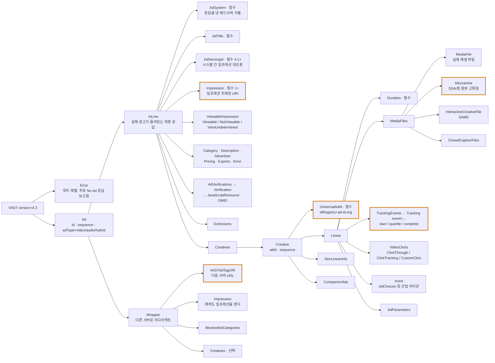

# 03. VAST — 비디오/오디오 광고 서빙 표준

> 출처: [VAST 4.x 정본 (GitHub: VAST4.x 저장소)](https://github.com/InteractiveAdvertisingBureau/VAST4.x) · [IAB Tech Lab VAST 표준 페이지](https://iabtechlab.com/standards/vast/) · [VAST XSD 스키마](https://github.com/InteractiveAdvertisingBureau/vast)
>
> 정리 기준일: 2026-09-25 / 공식 최신 릴리스: **VAST 4.3 (2022-12)**, 저장소에 **4.4** 초안 존재

---

## 1. VAST란 무엇인가

> "The Video Ad Serving Template or VAST is a template for structuring ad tags that serve video and audio ads to media players. Using an XML schema, VAST transfers important metadata about an ad from the ad server to a media player."

핵심은 이거다. **OpenRTB는 "누가 얼마에 살 것인가"를 정하고, VAST는 "그래서 무엇을 어떻게 틀 것인가"를 정한다.**

- OpenRTB `Bid.adm`에 담기는 비디오 크리에이티브의 실체가 바로 VAST XML이다
- 2008년 최초 출시. 디스플레이 광고와 달리 비디오 플레이어는 브라우저 표준 기술을 못 쓰는 경우가 많아(전용 코드, CTV 기기) 별도 템플릿이 필요했다
- **VAST는 단방향(unidirectional)이다.** 애드서버 → 플레이어로 정보를 내려줄 뿐, 플레이어가 응답 중에 대화하지 않는다 (그 양방향 상호작용이 VPAID였고, 지금은 SIMID로 분리됨)

---

## 2. 버전별 변화 — 무엇이 왜 바뀌었나

| 버전 | 시기 | 핵심 변화 |
|---|---|---|
| **4.0** | 2016-01 | 미디어 파일과 인터랙티브/검증 코드 **분리**, SSAI용 **Mezzanine 파일**, **UniversalAdId**, `<AdVerifications>`, `<ViewableImpression>`, 카테고리, `[TIMESTAMP]` 표준화 |
| **4.1** | 2017-08 (스펙 기준 2018 공개 코멘트) | **VPAID 공식 deprecate 시작**, Open Measurement(OMID) 연동, **DAAST(오디오 광고) 흡수** → `Ad@adType`, **Ad Request 스펙(매크로 기반) 신설**, **SSAI용 HTTP 헤더 규약**, Flash 제거, `<AdServingId>` 필수화, `loaded`/`closeLinear` 추가, `acceptInvitationLinear`/`timeSpentViewing` 제거, 클로즈드 캡션 |
| **4.2** | 2019-06 | **SIMID 지원** (신규 트래킹 이벤트 + 에러코드 902), Wrapper에서 `ClickThrough` 허용, 에러코드 206 추가, `UniversalAdId` 다중 허용 |
| **4.3** | 2022-12 | **매크로 목록을 GitHub로 분리 관리**(VAST 버전 올리지 않고 매크로 추가 가능), `[PLAYBACKMETHODS]`에 값 7=continuous play 추가, `<InteractiveCreativeFile>`에 inline data URI 허용 |
| **4.4** | (저장소 초안) | **CTV Ad Portfolio** 지원 — `<NonLinearAds>`를 Pause/Screensaver/Overlay/Squeezeback/In-Scene 광고로 확장, NonLinear에 `<MediaFiles>`·`<InteractiveCreativeFile>`·Icons 허용, Extensions에 AdCOM `plcmt`/`pos`/`playbackmethod`/`attr` 신호 표준화, **QR 코드 `<CreativeExtension>` 표준화** |

**VAST 4가 해결한 두 가지 근본 문제**를 기억하면 전체가 꿰어진다.

1. **미디어 파일과 실행 코드의 분리** — VPAID 방식에서는 광고 크리에이티브가 비디오 로딩·재생을 직접 관장했다. 플레이어가 VPAID를 실행 못 하면 광고 자체가 안 나온다. 4.0부터 미디어는 `<MediaFile>`, 인터랙션은 `<InteractiveCreativeFile>`, 검증은 `<AdVerifications>`로 분리했다.
2. **시스템 간 유지되는 크리에이티브 식별자 부재** — 방송사가 디지털로 넘어오면서 "같은 광고 소재"를 여러 시스템에서 동일하게 식별할 방법이 없었다. `<UniversalAdId>`가 그 답이다.

---

## 3. 응답 구조



### 3.1. InLine vs Wrapper

- **InLine** = 실제 광고. 여기서 체인이 끝난다
- **Wrapper** = "나 말고 저기로 가봐라". `<VASTAdTagURI>`를 따라 2차 요청을 보낸다

플레이어가 겪는 실제 흐름(§1.1.1):
1. VAST 요청 (pre/mid/post-roll 큐 지점에서)
2. 1차 서버가 Wrapper 응답
3. 2차 요청 → 또 Wrapper이거나 InLine
4. 결국 InLine 도달
5. 실행
6. **InLine과 그 앞의 모든 Wrapper에 대해 트래킹 발화**

> ⚠️ **Wrapper 체인이 지연의 주범이다.** 각 홉마다 네트워크 왕복이 생기고, 애드테크 실무에서 3~5홉은 흔하다. 그래서 에러코드 `301`(Wrapper URI 타임아웃), `302`(Wrapper 한계 도달), `303`(Wrapper 후 VAST 응답 없음)이 따로 있다.

### 3.2. Wrapper 충돌 관리

스펙 §2.3.5.2가 우선순위를 정의한다. 대표적으로 **`<BlockedAdCategories>`**: Wrapper가 차단한 카테고리를 InLine이 위반하면 **에러코드 205**를 보내고 광고를 틀지 않는다.

---

## 4. 트래킹 이벤트 — 애드테크 데이터 파이프라인의 원천

`<TrackingEvents>` 안에 `<Tracking event="...">` URI를 넣고, 플레이어가 해당 이벤트 발생 시 그 URI를 호출한다. 이것이 **모든 광고 성과 데이터의 출발점**이다.

```xml
<TrackingEvents>
  <Tracking event="start"><![CDATA[http://server1.com/start.jpg]]></Tracking>
  <Tracking event="start"><![CDATA[http://server2.com/start2.jpg]]></Tracking>
  <Tracking event="progress" offset="3"><![CDATA[http://server1.com/progress.jpg]]></Tracking>
  <Tracking event="complete"><![CDATA[http://server1.com/complete.jpg]]></Tracking>
</TrackingEvents>
```

같은 이벤트에 **여러 URI를 둘 수 있다** (당사자별로 각자 집계). 이게 discrepancy(수치 불일치)의 구조적 원인이기도 하다.

### 4.1. Linear / 시간 기반 이벤트 — ★ Quartile

| 이벤트 | 스펙 정의 |
|---|---|
| `loaded` | 플레이어가 크리에이티브의 미디어와 에셋을 **재생 준비가 될 만큼 로드·버퍼링**했다고 판단한 시점 |
| `start` | 광고 내 개별 크리에이티브가 로드되어 **재생이 시작**됨. 자동재생/음소거 상태는 매크로로 기술 |
| **`firstQuartile`** | **전체 길이의 최소 25%를 정상 속도로 연속 재생** |
| **`midpoint`** | **최소 50%를 정상 속도로 연속 재생** |
| **`thirdQuartile`** | **최소 75%를 정상 속도로 연속 재생** |
| **`complete`** | **정상 속도로 끝까지 재생되어 100% 재생됨** |
| `progress` | `offset` 속성이 지정한 시점/비율에 도달. 형식은 `HH:MM:SS` / `HH:MM:SS.mmm` / `n%`. **여러 개 지정 가능** |
| `otherAdInteraction` | hover-over, 커스텀 클릭 등 기타 상호작용. **기존 이벤트를 대체하면 안 됨** |
| `closeLinear` | 시청자가 linear 광고를 닫음. 모바일 SDK에서 end-card companion 해제 표시로도 쓰임 |

**Quartile 정의에서 놓치기 쉬운 두 단어: "continuously"와 "at normal speed".**
- 사용자가 앞으로 스킵했다가 돌아오면 "연속"이 아니다
- 배속 재생은 "정상 속도"가 아니다
- 즉 **단순히 playhead가 25%를 넘었다고 firstQuartile이 아니다.** 플레이어의 정확한 구현이 요구된다

`progress`는 quartile을 대체하거나 병행할 수 있다:
> "When percentages are used, the progress event can offer tracking that represent the quartile events."

**스킵 광고에서의 progress 활용**:
> "if the tracking offset is set to 00:00:15 (15 seconds) but the ad is skipped after 20 seconds, then a creativeView event may be recorded"

즉 "몇 초 이상 보면 과금 대상 조회로 인정"이라는 계약 조건을 `progress@offset`으로 표현한다.

> **오디오 주의**: `adType`이 `audio` 또는 `hybrid`면 **백그라운드 재생 중에도 progress 이벤트를 발화해야 한다.**

### 4.2. 플레이어 조작 이벤트 (Linear & NonLinear 공통)

`mute`, `unmute`, `pause`, `resume`, `rewind`, `skip`, `playerExpand`(구 fullscreen), `playerCollapse`(구 exitFullscreen)

특별한 것 하나:
- **`notUsed`** — 이 광고는 재생되지 않았고 앞으로도 안 된다(예: 특정 브레이크용으로 프리페치했으나 선택되지 않음). **종결 이벤트이며 이 이후 다른 트래킹을 보내면 안 된다.**
  > "This allows ad servers to reuse an ad earlier than otherwise would be possible due to budget/frequency capping."

  👉 **예산/빈도 제어 관점에서 대단히 중요한 이벤트다.** 프리페치로 예약 차감된 예산을 조기에 반환할 수 있게 해 준다. 단 플레이어 지원은 선택이고 best-effort다(플레이어가 먼저 죽으면 못 보냄).

### 4.3. NonLinear 이벤트

`creativeView`, `acceptInvitation`, `adExpand`, `adCollapse`, `minimize`, `close`, `overlayViewDuration`, `otherAdInteraction`

**`creativeView`는 impression이 아니다.** 스펙이 직접 구분한다:
> "Not to be confused with an impression, this event indicates that an individual creative portion of the ad was viewed. An impression indicates that at least a portion of the ad was displayed; however an ad may be composed of multiple creative."

Companion Ads는 브라우저 기술을 쓰므로 VAST 이벤트로는 **`creativeView`만** 추적 가능하다.

### 4.4. 인터랙티브 이벤트

- **`interactiveStart`** — VAST 4부터 비디오 재생과 인터랙티브 크리에이티브 재생이 **병렬**로 일어나므로, 인터랙티브 시작을 따로 추적할 필요가 생겼다. 발화 시점은 SIMID 등 인터랙티브 스펙이 정의한다

### 4.5. 이벤트 발화를 플레이어가 혼자 알 수 없는 경우

> "In some cases the media player cannot detect that an event has occurred unless a third party, such as the ad creative or a verification script, communicates the event through a framework such as OMID or VPAID."

예: NonLinear의 `adExpand`는 광고가 플레이어에게 "나 확장했다"고 알려줘야 한다.

---

## 5. `<Impression>` — 임프레션의 공식 신호

```xml
<InLine>
  <Impression id="..."><![CDATA[https://adserver.com/imp?...]]></Impression>
</InLine>
```

| 속성 | 내용 |
|---|---|
| Player Support | **필수** |
| Required in Response | **예** |
| Parent | InLine 또는 Wrapper |
| Bounded | **1+** |

핵심 규칙:
> "All `<Impression>` URIs in the InLine response and any Wrapper responses preceding it **should be triggered at the same time** when the impression for the ad occurs, or as close in time as possible... **to prevent impression-counting discrepancies.**"

- 같은 `id`를 가진 Impression URI들은 **동시에** 요청해야 한다
- 임프레션을 보낼 이유가 없으면 **`about:blank`** 플레이스홀더를 쓰고, 플레이어는 이 값이면 요청하지 않는다

그리고 OpenRTB Implementation Notes가 못 박는다:
> **"The IAB prescribes that for video, the VAST `<Impression>` event is the official signal that the billable event has occurred."**
> "Demand chain participants are **discouraged** from using billing notice URLs (burl) for video/audio transactions."

즉 **비디오/오디오 과금 기준은 `burl`이 아니라 VAST `<Impression>`이다.** → 상세는 `06_광고이벤트_트래킹과_정산대사.md`

---

## 6. `<ViewableImpression>` — 뷰어빌리티

플레이어 지원은 **선택**. 세 컨테이너:

| 요소 | 발화 조건 |
|---|---|
| `<Viewable>` | 뷰어블 임프레션 기준을 **충족했을 때** |
| `<NotViewable>` | 광고가 실행됐지만 **끝내 기준을 충족하지 못했을 때** |
| `<ViewUndetermined>` | **판정 자체가 불가능할 때** |

> "The point at which these tracking resource files are pinged **depends on the viewability standard the player has implemented**, in agreement with or with the understanding of the buyer."

즉 **기준은 스펙이 아니라 당사자 합의**다. 업계 표준은 MRC 기준(비디오: 픽셀 50% 이상이 연속 2초) → `06` 문서 참조.

**오디오에는 적용되지 않는다.**

`<ViewUndetermined>`가 따로 있다는 점이 실무적으로 중요하다. **측정 불가를 "미달"로 뭉개지 않고 별도 상태로 둔다.** 데이터 파이프라인에서도 viewable/not-viewable/undetermined 3-state로 설계해야 한다.

---

## 7. `<UniversalAdId>` — 시스템 간 크리에이티브 동일성

```xml
<UniversalAdId idRegistry="ad-id.org">CNPA0484000H</UniversalAdId>
<UniversalAdId idRegistry="clearcast.co.uk">AAA/BBBB123/030</UniversalAdId>
```

- **VAST 4에서 필수**. InLine의 `<Creative>` 하위, 1+ (4.2부터 다중 허용)
- `idRegistry` 속성 필수. 레지스트리가 없으면 `"unknown"`
- 미국은 **Ad-ID**, 영국은 **Clearcast**
- `<Creative adId="...">`와 다르다. `adId`는 **애드서버 고유 ID**, `UniversalAdId`는 **시스템을 가로질러 유지되는 ID**

**왜 중요한가 — SSAI 때문이다.**
> "Ad-stitching vendors rely on a unique creative identifier for managing the mezzanine source file and its cache of transcoded files... **If the ad creative is changed in any way, it should be served with a new creative identifier.**"

SSAI 서버는 UniversalAdId로 "이 소재 이미 트랜스코딩해뒀나?"를 판단한다. 소재를 바꿨는데 ID를 안 바꾸면 **옛날 영상이 계속 나간다.**

---

## 8. 에러 코드 (전체)

`<Error>` URI에 `[ERRORCODE]` 매크로를 넣으면 플레이어가 해당 코드로 치환해 호출한다. Wrapper 체인의 **각 Wrapper마다** 에러를 보낸다.

| 코드 | 의미 |
|---|---|
| 100 | XML 파싱 에러 |
| 101 | VAST 스키마 검증 실패 |
| 102 | 지원하지 않는 VAST 버전 |
| 200 | 트래피킹 에러. 예상치 못한/재생 불가 광고 타입 수신 |
| 201 | 기대와 다른 linearity |
| 202 | 기대와 다른 duration |
| 203 | 기대와 다른 size |
| 204 | 카테고리 필수인데 미제공 |
| 205 | **InLine 카테고리가 Wrapper의 BlockedAdCategories 위반** |
| 206 | **Ad Break가 단축되어 광고를 서빙하지 않음** (4.2 추가, 라이브 방송용) |
| 300 | 일반 Wrapper 에러 |
| **301** | **Wrapper의 VAST URI 타임아웃** |
| **302** | **Wrapper 한계 도달** (InLine 없이 Wrapper만 계속 받음) |
| **303** | **Wrapper 이후 VAST 응답 없음** (= No Ad) |
| 304 | InLine 응답이 시간 내 광고 표시에 실패 |
| 400 | 일반 Linear 에러 |
| 401 | MediaFile URI에서 파일을 찾을 수 없음 |
| 402 | MediaFile URI 타임아웃 |
| 403 | 지원 가능한 MediaFile을 못 찾음 |
| 405 | MediaFile 표시 실패 (코덱 미지원, MIME 불일치 등) |
| **406** | **Mezzanine 필수인데 미제공. 광고 미서빙** |
| **407** | **Mezzanine 최초 다운로드 중.** 수 시간 걸릴 수 있음. 완료 전까지 미서빙 |
| 408 | 조건부 광고 거부 (conditionalAd와 함께 deprecated) |
| 409 | InteractiveCreativeFile의 인터랙티브 유닛 미실행 |
| 410 | Verification 노드의 검증 유닛 미실행 |
| 411 | Mezzanine은 제공됐으나 규격 미충족 |
| 500 | 일반 NonLinearAds 에러 |
| 501 | 크리에이티브 크기가 표시 영역과 맞지 않음 |
| 502 | NonLinear 리소스 fetch 실패 |
| 503 | 지원 타입의 NonLinear 리소스 없음 |
| 600 | 일반 CompanionAds 에러 |
| 601 | Companion 크기가 표시 영역에 안 맞음 |
| 602 | 필수 Companion 표시 불가 |
| 603 | Companion 리소스 fetch 실패 |
| 604 | 지원 타입의 Companion 리소스 없음 |
| 900 | 미정의 에러 |
| 901 | 일반 VPAID 에러 |
| 902 | 일반 InteractiveCreativeFile 에러 (4.2 추가, SIMID용) |

### No Ad 응답

```xml
<VAST version="4.1">
  <Error><![CDATA[http://adserver.com/noad.gif]]></Error>
</VAST>
```

루트 `<VAST>`와 선택적 `<Error>`만 담는다. Wrapper 체인 후 빈 InLine을 받으면 플레이어는 **에러코드 303**으로 치환해 호출해야 한다.

> 💡 **포트폴리오 연결점**: 에러 코드는 **관측 가능성(observability) 설계의 재료**다. 407(mezzanine 트랜스코딩 중), 301/302(wrapper 지연·한계), 403(코덱 미스매치)의 비율을 대시보드로 뽑으면 "어느 파트너의 소재가 문제인가"를 바로 짚을 수 있다. "에러코드별 fill rate 손실 분석"은 실제 애드테크 팀의 일상 업무다.

---

## 9. 매크로

`[MACRO]` 형태. **대괄호 포함 전체를 치환**한다. 4.3부터 목록은 [GitHub의 매크로 저장소](https://github.com/InteractiveAdvertisingBureau/vast/tree/master/vast4macros)에서 VAST 버전과 독립적으로 관리된다 (현재 59개).

### 규칙

- 치환 책임은 **HTTP 요청을 실제로 수행하는 주체**에게 있다. 보통 플레이어, SSAI라면 서버
- 값을 모를 때 → **`-1`**, 정책상 공유 불가 → **`-2`**. (구현 안 한 매크로를 전부 -1로 채우지 말 것)
- 배열형은 콤마 구분, **각 값에 개별적으로 `encodeURIComponent` 적용**하고 **콤마는 인코딩하지 않는다**
  - 예: `abc/def`, `y=z` → `abc%2Fdef,y%3Dz`

### 자주 쓰는 매크로

| 매크로 | 용도 |
|---|---|
| `[TIMESTAMP]` | ISO 8601 시각. `{YYYY-MM-DD}T{HH:MM:SS}.{mmm}{±}{ZONEOFFSET}` |
| `[CACHEBUSTING]` | 8자리 난수. 캐시 회피 |
| `[CONTENTPLAYHEAD]` / `[MEDIAPLAYHEAD]` | 콘텐츠의 현재 재생 위치 |
| `[ADPLAYHEAD]` | **광고 크리에이티브의** 재생 위치 |
| `[BREAKPOSITION]` | 브레이크가 콘텐츠 내 어디인지 |
| `[BREAKMAXDURATION]` / `[BREAKMAXADS]` / `[BREAKMINADLENGTH]` / `[BREAKMAXADLENGTH]` | 브레이크 제약 (pod 요청에 사용) |
| `[ADCOUNT]` | 요청 시: 플레이어가 기대하는 광고 수 / 트래킹 시: 순번 |
| `[TRANSACTIONID]` | 공급 측 기원부터의 요청 체인 상관관계 ID |
| **`[UNIVERSALADID]`** | 현재 광고의 UniversalAdId |
| **`[ADSERVINGID]`** | 현재 광고의 `<AdServingId>` |
| `[PODSEQUENCE]` | 현재 재생 중 `<Ad>`의 sequence |
| **`[SERVERSIDE]`** | **URL이 클라이언트에서 요청됐는지 서버에서 요청됐는지** |
| **`[SERVERUA]` / `[DEVICEUA]` / `[DEVICEIP]`** | **SSAI 시 서버와 실제 디바이스를 구분** |
| `[IFA]` / `[IFATYPE]` / `[LIMITADTRACKING]` | 광고 식별자와 추적 제한 설정 |
| `[DOMAIN]` / `[PAGEURL]` / `[APPBUNDLE]` / `[STOREID]` / `[STOREURL]` | 인벤토리 식별 |
| `[VASTVERSIONS]` / `[APIFRAMEWORKS]` / `[MEDIAMIME]` / `[PLAYERCAPABILITIES]` | 플레이어 능력 광고 |
| `[OMIDPARTNER]` | OM SDK 통합 식별자 |
| `[PLAYERSIZE]` / `[PLAYERSTATE]` / `[INVENTORYSTATE]` / `[PLAYBACKMETHODS]` | 재생 환경 |
| `[CLICKPOS]` / `[CLICKTYPE]` | 클릭 좌표·유형 |
| **`[ERRORCODE]`** | 에러 코드 치환 |
| `[REASON]` | 검증 미실행 사유 |
| `[REGULATIONS]` / `[GDPRCONSENT]` / `[GPPSTRING]` / `[GPPSECTIONID]` | 규제·동의 |
| `[DSAREQUIRED]` / `[DSAPARAMS]` / `[DSAPUBRENDER]` | EU Digital Services Act 투명성 |

---

## 10. VAST Ad Request (4.1+)

VAST는 원래 **응답 프로토콜**이었지만 4.1부터 **매크로 기반의 요청 규격**이 생겼다. 플레이어가 위 매크로들을 쿼리 파라미터로 채워 애드서버를 호출하는 방식이다.

향후 방향에 대해 스펙이 밝힌 것:
> "In the future, ad requests will move to a **POST based model**, which has performance and scaling implications, so the working group recommends that platforms start working on understanding architectural changes required to support POST messages at scale."

---

## 11. 구현 체크리스트

- [ ] Wrapper 체인 최대 깊이 제한 + 홉별 타임아웃 (에러 301/302)
- [ ] 체인 전체(InLine + 모든 Wrapper)의 `<Impression>`을 **동시 발화**
- [ ] `about:blank` Impression은 요청하지 않음
- [ ] Quartile을 "연속 & 정상속도" 기준으로 정확히 판정
- [ ] `notUsed` 이벤트로 프리페치 예산 반환 처리
- [ ] `<UniversalAdId>` 기반 소재 캐시 키 (SSAI)
- [ ] 뷰어빌리티는 viewable / notViewable / **undetermined** 3-state
- [ ] `[ERRORCODE]` 치환과 코드별 집계
- [ ] 매크로 배열 인코딩 규칙 (값만 인코딩, 콤마 유지)
- [ ] 오디오(`adType=audio|hybrid`)는 백그라운드에서도 progress 발화

---

## 12. 참고 원문

- VAST 4.3 / 4.4 정본: https://github.com/InteractiveAdvertisingBureau/VAST4.x
- XSD 스키마 및 릴리스 노트: https://github.com/InteractiveAdvertisingBureau/vast
- 매크로 목록: https://github.com/InteractiveAdvertisingBureau/vast/tree/master/vast4macros
- VAST 표준 허브: https://iabtechlab.com/standards/vast/
- VAST CTV Addendum 2024: https://github.com/InteractiveAdvertisingBureau/vast/blob/master/VAST%20CTV%20Addendum%202024.md
