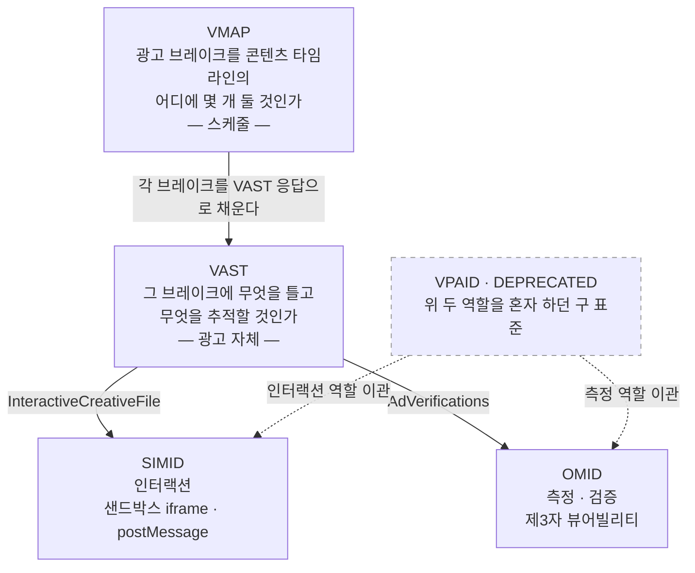
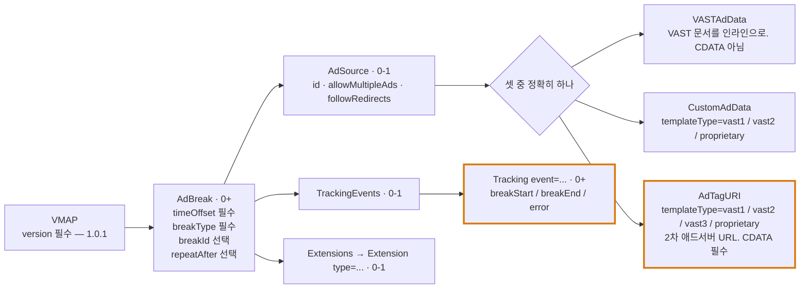
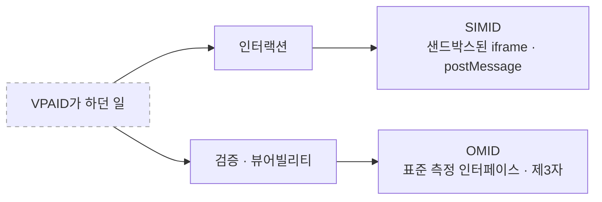

# 04. VMAP · VPAID · SIMID · OMID — VAST 주변 표준

> 출처: [VMAP 1.0.1 XSD (IAB 정본)](https://github.com/InteractiveAdvertisingBureau/vmap/blob/master/xsd/vmap.xsd) · [VMAP 1.0 스펙 PDF](https://www.iab.com/wp-content/uploads/2015/06/VMAPv1_0.pdf) · [SIMID 1.2 (GitHub 정본)](https://github.com/InteractiveAdvertisingBureau/SIMID/blob/master/SIMID%201.2.md) · [IAB SIMID 가이드라인](https://www.iab.com/guidelines/simid/) · [Open Measurement SDK](https://iabtechlab.com/standards/open-measurement-sdk/)
>
> 정리 기준일: 2026-09-25

---

## 0. 네 표준의 관계 한 장 정리



---

# 1. VMAP — Video Multiple Ad Playlist

## 1.1. 무엇을 푸는가

VAST는 **하나의 광고 브레이크**에 대한 응답이다. 그런데 30분짜리 콘텐츠라면 "0초에 pre-roll, 10분에 mid-roll, 20분에 mid-roll, 끝에 post-roll" 같은 **브레이크 스케줄 자체**를 누군가 정해야 한다.

IAB 정의:
> "an XML template that video content owners can use to describe the structure for ad inventory insertion **when they don't control the video player or the content distribution outlet.**"
>
> **번역**: 비디오 콘텐츠 소유자가 **비디오 플레이어나 콘텐츠 배포 채널을 통제하지 못할 때** 광고 인벤토리 삽입 구조를 기술하는 데 사용할 수 있는 XML 템플릿.

즉 **콘텐츠 소유자가 플레이어를 통제하지 못할 때** 광고 삽입 구조를 기술하는 수단이다. 유튜브/OTT에 콘텐츠를 배포하는 방송사의 상황이 정확히 이것이다.

- VMAP 1.0: 2012-07
- **VMAP 1.0.1: 2014** — 모호성 제거와 명시적 가이드라인 추가. 현재 유효 버전
- VAST 3.0 응답을 받도록 설계됐지만 **다른 포맷도 허용**한다

## 1.2. 구조 (XSD 기준)



## 1.3. `timeOffset` — 네 가지 표기법

| 형식 | 예 | 의미 |
|---|---|---|
| 시간 | `00:10:00` 또는 `00:10:00.500` | 콘텐츠 시작으로부터의 절대 오프셋 |
| 백분율 | `50%` | 전체 길이 대비 비율 (0~100 정수) |
| 키워드 | `start` / `end` | 최선두 / 최후미 |
| 브레이크 순번 | `#3` | **n번째 광고 브레이크 기회**. 콘텐츠에 큐포인트가 이미 있을 때 |

`#m` 표기가 중요한 이유: **방송 콘텐츠에는 이미 프로그램 상의 브레이크 지점(큐 마커)이 존재**한다. 절대 시간이 아니라 "세 번째 브레이크"로 지정해야 편집으로 길이가 바뀌어도 맞는다.

## 1.4. 나머지 속성

| 속성 | 값 | 의미 |
|---|---|---|
| `breakType` | `linear` / `nonlinear` / `display` (콤마로 복수 지정, 공백 없이) | 이 브레이크가 허용하는 광고 타입. **플레이어에 대한 "힌트"** |
| `breakId` | 문자열 | 브레이크 식별자 (선택) |
| `repeatAfter` | `HH:MM:SS[.mmm]` | **이 AdBreak/AdSource를 해당 간격마다 반복**하라는 지시. 라이브 스트림에서 유용 |
| `allowMultipleAds` | boolean | 응답 문서에서 광고 **하나만** 고를지 여러 개 틀지. 미지정 시 여러 개 허용 |
| `followRedirects` | boolean | 응답 내 Wrapper/리다이렉트를 따라갈지. 미지정 시 플레이어 재량 |

## 1.5. VMAP 트래킹 이벤트 — 딱 3개

`breakStart` / `breakEnd` / `error`

**VAST 이벤트와 레이어가 다르다.** VAST는 "광고 하나"의 생애(start, quartile, complete)를, VMAP은 "브레이크 전체"의 생애를 추적한다. 데이터 모델링 시 이 둘을 같은 테이블에 뭉개면 안 된다.

## 1.6. 예시

```xml
<vmap:VMAP xmlns:vmap="http://www.iab.net/videosuite/vmap" version="1.0.1">
  <vmap:AdBreak timeOffset="start" breakType="linear" breakId="preroll">
    <vmap:AdSource id="preroll-ad-1" allowMultipleAds="false" followRedirects="true">
      <vmap:AdTagURI templateType="vast3">
        <![CDATA[https://adserver.example.com/vast?pos=preroll]]>
      </vmap:AdTagURI>
    </vmap:AdSource>
    <vmap:TrackingEvents>
      <vmap:Tracking event="breakStart">
        <![CDATA[https://tracker.example.com/breakstart?id=preroll]]>
      </vmap:Tracking>
      <vmap:Tracking event="breakEnd">
        <![CDATA[https://tracker.example.com/breakend?id=preroll]]>
      </vmap:Tracking>
      <vmap:Tracking event="error">
        <![CDATA[https://tracker.example.com/breakerror?id=preroll]]>
      </vmap:Tracking>
    </vmap:TrackingEvents>
  </vmap:AdBreak>

  <vmap:AdBreak timeOffset="#2" breakType="linear,nonlinear" breakId="midroll-2"
                repeatAfter="00:10:00">
    <vmap:AdSource id="midroll-src" allowMultipleAds="true" followRedirects="true">
      <vmap:AdTagURI templateType="vast3">
        <![CDATA[https://adserver.example.com/vast?pos=midroll&pod=1]]>
      </vmap:AdTagURI>
    </vmap:AdSource>
  </vmap:AdBreak>

  <vmap:AdBreak timeOffset="end" breakType="linear" breakId="postroll">
    <vmap:AdSource id="postroll-src">
      <vmap:AdTagURI templateType="vast3">
        <![CDATA[https://adserver.example.com/vast?pos=postroll]]>
      </vmap:AdTagURI>
    </vmap:AdSource>
  </vmap:AdBreak>
</vmap:VMAP>
```

> 💡 **OpenRTB와의 연결**: VMAP의 `AdBreak` 하나가 OpenRTB의 **Ad Pod** 하나에 대응한다. `BREAKMAXDURATION`, `BREAKMAXADS`, `BREAKMINADLENGTH`, `BREAKMAXADLENGTH` VAST 매크로가 브레이크 제약을 애드서버에 전달하고, 그 애드서버가 SSP/Exchange로 갈 때 `Video.poddur`, `Video.maxseq`, `Video.minduration/maxduration`로 매핑된다. **VMAP → VAST 매크로 → OpenRTB Video 객체**로 이어지는 제약 전달 경로를 이해하는 게 CTV 애드테크의 핵심이다.

---

# 2. VPAID — 왜 죽었는가 (그래도 알아야 하는 이유)

## 2.1. 원래 목적과 오용

VPAID(Video Player-Ad Interface Definition)는 **광고 크리에이티브가 실행 코드를 갖고 플레이어와 양방향 통신**하게 만든 표준이다. 목적은 인터랙티브 광고였다.

그런데 VAST 스펙이 직접 지적하듯:
> "Verification services adopted VPAID in order to run code that verifies and measures playback (including viewability)."
> "**An unfortunate side effect of this approach is that, rather than simply enabling monitoring of player-controlled video playback, responsibility for creative rendering is placed on the verification service.** In many cases, multiple data-collection VPAID 'wrappers' may be used, leading to a **fragile chain of intermediaries in the critical path** which can significantly delay page rendering and create a negative experience for the viewer."
>
> **번역**: 검증 서비스들은 재생(뷰어빌리티 포함)을 검증·측정하는 코드를 실행하기 위해 VPAID를 채택했다. **이 방식의 불행한 부작용은 플레이어가 통제하는 비디오 재생을 단순히 모니터링하는 데 그치지 않고, 크리에이티브 렌더링 책임이 검증 서비스에 넘어간다는 점이다.** 많은 경우 데이터 수집용 VPAID '래퍼'가 여러 겹 쓰이며, 그 결과 **핵심 경로에 취약한 중개자 체인**이 생겨 페이지 렌더링을 크게 지연시키고 시청자 경험을 해칠 수 있다.

즉 **"임프레션 시점에 코드를 실행할 유일한 수단"이라는 이유로 측정 벤더들이 VPAID를 전용**했고, 그 결과 렌더링 책임이 측정 업체에 넘어가 체인이 취약해졌다.

## 2.2. 구조적 한계

| 항목 | VPAID의 문제 |
|---|---|
| 보안 | 크리에이티브가 **플레이어 DOM과 전역 JS 컨텍스트에 직접 접근** |
| 미디어 제어 | **크리에이티브가 비디오 로딩·재생을 직접 관장** |
| 프리캐싱 | VPAID 스크립트만 캐시 가능, **비디오 에셋은 프리캐시 불가** |
| 장애 영향 | 크리에이티브의 치명적 스크립트 에러가 **플레이어/퍼블리셔 사이트 전체 성능과 UX를 훼손** (샌드박스 공유) |
| **SSAI** | **불가능.** 삽입 시점에 브라우저 측 JS 런타임이 없음 |
| 지연 | 퍼블리셔가 VPAID 구현 효율과 내부 프로세스(검증, 트레이딩, 래핑)에 휘둘림 |
| API | 양측이 특정 JS 함수를 서로 **직접 호출** (공유 샌드박스, 비보안) |
| 크리에이티브 래핑 | VPAID 광고가 **다른 VPAID 광고를 로드 가능** |
| 환경 제약 | 플레이어가 **HTML video 엘리먼트여야만** 함 |
| MIME | `application/javascript` |

## 2.3. 폐기 경로

- **VAST 4.1**: VPAID 관련 기능 deprecate 시작. `MediaFile@apiFramework`, `Ad@conditionalAd` deprecate
- **VAST 4.1**: Flash 참조 전면 제거
- 대체: **인터랙션 → SIMID**, **검증/측정 → OMID**

VAST 스펙의 권고:
> "The IAB Tech Lab **strongly recommends using code that supports the Open Measurement Interface Definition (OMID)** for this purpose, and **strongly against using VPAID (which is being retired).**"
>
> **번역**: IAB Tech Lab은 이 목적으로 **OMID(Open Measurement Interface Definition)를 지원하는 코드를 사용할 것을 강력히 권고**하며, **VPAID(폐기 진행 중) 사용에는 강력히 반대한다.**

**여전히 알아야 하는 이유**: 레거시 인벤토리에 VPAID가 남아 있고, AdCOM API Frameworks 리스트에 `1`=VPAID 1.0, `2`=VPAID 2.0이 아직 존재한다. "우리 트래픽에 VPAID가 몇 %인가"를 측정하는 것 자체가 마이그레이션 프로젝트의 첫 단계다.

---

# 3. SIMID — Secure Interactive Media Interface Definition

## 3.1. 개념

> "While VAST addresses how publishers discover various metadata assets related to an ad campaign, **SIMID addresses how the publisher's media player should communicate and interface with a rich interactive layer and vice versa.** As such, one can think of the SIMID creative as one of the assets listed in a VAST document."
>
> **번역**: VAST가 퍼블리셔가 광고 캠페인과 관련된 각종 메타데이터 에셋을 찾는 방법을 다룬다면, **SIMID는 퍼블리셔의 미디어 플레이어가 리치 인터랙티브 레이어와 어떻게 통신하고 연동해야 하는지(그 반대 방향도)를 다룬다.** 따라서 SIMID 크리에이티브는 VAST 문서에 나열된 에셋 중 하나로 생각할 수 있다.

**핵심 원칙 — 인터랙티브 레이어와 미디어 에셋의 분리.**
> "This clear separation allows publisher players to be in control of their streams and **enables use cases such as server-side ad insertion (SSAI), as well as live streaming.**"
>
> **번역**: 이러한 명확한 분리 덕분에 퍼블리셔 플레이어가 자기 스트림을 통제할 수 있고, **서버사이드 광고 삽입(SSAI)과 라이브 스트리밍 같은 사용 사례가 가능해진다.**

- 현재 버전: **SIMID 1.2**
- 1.2 변경점: L자형 squeeze-back 처리, 반응형 광고의 미지 사이즈를 `-1`로 표현, **세션 ID는 암호학적으로 안전해야 함**, 딥링크 관련 주석

## 3.2. VPAID 대비 (스펙의 공식 비교표 요약)

| 항목 | VPAID | **SIMID** |
|---|---|---|
| 보안 | 플레이어 DOM/전역 JS 직접 접근 | **cross-origin iframe에 샌드박스.** DOM 접근도 JS 컨텍스트 공유도 없음 |
| 미디어 관리 | 크리에이티브가 담당 | **플레이어가 담당** |
| 프리캐싱 | 스크립트만 | **미디어 에셋과 SIMID 크리에이티브 둘 다 가능** |
| 에러 영향 | 플레이어/사이트 전체 훼손 | **크리에이티브 내부로 한정** |
| **SSAI** | **불가** | **가능** |
| 지연 | 크리에이티브 구현에 종속 | 플레이어가 로딩·표시를 완전 통제, **광고 결정 지연 제거** |
| API | 직접 함수 호출 | **`postMessage` + SIMID 메시징 프로토콜**만 사용 |
| 검증 | VPAID가 직접 수행 | **불가능 (의도된 것). OMID가 담당** |
| 크리에이티브 래핑 | 가능 | **불가** |
| 오디오 광고 | 범위 밖 | **지원** |
| 환경 | HTML video 엘리먼트 필수 | **네이티브/웹 모두.** 샌드박스된 DOM 접근만 있으면 됨 (웹뷰 포함) |
| MIME | `application/javascript` | **`text/html`** |

## 3.3. VAST에서 SIMID 참조하기

```xml
<MediaFiles>
  <MediaFile>
    <![CDATA[https://example.com/mediafile.mp4]]>
  </MediaFile>
  <InteractiveCreativeFile type="text/html" apiFramework="SIMID" variableDuration="true">
    <![CDATA[https://adserver.com/ads/creative.html]]>
  </InteractiveCreativeFile>
</MediaFiles>
```

필수 속성: **`type="text/html"`**, **`apiFramework="SIMID"`**

- **SIMID API 버전은 VAST의 어떤 요소/속성으로도 표시되지 않는다.** 플레이어와 크리에이티브가 로딩 과정에서 버전 협상을 한다
- `variableDuration="true"` (선택): 이 광고는 **플레이어가 광고 재생을 일시정지하고 브레이크 길이를 연장하도록 허용해야만 재생 가능**하다는 뜻. 게임·설문 같은 인터랙티브 콘텐츠용
  - **플레이어가 이를 지원/허용하지 않으면 미디어와 SIMID 둘 다 렌더링해서는 안 되고, 에러 처리 후 본 콘텐츠로 복귀하거나 pod의 다음 광고로 넘어가야 한다**
- SIMID를 지원하지 않는 플레이어는 **미디어 파일만 재생**하고 SIMID 크리에이티브는 로드하지 않는다 → **graceful degradation**

## 3.4. 통신 방식

- SIMID 크리에이티브는 **광고주 도메인에서 서빙되는 HTML 문서**이고, 플레이어는 이를 **다른 도메인의 cross-origin iframe("unfriendly iframe")** 에 로드한다
- 브라우저 샌드박스 제약 때문에 **표준 `postMessage` API만이 유일한 통신 수단**
- 로딩 시 iframe은 **숨겨진 상태로 시작**하되, 보이지 않는 동안에도 JS 실행과 리소스 로딩이 가능해야 한다

## 3.5. 범위와 한계 (중요)

- **뷰어빌리티 측정에 SIMID를 쓰면 안 된다.** 스펙 명시: "SIMID should not be set up to measure viewability. IAB Tech Lab offers resources for measurement in its Open Measurement initiative." — *번역: SIMID를 뷰어빌리티 측정용으로 설정해서는 안 된다. IAB Tech Lab은 Open Measurement 이니셔티브를 통해 측정용 리소스를 제공한다.*
- **클라이언트에서 임프레션 전에 어떤 미디어를 보여줄지 결정할 수 없다.** 미디어 파일은 VAST `MediaFile` 노드로 SIMID와 함께 내려와야 하므로
- **일부 TV/OTT 박스는 SIMID 구현이 불가능하다** — 외부 에셋 로딩 제한, HTML 렌더링 능력 제한, HTML과 오디오/비디오 동시 표시 불가
- 인터랙티브/동적 콘텐츠 외의 용도로 SIMID를 쓰는 것은 **스펙 의도에 반한다**

## 3.6. 프라이버시

> "As long as the ad is contained in a SIMID container, **it cannot access any data the publisher may have in the player app or the environment** where the player is installed."
>
> **번역**: 광고가 SIMID 컨테이너 안에 담겨 있는 한, 광고는 **퍼블리셔가 플레이어 앱이나 플레이어가 설치된 환경에 가지고 있는 어떤 데이터에도 접근할 수 없다.**

샌드박스가 곧 프라이버시 경계다. 동의 처리는 SIMID 로드 **이전**, 광고 거래 단계에서 끝난다.

---

# 4. OMID / Open Measurement SDK

## 4.1. 개념

- **OM SDK**: 디지털 광고 측정에 투명성과 신뢰를 제공하는 업계 표준 솔루션
- **OMID (Open Measurement Interface Definition)**: OM SDK가 통신하는 **API**. 사이트/앱이 이 표준 인터페이스로 측정 신호를 보내고, 제3자 검증 파트너가 그 데이터를 수집한다
- 현재 버전: **OMID 1.6** (Android / JavaScript / iOS별 API 문서). 1.5에서 Samsung·LG TV 포함 CTV 커버리지 확대, 1.4에서 네이티브 CTV 지원

## 4.2. 무엇을 푸는가

표준화 이전에는 "화면상 위치, 오버레이 투명도, quartile 측정" 같은 기본 신호조차 **측정 업체마다 다른 방법론으로 수집**됐다. 같은 캠페인의 뷰어빌리티가 벤더마다 다르게 나오는 문제가 여기서 생긴다. OM SDK는 이 파편화를 제거한다.

## 4.3. 세 가지 역할

1. **Integration Partner** — 앱/퍼블리셔 개발자, 광고 SDK 제공자. SDK를 임베드한다
2. **Verification Script** — 측정 제공자가 배치하는 태그. OMID를 통해 신호를 수집한다
3. **Measurement Provider** — 제3자 검증 벤더. 신호를 독립적으로 분석한다

**이 3자 분리가 핵심이다.** 퍼블리셔가 자기 뷰어빌리티를 자기가 재는 게 아니라, 표준 인터페이스를 통해 독립 제3자가 잰다.

## 4.4. 지원 환경

- **Web/JS**: OM Web Video SDK (2020-12 출시)
- **모바일 앱**: iOS, Android
- **CTV**: AndroidTV, tvOS, 그리고 Samsung·LG용 HTML5/Web Video

## 4.5. VAST와의 연결

```xml
<AdVerifications>
  <Verification vendor="vendor.com-omid">
    <JavaScriptResource apiFramework="omid" browserOptional="true">
      <![CDATA[https://vendor.com/omid-verification.js]]>
    </JavaScriptResource>
    <TrackingEvents>
      <Tracking event="verificationNotExecuted">
        <![CDATA[https://vendor.com/not-executed?reason=[REASON]]]>
      </Tracking>
    </TrackingEvents>
    <VerificationParameters><![CDATA[{...}]]></VerificationParameters>
  </Verification>
</AdVerifications>
```

- VAST 4.0이 `<AdVerifications>`라는 **전용 자리**를 만들었다. 검증 코드가 미디어 파일과 분리된다
- 검증 유닛이 실행되지 않으면 **VAST 에러코드 410**
- OpenRTB에서는 `Imp.video.api`에 **`7` (OMID 1.0)** 을 넣어 지원을 알린다
- VAST 매크로 `[OMIDPARTNER]`가 OM SDK 통합을 식별한다

## 4.6. SIMID + OMID = VPAID 완전 대체



두 표준이 **의도적으로 서로의 영역을 침범하지 않도록** 설계됐다는 점이 중요하다. SIMID는 측정을 못 하고(샌드박스 밖 접근 불가), OMID는 인터랙션을 안 한다.

---

## 5. 구현 체크리스트

- [ ] VMAP `timeOffset`의 네 형식 전부 파싱 (`HH:MM:SS.mmm`, `n%`, `start|end`, `#m`)
- [ ] `repeatAfter`로 생성되는 반복 브레이크 처리
- [ ] `allowMultipleAds=false`일 때 응답에서 광고 하나만 선택
- [ ] VMAP 이벤트(breakStart/breakEnd/error)와 VAST 이벤트를 **별도 레이어로** 모델링
- [ ] `InteractiveCreativeFile`의 `apiFramework` 확인 후 SIMID 미지원 시 **미디어만 재생**
- [ ] `variableDuration="true"`인데 브레이크 연장 불가 → **광고 전체를 에러 처리**
- [ ] SIMID iframe은 cross-origin + 숨김 시작, `postMessage`만 사용, 세션 ID는 암호학적 난수
- [ ] OMID 지원 시 `Imp.video.api`에 7 포함, `[OMIDPARTNER]` 매크로 채우기
- [ ] 검증 미실행 시 에러 410 + `[REASON]` 전달
- [ ] 트래픽 내 VPAID 비율 측정 → 마이그레이션 계획

---

## 6. 참고 원문

- VMAP XSD: https://github.com/InteractiveAdvertisingBureau/vmap/blob/master/xsd/vmap.xsd
- VMAP 1.0 PDF: https://www.iab.com/wp-content/uploads/2015/06/VMAPv1_0.pdf
- SIMID 1.2: https://github.com/InteractiveAdvertisingBureau/SIMID/blob/master/SIMID%201.2.md
- SIMID 렌더링 버전: https://interactiveadvertisingbureau.github.io/SIMID/
- IAB SIMID 가이드라인: https://www.iab.com/guidelines/simid/
- Open Measurement SDK: https://iabtechlab.com/standards/open-measurement-sdk/
- OM JS Clients: https://github.com/InteractiveAdvertisingBureau/Open-Measurement-JSClients
