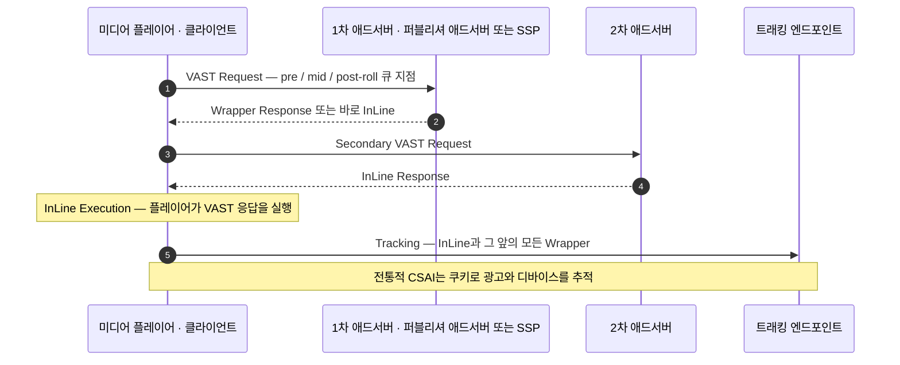
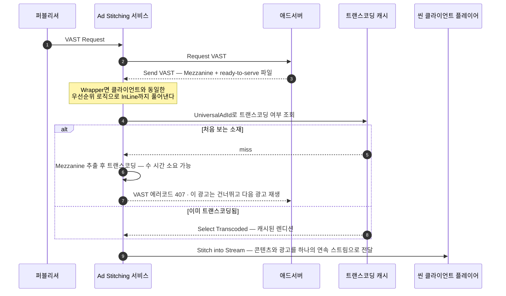

# 05. SSAI · CSAI — 광고 삽입 방식

> 출처: [VAST 4.x §1.1 Ad Serving and Tracking](https://github.com/InteractiveAdvertisingBureau/VAST4.x) · [OpenRTB 2.6 `Imp.ssai`](https://github.com/InteractiveAdvertisingBureau/openrtb2.x/blob/main/2.6.md) · [OpenRTB Implementation Notes §7.8](https://github.com/InteractiveAdvertisingBureau/openrtb2.x/blob/main/implementation.md) · [MRC Digital Video Measurement Guidelines](https://mediaratingcouncil.org/sites/default/files/Standards/Digital%20Video%20Served%20Impression%20Measurement%20Guidelines%20%28MMTF%20June%202018%29.pdf)
>
> 정리 기준일: 2026-09-25

---

## 1. 두 방식의 근본 차이

### CSAI — Client-Side Ad Insertion

플레이어(클라이언트)가 직접 애드서버에 VAST를 요청하고, 직접 광고를 재생하고, 직접 트래킹 픽셀을 쏜다.

VAST 스펙 §1.1.1이 기술하는 흐름:

### SSAI — Server-Side Ad Insertion (= Ad Stitching / Stream Stitching)

중간 서버가 **광고를 콘텐츠 스트림 안에 물리적으로 꿰매 넣어(stitch)** 하나의 연속 스트림으로 내려보낸다.

VAST 스펙 §1.1.2가 기술하는 흐름:

## 2. 왜 SSAI가 필요한가

> "in today's wide array of streaming media players **the player may not be capable of executing dynamic ad responses or tracking impressions and interactions.** In these cases, an intermediary server is needed to insert ads dynamically into the video or audio stream."

| 동기 | 설명 |
|---|---|
| **씬 클라이언트** | CTV 기기, 셋톱박스, 스마트TV는 VAST 파싱·동적 광고 실행 능력이 제한적 |
| **광고 차단 회피** | 광고가 콘텐츠와 같은 스트림·같은 도메인이라 클라이언트 단 차단이 어렵다 |
| **재생 끊김 제거** | 콘텐츠 → 광고 전환 시 버퍼링/블랙 프레임이 없다. 방송 수준 UX |
| **롱폼/라이브** | 수백만 동시 시청 라이브 이벤트에서 클라이언트마다 애드콜을 하면 애드서버가 버틴다는 보장이 없다 |

## 3. SSAI가 만드는 문제들

### 3.1. 쿠키가 없다

> "the ad-stitching service cannot access cookies used in traditional client-side tracking. Instead, the ad-stitching service must identify devices where ads play by a combination of other methods."

→ IFA(광고 식별자), IP, 디바이스 핑거프린트 조합에 의존하게 된다.

### 3.2. 모든 트래킹이 한 IP에서 나온다

> "This server-to-server tracking process is problematic because **all the tracking is coming from one IP address.** To an ad server that is receiving tracking information, **the reports look similar to invalid traffic.**"

이게 SSAI의 가장 실질적인 운영 문제다. 정상 트래픽이 IVT(invalid traffic)로 오판되면 그대로 매출 손실이다.

### 3.3. 서버 정보와 클라이언트 정보가 뒤섞인다

> "the server is initiating the request on behalf of the client, so it is important to **separate information describing the server itself from information describing the client.**"

---

## 4. ★ SSAI HTTP 헤더 규약 (VAST 4.1+)

IVT 오판을 피하기 위해 **ad stitching 제공자는 반드시** 다음 헤더를 포함해야 한다:

### 필수

| 헤더 | 값 |
|---|---|
| **`X-Device-IP`** | 이 요청을 대신 수행해 주는 **디바이스의 IP 주소** |
| **`X-Device-User-Agent`** | 대신 수행해 주는 **클라이언트의 User-Agent** |

### 가능하면 포함 (should)

| 헤더 | 값 |
|---|---|
| `X-Device-Referer` | 클라이언트가 직접 요청했다면 보냈을 `Referer` 값 |
| `X-Device-Accept-Language` | 클라이언트의 `Accept-Language` 값 |
| `X-Device-Requested-With` | 클라이언트의 `X-Requested-With` 값 |

### 선택 (may)

| 헤더 | 값 |
|---|---|
| `X-Forwarded-For` | 하위 호환용. **now deprecated** |
| `X-Device-*` | 클라이언트가 보냈을 다른 HTTP 헤더는 `X-Device-` 접두사를 붙여 포워딩 가능 |

> **"The information included in these headers must match the information in the original ad request payload."**
> 헤더와 페이로드가 불일치하면 그 자체가 부정 신호로 취급될 수 있다.

### 요청 방식에 대한 과도기 규정

VAST 4.1 이전 버전(2.0/3.0/4.0)으로 서버사이드 요청을 하는 경우, 퍼블리셔 서버나 SSAI 플랫폼은 **기존 HTTP GET 태그 요청을 계속 써도 되지만 위 헤더를 반드시 추가**해야 한다. 이는 매크로 기반 요청 모델(VAST §1.5)로 전환할 시간을 주기 위한 과도기 조치다.

그리고 스펙의 예고:
> "In the future, ad requests will move to a **POST based model**, which has performance and scaling implications, so the working group recommends that platforms start working on understanding architectural changes required to support POST messages at scale."

---

## 5. SSAI 관련 VAST 매크로

| 매크로 | 역할 |
|---|---|
| **`[SERVERSIDE]`** | 이 URL이 **클라이언트에서 요청됐는지 서버에서 요청됐는지** 표시 |
| **`[SERVERUA]`** | 클라이언트를 대신해 요청하는 **서버의** User-Agent |
| **`[DEVICEUA]`** | 실제로 광고를 렌더링하는 **디바이스의** User-Agent |
| **`[DEVICEIP]`** | 실제로 광고를 렌더링하는 **디바이스의** IP |

`[SERVERUA]`, `[DEVICEUA]`, `[DEVICEIP]`는 **"다른 주체가 클라이언트를 대신해 요청할 때만 의미가 있다"**고 스펙이 명시한다.

**매크로 치환 책임**도 달라진다:
> "In some cases a server might perform the macro replacement on behalf of the video player, for example in the case of **server-side ad insertion where the server is performing tracking pixel requests on behalf of the client.**"

---

## 6. OpenRTB의 `Imp.ssai` 신호

SSAI 사용 여부와 그것이 에셋/트래커 취득에 미치는 영향을 입찰 요청에 실어 보낸다.

| 값 | 의미 |
|---|---|
| `0` | 상태 불명 (기본값) |
| `1` | **전부 클라이언트 사이드** (= 서버사이드 아님) |
| `2` | **에셋은 서버에서 stitching되지만 트래킹 픽셀은 클라이언트에서 발화** |
| `3` | **전부 서버사이드** |

**값 2가 실무적으로 가장 흥미롭다.** 하이브리드 구성이다. 영상은 서버가 꿰매어 재생 UX를 매끄럽게 하되, 트래킹은 클라이언트가 쏴서 측정 신뢰도(MRC 요구사항)를 지킨다. **SSAI의 장점과 클라이언트 측정의 정확성을 모두 취하려는 절충안**이고, 실제로 성숙한 CTV 퍼블리셔들이 이 형태를 쓴다.

DSP 입장에서 `ssai=3`인 요청은:
- 뷰어빌리티 측정이 사실상 불가 → 뷰어빌리티 보장 캠페인을 붙이면 안 됨
- IVT 판정 로직을 다르게 적용해야 함
- 입찰가 산정에 측정 불확실성 프리미엄/디스카운트 반영

---

## 7. ★ Mezzanine 파일 — SSAI의 물리적 전제

SSAI 서버는 **광고를 콘텐츠와 같은 인코딩 프로파일로 다시 인코딩**해야 스트림에 꿰맬 수 있다. (해상도, 비트레이트, 코덱, GOP 구조, 오디오 샘플레이트가 안 맞으면 플레이어가 끊긴다.)

그래서 VAST 4.0이 **`<Mezzanine>`** 을 도입했다:

> "To support advertising across video platforms that include longform content and high-resolution screens, VAST 4 features include support for the raw, high-quality mezzanine file. **The mezzanine file is very large and cannot be used for ad display**, but ad-stitching services and other ad vendors use it to generate files at appropriate quality levels for the environment in which they play."

관련 에러 코드:

| 코드 | 상황 | 운영 의미 |
|---|---|---|
| **406** | Mezzanine이 필수인데 미제공. **광고 미서빙** | 소재 입고 프로세스 문제 |
| **407** | **Mezzanine을 최초 다운로드 중.** "수 시간이 걸릴 수 있음". 완료 전까지 미서빙 | **신규 소재의 첫 노출은 실패한다는 뜻.** 캠페인 시작 전 warm-up이 필요 |
| **411** | Mezzanine은 제공됐으나 규격 미충족. 광고 미서빙 | 소재 QC 실패 |

> 💡 **포트폴리오 연결점**: 407은 "**콜드 스타트 문제**"의 아주 구체적인 도메인 사례다. 캠페인 시작 시점에 fill rate가 떨어지는 현상을 407 비율로 설명하고, "소재 등록 시점에 트랜스코딩을 사전 트리거하는 파이프라인"을 설계했다고 말하면 도메인 이해를 확실히 보여준다.

`<Ready-to-serve>` 파일도 함께 이해해야 한다. VAST 4는 Mezzanine 외에 **서로 다른 화질 레벨의 즉시 재생 가능 파일 3개**를 제공하도록 가이드한다. "linear 비디오/오디오 광고가 **항상** 재생될 수 있게" 보장하기 위해서다.

---

## 8. ★ SSAI에서의 임프레션 측정 — 가장 중요한 논쟁 지점

VAST 스펙이 MRC 가이드라인을 인용하며 직접 짚는다:

> "While these recommendations for tracking support server-side tracking, **IAB Impression Measurement Guidelines developed with the Media Rating Council (MRC) favor client-side tracking.**
>
> 'The Measurement Guidelines require ad counting to use a **client-initiated approach**; **server-initiated ad counting methods** (the configuration in which impressions are counted at the same time the underlying page content is served) **are not acceptable** for counting ad impressions because they are the furthest away from the user actually seeing the ad.
>
> Measurement counting **may happen at the server side as long as it is initiated based on client-side events and measurement assets.** However, pass-through methods (where client-initiated measurement is passed to server-side collection) of signaling interactions detected on the client side from server infrastructure are acceptable.'"

**정리하면:**

| 방식 | MRC 허용 여부 |
|---|---|
| 클라이언트에서 이벤트 발생 → 클라이언트가 직접 픽셀 발화 | ✅ 표준 |
| 클라이언트에서 이벤트 발생 → 그 신호를 서버가 받아 서버에서 집계 (pass-through) | ✅ 허용 |
| **콘텐츠를 서빙하는 시점에 서버가 임프레션을 카운트** | ❌ **불허** |

즉 **"서버에서 세는 것"이 문제가 아니라 "클라이언트 이벤트에 기반하지 않고 세는 것"이 문제다.**

### 현실의 타협

스펙도 현실을 인정한다:
> "an ad-stitching service may have little or no control over ad play once the ad is stitched into the content and streamed to the client. **Impression reporting may vary by implementation.** For the ad stitching service in situations where the client cannot count impressions, an impression **could** be reported as the ad is sent on the stitched stream and therefore be **as close as possible to the opportunity to play**. Alternately, a session-oriented ad-stitching service may report impressions **from a given session at session completion**."

그리고:
> "**any impression measurement beyond the ad-stitched stream is out of the ad-stitching services' control and should be counted by the player whenever possible.**"

### 감사(audit) 시 초점

> "Auditing for compliance with IAB Viewable Ad Impression Measurement Guidelines should focus on **disclosing the process by which impressions are counted and any limitations** with reporting impressions in certain situations and environments."

→ **완벽한 측정이 아니라 "어떻게 세는지와 그 한계를 공개했는가"가 감사 기준이다.** 애드테크에서 "정확성"은 절대값이 아니라 **투명하게 공시된 방법론**이라는 점을 이해하는 게 중요하다.

---

## 9. 서버사이드 통지 Best Practice (OpenRTB §7.8)

롱폼 비디오와 모바일 앱에서 서버가 임프레션/과금 통지를 대신 쏘는 것은 흔하다. 그때의 규칙:

> **BEST PRACTICE**: 가능한 경우 exchange는 `burl` 통지를 **서버사이드에서** 보내 수요 파트너와의 불일치를 최소화할 것. 단 **과금 이벤트 자체는 MRC 가이드라인에 따라 클라이언트 측 이벤트에서 발원해야 한다.**

> **BEST PRACTICE**: 서버사이드에서 임프레션 통지를 HTTP로 쏠 때 통지 주체는:
> - **`X-Forwarded-For` 또는 `X-Device-IP`** 헤더로 대신 요청해 주는 클라이언트 디바이스의 IP를 표시할 것
> - **`X-Device-User-Agent`** 헤더로 그 디바이스의 UA를 표시할 것
>
> "These HTTP headers allow recipients of impression notifications to **run anti-IVT checks using metadata about the end user device, rather than the server itself.**"

> **BEST PRACTICE**: 서버사이드 통지 시 [ads.cert Call Sign](https://iabtechlab.com/wp-content/uploads/2021/09/2-ads-cert-call-signs-pc.pdf)을 확립하고 [ads.cert Authenticated Connections](https://iabtechlab.com/wp-content/uploads/2021/09/3-ads-cert-authenticated-connections-pc.pdf) 프로토콜로 **통지에 암호학적 서명**을 할 것. 수신자가 발신자를 인증할 수 있게 하여 부정을 방지한다.

---

## 10. SSAI vs CSAI 비교 정리

| 항목 | CSAI | SSAI |
|---|---|---|
| 광고 요청 주체 | 플레이어 | stitching 서버 |
| 재생 전환 | 콘텐츠↔광고 플레이어 전환 → 버퍼링 가능 | 단일 연속 스트림 → 끊김 없음 |
| 광고 차단 | 상대적으로 쉬움 | 어려움 |
| 쿠키 | 사용 가능 | 사용 불가 (IFA/IP 조합) |
| 트래킹 발화 주체 | 클라이언트 | 서버 (또는 하이브리드) |
| IVT 오판 위험 | 낮음 | **높음** → `X-Device-*` 헤더 필수 |
| 뷰어빌리티 측정 | 가능 (OMID) | **매우 제한적** |
| 인터랙티브 광고 | VPAID/SIMID 가능 | **VPAID 불가**, SIMID는 가능 |
| 트랜스코딩 | 불필요 | **필수** (Mezzanine → 콘텐츠 프로파일) |
| 콜드 스타트 | 없음 | **있음** (에러 407) |
| 적합 환경 | 웹, 모바일 앱 | **CTV, OTT, 라이브, 롱폼** |
| OpenRTB `Imp.ssai` | `1` | `2`(하이브리드) 또는 `3` |

---

## 11. 구현 체크리스트

- [ ] `X-Device-IP`, `X-Device-User-Agent` 필수 포함. 페이로드와 값 일치 보장
- [ ] `X-Device-Referer`, `X-Device-Accept-Language`, `X-Device-Requested-With` 가능하면 포함
- [ ] `X-Forwarded-For`는 deprecated임을 인지 (하위 호환용만)
- [ ] `[SERVERSIDE]`, `[SERVERUA]`, `[DEVICEUA]`, `[DEVICEIP]` 매크로 서버 측 치환
- [ ] `UniversalAdId` 기반 트랜스코딩 캐시. 소재 변경 시 새 ID 강제
- [ ] Mezzanine 사전 트랜스코딩 파이프라인 (에러 407 최소화)
- [ ] Wrapper 체인은 stitching 서버가 **클라이언트와 동일한 우선순위 로직으로** 해석
- [ ] 임프레션 카운팅 방법론과 한계를 **문서화하고 공시** (감사 대비)
- [ ] 가능하면 `ssai=2` 하이브리드 — 트래킹은 클라이언트에서
- [ ] 서버사이드 통지에 ads.cert 서명 검토
- [ ] IVT 판정 로직을 `Imp.ssai` 값에 따라 분기

---

## 12. 참고 원문

- VAST 4.x §1.1 (Client-Side / Server-Side Stitching / Headers): https://github.com/InteractiveAdvertisingBureau/VAST4.x
- OpenRTB 2.6 `Imp.ssai`: https://github.com/InteractiveAdvertisingBureau/openrtb2.x/blob/main/2.6.md
- OpenRTB Implementation Notes §7.8: https://github.com/InteractiveAdvertisingBureau/openrtb2.x/blob/main/implementation.md
- MRC Digital Video Served Impression Guidelines: https://mediaratingcouncil.org/sites/default/files/Standards/Digital%20Video%20Served%20Impression%20Measurement%20Guidelines%20%28MMTF%20June%202018%29.pdf
- ads.cert: https://iabtechlab.com/wp-content/uploads/2021/09/3-ads-cert-authenticated-connections-pc.pdf
