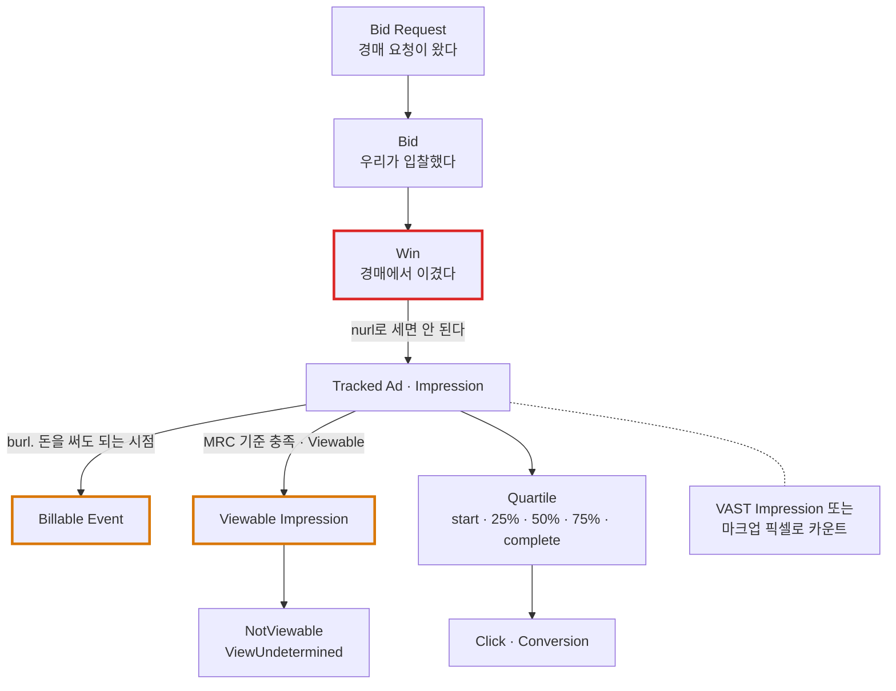
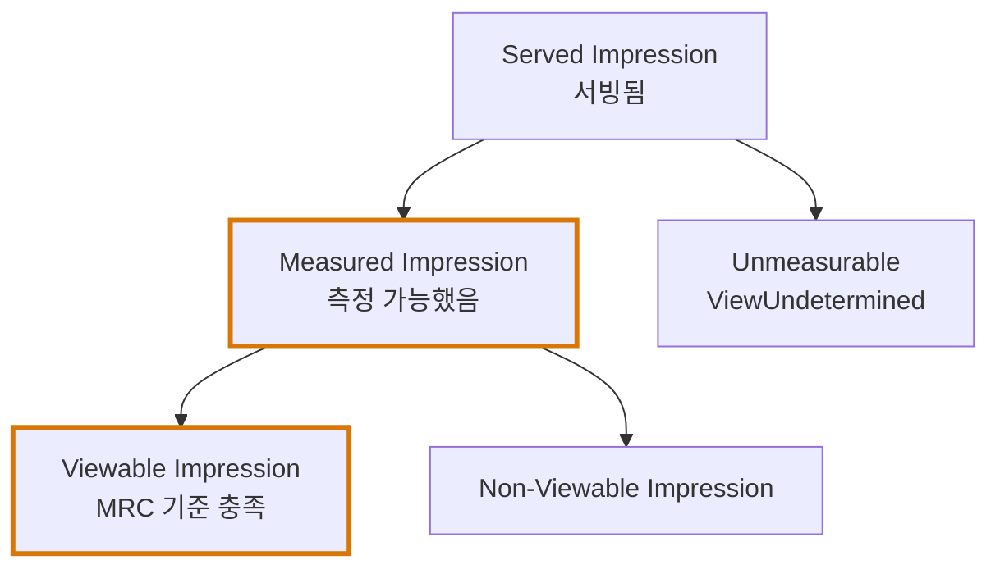
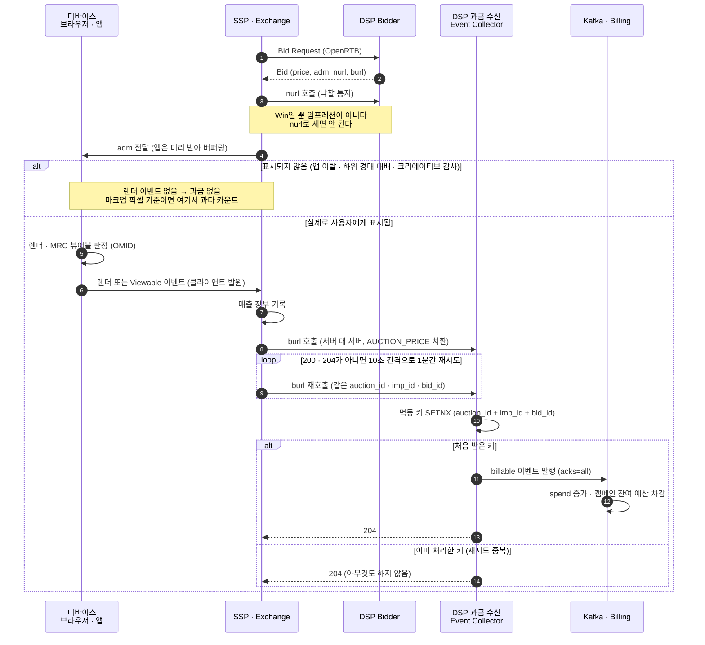
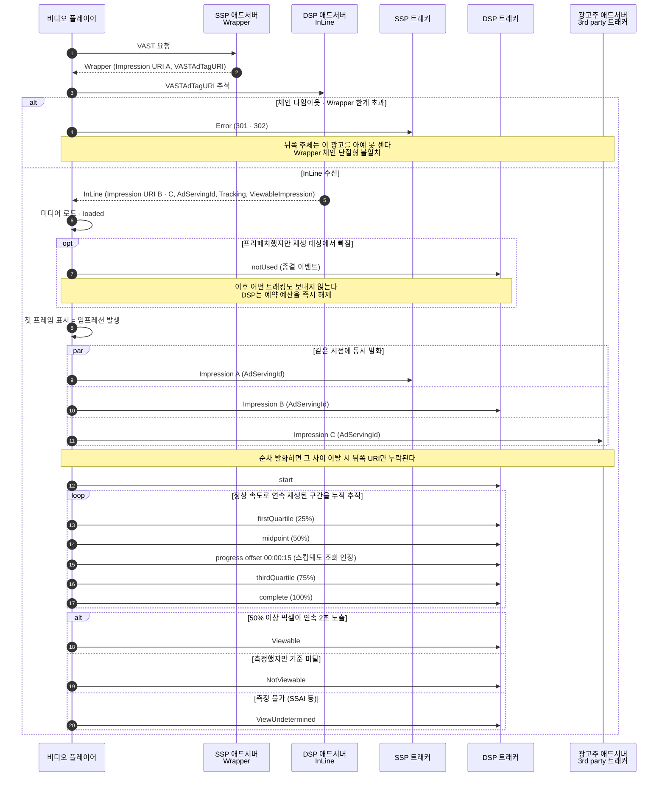
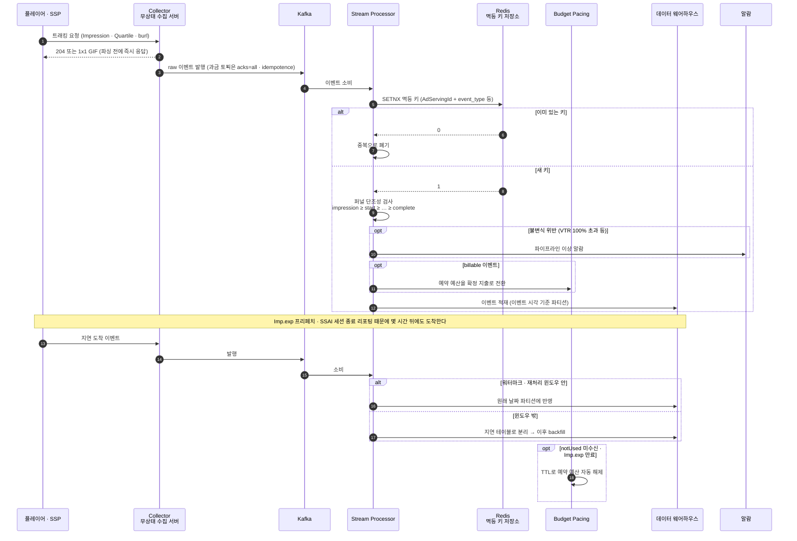
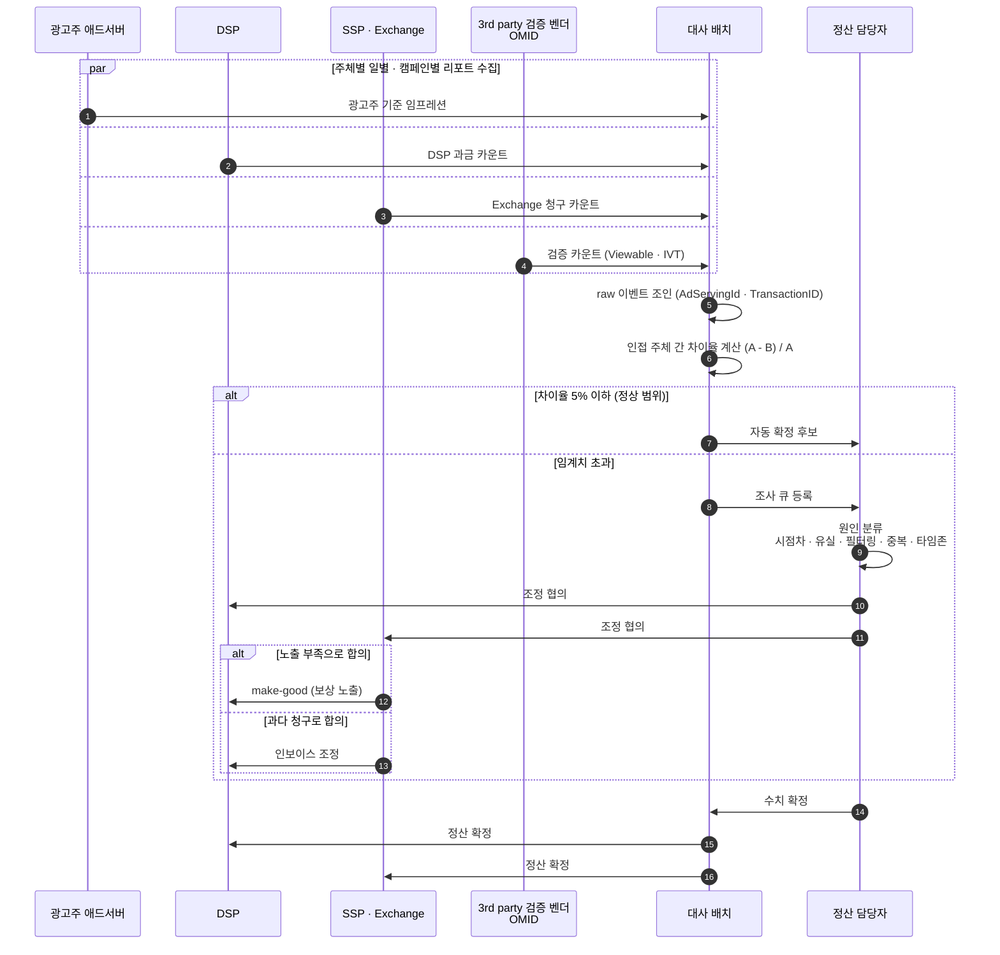
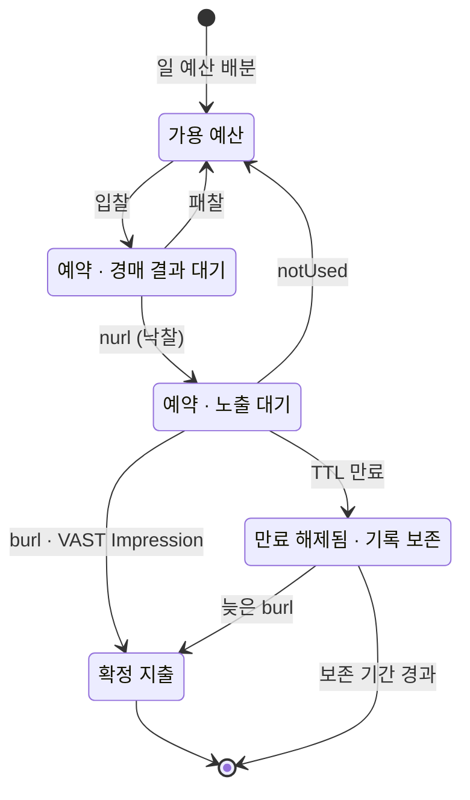
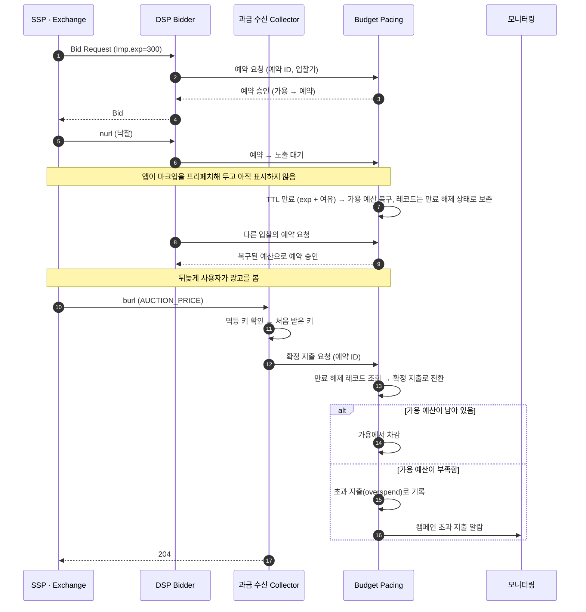

# 06. 광고 이벤트 · 트래킹 · 정산과 대사(Reconciliation)

> 출처: [OpenRTB Implementation Notes §7.8 Counting Billable Events and Tracked Ads](https://github.com/InteractiveAdvertisingBureau/openrtb2.x/blob/main/implementation.md) · [VAST 4.x §3.4.4 / §3.5 / §3.14](https://github.com/InteractiveAdvertisingBureau/VAST4.x) · [MRC Viewable Ad Impression Measurement Guidelines](https://www.iab.com/wp-content/uploads/2015/06/MRC-Viewable-Ad-Impression-Measurement-Guideline.pdf) · [MRC Standards](https://mediaratingcouncil.org/standards-and-guidelines)
>
> 정리 기준일: 2026-09-25

---

## 1. 이벤트 계층 구조 — 무엇이 무엇과 다른가

애드테크 데이터의 가장 흔한 실수는 아래 것들을 같은 것으로 취급하는 것이다. **전부 다른 개념이고 전부 숫자가 다르다.**



각 단계에서 수가 줄어든다(퍼널). 그리고 **각 단계를 서로 다른 주체가 각자 센다.** 이게 대사(reconciliation) 문제의 전부다.

---

## 2. Impression — 무엇을 임프레션이라 부르는가

### 2.1. VAST `<Impression>` (§3.4.4)

| 속성 | 내용 |
|---|---|
| Player Support | **필수** |
| Required in Response | **예** |
| Parent | InLine 또는 Wrapper |
| Bounded | **1+** |
| `id` 속성 | 애드서버의 임프레션 ID |

핵심 규칙:
> "All `<Impression>` URIs in the InLine response and any Wrapper responses preceding it should be **triggered at the same time** when the impression for the ad occurs, or as close in time as possible to when the impression occurs, **to prevent impression-counting discrepancies.**"
>
> **번역**: InLine 응답과 그 앞의 모든 Wrapper 응답에 있는 `<Impression>` URI는 광고 임프레션이 발생할 때 **동시에 호출**되어야 하며, 그게 안 되면 임프레션 발생 시점에 최대한 가깝게 호출되어야 한다. **임프레션 카운팅 불일치를 막기 위해서다.**

> "Impression URIs of the **same id** for an ad should be requested at the same time or as close in time as possible to help prevent discrepancies."
>
> **번역**: 한 광고에서 **같은 id**를 가진 Impression URI들은 불일치를 막기 위해 동시에, 또는 시간상 최대한 가깝게 요청되어야 한다.

즉 **불일치를 막는 1차 방어선이 "동시 발화"**다. 순차 발화하면 그 사이에 사용자가 이탈하여 뒤쪽 URI만 누락된다.

임프레션을 보낼 이유가 없으면 트래킹 URL 대신 **`about:blank`** 를 넣고, 플레이어는 그 값이면 호출하지 않는다.

### 2.2. `creativeView`는 임프레션이 아니다

VAST 스펙이 직접 구분한다:
> "**Not to be confused with an impression**, this event indicates that an **individual creative portion** of the ad was viewed. An impression indicates that at least a portion of the ad was displayed; however **an ad may be composed of multiple creative**, or creative that only play on some platforms and not others."
>
> **번역**: **임프레션과 혼동하지 말 것.** 이 이벤트는 광고의 **개별 크리에이티브 부분**이 조회되었음을 뜻한다. 임프레션은 광고의 적어도 일부가 표시되었음을 뜻하지만, **하나의 광고는 여러 크리에이티브로 구성될 수 있고**, 일부 플랫폼에서만 재생되는 크리에이티브도 있다.

하나의 `<Ad>`가 Linear + Companion + NonLinear 여러 크리에이티브로 구성될 수 있다. 임프레션은 광고 단위, `creativeView`는 크리에이티브 단위다.

---

## 3. ★ Quartile — 정의를 정확히

| 이벤트 | 스펙 정의 |
|---|---|
| `loaded` | 플레이어가 미디어와 에셋을 **재생 준비가 될 정도로** 로드·버퍼링했다고 판단 |
| `start` | 광고 내 개별 크리에이티브가 로드되고 **재생이 시작**됨 |
| `firstQuartile` | **전체 길이의 최소 25%를 정상 속도로 연속 재생** |
| `midpoint` | **최소 50%를 정상 속도로 연속 재생** |
| `thirdQuartile` | **최소 75%를 정상 속도로 연속 재생** |
| `complete` | **정상 속도로 끝까지 재생되어 100% 재생됨** |
| `progress` | `offset` 속성이 지정한 시간/비율 도달. `HH:MM:SS`, `HH:MM:SS.mmm`, `n%` |

### 3.1. 두 개의 한정어를 놓치지 말 것

**"continuously"** 와 **"at normal speed"**.

- 25% 지점을 지나쳤어도 **중간을 건너뛰었으면 firstQuartile이 아니다**
- 2배속 재생은 **정상 속도가 아니다**

즉 quartile은 "playhead > duration × 0.25"의 단순 비교가 아니다. 플레이어는 **연속 재생 구간을 누적 추적**해야 한다.

### 3.2. 데이터 엔지니어링 관점의 불변식(invariant)

정상적인 이벤트 스트림은 다음을 만족해야 한다:

```
count(impression) ≥ count(start)
              ≥ count(firstQuartile)
              ≥ count(midpoint)
              ≥ count(thirdQuartile)
              ≥ count(complete)
```

이 단조성이 깨지면 **파이프라인에 문제가 있다는 신호**다. 흔한 원인:
- 중복 제거 실패 (재시도로 인한 이중 카운트)
- 이벤트 순서 역전 (네트워크 지연으로 complete가 midpoint보다 먼저 도착)
- 파티션 경계 문제 (자정 근처 이벤트가 다른 날짜로 집계)

**VTR(Video Completion Rate) = complete / impression** 이 핵심 성과 지표이고, 이 불변식이 깨지면 VTR이 100%를 넘는 말도 안 되는 값이 나온다.

> 💡 **포트폴리오 연결점**: Event Processor를 만든다면 **"quartile 단조성 검증을 스트림 처리 단계에서 실시간 assertion으로 넣고, 위반 시 알람"** 같은 설계는 도메인을 아는 사람만 할 수 있는 이야기다.

### 3.3. `progress`로 표현하는 계약 조건

> "When skippable ads are supported, the **progress** event is used to identify **when the ad counts as a view even if the ad is skipped.** For example, if the tracking offset is set to `00:00:15` (15 seconds) but the ad is skipped after 20 seconds, then a creativeView event may be recorded."
>
> **번역**: 스킵 가능한 광고를 지원할 때 **progress** 이벤트는 **광고가 스킵되더라도 조회로 인정되는 시점**을 식별하는 데 쓰인다. 예를 들어 트래킹 offset이 `00:00:15`(15초)로 설정되어 있고 광고가 20초 후에 스킵되었다면, creativeView 이벤트가 기록될 수 있다.

"15초 이상 시청 시 과금"이라는 비즈니스 계약이 `<Tracking event="progress" offset="00:00:15">`로 표현된다. `progress`는 여러 개 둘 수 있고 quartile을 대체할 수도, 병행할 수도 있다.

### 3.4. 오디오 특례

> "If adType is 'audio' or 'hybrid', **progress events should be fired even if the media playback is in the background.**"
>
> **번역**: adType이 'audio' 또는 'hybrid'라면, **미디어가 백그라운드에서 재생 중이더라도 progress 이벤트를 발화해야 한다.**

오디오 광고(팟캐스트, 음악 스트리밍)는 화면이 꺼져 있어도 들린다. 그래서 백그라운드에서도 진행 이벤트를 쏴야 한다.

### 3.5. `notUsed` — 예산 회수 이벤트

> "This ad was not and will not be played (e.g. it was prefetched for a particular ad break but was not chosen for playback). **This allows ad servers to reuse an ad earlier than otherwise would be possible due to budget/frequency capping.** This is a terminal event; no other tracking events should be sent when this is used."
>
> **번역**: 이 광고는 재생되지 않았고 앞으로도 재생되지 않는다 (예: 특정 광고 브레이크를 위해 프리페치되었지만 재생 대상으로 선택되지 않음). **이 이벤트 덕분에 애드서버는 예산/빈도 제한 때문에 원래 가능했던 것보다 더 일찍 광고를 재사용할 수 있다.** 종결 이벤트이므로, 이 이벤트를 보낸 뒤에는 다른 트래킹 이벤트를 보내면 안 된다.

- **종결 이벤트다.** 이 이후 다른 트래킹을 보내면 안 된다
- 플레이어 지원은 선택이고 best-effort — "플레이어 자체가 재생 전에 종료되면 발화 불가"

> 💡 **Budget Pacing Service 설계 포인트**: 프리페치 시 예약(reserve)한 예산을 `notUsed`로 즉시 해제하고, 오지 않으면 `Imp.exp` 기반 TTL로 만료 해제하는 2단 회수 구조가 자연스럽다. → 상세는 §9

---

## 4. ★ 과금 이벤트 카운팅 방법론 4가지 (OpenRTB §7.8)

> "There are multiple conventions for how to count billable events or tracked ads via OpenRTB... Implementers should **discuss the definition of the billable event and the technical basis for counting it with their counterparties** to determine a mutually acceptable approach."
>
> **번역**: OpenRTB에서 과금 이벤트나 tracked ad를 세는 관례는 여러 가지다... 구현 주체들은 서로 받아들일 수 있는 방식을 정하기 위해 **과금 이벤트의 정의와 그것을 세는 기술적 근거를 거래 상대방과 협의해야 한다.**

| 방법 | 스펙이 적은 특징 |
|---|---|
| **Pixel in Markup** | • 널리 지원됨<br>• 보통 클라이언트 브라우저에서 발화<br>• **불일치가 발생하기 쉬움**<br>• 일부 상황에서 **과다 카운트** (모바일 앱)<br>• **디스플레이에만 적용 가능** |
| **VAST `<Impression>`** | • **오디오/비디오에 권장**<br>• 오디오/비디오에만 적용 가능 |
| **Billing notice (`burl`)** | • **DSP와 exchange 간 tracked ad 카운팅 정합이 가장 좋음**<br>• **불일치 최소**<br>• **오디오/비디오에는 비권장**, 그 외 모든 크리에이티브 타입에 적용 가능<br>• 보통(그리고 권장되기로) 서버 대 서버로 발화하되 **클라이언트 이벤트에 기반** |
| **Native eventtrackers / imptrackers / jstrackers** | • 네이티브 광고 전용 |

### 4.1. Pixel in Markup의 두 가지 실패 케이스

> **모바일 앱** — 광고가 표시될 때만 과금돼야 하는데, 앱에서는 느리고 불안정한 연결에 대비해 **마크업을 훨씬 먼저 가져와 버퍼링**한다. 사용자가 광고 표시 전에 앱을 떠나면 마크업은 끝내 표시되지 않는다. **특히 전면 광고(interstitial)에서 문제.**

> **크리에이티브 감사(Creative auditing)** — 멀버타이징 스캔을 위해 마크업을 로드하면 **가짜 과금/tracked ad 이벤트가 생긴다. 이기지도 않은 경매에 대해서도.**

> **BEST PRACTICE**: 가능한 경우 exchange는 모바일 앱 컨텍스트에서 **`adm` 기반 통지를 과금 판정 기준으로 쓰지 말고**, `burl` 또는 **실제로 광고가 사용자에게 표시된 것에 근거한 독립 측정 방식(예: OMID)** 을 쓸 것.

### 4.2. VAST `<Impression>` — 비디오/오디오의 공식 신호

> "The IAB **prescribes** that for video, the VAST `<Impression>` event is the **official signal** that the billable event has occurred."
> "Demand chain participants are **discouraged** from using billing notice URLs (`burl`) for video/audio transactions."
>
> **번역**: IAB는 비디오의 경우 VAST `<Impression>` 이벤트를 과금 이벤트가 발생했다는 **공식 신호**로 **규정한다.** 수요 체인 참여자들은 비디오/오디오 거래에 과금 통지 URL(`burl`)을 쓰지 **않도록 권고된다.**

### 4.3. `burl` — 과금 통지

> "A **billing event** is when a transaction results in a **monetary charge** from the publisher to an exchange, and subsequently from the exchange or other intermediary to one of their demand-side partners... **For a DSP, this event signals that they can increment spend and deduct the remaining budget against the related campaign.**"
>
> **번역**: **과금 이벤트**란 거래가 퍼블리셔에서 exchange로, 이어서 exchange나 다른 중개자에서 수요 측 파트너 중 하나로 **금전 청구**를 발생시키는 시점이다... **DSP에게 이 이벤트는 지출을 증가시키고 관련 캠페인의 잔여 예산을 차감해도 된다는 신호다.**

`burl`에 대한 스펙의 BEST PRACTICE 전부:

1. **"Firing the billing notice URL represents the fulfillment of a business transaction... This should not be delegated to another party including a client-side pixel**, although a pixel may be the initiating signal for billing to the exchange." — *번역: 과금 통지 URL을 호출하는 것은 사업상 거래의 이행을 뜻한다... **클라이언트 사이드 픽셀을 포함해 다른 주체에게 위임해서는 안 된다.** 다만 픽셀이 exchange에 대한 과금의 시작 신호가 될 수는 있다.*
2. **"Exchanges... should invoke the billing notice from the server-side... as 'close' as possible to the moment when the exchange books revenue."** — *번역: exchange는... exchange가 매출을 장부에 기록하는 순간에 최대한 '가깝게' **서버 사이드에서** 과금 통지를 호출해야 한다.*
3. **"Exchanges are highly encouraged to standardize on a client-initiated render or viewability event as the basis for the billing event.** This is generally the most consistent approach in a complex supply chain scenario composed of multiple auction decision points." — *번역: **exchange는 클라이언트 개시 렌더 이벤트 또는 뷰어빌리티 이벤트를 과금 이벤트의 기준으로 표준화할 것이 강력히 권장된다.** 이는 여러 경매 결정 지점으로 구성된 복잡한 공급망 시나리오에서 일반적으로 가장 일관된 방식이다.*
4. "Publishers should generally refer to the **MRC's guidelines** to determine when the criteria have been met to consider a transaction billable." — *번역: 퍼블리셔는 거래를 과금 대상으로 볼 기준이 충족되었는지 판단할 때 일반적으로 **MRC 가이드라인**을 참고해야 한다.*
5. ★ **"The public internet is noisy and this event is financial in nature. If an entity calling a billing notice receives a response other than HTTP 200 or 204, it should consider a retry scheme (e.g., every 10 seconds for the next minute). Conversely, an entity receiving billing notices should endeavor to make their endpoint idempotent to avoid double counting."** — *번역: 공용 인터넷은 불안정하고 이 이벤트는 금전적 성격을 띤다. 과금 통지를 호출한 주체가 HTTP 200이나 204가 아닌 응답을 받으면 재시도 방식(예: 이후 1분간 10초마다)을 고려해야 한다. 반대로 과금 통지를 받는 주체는 이중 카운팅을 피하도록 엔드포인트를 멱등하게 만들어야 한다.*

> 💡 **5번이 그대로 시스템 설계 요구사항이다.** 과금 통지 수신 엔드포인트는 **멱등(idempotent)** 해야 한다. 재시도가 프로토콜 차원에서 권장되므로 **중복 수신은 예외가 아니라 정상**이다.
>
> 구현: `(auction_id, imp_id, bid_id)` 조합을 멱등 키로 삼아 Redis SETNX 또는 Kafka 키 기반 중복 제거. TTL은 재시도 윈도우(1분) + 여유를 커버해야 하고, 지연 도착을 감안하면 실무에서는 훨씬 길게 잡는다.

### 4.4. `nurl`은 절대 아니다

> "At first glance, an auction 'win' and the associated win notice (`nurl`) field appears suitable as a proxy for billable/tracked ad counting. However, **winning an auction does not guarantee that an impression will indeed be served, and in fact in many cases only a small percentage of won auctions will become impressions.** This occurs because of downstream auctions (i.e. client-side header bidding), inability to play back media (in video and audio), etc."
>
> **"Win notice URLs should never be used to count impressions or tracked ads."**
>
> **번역**: 언뜻 보면 경매 '낙찰'과 그에 따른 낙찰 통지(`nurl`) 필드가 과금/tracked ad 카운팅의 대용으로 적합해 보인다. 그러나 **경매 낙찰이 임프레션이 실제로 서빙된다는 것을 보장하지 않으며, 실제로 많은 경우 낙찰된 경매 중 일부만 임프레션이 된다.** 하위 경매(예: 클라이언트 사이드 헤더 비딩), 미디어 재생 불가(비디오·오디오) 등 때문이다.
>
> **낙찰 통지 URL은 절대로 임프레션이나 tracked ad를 세는 데 쓰면 안 된다.**

---

## 5. Viewability — MRC 기준

| 포맷 | 기준 |
|---|---|
| **디스플레이** | 픽셀의 **50% 이상**이 **연속 1초 이상** 화면에 노출 |
| **대형 디스플레이** (242,000 픽셀 초과) | 면적의 **30% 이상**이 **1초 이상** |
| **비디오** | 픽셀의 **50% 이상**이 **연속 2초 이상** |

추가 규정:
> 뷰어빌리티 판정을 **광고 자체의 픽셀이 아니라 비디오 플레이어의 픽셀 50%** 기준으로 한다면, 그 구분을 **명확히 공시**해야 하고, 플레이어 기준 사용의 영향이 미미하다는 근거를 제시해야 한다.

### 5.1. VAST에서의 표현

```xml
<ViewableImpression id="...">
  <Viewable><![CDATA[https://.../viewable]]></Viewable>
  <NotViewable><![CDATA[https://.../notviewable]]></NotViewable>
  <ViewUndetermined><![CDATA[https://.../undetermined]]></ViewUndetermined>
</ViewableImpression>
```

- 플레이어 지원은 **선택**
- 발화 시점은 **"플레이어가 구현한 뷰어빌리티 표준에 따라, 구매자와의 합의 또는 이해 하에"** 결정된다 → 스펙이 기준을 강제하지 않는다
- **오디오에는 적용 불가**
- 동일 `id`의 URI는 동시 발화

**`<ViewUndetermined>`가 별도로 존재한다는 점이 데이터 모델링의 핵심이다.** 측정 불가를 "미달"로 뭉개면 안 되고, **viewable / not-viewable / undetermined 3-state**로 저장해야 한다. SSAI 환경에서는 undetermined 비율이 매우 높게 나온다.

### 5.2. 계층 관계



**Viewability Rate = Viewable / Measured** 이지 `/ Served`가 아니다. 분모를 뭘로 쓰느냐로 숫자가 완전히 달라지고, 이게 벤더 간 분쟁의 단골 소재다.

---

## 6. ★ 대사(Reconciliation)와 불일치(Discrepancy)

### 6.1. 왜 숫자가 안 맞는가

애드테크에서는 **같은 임프레션을 4~6개 주체가 각자 센다.**

```
광고주 애드서버 (3rd party ad server)     ← 광고주가 믿는 숫자
       ↕ 불일치
DSP                                      ← 광고주에게 청구하는 숫자
       ↕ 불일치
Ad Exchange / SSP                        ← DSP에 청구하는 숫자
       ↕ 불일치
퍼블리셔 애드서버 (1st party)              ← 매체사가 받는 숫자
       ↕ 불일치
제3자 측정 벤더 (OMID 기반)                ← 검증 숫자
```

**업계에서 인접 단계 간 5~10% 불일치는 "정상 범위"로 취급된다.** 그 이상이면 조사 대상이다.

### 6.2. 불일치의 구조적 원인

| 원인 | 설명 | 스펙 근거 |
|---|---|---|
| **카운팅 시점 차이** | 한쪽은 광고 서빙 시점, 다른 쪽은 렌더링 시점, 또 다른 쪽은 뷰어블 시점 | §7.8 "the technical basis for counting it"<br/>*번역: 그것을 세는 기술적 근거* |
| **픽셀 발화 타이밍 차이** | "Differences in timing between when an exchange's and a DSP's pixel load may result in discrepancies"<br/>*번역: exchange와 DSP의 픽셀이 로드되는 시점 차이가 불일치를 낳을 수 있다* | §7.8 |
| **네트워크 유실** | "the noisy nature of the public Internet and variable connectivity quality of client devices may result in **one pixel firing but not the other**"<br/>*번역: 공용 인터넷의 불안정성과 클라이언트 디바이스의 들쭉날쭉한 연결 품질 때문에 **한쪽 픽셀만 발화되고 다른 쪽은 발화되지 않을** 수 있다* | §7.8 |
| **Wrapper 체인 단절** | 체인 중간에서 타임아웃(301)/한계(302) 발생 시 뒤쪽 주체는 아예 못 셈 | VAST 에러코드 |
| **필터링 기준 차이** | IVT 판정, 봇 필터, 지역 필터가 주체마다 다름 | MRC |
| **타임존/집계 경계** | UTC vs 로컬, 집계 윈도우 경계 | — |
| **중복 제거 기준 차이** | 멱등 키 정의가 다름 | §7.8 "make their endpoint idempotent"<br/>*번역: 엔드포인트를 멱등하게 만들 것* |
| **프리페치 지연** | 경매와 실제 노출 사이 시차 | `Imp.exp`, `${AUCTION_IMP_TS}` |
| **SSAI** | 서버 카운팅과 클라이언트 카운팅의 근본적 차이 | VAST §1.1.3 |

### 6.3. 스펙이 제시하는 불일치 최소화 수단

1. **동시 발화** — 체인상 모든 `<Impression>` URI를 같은 시점에
2. **`burl` 사용** — "Best alignment between DSPs and exchanges to count tracked ads / Minimal discrepancy" — *번역: tracked ad 카운팅에서 DSP와 exchange 간 정합이 가장 좋다 / 불일치 최소*
3. **서버사이드 `burl` 발화** — exchange가 매출을 장부에 기록하는 순간에 최대한 가깝게
4. **클라이언트 발원 이벤트를 기준으로 표준화** — "generally the most consistent approach in a complex supply chain" — *번역: 복잡한 공급망에서 일반적으로 가장 일관된 방식*
5. **멱등 수신 엔드포인트 + 재시도**
6. **`${AUCTION_IMP_TS}`** — 즉시 통지가 불가능한 플랫폼이 실제 노출 시각을 전달
7. **`<AdServingId>`** (VAST 4.1 필수) — "A required field has been added **to simplify comparing data about a video impression across the various systems** involved with the delivery and tracking of the impression" — *번역: 임프레션의 전달·트래킹에 관여하는 **여러 시스템 간에 비디오 임프레션 데이터를 쉽게 비교할 수 있도록** 필수 필드가 추가되었다*

> **`<AdServingId>`가 바로 대사(reconciliation)를 위해 만들어진 필드다.** 여러 시스템이 같은 임프레션을 각자 세더라도 이 ID로 조인할 수 있게 하기 위한 것. 데이터 웨어하우스 설계 시 이 값을 조인 키로 잡는다.

### 6.4. 대사 프로세스 (실무 흐름)

```
1. 각 주체의 일별/캠페인별 집계 리포트 수집
2. AdServingId / TransactionID 기준 raw 이벤트 조인 (가능한 경우)
3. 차이율 계산: (A - B) / A
4. 임계치(예: 5%) 초과 건을 조사 큐로
5. 원인 분류: 시점차 / 유실 / 필터링 / 중복 / 타임존
6. make-good(보상 노출) 또는 인보이스 조정 협의
7. 확정 → 정산
```

**"정산·대사"가 채용 요건에 들어간 이유**는 이것이 단순 집계 배치가 아니라 **돈이 걸린 데이터 정합성 문제**이기 때문이다. 멱등성, exactly-once, 지연 데이터(late arrival) 처리, 워터마크, 재처리(backfill) 같은 스트림 처리의 어려운 주제가 전부 여기서 실전으로 나온다.

---

## 7. 시퀀스로 보는 전체 절차

위 1~6장의 규칙이 실제로 **누가, 언제, 어떤 순서로** 발화하는지를 네 장면으로 나눠 그린다.

| 장면 | 다루는 절차 | 근거 장 |
|---|---|---|
| 7.1 | 디스플레이: 경매 → 렌더 → `burl` 과금 → 멱등 수신 | §4.1, §4.3, §4.4 |
| 7.2 | 비디오: Wrapper 체인 → `<Impression>` 동시 발화 → Quartile · Viewability | §2, §3, §4.2, §5 |
| 7.3 | 수집 파이프라인: 멱등 · 단조성 검증 · 지연 도착 | §3.2, §8 |
| 7.4 | 대사: 주체별 리포트 → 조인 → 조정 → 정산 | §6 |

### 7.1. 디스플레이 — 낙찰부터 과금 확정까지

`nurl`(낙찰)과 `burl`(과금) 사이에 **"실제로 표시되었는가"라는 관문**이 있다는 것이 이 장면의 핵심이다.



- 3번의 `nurl`과 8번의 `burl`은 **다른 시점, 다른 의미**다. 그 사이의 분기(`alt`)에서 떨어져 나가는 비율이 "낙찰은 많은데 임프레션은 적다"의 정체다
- 8~10번은 재시도를 전제로 한다. **중복 수신은 예외가 아니라 정상 경로**이므로 `else` 분기도 똑같이 204로 응답한다

### 7.2. 비디오 — Wrapper 체인과 `<Impression>` 동시 발화

비디오/오디오의 과금 공식 신호는 `burl`이 아니라 VAST `<Impression>`이다. 체인에 끼어 있는 **모든 주체의 Impression URI를 한 번에** 쏘는 것이 불일치를 막는 1차 방어선이다.



- 중간에 건너뛰거나 2배속으로 보면 해당 quartile은 **발화되지 않는다.** 그래서 루프 안 이벤트 수는 뒤로 갈수록 줄어든다(§3.2 불변식)
- 뷰어빌리티는 3개 중 **정확히 하나**가 발화된다. 저장도 3-state로 한다
- 실제 트래커는 URI마다 따로 있지만, 그림에서는 Quartile · Viewability를 DSP 트래커 하나로 대표했다

### 7.3. 수집 파이프라인 — 픽셀 한 발이 정산 테이블에 닿기까지

7.1·7.2에서 트래커가 받은 요청이 어떻게 **유실 없이, 중복 없이, 순서 검증을 거쳐** 저장되는지.



- `[CACHEBUSTING]` 값은 매번 달라지므로 5번 멱등 키에 넣으면 **중복 제거가 무력화**된다
- 파티션은 **수신 시각이 아니라 이벤트 시각** 기준이어야 자정 경계 문제가 줄어든다

### 7.4. 대사(Reconciliation) — 같은 임프레션, 다른 숫자



- 1~4번이 병렬인 이유는 **각 주체가 서로 다른 시점 · 다른 기준으로 센 결과를 각자 들고 오기** 때문이다 (§6.1)
- 5번 조인이 가능하려면 7.2에서 **모든 트래커에 같은 `AdServingId`가 실려 있어야** 한다. 대사는 사후 배치가 아니라 발화 시점의 설계에서 이미 결정된다

---

## 8. 이벤트 파이프라인 설계 가이드

### 8.1. 수집 계층

- 트래킹 픽셀 엔드포인트는 **응답을 최소화**한다. 1x1 GIF 또는 HTTP 204. 본문을 만들지 않는다
- **비동기 수집**: 요청을 받아 즉시 응답하고, 파싱·검증은 이후 단계로 미룬다. Bidder Service와 물리적으로 분리하여 이벤트 폭주가 입찰 경로에 영향을 주지 않게 한다
- 수집 서버는 **무상태(stateless)** 로 유지하여 수평 확장

### 8.2. 멱등 키 설계

| 이벤트 | 멱등 키 후보 |
|---|---|
| 과금 통지 (`burl`) | `auction_id` + `imp_id` + `bid_id` |
| VAST 임프레션 | `AdServingId` + `TransactionID` |
| Quartile | `AdServingId` + `event_type` |

`[CACHEBUSTING]` 매크로(8자리 난수)는 캐시 회피용이지 **멱등 키가 아니다.** 오히려 매번 달라지므로 중복 제거에 쓰면 안 된다.

### 8.3. 유실 방지 (정산 직결)

- Kafka Producer: `acks=all`, `enable.idempotence=true`, `max.in.flight.requests.per.connection≤5`, `retries` 충분히
- 컨슈머 측 exactly-once 또는 **at-least-once + 하류 멱등**
- 과금 관련 이벤트와 분석용 이벤트를 **다른 토픽/다른 보장 수준**으로 분리하는 것도 합리적 선택 (과금은 비싸게, 분석은 싸게)

### 8.4. 지연 데이터

`Imp.exp`(프리페치)와 SSAI 세션 종료 시점 리포팅 때문에 **이벤트는 몇 시간 뒤에도 도착할 수 있다.** 워터마크와 재처리 윈도우를 그에 맞춰 설계해야 한다.

### 8.5. IVT 필터링

- SSAI 환경에서는 서버 IP가 아니라 `X-Device-IP` / `X-Device-User-Agent`를 기준으로 판정
- `Imp.ssai` 값에 따라 판정 규칙 분기

---

## 9. 예산 예약 · 해제 — 낙찰됐지만 노출되지 않은 광고의 예산

> 이 장은 **이벤트 · 과금 관점**에서 본다. 원자적 차감(Redis Lua), 페이싱 알고리즘 같은 구현은 [08. 저지연 · 고처리량 아키텍처 §4 Budget Pacing Service](./08_저지연_고처리량_아키텍처.md)에 있다.

### 9.1. 낙찰만 되고 노출되지 않으면 돈을 날리나

**과금 기준을 무엇으로 계약했느냐에 달렸다.** 스펙 권고대로면 돈은 나가지 않는다.

| 과금 기준 | 낙찰했는데 노출되지 않으면 | 누가 손해 |
|---|---|---|
| **`burl`** (디스플레이 권장) | Exchange가 burl을 호출하지 않으므로 과금 없음 | 없음 |
| **VAST `<Impression>`** (비디오 · 오디오 권장) | 첫 프레임이 뜨지 않으면 발화되지 않으므로 과금 없음 | 없음 |
| **마크업 픽셀** | 앱 프리페치나 크리에이티브 감사 때문에 픽셀이 호출될 수 있음 (§4.1) | **DSP · 광고주**: 보지 않은 광고에 돈을 냄 |
| **`nurl`(낙찰) 기준** | 이긴 순간 과금 | **DSP · 광고주**: 이긴 만큼 전부 냄 |

돈이 나가지 않아도 잃는 것은 있다.

- **DSP: 예산이 묶인다.** 과금 신호가 올지 모르므로 예산을 예약해 두는데, 끝내 오지 않으면 해제될 때까지 그 예산으로 다른 입찰을 못 한다 → **집행 부족(underdelivery)**
- **DSP: 입찰 비용은 이미 나갔다.** Bid Request 수신, 타기팅, 응답에 쓴 인프라 비용. 낙찰 대비 노출 비율이 낮은 공급원은 비효율 트래픽이다
- **퍼블리셔: 매출 기회를 잃는다.** 헤더 비딩 하위 경매에서 밀린 경우는 다른 입찰자가 그 자리를 채우므로 손해가 없지만, 앱 이탈이나 재생 실패로 아예 노출되지 않으면 그 자리의 매출이 사라진다

### 9.2. 예약의 생애주기

[08 §4.2의 3단계 모델](./08_저지연_고처리량_아키텍처.md)(Available → Reserved → Spent)에서 **Reserved를 이벤트 기준으로 나눠 본** 것이다. 낙찰 전과 후는 해제 근거가 다르다.



| 전이 | 신호 | 예산 변화 |
|---|---|---|
| 입찰 | Bid 응답 | 가용에서 입찰가만큼 예약 |
| 패찰 | `lurl` 수신 또는 `nurl` 미도착 | 예약 해제 → 가용 복구 |
| 낙찰 | `nurl` 수신 | 변화 없음. 예약 유지, 아직 과금 아님 |
| 과금 | `burl` 또는 VAST `<Impression>` | 예약 → 확정 지출 |
| notUsed | 프리페치했으나 재생하지 않음 | 즉시 해제 → 가용 복구 |
| TTL 만료 | 신호 없음 (`Imp.exp` + 여유 경과) | 해제 → 가용 복구, 레코드는 보존 |
| 늦은 burl | TTL 이후 burl 도착 | 확정 지출. 가용이 모자라면 초과 지출로 기록 (9.4) |

- **`Won`에서 `Spent`로 가는 길은 과금 신호 하나뿐이다.** `nurl`은 `Reserved`에서 `Won`으로 옮길 뿐 지출을 만들지 않는다(§4.4)
- **`Expired`를 따로 두는 이유**: 해제한 예산은 가용으로 돌아가 다른 입찰에 쓰이지만, 늦게 도착하는 burl을 받아 줄 근거(예약 ID와 금액)는 남겨 둬야 한다. 레코드까지 바로 지우면 늦게 온 burl이 어느 캠페인의 얼마짜리 거래인지 알 수 없다

### 9.3. "안 나갔다"는 신호는 대부분 오지 않는다

`notUsed`는 플레이어 지원이 선택이고 best-effort다(§3.5). 앱이 먼저 죽으면 보낼 수도 없다. 그래서 대부분은 **burl이 오지 않는다는 부재**로만 미노출을 알 수 있다. 부재는 **언제 확정할지를 정해야 하는 문제**다.

| TTL 설정 | 결과 | 손실 |
|---|---|---|
| **너무 짧다** | 해제한 예산을 다른 입찰에 썼는데 burl이 늦게 도착 | **예산 초과(overspend)**. 광고주는 계약 예산 이상을 보통 내지 않으므로 **초과분은 DSP가 떠안는다** |
| **너무 길다** | 노출되지 않을 예산이 오래 묶임 | **집행 부족(underdelivery)**. 캠페인 기간 안에 예산을 못 씀 |

burl이 늦게 오는 이유:
- **프리페치**: 경매는 지금, 노출은 `Imp.exp` 안의 아무 때나. CTV에서는 `exp`가 수천 초일 수 있다
- **재시도**: 스펙이 권장하는 10초 간격 1분 재시도(§4.3)
- **SSAI 세션 종료 시점 리포팅**: 이벤트가 몇 시간 뒤에 몰려 온다(§8.4)

### 9.4. 늦게 도착한 burl

TTL이 지나 예산을 해제한 뒤에 burl이 도착하는 장면이다.



- **10번 burl은 거절하지 않는다.** 실제로 사용자에게 노출되고 Exchange가 매출로 잡은 거래이므로, DSP가 받지 않아도 Exchange의 청구서에는 찍힌다. 거절하면 내부 장부만 틀어진다
- 초과 지출은 막을 대상이라기보다 **측정하고 상한을 관리할 대상**이다. 발생률을 보고 TTL과 안전 마진을 조정한다

### 9.5. 실무 절충안

스펙이 정한 규칙이 아니라 흔히 쓰는 운영 방식이다.

| 방법 | 내용 | 대가 |
|---|---|---|
| **TTL = `Imp.exp` + 여유** | 공급원이 알려 준 최대 지연을 기준으로 잡는다. `exp`가 없으면 채널별 기본값 | CTV처럼 `exp`가 길면 예산이 오래 묶임 |
| **`notUsed` 즉시 해제** | 신호가 오는 경우만큼은 기다리지 않는다 | 없음. 지원하는 플레이어가 적을 뿐 |
| **해제 후 burl도 수락** | 9.4처럼 받아서 초과 지출로 기록 | 초과분은 DSP 비용 |
| **캠페인 끝부분 안전 마진** | 잔여 예산이 일정 비율 아래로 내려가면 입찰을 줄이거나 멈춰 늦게 오는 burl을 흡수 | 예산을 완전히 소진하지 못할 수 있음 |
| **기대값 예약** | 입찰가 전액 대신 **입찰가 × 과거 낙찰 → 노출 전환율**만 예약. 전환율 60%인 공급원이면 60%만 | 예산이 덜 묶이는 대신 초과 위험을 통계적으로 관리해야 함 |

### 9.6. 내부 예산 해제와 실제 환불은 다르다

"못 나간 광고의 돈을 돌려받아 예산을 보충한다"에는 두 가지 뜻이 섞여 있다.

| | 내부 예산 해제 | 실제 환불 |
|---|---|---|
| 대상 | DSP 장부의 **예약**. 아직 청구되지 않은 돈 | Exchange가 **이미 청구한** 돈 (낙찰 · 픽셀 기준 과금일 때) |
| 방법 | `notUsed` 또는 TTL 만료 | §6.4 대사 → 인보이스 조정 또는 make-good |
| 시점 | 수초 ~ 수시간 | 수주 뒤 (월 정산) |
| 캠페인 도중 재사용 | **가능.** 이게 예약 구조의 목적 | **불가.** 캠페인이 이미 끝난 경우가 많다 |
| 금액 | 예약한 만큼 정확히 | 총량 협상. 5~10% 불일치는 정상 범위로 넘어가는 게 관례 |

그래서 **늦게 확정되는 기준(`burl`, VAST `<Impression>`)으로 과금하고, 그 시차는 DSP 내부에서 예약 · 해제로 흡수하는 것**이 구조적으로 유리하다. 과금 기준을 앞당기면(`nurl`, 픽셀) 그 손실은 사후 환불로만 돌려받을 수 있고, 그마저 불완전하다.

---

## 10. 구현 체크리스트

- [ ] `nurl`로 임프레션을 세지 않는다
- [ ] 비디오/오디오는 VAST `<Impression>`, 그 외는 `burl` 기준
- [ ] 과금 수신 엔드포인트 **멱등** 보장, 재시도 정책(10초 간격 1분) 대응
- [ ] 체인상 모든 Impression URI **동시 발화**
- [ ] `about:blank` Impression은 호출하지 않음
- [ ] Quartile은 "연속 & 정상 속도" 기준
- [ ] Quartile 단조성 불변식 검증 + 위반 알람
- [ ] 뷰어빌리티는 **3-state** (viewable / notViewable / undetermined)
- [ ] Viewability Rate 분모를 Measured로 (Served 아님)
- [ ] `<AdServingId>`를 대사 조인 키로 사용
- [ ] `notUsed` 수신 시 예약 예산 즉시 해제
- [ ] 예약 TTL은 `Imp.exp` + 여유. 만료 해제 후에도 예약 레코드 보존
- [ ] TTL 이후 도착한 `burl`도 수락하고 초과 지출로 기록 · 알람
- [ ] 캠페인 끝부분 안전 마진으로 늦은 과금 흡수
- [ ] 지연 도착 이벤트 처리 (`Imp.exp` 고려)
- [ ] 과금 이벤트와 분석 이벤트의 보장 수준 분리
- [ ] 카운팅 방법론과 그 한계를 **문서화·공시** (MRC 감사 기준)

---

## 11. 참고 원문

- OpenRTB Implementation Notes §7.8: https://github.com/InteractiveAdvertisingBureau/openrtb2.x/blob/main/implementation.md
- VAST 4.x (Impression / ViewableImpression / TrackingEvents): https://github.com/InteractiveAdvertisingBureau/VAST4.x
- MRC Viewable Ad Impression Guidelines: https://www.iab.com/wp-content/uploads/2015/06/MRC-Viewable-Ad-Impression-Measurement-Guideline.pdf
- MRC Standards & Guidelines 전체: https://mediaratingcouncil.org/standards-and-guidelines
- MRC Digital Video Served Impression Guidelines: https://mediaratingcouncil.org/sites/default/files/Standards/Digital%20Video%20Served%20Impression%20Measurement%20Guidelines%20%28MMTF%20June%202018%29.pdf
