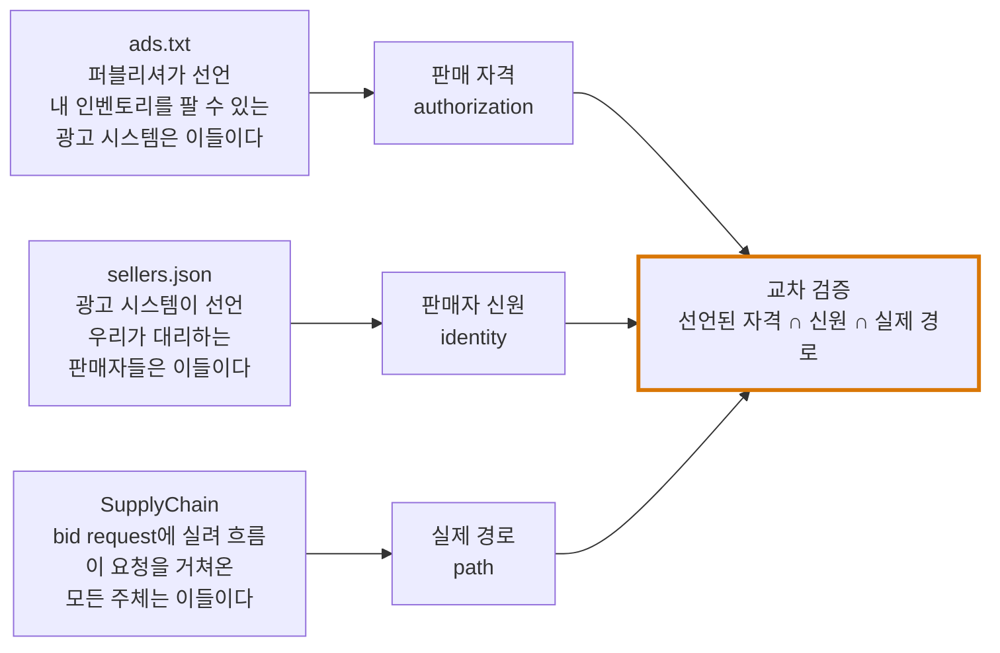
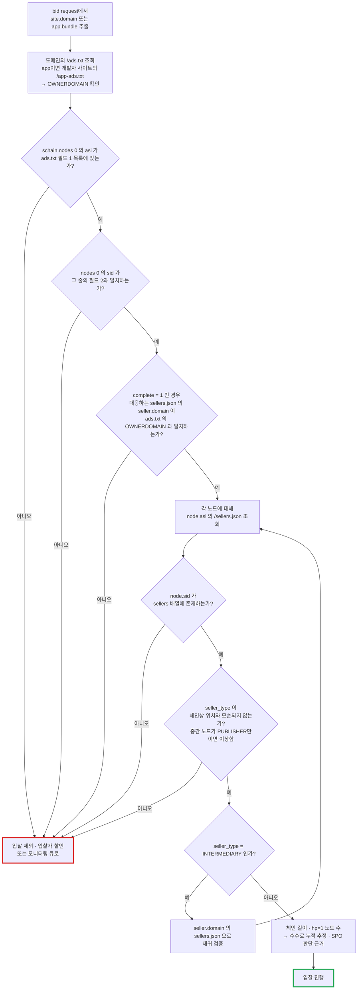
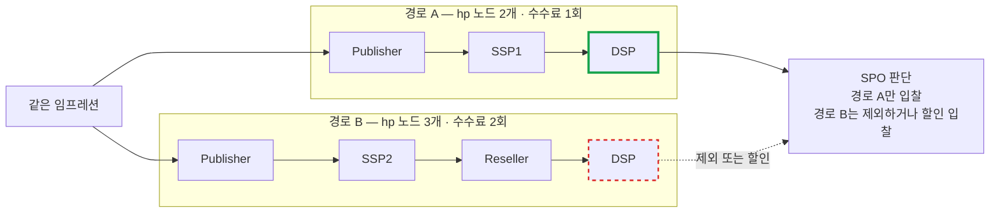

# 07. 공급망 투명성 — ads.txt · app-ads.txt · sellers.json · SupplyChain

> 출처: [ads.txt v1.1 (IAB Supply-Chain-Validation 정본)](https://github.com/InteractiveAdvertisingBureau/Supply-Chain-Validation/blob/main/ads.txt%20v1.1.md) · [sellers.json](https://github.com/InteractiveAdvertisingBureau/Supply-Chain-Validation/blob/main/sellers-json.md) · [SupplyChain Object](https://github.com/InteractiveAdvertisingBureau/openrtb/blob/main/supplychainobject.md) · [IAB Tech Lab ads.txt](https://iabtechlab.com/ads-txt/)
>
> 정리 기준일: 2026-09-25

---

## 0. 왜 이게 필요한가 — 문제 정의

프로그래매틱 광고의 구조적 취약점은 **"이 임프레션을 파는 사람이 진짜 그걸 팔 자격이 있는가"를 확인할 방법이 없었다**는 것이다.

- 누구나 bid request에 `site.domain = "nytimes.com"`이라고 써 보낼 수 있다 → **도메인 스푸핑**
- 재판매 체인이 5단계면 각 단계가 수수료를 떼는데 구매자는 그 체인을 볼 수 없다 → **수수료 불투명**
- 봇 트래픽을 프리미엄 인벤토리로 위장 → **가짜 인벤토리(counterfeit inventory)**

IAB의 해법은 **세 개의 공개 파일/필드 조합**이다:



세 개를 교차 검증하면 "선언된 자격 ∩ 신원 ∩ 실제 경로"가 맞는지 확인할 수 있다.

---

# 1. ads.txt (Authorized Digital Sellers) v1.1

## 1.1. 기본 개념

robots.txt에서 영감을 받았다. 핵심 속성:
> "A key attribute is that **the file is posted to the web serving system of the content, thus proving that the website authored the file.**"
>
> **번역**: 핵심 속성은 **파일이 해당 콘텐츠의 웹 서빙 시스템에 게시되므로, 그 웹사이트가 파일을 작성했음이 증명된다는 점**이다.

즉 **파일이 그 도메인에 올라가 있다는 사실 자체가 소유권 증명**이다.

OpenRTB bid request의 `site.domain` 또는 `app.bundle`과 짝을 이뤄 쓰인다.

## 1.2. 접근 방법

- 위치: **루트 도메인의 `/ads.txt`** (필요 시 서브도메인에도)
- "루트 도메인" = **public suffix + 1 문자열**. 크롤러는 [Public Suffix List](https://publicsuffix.org/)를 써서 도출해야 한다
- `Content-Type: text/plain` (UTF-8 명시 권장)
- **HTTPS 우선.** 같은 URL에 HTTP/HTTPS 둘 다 있으면 HTTPS 데이터를 쓴다

### HTTP 응답별 처리

| 응답 | 처리 |
|---|---|
| **2xx** | 내용을 읽고 파싱하여 선언을 적용해야 한다 (must) |
| **301 / 302 / 307** | **원래 루트 도메인 범위 안이면** 리다이렉트를 따라가고 권위 있는 데이터로 간주. 같은 루트 도메인 안이면 다중 리다이렉트도 유효 |
| 외부 도메인 리다이렉트 | **단 1회만 허용** (제3자 웹서버로의 one-hop 권한 위임). 그 제3자가 또 리다이렉트하면 **에러 처리** |
| **401** | 사이트에 직접 연락해 인증 키나 설명을 구할 것 |
| **404** | 선언이 없다고 간주. **어떤 광고 시스템도 무권한이 아니다** |
| 기타 에러 | **이전에 성공적으로 가져온 데이터셋을 사용** |

## 1.3. 파일 포맷

```
<FIELD #1>, <FIELD #2>, <FIELD #3>, <FIELD #4>
```
또는
```
<VARIABLE>=<VALUE>
```

- `#`로 시작하는 줄은 주석. `#` 이후 줄 끝까지 무시
- 레코드는 줄바꿈으로 구분. CR, CRLF 등을 관대하게 해석
- 공백/탭 시퀀스는 무시. 필드 안에 탭·콤마·공백이 있으면 **URL 인코딩**
- 확장 필드는 마지막에 **`;` 구분자** 뒤에 붙인다

## 1.4. 데이터 레코드 4필드

| 필드 | 이름 | 내용 |
|---|---|---|
| **#1** | 광고 시스템 도메인 | (필수) 입찰자가 접속하는 SSP/Exchange/Header Wrapper의 **정규 도메인명**. 모회사 도메인과 다르면 운영 도메인을 쓴다 (WHOIS·역DNS로 소유권 확인 가능하도록) |
| **#2** | 퍼블리셔 계정 ID | (필수) 필드 #1 시스템 내의 판매자/재판매자 계정 식별자. **거래(OpenRTB bid request)에서 실제로 쓰이는 값과 같아야 한다.** 보통 OpenRTB `publisher.id` |
| **#3** | 계정/관계 유형 | (필수) **`DIRECT`** = 퍼블리셔(콘텐츠 소유자)가 그 계정을 직접 통제. 보통 직접 계약. **`RESELLER`** = 퍼블리셔가 다른 주체에게 그 계정 통제와 재판매를 승인. **대소문자 구분 없이 해석** |
| **#4** | 인증 기관 ID | (선택) 인증 기관 내에서 광고 시스템을 유일하게 식별하는 ID. 현재는 **TAG**(Trustworthy Accountability Group)의 TAGID. **sellers.json의 `identifiers` 객체로 대체되었고 향후 deprecate될 수 있다** |

> 모회사가 여러 SSP/Exchange를 운영한다면, 필드 #1은 **입찰자가 실제로 bid request를 받고 있는 RTB 커넥션의 도메인**을 가리켜야 한다.

## 1.5. 변수 선언 레코드

| 변수 | 의미 |
|---|---|
| `CONTACT` | (선택) 파일 소유자 연락처. 이메일/전화/폼 링크 |
| `SUBDOMAIN` | (선택) **서브도메인의 ads.txt를 가리키는 기계 판독 포인터.** 크롤러는 그 데이터를 서브도메인에 연결(현재 도메인 아님). **public suffix 절단 과정에서 면제된다.** 루트 도메인만 서브도메인을 참조할 수 있고, **서브도메인이 다른 서브도메인을 참조하면 안 된다** |
| `INVENTORYPARTNERDOMAIN` | (권장, 해당되는 경우) 앱/사이트 콘텐츠 내 광고를 수익화할 권한이 명시적으로 부여된 주체의 도메인. 그 파트너의 ads.txt가 거기 호스팅된다. **파트너별로 줄을 다 쓰는 대신 도메인 하나로 위임.** 이 참조는 **ads.txt만 따라가고 app-ads.txt는 따라가지 않는다** |
| `OWNERDOMAIN` | (권장) **도메인/사이트/앱을 소유한 사업 주체의 도메인.** sellers.json의 `seller.domain`과 같은 값이어야 한다. PSL+1 형식(전체 호스트명이나 URL 아님). **완전한 SupplyChain에서 최초 퍼블리셔 노드(schain 첫 노드)의 `seller.domain`이 이 OWNERDOMAIN과 일치해야 한다.** OWNERDOMAIN이 ads.txt가 있는 도메인과 같아도 포함을 권장 |
| `MANAGERDOMAIN` | (선택, 해당 시만) 퍼블리셔 인벤토리의 **주요/독점 수익화 파트너**의 사업 도메인. 형식: `[PSL+1 도메인, 필수],[ISO 3166-1 alpha-2 국가코드, 선택, 공백=글로벌]`. **퍼블리셔가 아니면서 해당 사이트의 주요/독점 프로그래매틱 판매자인 경우에만.** 국가별로 하나씩 둘 수 있고, 글로벌 기본값은 국가 확장자 없이. 국가 항목이 기본값을 덮어쓴다 |

## 1.6. 빈 파일 처리 (중요)

아무 광고 시스템도 승인하지 않겠다면 **빈 파일로 두면 안 된다.** 웹서버 에러 페이지와 구분이 안 되기 때문이다. 대신 플레이스홀더 레코드를 쓴다:

```
placeholder.example.com, placeholder, DIRECT, placeholder
```

> "Prior versions of the ads.txt specification indicated that publishers may simply use an empty ads.txt file... **That method is now deprecated** because of ambiguities it creates and **should be ignored by consuming systems after March 1, 2020.**"
>
> **번역**: 이전 버전의 ads.txt 스펙은 퍼블리셔가 빈 ads.txt 파일을 올려도 된다고 했다… **이 방식은 이제 폐기되었다.** 모호함을 만들기 때문이며, **소비 시스템은 2020년 3월 1일 이후 이를 무시해야 한다.**

## 1.7. 캐시 만료

- HTTP `Expires` 헤더를 존중
- **cache-control 지시자가 없으면 기본 만료 7일**

## 1.8. 예시

```
# ads.txt file for example.com:
greenadexchange.com, 12345, DIRECT, d75815a79
silverssp.com, 9675, RESELLER, f496211
blueadexchange.com, XF436, DIRECT
orangeexchange.com, 45678, RESELLER
silverssp.com, ABE679, RESELLER

CONTACT=adops@example.com
OWNERDOMAIN=example.com
SUBDOMAIN=divisionone.example.com
```

## 1.9. app-ads.txt

모바일 앱과 CTV 앱을 위한 변형이다. 차이는 **탐색 경로**다:
- 앱스토어의 앱 리스팅에 등록된 **개발자 웹사이트 URL**을 찾는다
- 그 도메인의 **`/app-ads.txt`** 를 크롤링한다
- OpenRTB `app.bundle`(앱스토어 ID)과 짝을 이룬다

`INVENTORYPARTNERDOMAIN` 참조는 **ads.txt로만 이어진다**는 점에 주의.

---

# 2. sellers.json

## 2.1. 무엇을 보완하는가

> "Ads.txt does not, however, make any attempt at revealing **the identities of the publisher account IDs** within their advertising platform(s)."
>
> **번역**: 그러나 ads.txt는 광고 플랫폼 안의 **퍼블리셔 계정 ID가 누구인지**를 밝히려는 시도는 전혀 하지 않는다.

ads.txt는 "이 계정 ID가 내 인벤토리를 팔 수 있다"까지만 말한다. **그 계정 ID가 실제로 어떤 법인인지는 알 수 없다.** sellers.json이 그걸 공개한다.

부가 효과:
> "Sellers.json enables **smaller bid request object sizes** by allowing this information to be looked up and **cached 'offline'** rather than supplied with every bid request."
>
> **번역**: Sellers.json은 이 정보를 매 bid request에 싣는 대신 조회해서 **'오프라인'으로 캐시**할 수 있게 해 **bid request 객체 크기를 줄여 준다.**

즉 판매자 이름/도메인을 매 bid request에 싣지 않고 오프라인 조회+캐시로 처리하여 요청 크기를 줄인다. 초당 수만 QPS 환경에서 이건 실질적인 이득이다.

## 2.2. 접근 방법

- 위치: **`https://{advertising_system_domain}/sellers.json`**
- `Content-Type: application/json`
- 리다이렉트 규칙은 ads.txt와 동일 (같은 루트 도메인 내 다중 허용, 외부는 one-hop만)
- **404 또는 기타 에러 시 마지막으로 성공한 데이터셋 사용**
- 캐시 기본 만료 **7일**

> "Every advertising system listed in an ads.txt file **and any advertising system that is referenced from a SupplyChain object node** should publish a Sellers.json file."
>
> **번역**: ads.txt 파일에 등재된 모든 광고 시스템, **그리고 SupplyChain 객체 노드에서 참조되는 모든 광고 시스템**은 Sellers.json 파일을 게시해야 한다.

## 2.3. 객체 구조

### Parent (최상위)

| 속성 | 타입 | 설명 |
|---|---|---|
| `sellers` | object array; **required** | 이 광고 시스템이 대리하는 **모든** Seller 객체. **기밀(confidential)이더라도 전부 포함해야 한다** |
| `identifiers` | object array; optional | 이 광고 시스템에 연결된 Identifier 객체 배열 (TAG-ID, D&B 등) |
| `contact_email` | string; optional | 문의 이메일 |
| `contact_address` | string; optional | 사업장 주소 |
| `version` | string; **required** | 현재 유효값은 `"1.0"` |
| `ext` | object; optional | 확장 |

### Identifier

| 속성 | 설명 |
|---|---|
| `name` | (필수) 식별자 설명 |
| `value` | (필수) 식별자 값 |

### Seller

> "It is invalid for a `seller_id` to represent multiple entities. **Every `seller_id` must map to only a single entity** that is paid for inventory transacted with that `seller_id`. It is valid for a selling entity to have **multiple `seller_id`s** within an advertising system."
>
> **번역**: 하나의 `seller_id`가 여러 주체를 나타내는 것은 유효하지 않다. **모든 `seller_id`는 오직 하나의 주체에만 대응해야 하며**, 그 주체가 해당 `seller_id`로 거래된 인벤토리의 대금을 받는다. 반대로 하나의 판매 주체가 한 광고 시스템 안에서 **여러 개의 `seller_id`**를 갖는 것은 유효하다.

| 속성 | 타입 | 설명 |
|---|---|---|
| `seller_id` | string; **required** | **ads.txt에 나타나는 것과 같은 ID**이자 **SupplyChain `nodes[].sid`와 같은 값**. 대부분 OpenRTB `Publisher.id`에도 나타난다 |
| `seller_type` | string; **required** | **`PUBLISHER`** = 이 계정으로 팔리는 인벤토리는 해당 주체가 소유한 사이트/앱/매체이고 광고 시스템이 그들에게 직접 지급. **`INTERMEDIARY`** = 인벤토리를 그 주체가 소유하지 않거나 직접 지급받지 않음. **`BOTH`** = 둘 다. 대소문자 구분 없음 |
| `is_confidential` | integer; default 0 | 판매자 신원이 기밀인지. `1`이면 `name`, `domain` 생략 가능 |
| `is_passthrough` | integer; default 0 | **패스스루 판매자** 여부. `1`이면 이 판매자가 하류 시스템과 **계정 통제 관계**를 갖는다. SupplyChain의 마지막 링크라면 구매 시스템이 이 판매자와 계정 통제 관계를 맺고 있어야 거래 가능 |
| `name` | string | `is_confidential=0`일 때 **필수**. 해당 `seller_id`로 거래된 인벤토리 대금을 받는 **법인명** |
| `domain` | string | 웹 존재가 있고 `is_confidential=0`이면 필수. `seller_type`이 `INTERMEDIARY`/`BOTH`면 **그 판매자의 sellers.json 루트 도메인**이어야 한다 |
| `comment` | string; optional | 설명. 여러 seller_id를 가진 판매자가 각각의 의미를 기술할 때 유용 |
| `ext` | object; optional | 확장 |

> 💡 `domain`이 INTERMEDIARY일 때 "그 판매자의 sellers.json 루트 도메인"이라는 규정이 **체인을 따라 재귀적으로 올라갈 수 있게** 해준다. 이것이 공급망 전체를 프로그래매틱하게 검증 가능하게 만드는 장치다.

---

# 3. SupplyChain Object (OpenRTB)

## 3.1. 위치

| OpenRTB 버전 | 위치 |
|---|---|
| **2.6 / 3.0** | `BidRequest.source.schain` (**정식 필드로 편입**) |
| 2.5 | `BidRequest.source.ext.schain` |
| 2.4 이하 | `BidRequest.ext.schain` |

## 3.2. SupplyChain 객체

| 속성 | 타입 | 설명 |
|---|---|---|
| `complete` | integer; **required** | 체인이 **인벤토리 매체의 소유자까지 거슬러 올라가는 모든 노드를 포함하는지**. 0=아니오, 1=예 |
| `nodes` | object array; **required** | **체인 순서대로**의 SupplyChainNode 배열. 완전한 체인에서 **첫 노드 = 최초 광고 시스템과 seller ID(= 사이트/앱 소유자)**, **마지막 노드 = 이 bid request를 보내는 주체**. 불완전한 체인에서 첫 노드는 "알려진 첫 노드" |
| `ver` | string; **required** | 사양 버전 `"major.minor"`. 예: `"1.0"` |
| `ext` | object; optional | 확장 |

## 3.3. SupplyChainNode 객체

| 속성 | 타입 | 설명 |
|---|---|---|
| `asi` | string; **required** | 입찰자가 접속하는 SSP/Exchange/Header Wrapper 시스템의 **정규 도메인명**. **ads.txt에서 판매자를 식별하는 데 쓰는 값과 같아야 한다** |
| `sid` | string; **required** | 그 광고 시스템 내 판매자/재판매자 계정 식별자. **거래에서 실제로 쓰이는 값과 같아야 한다** (보통 `publisher.id`). **64자 이내 권장** |
| `hp` | integer; **required** | 이 노드가 **대금 흐름에 관여하는지**. `1`이면 `asi`의 광고 시스템이 `sid`의 판매자에게 지급하고, 그 판매자가 이전 노드에 지급할 책임을 진다. **SupplyChain 1.0에서는 항상 1이어야 한다** (향후 비지급 노드 도입 대비로 명시적 필수) |
| `rid` | string; optional | 이 판매자가 발행한 OpenRTB RequestId |
| `name` | string; optional | `seller_id`로 지급받는 법인명. **광고 시스템의 sellers.json에 있으면 넣지 말 것** |
| `domain` | string; optional | 이 노드가 나타내는 주체의 사업 도메인. **sellers.json에 있으면 넣지 말 것** |
| `ext` | object; optional | 확장 |

> `name`/`domain`을 "sellers.json에 있으면 넣지 말라"는 규정이 앞서 말한 **요청 크기 절감** 설계와 맞물린다.

## 3.4. 도메인 표기 규칙

`asi`와 `domain`은 **정규 도메인만** 넣는다. 전체 URL도, 스킴(`http://`, `https://`)도 넣지 않는다. "루트 도메인"은 **public suffix + 1**.

```
유효:   example.com,  example.co.uk
무효:   https://example.com,  www.example.com/path
```

> "these should be the same domains used in OpenRTB `Site.domain`, sellers.json, ads.txt **for reconciliation**"
>
> **번역**: 이 값들은 **대사(reconciliation)를 위해** OpenRTB `Site.domain`, sellers.json, ads.txt에 쓰인 것과 같은 도메인이어야 한다.

## 3.5. 예시

```json
{
  "source": {
    "schain": {
      "complete": 1,
      "ver": "1.0",
      "nodes": [
        { "asi": "directseller.com", "sid": "00001", "hp": 1, "rid": "BidRequest1" },
        { "asi": "reseller.com",     "sid": "aaaaa", "hp": 1, "rid": "BidRequest2" }
      ]
    }
  }
}
```

해석: 원 퍼블리셔는 `directseller.com`의 계정 `00001`이고, 그 인벤토리가 `reseller.com`의 계정 `aaaaa`를 거쳐 재판매되어 지금 이 요청이 왔다. 체인은 완전하다.

---

# 4. 세 표준의 교차 검증 로직

구매자(DSP)가 실제로 수행하는 검증:



실패 시 조치: 입찰 제외, 또는 입찰가 할인, 또는 모니터링 큐로.

> 💡 **포트폴리오 연결점**: 이건 **Bidder Service 앞단의 Fast Filtering 단계에 딱 들어맞는 기능**이다.
> - ads.txt / sellers.json은 **7일 캐시**가 스펙 기본값이므로, **오프라인 크롤러 + 로컬 캐시(Caffeine/RocksDB)** 구조가 자연스럽다
> - 입찰 경로(tmax 100~300ms)에서는 **메모리 조회만** 하고 네트워크 I/O를 하지 않는다
> - 이 설계를 "왜 실시간 조회가 아니라 사전 크롤링인가"로 설명하면 **캐시 전략 + 스펙 근거**를 동시에 보여줄 수 있다

---

# 5. SPO — Supply Path Optimization

공급망이 보이게 되자 구매자가 할 수 있게 된 것: **같은 임프레션에 도달하는 여러 경로 중 가장 짧고 싼 경로를 고르는 것.**



schain이 이 판단의 데이터다. `MANAGERDOMAIN` 변수가 "이 시장에서는 퍼블리셔가 직접 안 팔고 이 회사가 독점 판매한다"를 알려주는 것도 SPO 판단에 쓰인다.

---

# 6. 구현 체크리스트

- [ ] Public Suffix List를 사용한 루트 도메인 도출
- [ ] ads.txt 리다이렉트 규칙 (같은 루트 내 다중 OK, 외부는 one-hop만)
- [ ] 에러 시 **마지막 성공 데이터셋 사용** (404 제외)
- [ ] 캐시 만료: `Expires` 헤더 존중, 없으면 **7일**
- [ ] 빈 ads.txt는 `placeholder.example.com, placeholder, DIRECT, placeholder`로 인식
- [ ] `SUBDOMAIN` 참조는 1단계만 (서브도메인→서브도메인 금지)
- [ ] `INVENTORYPARTNERDOMAIN`은 ads.txt만 따라감 (app-ads.txt 아님)
- [ ] `seller_type` 대소문자 무시 비교
- [ ] `is_confidential=1`인 판매자도 sellers 배열에 반드시 존재해야 함
- [ ] schain `nodes` **순서 보존** (배열 순서가 의미를 갖는다)
- [ ] schain 중계 시 `hp` 필드 **전파** (스펙 명시 요구)
- [ ] `asi`/`domain`에 스킴·경로·www 금지, PSL+1만
- [ ] 입찰 경로에서는 캐시 메모리 조회만, 네트워크 I/O 금지

---

# 7. 참고 원문

- ads.txt v1.1: https://github.com/InteractiveAdvertisingBureau/Supply-Chain-Validation/blob/main/ads.txt%20v1.1.md
- app-ads.txt: https://github.com/InteractiveAdvertisingBureau/Supply-Chain-Validation/blob/main/app-ads.txt.md
- sellers.json: https://github.com/InteractiveAdvertisingBureau/Supply-Chain-Validation/blob/main/sellers-json.md
- 구현 가이드 / Explainer: https://github.com/InteractiveAdvertisingBureau/Supply-Chain-Validation
- SupplyChain Object: https://github.com/InteractiveAdvertisingBureau/openrtb/blob/main/supplychainobject.md
- DemandChain Object 1.0: https://iabtechlab.com/wp-content/uploads/2021/06/DemandChainObject-1.0-June2021.pdf
- ads.txt 크롤러 레퍼런스 구현: https://github.com/InteractiveAdvertisingBureau/adstxtcrawler
- ads.txt 파서: https://github.com/InteractiveAdvertisingBureau/ads.txt-parser
