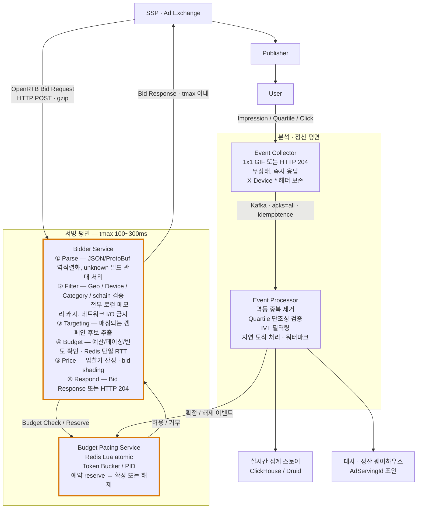
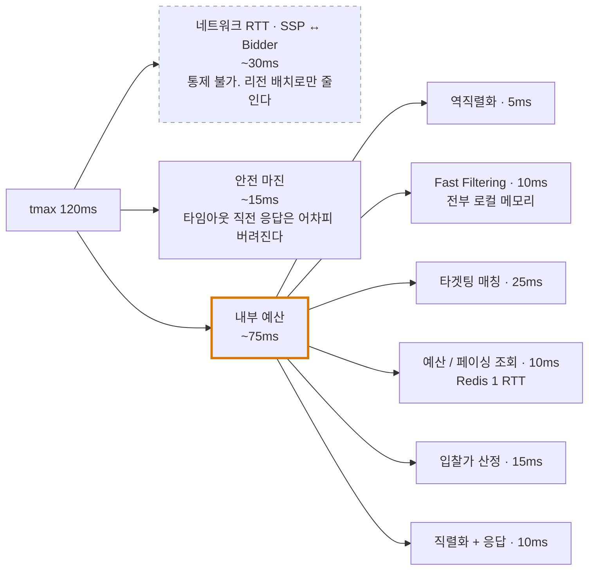
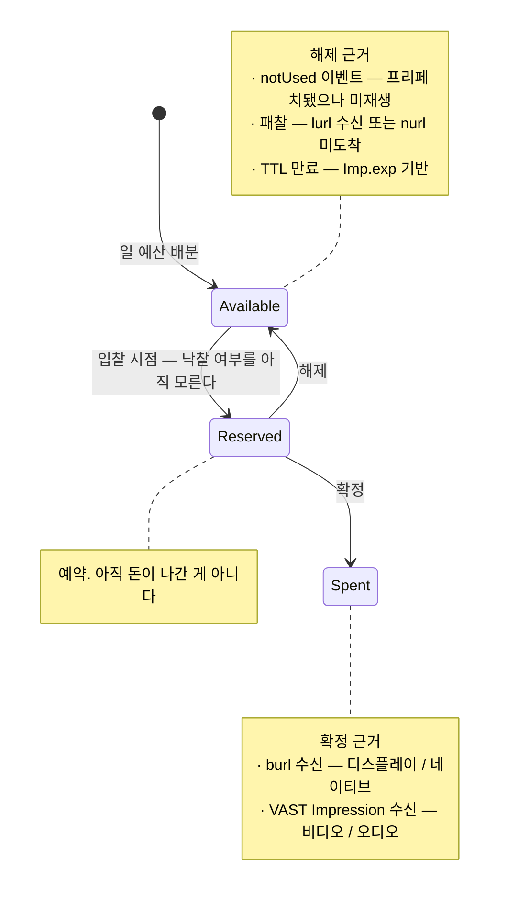

# 08. 저지연·고처리량 애드테크 아키텍처

> 근거 스펙: [OpenRTB 2.6 §2 Transport/Encoding](https://github.com/InteractiveAdvertisingBureau/openrtb2.x/blob/main/2.6.md) · [Implementation Notes §7.2 / §7.6 / §7.8](https://github.com/InteractiveAdvertisingBureau/openrtb2.x/blob/main/implementation.md) · [VAST 4.x](https://github.com/InteractiveAdvertisingBureau/VAST4.x)
>
> 정리 기준일: 2026-09-25
>
> 이 문서는 앞의 01~07에서 정리한 **스펙상의 요구사항이 왜 특정 아키텍처를 강제하는지**를 연결한다. 포트폴리오 서술의 근거로 쓰기 위한 문서다.

---

## 1. 제약 조건은 스펙에서 나온다

애드테크의 "저지연·고처리량"은 엔지니어의 취향이 아니라 **프로토콜이 부과한 제약**이다. 이걸 근거로 말할 수 있으면 서술의 설득력이 완전히 달라진다.

| 제약 | 출처 | 귀결 |
|---|---|---|
| **`BidRequest.tmax`** — 응답 제한 시간(ms). 초과 시 입찰 폐기 | OpenRTB `BidRequest.tmax` | 내부 처리 예산을 구간별로 쪼개고 초과 시 즉시 포기해야 한다. **늦은 정답 = 오답** |
| **Bid Request는 HTTP POST 필수** | §2.1 | GET 캐싱 전략 불가. 매 요청이 오리진까지 온다 |
| **Keep-Alive가 "profound impact"**<br/>*번역: 지대한 영향* | §2.1 BEST PRACTICE | 커넥션 풀 관리가 1차 최적화 |
| **바이너리 표현 허용** (ProtoBuf, Avro, 압축 JSON) | §2.3 | JSON 직렬화가 병목이면 대안이 스펙상 열려 있다 |
| **양방향 gzip 권장** | §2.4 | CPU vs 대역폭 트레이드오프를 명시적으로 결정해야 한다 |
| **no-bid는 HTTP 204 + 빈 본문** | §4.2.1 | **가장 흔한 경로가 가장 싸야 한다** |
| **unknown 필드/enum을 반드시 관대하게 처리** | §2.6 | 파서가 예외를 던지면 안 됨 |
| **과금 통지 재시도 권장 + 수신 멱등** | §7.8 | 중복 수신이 정상. 멱등 키 설계 필수 |
| **Wrapper 체인 다중 홉** | VAST §1.1.1 | 홉별 타임아웃과 전체 예산 관리 |
| **프리페치로 경매↔노출 시차** | `Imp.exp`, §7.2 | 예산 예약/해제 2단 구조 |
| **Pod 내 조합 최적화** | §7.6 | 단건 최적화가 아닌 제약 하 조합 문제 |

---

## 2. 전체 아키텍처



---

## 3. Bidder Service — 지연 예산 설계

### 3.1. tmax를 구간 예산으로 분해

`tmax`가 120ms라면 실제로 쓸 수 있는 건 그보다 훨씬 적다. 네트워크 왕복과 안전 마진을 빼야 한다.



**각 구간에 개별 타임아웃을 걸고, 초과 시 즉시 204로 빠진다.** 부분 결과로 입찰하는 것보다 포기가 낫다 — 늦은 응답은 어차피 버려지고 커넥션만 점유한다.

### 3.2. Fast Filtering — 왜 로컬 캐시여야 하는가

스펙이 직접 근거를 준다:
- ads.txt / sellers.json은 **캐시 기본 만료가 7일** → 실시간 조회할 이유가 없다
- 그래서 **오프라인 크롤러가 주기적으로 수집 → 로컬 메모리 캐시**가 정답이다

| 필터 | 데이터 소스 | 갱신 주기 | 저장 |
|---|---|---|---|
| Geo | GeoIP DB | 주간 | 메모리 |
| ads.txt / sellers.json 검증 | 크롤러 | 스펙상 7일 / 실무 일단위 | 메모리 or RocksDB |
| 카테고리 블록 (`bcat`, `badv`) | 캠페인 설정 | 변경 시 푸시 | 메모리 |
| 디바이스/플레이어 능력 | 요청 내 필드 | — | 없음 |
| 캠페인 인덱스 | 캠페인 DB | 변경 시 푸시 | 메모리 |

**원칙: 입찰 경로에서 네트워크 I/O는 예산 조회(Redis) 단 한 번.** 나머지는 전부 프로세스 메모리.

캐시 갱신은 **풀(poll)이 아니라 푸시**가 좋다. 캠페인 변경이 Kafka로 브로드캐스트되고 각 Bidder 인스턴스가 로컬 인덱스를 갱신하는 구조. 풀링은 인스턴스 수에 비례해 DB 부하가 늘고 갱신 지연이 불균일해진다.

### 3.3. 파서 요구사항 (스펙 강제)

```
OpenRTB 2.6 §2.6:
"Bidders and exchanges must tolerate receiving new or unexpected fields
 and enumerated list values gracefully, treating them as unknown or ignoring them"
```

- Jackson: `FAIL_ON_UNKNOWN_PROPERTIES = false`
- enum: 미지의 정수값을 `UNKNOWN`으로 흡수하는 커스텀 디시리얼라이저
- **AdCOM 열거형은 OpenRTB 버전과 무관하게 계속 추가된다.** 하드코딩된 enum 매칭은 반드시 깨진다

### 3.4. 직렬화 선택

기본은 JSON이지만 스펙이 대안을 허용한다:
> "Optionally, an exchange may also offer binary representations (e.g., compressed JSON, ProtoBuf, Avro, etc.), which can be more efficient in terms of transmission time and bandwidth."
>
> **번역**: 선택적으로 거래소는 바이너리 표현(예: 압축 JSON, ProtoBuf, Avro 등)도 제공할 수 있으며, 이는 전송 시간과 대역폭 측면에서 더 효율적일 수 있다.

판단 기준:
- **파트너가 지원해야만 의미가 있다.** 일방적으로 못 바꾼다 (`Content-Type` 협상 필요)
- JSON 파싱이 실제 프로파일링에서 병목으로 확인됐을 때만
- gzip은 CPU를 쓴다. **대역폭 비용 vs CPU 비용**을 실측으로 비교

### 3.5. Ad Pod 입찰 — 조합 최적화

Structured pod은 슬롯별 독립 입찰이지만, **dynamic pod은 다르다.**

```
제약: 총 길이 poddur = 90초, 최대 광고 수 maxseq = 6
      각 광고는 minduration ~ maxduration 범위
목표: 총 가치 최대화
```

전형적인 배낭 문제다. 그리고 스펙이 경고한다:
> "Buyers who submit N bids for a particular pod may find that the seller selects **anywhere between 0 to N** of those bids... the seller may **co-mingle bids from other buyers** in that pod."
>
> **번역**: 특정 Pod에 N개의 입찰을 제출한 구매자는 판매자가 그중 **0개에서 N개 사이 어느 수든** 선택할 수 있음을 알게 될 것이다… 판매자는 그 Pod에 **다른 구매자의 입찰을 섞어 넣을 수도 있다.**

→ **최종 조합 구성권은 판매자에게 있다.** 따라서 구매자는 "이 조합이 통째로 채택되기를 기대"하면 안 되고, **각 입찰이 독립적으로 유효해야** 한다. `SeatBid.group=1`(전부 아니면 전무)은 이럴 때 쓰는 장치지만, 판매자가 지원하지 않을 수 있다.

---

## 4. Budget Pacing Service

### 4.1. 왜 어려운가 — 세 가지 제약이 동시에 걸린다

1. **동시성** — 수만 QPS가 같은 캠페인 예산을 동시에 건드린다
2. **시차** — 경매(now)와 과금 확정(`burl` / VAST `<Impression>`, 수초~수시간 뒤) 사이에 간극이 있다
3. **페이싱** — 예산을 하루에 고르게 쓰거나 목표 곡선을 따라야 한다

### 4.2. 3단계 상태 모델

스펙의 이벤트 구조가 자연스럽게 3단계를 요구한다.



**왜 `nurl`(낙찰)에서 바로 Spent로 가면 안 되는가** — `07`과 `06`에서 본 그대로:
> "winning an auction does not guarantee that an impression will indeed be served, and in fact **in many cases only a small percentage of won auctions will become impressions**"
>
> **번역**: 경매에서 낙찰됐다고 해서 임프레션이 실제로 서빙된다는 보장은 없으며, 실제로 **많은 경우 낙찰된 경매 중 일부만 임프레션이 된다.**

낙찰 기준으로 차감하면 **실제 집행액보다 훨씬 과다 차감**되어 캠페인이 조기에 멈춘 것처럼 보인다.

### 4.3. 원자적 차감 — Redis Lua

Redis의 단일 명령은 원자적이지만 **"조회 → 판단 → 차감"은 3개 명령**이라 원자적이지 않다. Lua 스크립트는 Redis에서 단일 원자 단위로 실행되므로 race condition 없이 check-and-decrement를 할 수 있다.

```lua
-- KEYS[1] = budget:{campaign_id}:available
-- KEYS[2] = budget:{campaign_id}:reserved
-- KEYS[3] = pacing:{campaign_id}:tokens
-- ARGV[1] = 요청 금액(마이크로 단위 정수)
-- ARGV[2] = 예약 TTL(초)
-- ARGV[3] = 예약 ID (멱등 키)

local available = tonumber(redis.call('GET', KEYS[1]) or '0')
local amount    = tonumber(ARGV[1])

if available < amount then
  return {0, 'INSUFFICIENT_BUDGET'}
end

local tokens = tonumber(redis.call('GET', KEYS[3]) or '0')
if tokens < amount then
  return {0, 'PACING_THROTTLED'}
end

redis.call('DECRBY', KEYS[1], amount)
redis.call('DECRBY', KEYS[3], amount)
redis.call('HSET',  KEYS[2], ARGV[3], amount)
redis.call('EXPIRE', KEYS[2], tonumber(ARGV[2]))

return {1, 'OK'}
```

주의사항:
- **금액은 정수(마이크로 단위)로 다룬다.** 부동소수점 누적 오차는 정산에서 사고가 된다. OpenRTB 스펙도 "while the type indicates float, **integer math is highly recommended** when handling currencies (e.g., BigDecimal in Java)" — *번역: 타입은 float로 표기되어 있지만, 통화를 다룰 때는 **정수 연산을 강력히 권장한다** (예: Java의 BigDecimal)* — 라고 명시한다
- Redis Cluster를 쓴다면 **같은 캠페인의 키를 같은 슬롯에** 두어야 Lua가 동작한다 → `budget:{campaign_id}:...` 형태의 **해시태그** 사용
- 예약 TTL은 `Imp.exp`를 참고해 결정. 프리페치가 긴 환경(CTV)에서는 길게

### 4.4. 페이싱 알고리즘

#### Token Bucket (균등 배분)

```
일 예산 B, 하루 T초
보충률 r = B / T  (초당)
버킷 용량 = r × burst_window   (순간 트래픽 변동 흡수)
```

단순하고 예측 가능하지만, **트래픽이 시간대별로 크게 다르면 비효율적이다.** 새벽에 토큰이 남아돌고 저녁 피크에 부족해진다.

#### Probabilistic Pacing (확률적 참여)

목표 소진 곡선 대비 현재 소진 속도에 따라 **입찰 참여 확률**을 조절한다.

```
p = clamp( 목표_누적소진(t) / 실제_누적소진(t), 0, 1 )
난수 < p 이면 입찰
```

트래픽 분포에 자연스럽게 적응하고, 특정 시간대에만 몰려 노출되는 것을 막는다. **단점: 확률적이라 단기 변동이 크다.**

#### PID 제어 (피드백 제어)

목표 곡선과 실제 소진의 오차를 P/I/D 항으로 보정해 참여율이나 입찰가를 조절. 가장 안정적이지만 파라미터 튜닝이 필요하다.

#### 실무 조합

```
1차: Token Bucket으로 하드 상한 (절대 초과 금지)
2차: Probabilistic / PID로 소프트 조절 (곡선 추종)
3차: 시간대별 트래픽 예측으로 목표 곡선 자체를 조정
```

> 💡 **면접 서술 재료**: "일 예산 1,000만 원이 오전 9시에 소진되는 것을 막는다"는 문제 설정은 좋지만, 거기서 한 걸음 더 들어가야 한다. **"과소진(overspend)은 손실이고 과소진 방지가 과하면 미소진(underdelivery)이라는 또 다른 손실이다. 두 손실 함수의 균형점을 어디로 잡았고 왜인가"**가 실제 질문이다.

### 4.5. 분산 환경의 예산 정합성

Bidder 인스턴스가 N개일 때 매 입찰마다 Redis를 때리면 Redis가 병목이 된다. 대안:

| 방식 | 장점 | 단점 |
|---|---|---|
| 매번 중앙 조회 | 정확 | Redis 병목, 지연 추가 |
| **로컬 배치 할당** — 인스턴스가 예산 청크를 미리 받아 로컬 소진 | Redis 부하 급감, 지연 최소 | 인스턴스 죽으면 할당분 유실(TTL로 회수), 정밀도 하락 |
| 낙관적 차감 + 주기 보정 | 빠름 | 일시적 과소진 가능 |

실무에서는 **로컬 배치 할당 + 짧은 TTL + 주기적 동기화**가 흔하다. 예산 소진이 임박하면 청크 크기를 줄여 정밀도를 높인다.

### 4.6. 빈도 제어 (Frequency Capping)

"같은 사용자에게 하루 3회까지"는 예산과 비슷하지만 **키 카디널리티가 훨씬 크다**(캠페인 수 × 사용자 수). 정확한 카운팅은 메모리를 너무 먹으므로 HyperLogLog나 확률적 자료구조, 또는 사용자 ID 샤딩 + TTL 기반 카운터를 쓴다.

---

## 5. Event Processor

### 5.1. 수집 계층은 입찰 경로와 물리적으로 분리

**이유가 분명하다.** 임프레션/클릭 이벤트는 입찰 요청보다 훨씬 많을 수도, 갑자기 폭주할 수도 있다. 이게 Bidder Service와 자원을 공유하면 이벤트 폭주가 곧 입찰 실패다.

수집 서버 설계:
- 응답은 **1x1 GIF 또는 HTTP 204**. 본문을 만들지 않는다
- **무상태.** 파싱·검증 없이 raw로 큐에 넣고 즉시 응답
- `X-Device-IP`, `X-Device-User-Agent` 등 **SSAI 헤더를 보존**하여 하류 IVT 판정에 전달
- 수평 확장만으로 처리량 증가

### 5.2. 유실 방지 (정산 직결)

과금과 직결되는 이벤트는 유실이 곧 매출 손실이다.

```properties
# Kafka Producer
acks=all
enable.idempotence=true
max.in.flight.requests.per.connection=5
retries=Integer.MAX_VALUE
delivery.timeout.ms=120000
compression.type=lz4
```

**토픽 분리 전략**: 과금 관련 이벤트(impression, billable)와 분석용 이벤트(quartile, interaction)를 **다른 토픽, 다른 보장 수준**으로 나누는 것이 합리적이다. 전자는 비싸게(복제 인수 높게, acks=all), 후자는 싸게.

### 5.3. 중복 제거 — 멱등성은 스펙 요구사항

```
OpenRTB §7.8:
"an entity receiving billing notices should endeavor to make their
 endpoint idempotent to avoid double counting"
```

**재시도가 프로토콜 차원에서 권장되므로 중복 수신은 예외가 아니라 정상 동작이다.**

| 이벤트 | 멱등 키 |
|---|---|
| 과금 통지 (`burl`) | `auction_id` + `imp_id` + `bid_id` |
| VAST 임프레션 | `AdServingId` + `TransactionID` |
| Quartile | `AdServingId` + `event_type` |

⚠️ **`[CACHEBUSTING]` 매크로(8자리 난수)를 멱등 키로 쓰면 안 된다.** 그건 캐시 회피용이라 매번 달라진다.

중복 제거 구현:
- Kafka 파티션 키를 멱등 키로 → 같은 이벤트가 같은 파티션으로 → 컨슈머 로컬 상태로 판정 가능
- 또는 Redis SETNX + TTL. TTL은 재시도 윈도우(스펙 예시 1분)보다 훨씬 길게 잡아야 한다. 프리페치와 SSAI 세션 종료 리포팅 때문에 이벤트는 **수 시간 뒤에도 도착**할 수 있다

### 5.4. 품질 검증 — Quartile 단조성

```
impression ≥ start ≥ firstQuartile ≥ midpoint ≥ thirdQuartile ≥ complete
```

스트림 처리 단계에서 실시간 assertion으로 넣고 위반 시 알람. 위반의 흔한 원인:
- 중복 제거 실패
- 이벤트 순서 역전 (네트워크 지연)
- 파티션/윈도우 경계 문제

**VTR(Video Completion Rate) = complete / impression**이 100%를 넘으면 명백한 파이프라인 버그다.

### 5.5. 백프레셔와 장애 격리

| 위치 | 수단 |
|---|---|
| 수집 → Kafka | 프로듀서 버퍼 포화 시 **요청은 계속 204로 받고 로컬 디스크 스풀** 또는 샘플링 드롭 (분석 이벤트만) |
| Kafka → Processor | 컨슈머 랙 모니터링. 랙 증가 시 파티션 추가 또는 인스턴스 스케일아웃 |
| Processor → DB | **Circuit Breaker.** 하류 DB가 느려질 때 컨슈머가 죽지 않도록 차단하고 재시도 큐로 |
| 전 구간 | 과금 이벤트는 **절대 드롭하지 않는다.** 분석 이벤트만 샘플링 대상 |

**핵심 원칙: 드롭 정책을 이벤트 종류별로 다르게 가져간다.** 전부 똑같이 취급하면 과금 데이터를 잃거나, 반대로 분석 데이터 때문에 시스템 전체가 멈춘다.

### 5.6. 지연 도착 처리

- `Imp.exp`(프리페치)로 경매와 노출 사이 시차가 존재
- SSAI 세션 지향 서비스는 **세션 종료 시점에 임프레션을 일괄 리포팅**할 수 있다
- → 워터마크와 재처리(backfill) 윈도우를 그에 맞춰 설계
- 실시간 대시보드용 집계와 정산용 확정 집계를 **분리**한다 (Lambda/Kappa 아키텍처 논의 지점)

---

## 6. 트레이드오프 — 포트폴리오에서 말해야 할 것들

### 6.1. 일관성 vs 지연

```
입찰 경로에서 RDBMS Strong Consistency를 포기하고
Redis + 로컬 캐시의 Eventual Consistency를 택한다.

대가: 캠페인 설정 변경이 반영되기까지 수 초의 지연,
      예산의 순간적 과소진 가능성

보상: tmax 제약 충족, 수평 확장성

보완: 예약(reserve) 단계를 두어 과소진 폭을 제한하고,
      주기적 보정으로 수렴시킨다
```

### 6.2. nurl 기준 차감 vs burl 기준 차감

| | nurl (낙찰) 기준 | burl / VAST Impression 기준 |
|---|---|---|
| 반영 속도 | 즉시 | 수초~수시간 지연 |
| 정확도 | **과다 차감** (낙찰 중 일부만 임프레션) | 정확 |
| 과소진 위험 | 낮음 (보수적) | 높음 (지연 중 계속 입찰) |
| 미소진 위험 | **높음** | 낮음 |
| 스펙 입장 | **"never be used to count impressions"**<br/>*번역: 임프레션 집계에 절대 쓰면 안 된다* | 공식 권고 |

→ **예약(nurl 기준) + 확정(burl 기준)의 2단 구조**가 양쪽의 절충이다.

### 6.3. 정확도 vs 처리량 (예산 조회)

중앙 Redis 매번 조회(정확) ↔ 로컬 배치 할당(빠름). 예산 잔액에 따라 청크 크기를 동적으로 조절하면 두 끝 사이를 부드럽게 움직일 수 있다.

### 6.4. gzip vs CPU

스펙이 양방향 압축을 권장하지만 CPU를 쓴다. **대역폭 비용과 CPU 비용을 실측으로 비교**해서 결정했다고 말할 수 있어야 한다. QPS가 높을수록 CPU가 비싸진다.

---

## 7. 정량 측정 — 무엇을 재야 하는가

"k6로 10,000 QPS, P99 12ms"는 좋은 시작이지만, 애드테크에서 중요한 건 **비즈니스 지표와 연결된 수치**다.

| 지표 | 정의 | 왜 중요한가 |
|---|---|---|
| **Timeout Rate** | tmax 초과로 버려진 입찰 비율 | 직접적인 기회 손실 |
| **QPS / Bid Rate** | 수신 요청 대비 응답 입찰 비율 | 너무 낮으면 필터가 과하고, 너무 높으면 비용 낭비 |
| **Win Rate** | 입찰 대비 낙찰 비율 | 입찰가 전략의 지표 |
| **Fill Rate** | 요청 대비 실제 광고 서빙 비율 | 매체사 측 핵심 지표 |
| **P50 / P95 / P99 Latency** | 구간별 분해 필요 | **P99가 tmax를 넘으면 상위 1%는 전부 손실** |
| **Budget Overspend / Underdelivery** | 목표 대비 초과/미달 | 페이싱 품질 |
| **Event Loss Rate** | 수집~적재 유실률 | **정산 직결. 0이어야 한다** |
| **Duplicate Rate** | 중복 제거된 비율 | 멱등성이 작동하는지 |
| **Quartile 단조성 위반율** | 불변식 위반 | 파이프라인 건강도 |
| **VAST Error Code 분포** | 301/302/403/407 등 | 파트너별 문제 진단 |
| **Discrepancy Rate** | 인접 주체 간 집계 차이 | 5~10%가 업계 정상 범위 |

> 💡 **서술 방식**: "10,000 QPS에서 P99 12ms 달성"보다
> **"tmax 120ms 환경에서 P99 내부 처리 지연을 42ms로 유지하여 timeout rate 0.03%를 달성했고, 이벤트 유실률은 정산 요구사항에 따라 0%를 목표로 acks=all + 멱등 중복제거로 설계했다"**
> 가 도메인을 아는 사람의 서술이다.

---

## 8. 기술 선택 시 고려 사항

### 8.1. 언어/런타임

| 선택 | 근거 |
|---|---|
| **Java + Spring WebFlux / Netty** | 생태계 성숙, Kafka/Redis 클라이언트 안정. **GC 튜닝이 P99의 최대 변수** — ZGC/Shenandoah 검토 |
| **Go** | GC 지연이 짧고 예측 가능, 동시성 모델 단순. 애드테크 Bidder에서 채택 많음 |
| **Rust** | GC 없음 → P99 최상. 개발 속도와 인력 확보가 트레이드오프 |

**JVM을 쓴다면 P99에서 GC pause가 지배적 요인이 된다.** 객체 할당을 줄이는 설계(오브젝트 풀, 원시 타입 배열, zero-copy 파싱)가 실질적 효과를 낸다.

### 8.2. 캐시 계층

```
L1: 프로세스 메모리 (Caffeine)        ← 입찰 경로. 수 ns
L2: 로컬 임베디드 스토어 (RocksDB)     ← 대용량 캐시. 수 μs
L3: Redis                            ← 공유 상태(예산). 수 백 μs ~ ms
L4: RDBMS / 웨어하우스                 ← 입찰 경로에서 절대 접근 금지
```

### 8.3. 스트림 처리

| 도구 | 적합 지점 |
|---|---|
| **Kafka Streams** | 상태 저장 중복 제거, 경량 집계. 배포가 단순(라이브러리) |
| **Flink** | 정교한 워터마크/윈도우, exactly-once, 대규모 상태 |
| **ClickHouse / Druid** | 실시간 OLAP 집계, 대시보드 |

### 8.4. 배포 토폴로지

- SSP/Exchange와 **지리적으로 가까운 리전**에 Bidder 배치. 네트워크 RTT는 코드로 못 줄인다
- Exchange는 보통 리전별 엔드포인트를 요구한다
- 예산 상태는 글로벌 공유가 필요하므로 **리전 로컬 할당 + 글로벌 동기화** 구조

---

## 9. 구현 체크리스트

### Bidder Service
- [ ] tmax 구간별 예산 분해 + 구간 타임아웃
- [ ] 초과 임박 시 즉시 204
- [ ] 입찰 경로 네트워크 I/O는 예산 조회 1회만
- [ ] 캠페인/ads.txt 캐시는 푸시 기반 갱신
- [ ] unknown 필드/enum 관대 처리
- [ ] HTTP Keep-Alive 커넥션 풀
- [ ] 금액은 정수 연산 (BigDecimal 또는 마이크로 단위 long)
- [ ] no-bid 경로 최적화 (204 + 빈 본문)
- [ ] schain 검증 (로컬 캐시 조회)

### Budget Pacing
- [ ] Redis Lua로 원자적 check-and-decrement
- [ ] Redis Cluster 해시태그로 키 슬롯 정렬
- [ ] Available / Reserved / Spent 3단 상태
- [ ] 확정 기준: burl 또는 VAST `<Impression>` (nurl 아님)
- [ ] 해제: `notUsed`, 패찰, TTL 만료
- [ ] 예약 TTL은 `Imp.exp` 반영
- [ ] 페이싱: Token Bucket 하드 상한 + 확률적/PID 소프트 조절
- [ ] 예산 소진 임박 시 로컬 할당 청크 축소

### Event Processor
- [ ] 수집 서버를 입찰 경로와 물리 분리
- [ ] 응답은 1x1 GIF 또는 204, 무상태
- [ ] `X-Device-*` 헤더 보존
- [ ] Kafka `acks=all` + `enable.idempotence=true`
- [ ] 과금 토픽과 분석 토픽 분리 (보장 수준 차등)
- [ ] 멱등 키 기반 중복 제거 (CACHEBUSTING 사용 금지)
- [ ] Quartile 단조성 assertion + 알람
- [ ] 지연 도착 워터마크 설계
- [ ] Circuit Breaker로 하류 장애 격리
- [ ] 드롭 정책 이벤트 종류별 차등 (과금은 절대 드롭 금지)
- [ ] `AdServingId`를 대사 조인 키로 보존

---

## 10. 참고

- OpenRTB 2.6 §2 (Transport / Data Format / Encoding): https://github.com/InteractiveAdvertisingBureau/openrtb2.x/blob/main/2.6.md
- Implementation Notes §7.2 (Impression Expiration), §7.6 (Pod Bidding), §7.8 (Counting Billable Events): https://github.com/InteractiveAdvertisingBureau/openrtb2.x/blob/main/implementation.md
- VAST 4.x: https://github.com/InteractiveAdvertisingBureau/VAST4.x
- MRC Standards: https://mediaratingcouncil.org/standards-and-guidelines
