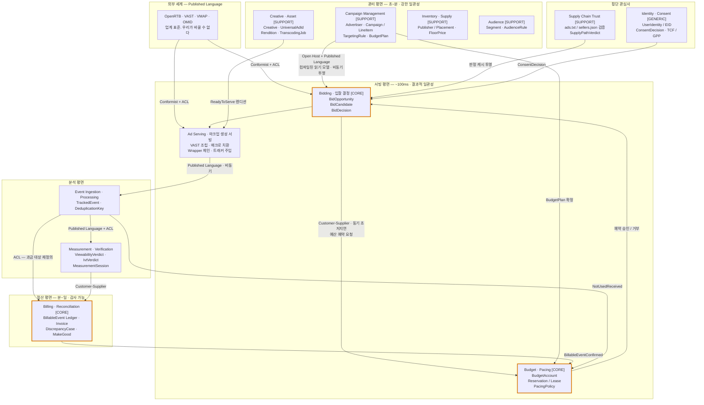
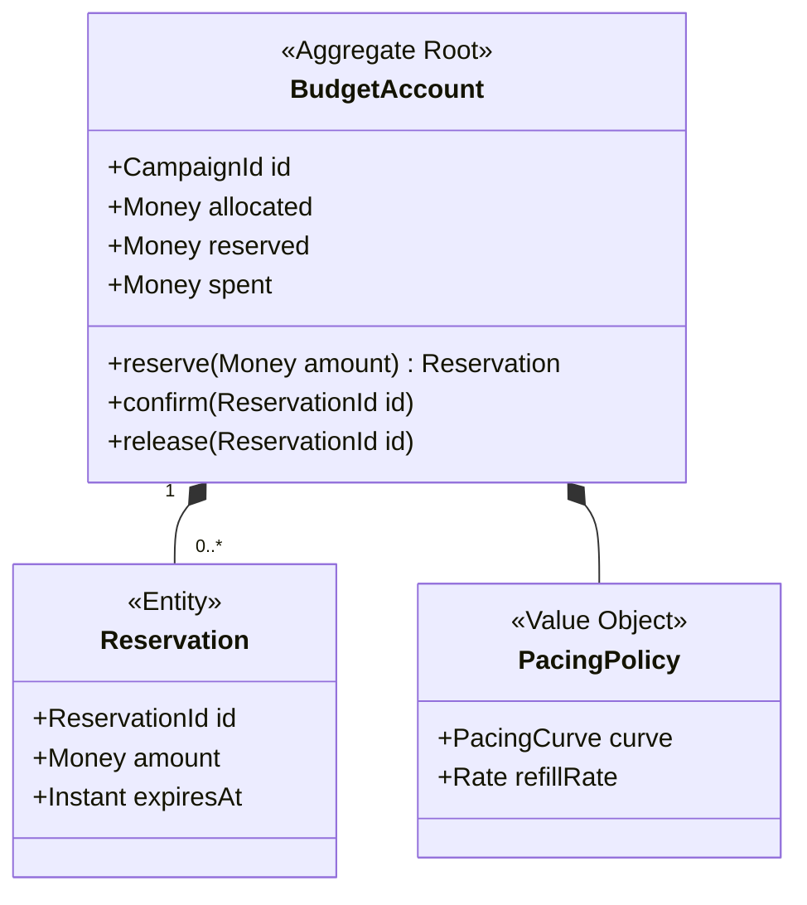
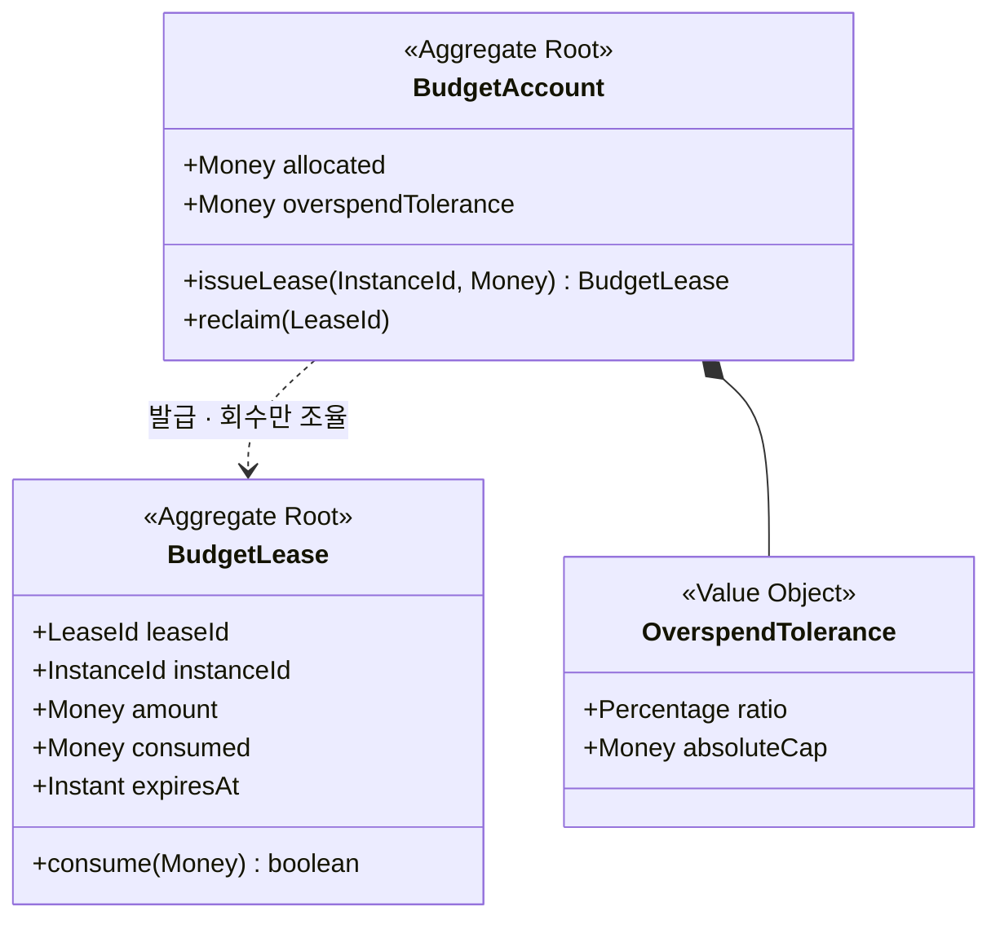
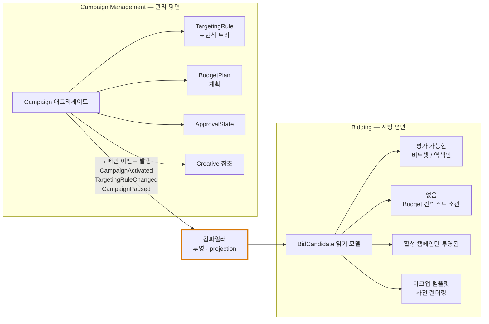
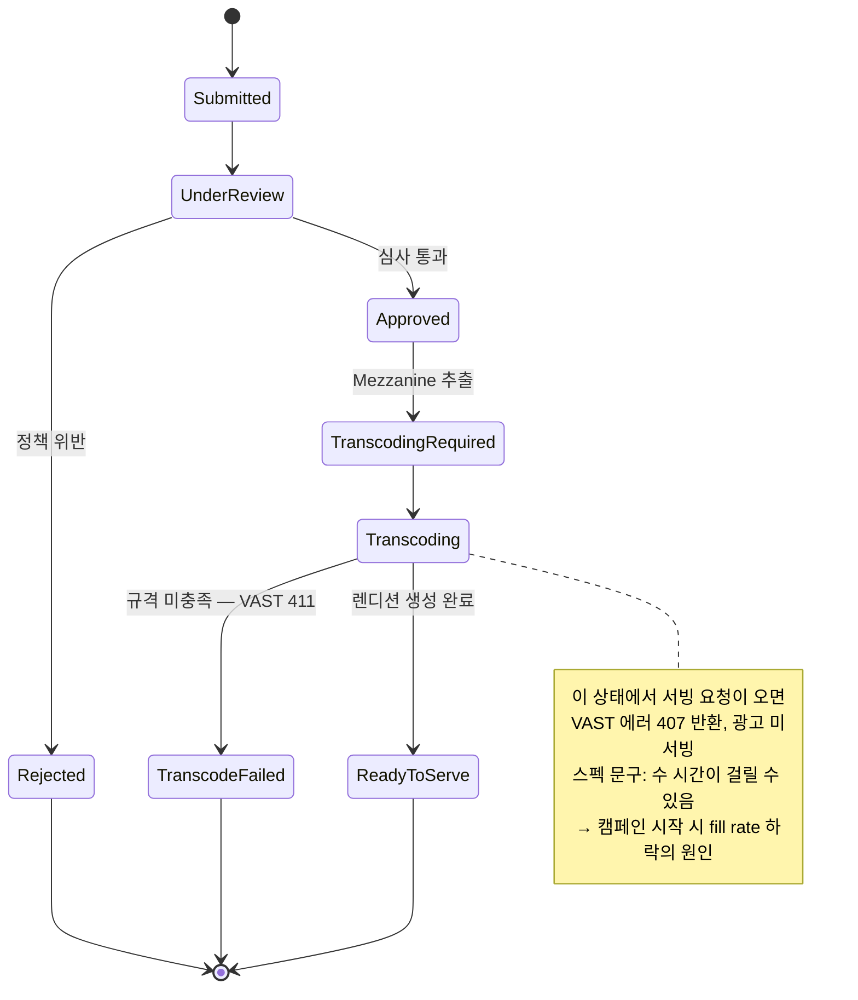
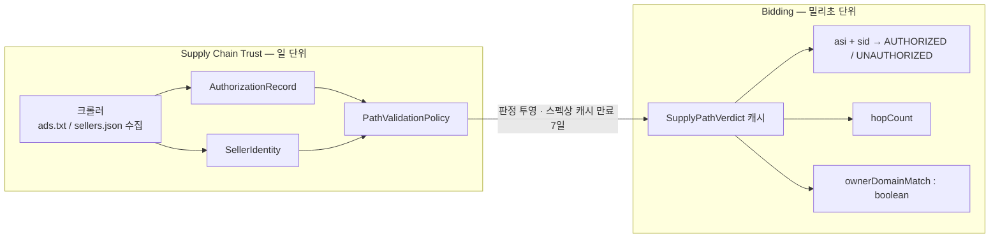
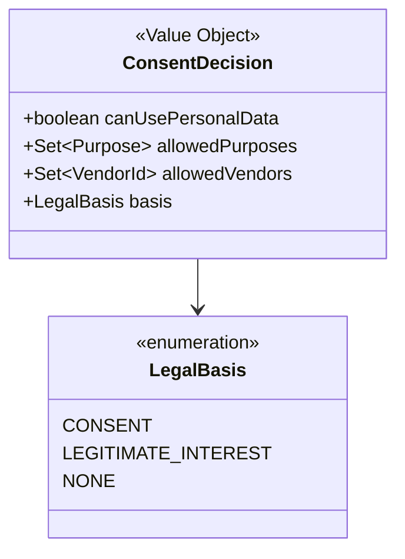
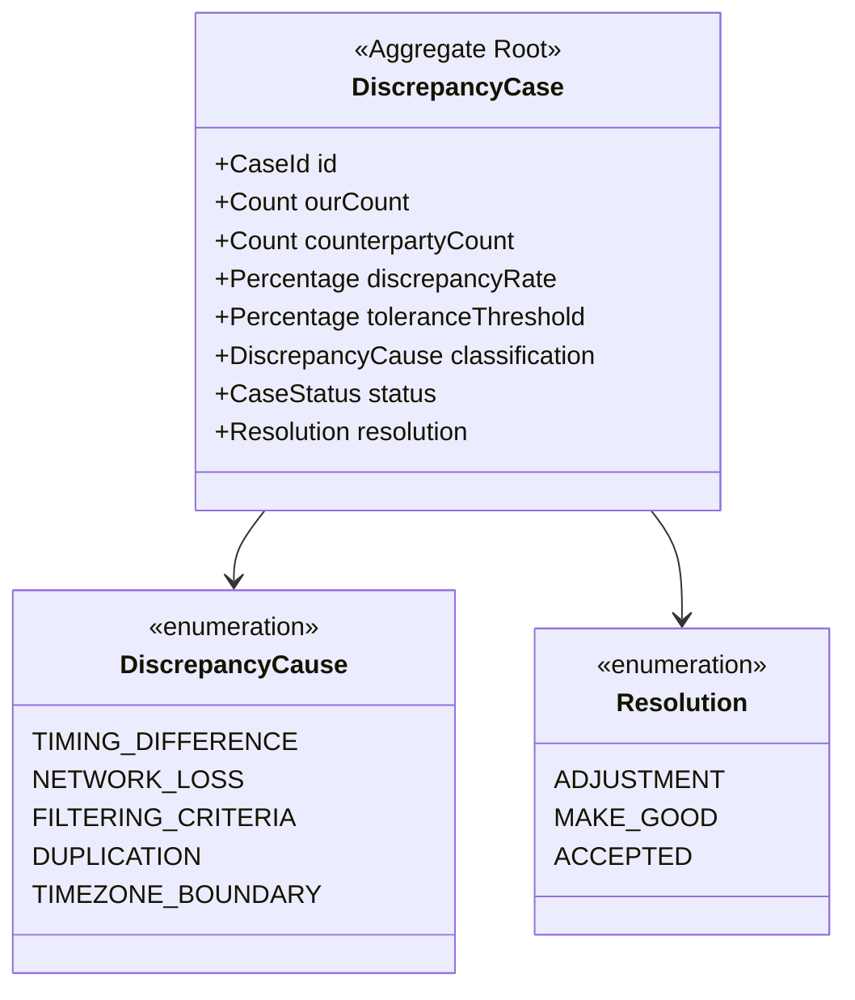
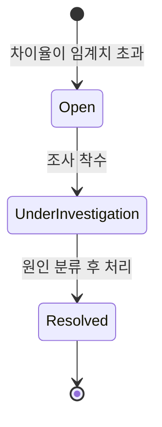
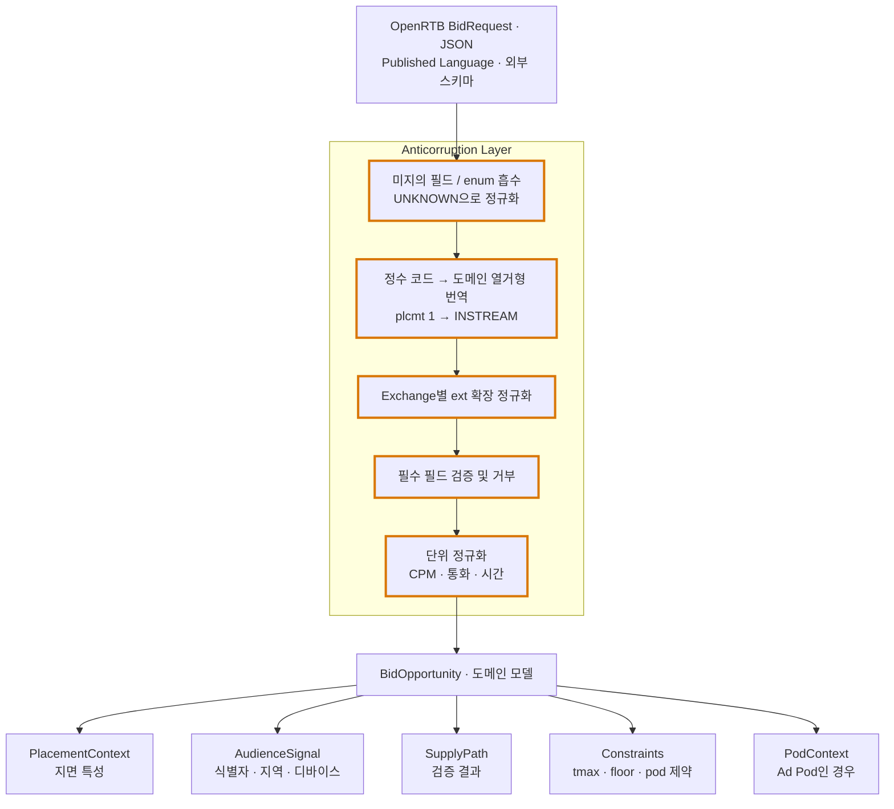

# 09. 애드테크 시스템의 DDD 바운디드 컨텍스트 설계

> 앞선 01~08의 도메인 지식을 전제로 한다. 특히 `06`(정산·대사)과 `08`(저지연 아키텍처)의 제약이 컨텍스트 경계를 결정한다.
>
> 정리 기준일: 2026-09-25

---

## 0. 결론 먼저

애드테크에서 바운디드 컨텍스트를 나누는 **1차 축은 비즈니스 기능이 아니라 일관성·지연 체제(consistency & latency regime)** 다.

```
서빙 평면 (Serving Plane)      ~100ms,  결과적 일관성,  읽기 최적화, 비정규화
관리 평면 (Management Plane)   초~분,    강한 일관성,    쓰기 최적화, 정규화
정산 평면 (Settlement Plane)   분~일,    최종 강한 일관성, 감사 가능, 불변 원장
```

이 세 평면 사이에는 **동기 호출이 존재하면 안 된다.** 평면이 다르면 SLA·장애 도메인·확장 축이 전부 다르기 때문이다. 평면 경계를 넘는 순간 그것은 이미 서로 다른 바운디드 컨텍스트다.

2차 축은 고전적인 DDD 신호, **"같은 단어가 다른 뜻을 갖는 지점"** 이다. 애드테크는 이 신호가 아주 강하게 나타난다.

---

## 1. 언어가 갈리는 지점 — 경계의 1차 증거

| 용어 | Campaign Mgmt | Bidding | Event | Measurement | Billing |
|---|---|---|---|---|---|
| **Campaign** | 광고주와의 계약 단위. 플라이트, 승인 상태, 타겟팅 규칙을 가진 풍부한 애그리게이트 | **사전 컴파일된 입찰 후보 인덱스 엔트리.** 규칙은 이미 평가 가능한 형태로 펼쳐져 있음 | 상관 키(label) 이상도 이하도 아님 | 집계 차원(dimension) | 청구 단위 |
| **Budget** | 계획된 예산(plan). 일/총 한도, 배분 규칙 | 입찰 가능 여부 신호. 참/거짓 | — | — | **실제 집행액(actual).** 인보이스의 근거 |
| **Impression** | 목표 수치(goal) | 존재를 모름 (입찰 시점엔 임프레션이 없다) | 수신된 raw 이벤트 | **측정 가능했던 노출 기회.** viewable / notViewable / undetermined | **IVT를 통과하고 MRC 기준을 충족한 과금 단위** |
| **Creative** | 승인 심사 대상 자산 | 응답에 넣을 마크업 참조 | — | — | — |
| **Publisher** | 계약 상대 | 인벤토리 품질 신호 | — | — | 정산 상대 |

**"Impression"이라는 한 단어가 다섯 곳에서 다섯 가지를 가리킨다.** 이것보다 명확한 컨텍스트 분리 신호는 없다. 하나의 `Impression` 클래스를 공유하려는 시도는 반드시 실패한다 — 필터링 기준이 다르고, 집계 시점이 다르고, 불변식이 다르기 때문이다.

> `06` 문서에서 정리한 "인접 주체 간 5~10% 불일치가 업계 정상 범위"라는 사실이 바로 이 언어 분리의 물리적 표현이다. **컨텍스트마다 숫자가 다른 게 정상이고, 그 차이를 관리하는 것이 대사(reconciliation)라는 별도 도메인이다.**

---

## 2. 컨텍스트 지도 (DSP 기준)



---

## 3. 각 컨텍스트 상세

### 3.1. Bidding (입찰 결정) — **Core**

| 항목 | 내용 |
|---|---|
| 책임 | 들어온 입찰 기회에 대해 **입찰할지, 무엇으로, 얼마에**를 결정 |
| 유비쿼터스 언어 | Bid Opportunity, Bid Candidate, Eligibility, Bid Decision, No-Bid Reason, Bid Price, Shading Factor, Supply Path Verdict |
| 일관성 | 결과적. 캠페인 변경이 수 초 늦게 반영돼도 무방 |
| 데이터 | **전부 읽기 모델.** 프로세스 메모리 인덱스 |

**중요한 판단: Bidding에는 애그리게이트가 거의 없다.**

DDD를 배운 사람이 가장 흔히 하는 실수가 입찰 경로에 애그리게이트를 억지로 만드는 것이다. 애그리게이트는 **트랜잭션 일관성 경계**인데, 입찰 결정은 아무것도 변경하지 않는 **순수 계산**이다.

Bidding은 구조적으로 이렇다:
- **Domain Service** — `BidDecisionService.decide(BidOpportunity): BidDecision`
- **Read Model / Projection** — 캠페인 인덱스, 타겟팅 인덱스, 공급망 검증 캐시
- **Value Object 중심** — `BidPrice`, `PlacementType`, `PodConstraint`, `AudienceSignal`

유일하게 상태를 건드리는 지점이 예산 예약인데, **그건 Budget 컨텍스트의 일**이다. 그래서 둘을 나눈다.

> `08` 문서의 "입찰 경로에서 네트워크 I/O는 예산 조회 단 한 번"이라는 원칙이 그대로 컨텍스트 경계다. 그 한 번의 호출이 컨텍스트 간 동기 협력이고, 나머지는 전부 컨텍스트 내부의 메모리 조회다.

### 3.2. Budget & Pacing (예산·페이싱) — **Core**

| 항목 | 내용 |
|---|---|
| 책임 | 예산 초과 방지, 소진 속도 제어, 빈도 제어 |
| 유비쿼터스 언어 | Budget Account, Allocation, Reservation, Confirmation, Release, Pacing Policy, Pacing Curve, Overspend Tolerance, Frequency Cap |
| 일관성 | **이 컨텍스트만 강한 일관성이 필요하다** (서빙 평면에 있으면서도) |

**왜 Bidding에서 분리하는가 — 세 가지 근거**

1. **불변식이 다르다.** Bidding의 관심사는 "이 기회에 얼마를 낼까"이고, Budget의 불변식은 `reserved + spent ≤ allocated`다. 이건 진짜 트랜잭션 불변식이고 별도의 일관성 경계를 요구한다.
2. **수명주기가 다르다.** 예산 상태는 `reserve → confirm/release`의 3단계를 거치며, **확정 신호는 전혀 다른 컨텍스트(Event/Billing)에서 온다.** Bidding은 이 생애주기를 모른다.
3. **소비자가 여럿이다.** 예산은 RTB 입찰만 소진하는 게 아니다. 직접 판매(Programmatic Guaranteed), 보장형 서빙도 같은 예산을 쓴다. Budget이 Bidding 안에 있으면 다른 소비자가 접근할 길이 없다.

**애그리게이트 설계 — 고경합(high contention) 문제**



**불변식: `reserved + spent ≤ allocated`**

문제는 **초당 수만 건이 같은 애그리게이트 인스턴스를 건드린다**는 것이다. 단일 애그리게이트로는 물리적으로 불가능하다.

해법 — 그리고 이게 DDD가 현실과 만나는 가장 흥미로운 지점이다:

> **불변식을 의도적으로 약화시키고, 그 약화 자체를 도메인 개념으로 승격시킨다.**

**불변식을 다시 쓴다.**

| | 불변식 | 성질 |
|---|---|---|
| 기존 | `reserved + spent ≤ allocated` | 엄격. **확장 불가** |
| 변경 | `reserved + spent ≤ allocated + overspendTolerance` | 완화. 확장 가능 |

**그리고 경합을 분산시킬 새 애그리게이트를 도입한다.**



`BudgetAccount`는 lease 발급/회수만 조율하므로 **경합이 급감**한다. `expiresAt`은 `Imp.exp` 기반 TTL이다.

`OverspendTolerance`는 기술적 타협이 아니라 **비즈니스가 명시적으로 승인한 도메인 개념**이다. "일 예산의 0.5%까지 초과를 허용한다"는 정책은 광고주와 합의할 수 있는 성질의 것이다. 이걸 코드 주석이 아니라 도메인 모델에 올리는 것이 핵심이다.

### 3.3. Ad Serving (마크업 생성·서빙)

| 항목 | 내용 |
|---|---|
| 책임 | 낙찰된 결정을 **VAST XML / HTML 마크업 / Native JSON**으로 조립하고 트래커를 주입 |
| 유비쿼터스 언어 | Ad Markup, Wrapper Chain, Macro Substitution, Tracker Set, Impression Beacon |

Bidding과 합칠지 나눌지는 규모에 달렸다. 나누는 근거:
- **다른 스펙을 다룬다.** Bidding은 OpenRTB, Ad Serving은 VAST/VMAP
- 매크로 치환, Wrapper 해석, 트래커 URL 조립은 별개의 복잡도 덩어리
- SSAI를 지원하면 완전히 다른 워크로드(스트림 스티칭)가 붙는다

DSP라면 대개 Bidding 안에 포함해도 되고, **애드서버나 SSP를 만든다면 반드시 분리**된다.

### 3.4. Campaign Management (캠페인 관리) — **Supporting**

| 항목 | 내용 |
|---|---|
| 책임 | 광고주, 캠페인, 라인아이템, 타겟팅 규칙, 예산 계획, 승인 워크플로 |
| 유비쿼터스 언어 | Advertiser, Campaign, Line Item, Flight, Targeting Rule, Budget Plan, Approval State, Pacing Goal |
| 일관성 | **강한 일관성.** RDBMS 트랜잭션 |
| 애그리게이트 | `Campaign`(루트) → `LineItem` → `TargetingRule`. 불변식: 라인아이템 예산 합 ≤ 캠페인 예산, 플라이트 기간 정합성 |

**서빙 평면과의 관계가 이 설계의 핵심이다.**

Bidding이 Campaign Management를 **조회하면 안 된다.** 대신:



**투영 과정이 단순 복사가 아니라 "컴파일"이라는 점이 중요하다.** 타겟팅 규칙 표현식 트리를 입찰 시점에 해석하면 느리다. 관리 평면에서 미리 역색인이나 비트셋으로 컴파일해 서빙 평면에 내려보낸다. 이건 CQRS의 읽기 모델이지만, **모델의 형태 자체가 다르므로 별도 바운디드 컨텍스트로 보는 것이 옳다.**

### 3.5. Creative & Asset (소재) — **Supporting**

| 항목 | 내용 |
|---|---|
| 책임 | 소재 등록, 심사, 트랜스코딩, 렌디션 관리 |
| 유비쿼터스 언어 | Creative, **UniversalAdId**, **Mezzanine**, Rendition, Transcoding Job, Ad Review, Policy Violation |
| 애그리게이트 | `Creative`(루트) → `Rendition`. 식별자는 `UniversalAdId` 값 객체 (`idRegistry` + `idValue`) |

**독립 컨텍스트로 두는 결정적 근거는 `03`/`05`에서 정리한 VAST 제약이다.**



> "Mezzanine is in the process of being downloaded for the first time. **Download may take several hours.**" — VAST 에러코드 407

**수 시간 걸리는 비동기 워크플로**가 도메인 안에 있다는 것은, 이것이 밀리초 단위 서빙과 같은 컨텍스트일 수 없다는 뜻이다. 트랜스코딩은 외부 벤더에 위임하는 경우가 많아 부패 방지 계층도 필요하다.

또한 스펙의 제약:
> "If the ad creative is changed in any way, **it should be served with a new creative identifier.**"

→ `UniversalAdId`는 **불변 식별자**이고, 소재 변경은 새 애그리게이트 인스턴스 생성이다. 이게 도메인 규칙으로 모델에 박혀야 SSAI 캐시 오염을 막을 수 있다.

### 3.6. Inventory & Supply (인벤토리) — **Supporting**

퍼블리셔, 사이트/앱, 지면, 플로어 프라이스, 인벤토리 품질.

DSP 관점에서는 얇다(구매 대상의 메타데이터). **SSP를 만든다면 이게 Core가 된다** — 수익 최적화, 플로어 가격 전략, 수요 소스 연결이 전부 여기 있기 때문이다.

### 3.7. Supply Chain Trust (공급망 신뢰) — **Supporting**

| 항목 | 내용 |
|---|---|
| 책임 | ads.txt / app-ads.txt / sellers.json 크롤링, SupplyChain 객체 검증, SPO 판단 |
| 유비쿼터스 언어 | Authorized Seller, Seller Identity, Supply Path, Path Verdict, Reseller Hop, Authorization Record |

**독립 컨텍스트인 근거는 `07`에서 정리한 캐시 규정이다.**

> ads.txt / sellers.json은 **캐시 기본 만료가 7일**

즉 이 컨텍스트는 **완전히 다른 시간축**에서 동작한다. 크롤러가 주기적으로 수집하고, 검증 결과를 **판정(verdict) 읽기 모델**로 서빙 평면에 투영한다. Bidding은 그 판정만 메모리에서 조회한다.



### 3.8. Audience (오디언스) — **Supporting**

세그먼트 정의, 데이터 온보딩, 사용자-세그먼트 멤버십.

주의: **세그먼트 "정의/구축"은 이 컨텍스트, 입찰 시점의 "세그먼트 매칭"은 Bidding 컨텍스트**다. 후자는 단순 조회이므로 읽기 모델로 투영된다.

### 3.9. Identity & Consent (식별자·동의) — **Generic → 규제 강화 시 Supporting**

| 항목 | 내용 |
|---|---|
| 책임 | 사용자 식별자 해석(EID/UID/IFA), 동의 문자열 파싱(TCF/GPP/US Privacy), 처리 가능 여부 판정 |
| 유비쿼터스 언어 | User Identity, Identity Graph, Consent String, Purpose, Legal Basis, Processing Decision |

**횡단 관심사처럼 보이지만 라이브러리가 아니라 컨텍스트로 두는 게 낫다.** 이유:
- "이 요청에 대해 개인화 타겟팅을 해도 되는가"는 **도메인 판정**이지 유틸리티 함수가 아니다
- 규제가 바뀌면 이 판정 로직만 바뀌어야 하고 다른 컨텍스트가 영향을 받으면 안 된다
- TCF/GPP 파싱 자체는 Generic(벤더 SDK 사용), 그 위의 **정책 판정은 우리 도메인**



Bidding은 `ConsentDecision`만 받아 쓰고, TCF 비트열이 뭔지 알 필요가 없다.

### 3.10. Event Ingestion & Processing (이벤트 수집·처리)

| 항목 | 내용 |
|---|---|
| 책임 | 트래킹 이벤트 수집, 정규화, 중복 제거, 순서/무결성 검증 |
| 유비쿼터스 언어 | Tracked Event, Event Envelope, Deduplication Key, Correlation Key (`AdServingId`, `TransactionID`), Quartile Progression, Late Arrival |
| 일관성 | at-least-once 수신 + 멱등 처리 |

**이 컨텍스트는 의도적으로 "얇고 판단하지 않는다."** 무엇이 과금 대상인지, 무엇이 뷰어블인지 **판정하지 않는다.** 그건 하류 컨텍스트의 언어다.

여기서 하는 일은:
- raw 이벤트를 받아 정규화
- 멱등 키로 중복 제거 (`06` 참조 — 스펙이 재시도를 권장하므로 중복은 정상)
- Quartile 단조성 같은 **구조적 무결성** 검증
- 상관 키 보존

**발행하는 이벤트가 내부의 Published Language**가 된다. 소비자가 여럿(Measurement, Billing, Reporting)이므로 스키마 레지스트리로 관리한다.

### 3.11. Measurement & Verification (측정·검증)

| 항목 | 내용 |
|---|---|
| 책임 | 뷰어빌리티 판정, IVT 판정, OMID 세션 관리 |
| 유비쿼터스 언어 | Measured Impression, **Viewability Verdict (Viewable / NotViewable / Undetermined)**, IVT Verdict, Measurement Session, MRC Criteria |

**3-state가 도메인 모델에 그대로 올라가야 한다.**

```java
sealed interface ViewabilityVerdict {
    record Viewable(Duration inViewTime, Percentage pixelRatio) implements ViewabilityVerdict {}
    record NotViewable(NotViewableReason reason)                implements ViewabilityVerdict {}
    record Undetermined(UndeterminedReason reason)              implements ViewabilityVerdict {}
}
```

`06`에서 정리한 대로 **Viewability Rate의 분모는 Measured이지 Served가 아니다.** `Undetermined`를 `NotViewable`로 뭉개면 이 계산이 틀어지고, SSAI 환경(`Imp.ssai=3`)에서는 Undetermined 비율이 매우 높다.

Core인지 Supporting인지는 사업 모델에 달렸다. 자체 측정이 차별화 요소라면 Core, 제3자 벤더(OMID)에 의존한다면 Supporting.

### 3.12. Billing & Reconciliation (정산·대사) — **Core**

| 항목 | 내용 |
|---|---|
| 책임 | 과금 대상 확정, 원장 기록, 인보이스 발행, 불일치 조사, 보상 |
| 유비쿼터스 언어 | **Billable Event**, Ledger Entry, Invoice, **Discrepancy Case**, Tolerance Threshold, Make-Good, Settlement Period |
| 일관성 | **강한 일관성 + 감사 가능성(audit trail)** |
| 애그리게이트 | `LedgerEntry`(불변), `Invoice`, `DiscrepancyCase`, `SettlementPeriod` |

**반드시 독립 컨텍스트여야 하는 이유**

1. **"과금 대상"의 정의가 Event 컨텍스트와 다르다.** Event가 받은 임프레션 중 IVT를 통과하고 MRC 기준을 충족한 것만 과금 대상이다. 이 재정의가 곧 **부패 방지 계층(ACL)의 존재 이유**다.
2. **불변 원장**이 필요하다. 이벤트 소싱이 자연스럽게 맞는 유일한 컨텍스트이기도 하다.
3. **대사(reconciliation)라는 고유한 도메인 개념**이 여기에만 있다.



`toleranceThreshold`의 업계 관행은 5~10%다.



`DiscrepancyCase`를 1급 도메인 객체로 만드는 것 자체가 애드테크를 이해했다는 증거다. 불일치는 버그가 아니라 **관리 대상 업무 프로세스**다.

---

## 4. 컨텍스트 매핑 패턴

| 상류 (U) | 하류 (D) | 패턴 | 구현 |
|---|---|---|---|
| **OpenRTB/VAST (업계)** | Bidding, Ad Serving | **Conformist + ACL** | 우리가 스펙을 바꿀 수 없으므로 순응하되, 경계에서 번역해 도메인을 보호 |
| Campaign Management | Bidding | **Open Host + Published Language** | 도메인 이벤트 → 컴파일러 → 읽기 모델 투영 (CQRS) |
| Campaign Management | Budget | Customer-Supplier | `BudgetPlan` 확정 시 `BudgetAccount` 생성/갱신 |
| Bidding | Budget | **Customer-Supplier (동기, 엄격 SLA)** | 평면 내부 유일한 동기 호출. 10ms 예산 |
| Supply Chain Trust | Bidding | Open Host (읽기 모델 투영) | 판정 캐시 |
| Identity & Consent | Bidding, Event | Open Host Service | `ConsentDecision` 값 객체만 노출 |
| Ad Serving | Event Ingestion | **Published Language** (비동기) | 트래킹 이벤트 스키마 |
| Event Ingestion | Measurement | Published Language + ACL | 이벤트 봉투 공유, 판정은 각자 |
| Event Ingestion | **Billing** | **ACL (필수)** | Billing이 "과금 대상"을 자체 정의하므로 번역 필수 |
| Measurement | Billing | Customer-Supplier | 뷰어빌리티 기반 과금 계약일 때 |
| Billing | Budget | **Customer-Supplier (이벤트)** | `BillableEventConfirmed` → 예약 확정 |
| Event Ingestion | Budget | Customer-Supplier (이벤트) | `NotUsedReceived` → 예약 해제 |
| Creative | Ad Serving | Customer-Supplier | `ReadyToServe` 렌디션만 서빙 |
| — | Reporting | Separate Ways | 웨어하우스에서 독립적으로 조인 |

### 4.1. ★ OpenRTB에 대한 부패 방지 계층이 가장 중요하다

이게 애드테크 DDD에서 단연 1순위 실수 지점이다.

```java
// ❌ OpenRTB DTO가 도메인으로 새어 들어온 경우
public BidResponse decide(OpenRtbBidRequest request) {
    if (request.getImp().get(0).getVideo().getPlcmt() == 1) { ... }
    //                                                  ^^^
    //  이 정수 1이 무슨 뜻인지 도메인 코드가 알아야 한다
}

// ✅ ACL로 번역한 경우
public BidDecision decide(BidOpportunity opportunity) {
    if (opportunity.placement().type() == PlacementType.INSTREAM) { ... }
}
```

**스펙 자체가 이 계층을 요구한다.**

> OpenRTB 2.6 §2.6: "As of OpenRTB 2.6-202211, OpenRTB's version number is only incremented on breaking changes... The current version of the OpenRTB specification is **updated approximately once a month** if there are non-breaking improvements to be released such as new fields, objects, or values in enumerated lists."
>
> "Bidders and exchanges **must tolerate receiving new or unexpected fields and enumerated list values gracefully**"

**월 단위로 필드와 enum 값이 추가되는 외부 스키마다.** ACL이 없으면 그 변화가 도메인 전체로 번진다. 그리고 AdCOM 열거형은 OpenRTB 버전과 무관하게 계속 늘어나므로, 하드코딩된 매칭은 반드시 깨진다.

ACL의 구체적 책임:


각 Exchange마다 `ext` 확장이 다르다는 점도 ACL이 흡수해야 한다. **Exchange별 어댑터 + 공통 도메인 모델**이 정석이다.

### 4.2. 관리 평면 → 서빙 평면은 "컴파일"이다

단순 CRUD 동기화가 아니다. 모델의 **형태 자체가 다르다.**

```
Campaign Management 의 TargetingRule          Bidding 의 읽기 모델
  AND(                                          역색인:
    OR(geo=KR, geo=JP),                           geo:KR   → {c1, c7, c9}
    device=MOBILE,                                geo:JP   → {c1, c3}
    NOT(category=GAMBLING)                        dev:MOB  → {c1, c2, c7}
  )                                             비트셋 교집합 연산으로 평가
```

표현식 트리를 입찰 시점에 재귀 평가하면 느리다. 관리 평면에서 역색인으로 컴파일해 내려보낸다. **이 변환이 존재한다는 사실 자체가 두 컨텍스트가 다른 모델을 갖는다는 증거다.**

---

## 5. 서브도메인 분류 — 무엇을 만들고 무엇을 사지 않을 것인가

| 분류 | 컨텍스트 | 판단 |
|---|---|---|
| **Core** | Bidding, Budget & Pacing, Billing & Reconciliation | **직접 만든다.** 경쟁력의 원천 |
| **Core?** | Measurement | 자체 측정이 차별화면 Core, 아니면 벤더(OMID) 의존 |
| **Supporting** | Campaign Mgmt, Creative, Inventory, Audience, Supply Chain Trust | 만들되 **과투자하지 않는다.** 단순하게 |
| **Generic** | Identity/Consent 파싱, Transcoding, Reporting/BI | **산다.** TCF SDK, 트랜스코딩 벤더, BI 도구 |

> **"Campaign Management를 화려하게 만드는 데 6개월을 쓰고 Bidding은 단순하게 만드는 것"** 이 애드테크에서 가장 흔한 자원 배분 실패다. Campaign Management는 CRUD + 워크플로이고 경쟁사도 다 있다. 차별화는 Bidding의 입찰 전략과 Billing의 데이터 정합성에서 나온다.

---

## 6. 흔한 잘못된 분리

| 안티패턴 | 왜 틀렸나 |
|---|---|
| **광고 포맷으로 나누기** (Video Context / Display Context / Native Context) | 포맷은 **변형(variation)** 이지 경계가 아니다. 예산·정산·타겟팅 언어가 전부 동일하다. 다형성으로 풀 문제 |
| **기술 계층으로 나누기** (API / Service / Repository) | DDD가 아니라 그냥 레이어드 아키텍처. 컨텍스트는 **언어**로 나뉜다 |
| **단일 "Ad" 컨텍스트** | Impression이 다섯 가지 뜻을 갖는데 한 모델로 표현하면 조건 분기가 폭발한다 |
| **Impression을 Shared Kernel로** | 컨텍스트마다 필터링 기준·집계 시점·불변식이 다르다. 공유하면 변경이 전 컨텍스트로 전파된다 |
| **OpenRTB DTO를 공용 모델로** | 외부 스키마가 월 단위로 바뀐다. 도메인이 그 변화에 종속된다 |
| **Budget을 Bidding 안에** | 다른 소비자(보장형 서빙)가 접근 불가. 확정 신호가 다른 평면에서 오는 구조를 표현 못 함 |
| **Event와 Billing을 합치기** | "과금 대상"의 정의가 다르다. 합치면 IVT 정책 변경이 수집 파이프라인을 흔든다 |
| **Reporting을 컨텍스트로** | Reporting은 **여러 컨텍스트를 읽는 뷰**다. Separate Ways로 웨어하우스에서 조인 |

---

## 7. 규모별 현실적 출발점

13개 컨텍스트를 13개 마이크로서비스로 시작하는 것은 실패 공식이다. **모듈러 모놀리스로 시작해 확장 축이 갈리는 순서대로 추출**한다.

### 7.1. 팀 5명 이하 — 3개 배포 단위

```
[serving]        Bidding + Budget + Ad Serving + Supply Chain Trust 캐시
[management]     Campaign + Creative + Inventory + Audience + Identity
[analytics]      Event Ingestion + Measurement + Billing + Reporting
```

내부는 **컨텍스트별 모듈로 엄격히 분리**한다. 패키지 경계, 모듈 의존 규칙(ArchUnit 등), 모듈 간 통신은 인터페이스를 통해서만. **경계는 처음부터 긋고, 배포만 나중에 나눈다.**

### 7.2. 추출 순서

| 순서 | 추출 대상 | 근거 |
|---|---|---|
| 1 | **Event Ingestion** | 트래픽 규모가 다른 것보다 자릿수 이상 크다. 가장 먼저 자원이 부딪힌다 |
| 2 | **Bidding** | tmax 제약. 다른 것의 배포가 입찰 지연에 영향을 주면 안 된다 |
| 3 | **Budget** | Bidding이 분리되면 자동으로 따라 나온다 (동기 협력) |
| 4 | **Billing** | 감사 요구와 강한 일관성이 다른 것과 섞이면 안 되는 시점에 |
| 5 | **Creative** | 트랜스코딩(수 시간 워크로드)이 본격화될 때 |
| 6 | 나머지 | 팀 경계가 생길 때 (콘웨이 법칙) |

**1번이 Bidding이 아니라 Event Ingestion인 이유**: 임프레션·quartile·클릭 이벤트는 입찰 요청보다 훨씬 많고 갑자기 폭주한다. `08`에서 정리한 대로 이게 Bidder와 자원을 공유하면 이벤트 폭주가 곧 입찰 실패다. **장애 격리가 가장 급한 지점이 여기다.**

---

## 8. 설계 검증 질문

새 컨텍스트를 나눌지 말지 판단할 때:

1. **같은 단어가 다른 뜻인가?** → 그렇다면 나눈다
2. **일관성 요구가 다른가?** (강한 일관성 ↔ 결과적 일관성) → 나눈다
3. **응답 시간 요구가 자릿수 이상 다른가?** → 나눈다
4. **변경 빈도가 다른가?** (분 단위 ↔ 분기 단위) → 나눈다
5. **실패했을 때 영향 범위가 격리되어야 하는가?** → 나눈다
6. **다른 팀이 소유할 것인가?** → 나눈다 (콘웨이 법칙)
7. 위 중 어느 것도 아닌데 "커서" 나누려 한다면 → **애그리게이트를 나눌 문제이지 컨텍스트를 나눌 문제가 아니다**

---

## 9. 요약

- 애드테크의 1차 분리 축은 **일관성·지연 체제**(서빙 / 관리 / 정산 평면). 평면을 넘는 동기 호출은 금지
- 2차 축은 **"Impression"이 다섯 가지 뜻을 갖는다**는 언어 분리 신호
- **OpenRTB/VAST는 Published Language이지 우리 도메인 언어가 아니다.** 경계에서 ACL로 반드시 번역. 스펙이 월 단위로 바뀌는 것이 그 근거
- **Bidding에는 애그리게이트가 거의 없다.** 읽기 모델 위의 도메인 서비스
- **Budget은 고경합 애그리게이트 문제의 교과서 사례.** 불변식을 의도적으로 완화하고 `OverspendTolerance`를 도메인 개념으로 승격
- **Billing은 반드시 분리.** "과금 대상"의 재정의가 ACL의 존재 이유이고, `DiscrepancyCase`가 1급 도메인 객체
- Core는 Bidding / Budget / Billing. **Campaign Management에 과투자하지 말 것**
- 모듈러 모놀리스로 시작하되 경계는 처음부터. **추출 1순위는 Event Ingestion**(장애 격리), 2순위는 Bidding(tmax)

---

## 10. 관련 문서

- 생태계와 역할 → [01. 광고 생태계와 프로그래매틱 기초](./01_광고생태계와_프로그래매틱_기초.md)
- ACL이 번역해야 할 대상 → [02. OpenRTB 실시간 입찰 프로토콜](./02_OpenRTB_실시간입찰_프로토콜.md)
- Creative 컨텍스트의 제약 → [03. VAST 비디오 광고 표준](./03_VAST_비디오광고_표준.md), [05. SSAI · CSAI](./05_SSAI_CSAI_광고삽입.md)
- Billing 컨텍스트의 언어 → [06. 광고 이벤트 · 트래킹 · 정산과 대사](./06_광고이벤트_트래킹과_정산대사.md)
- Supply Chain Trust 컨텍스트 → [07. 공급망 투명성](./07_공급망_투명성_ads.txt_sellers.json.md)
- 물리 아키텍처 → [08. 저지연 · 고처리량 아키텍처](./08_저지연_고처리량_아키텍처.md)
