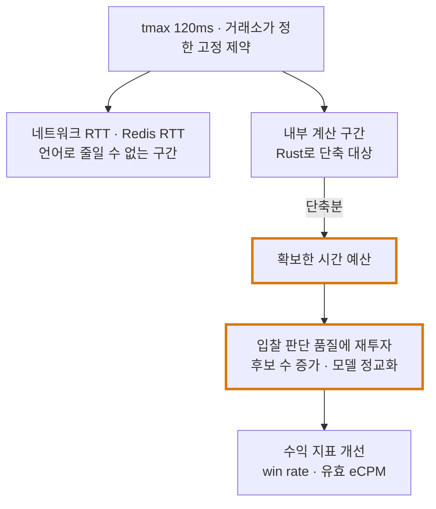
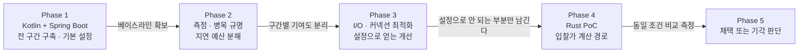
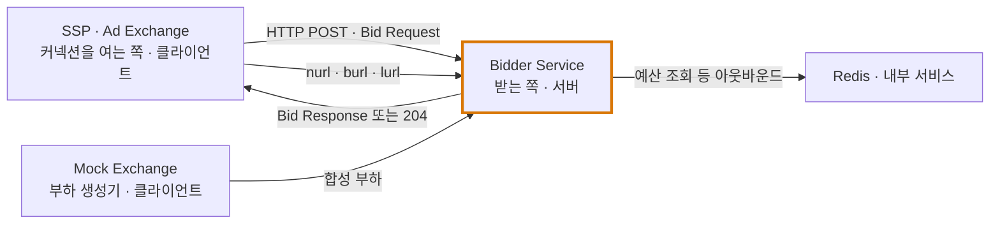

# 10. 포트폴리오 구축 계획 — OpenRTB 입찰 시스템

> 01~09의 도메인 지식을 실제 구현으로 옮기기 위한 계획. 정리 기준일: 2026-09-25

---

## 0. 한 줄 서사

> **Kotlin + Spring Boot로 OpenRTB 입찰 시스템을 전 구간 구축한 뒤, 측정으로 병목을 규명하고 → I/O·커넥션 설정을 최적화한 다음 → 그래도 남은 계산 구간만 Rust로 PoC하여, 동일한 `tmax` 제약 안에서 평가 가능한 입찰 후보 수를 늘렸다.**

이 서사가 강한 이유는 기술 스택이 아니라 **가설 → 측정 → 판단**의 순서를 보여주기 때문이다. "Rust를 써서 빨라졌다"는 누구나 말한다. **"무엇을 위해 속도가 필요했는가"**에 답할 수 있는 사람은 드물다.

### 핵심 프레이밍 — 속도는 목적이 아니라 예산이다

`tmax` 안에 이미 들어와 있다면 10ms 더 빨라져도 **낙찰 확률은 오르지 않는다.** 경매는 가격으로 정해지기 때문이다. 속도가 수익이 되는 경로는 둘뿐이다.

1. `tmax`를 넘기던 요청을 구제한다 (직접 이득)
2. **단축해서 남은 시간을 더 나은 입찰가 판단에 재투자한다** (간접 이득, 이쪽이 본질)



---

## 1. 구축 범위

| 서비스 | 역할 | 참고 문서 |
|---|---|---|
| **Mock Exchange** | OpenRTB Bid Request 생성·부하 발생, 경매 수행, `nurl`/`burl`/`lurl` 발화 | `02` |
| **Bidder Service** | 요청 파싱 → 필터 → 타겟팅 → 예산 확인 → 입찰가 산정 → 응답 | `02`, `08` |
| **Budget Pacing Service** | Available / Reserved / Spent 3단 상태, Redis Lua 원자 차감, 페이싱 | `06`, `08`, `09` |
| **Event Processor** | 트래킹 이벤트 수집·중복 제거·Quartile 검증·예산 확정 피드백 | `06`, `08` |

> **Mock Exchange를 직접 만드는 것 자체가 어필 포인트다.** 실제 SSP에 붙을 수 없으니 OpenRTB 요청을 스펙대로 생성하는 하니스가 필요하고, 이걸 만들었다는 것은 스펙을 읽었다는 증명이 된다. 여기에 `tmax` 강제, no-bid 집계, 경매 타입(`at` 1/2) 전환, Ad Pod 요청 생성을 넣으면 실험 장비가 된다.

컨텍스트 경계는 `09`의 설계를 따른다. 초기에는 **모듈러 모놀리스**로 두고, 추출은 Event Ingestion → Bidding → Budget 순서로 한다.

---

## 2. 단계별 계획



### Phase 1 — Kotlin + Spring Boot로 전 구간 구축

**왜 이 스택으로 시작하는가** (면접에서 반드시 물어본다)

- 도메인 모델링 속도가 빠르다. `09`의 바운디드 컨텍스트와 애그리게이트를 코드로 표현하는 데 Kotlin의 `sealed`/`value class`/`data class`가 잘 맞는다
- Kafka·Redis·관측 도구 생태계가 성숙해서 **인프라가 아니라 도메인에 시간을 쓸 수 있다**
- **먼저 동작하는 전체를 만들어야 병목을 측정할 수 있다.** 최적화는 측정 뒤에 온다

**완료 기준**

- [ ] OpenRTB 2.6 요청/응답 왕복, `tmax` 준수, no-bid는 HTTP 204
- [ ] unknown 필드·enum을 예외 없이 무시 (스펙 §2.6 요구사항)
- [ ] 예산 예약 → 확정/해제 3단 상태, Redis Lua 원자 차감
- [ ] 이벤트 수집 → Kafka → 멱등 중복 제거 → 예산 확정 피드백
- [ ] **부하 테스트 하니스와 지표 수집이 함께 있을 것** ← Phase 2의 전제
- [ ] **I/O·커넥션은 프레임워크 기본 설정 그대로 둔다** — 튜닝하지 않은 상태가 Phase 3의 비교 대상이 된다

> 여기서 의도적으로 최적화를 **하지 않는 것**이 계획의 일부다. 기본 설정 상태의 숫자가 있어야 이후 개선을 "얼마나"로 말할 수 있다.

### Phase 2 — 측정으로 병목을 규명

이 단계를 건너뛰면 서사 전체가 무너진다. **"Rust를 써보고 싶어서 썼다"와 "측정 결과 여기가 병목이라 썼다"의 차이가 포트폴리오의 값을 정한다.**

- 지연을 구간별로 분해: 역직렬화 / 필터 / 타겟팅 / 예산조회 / 입찰가산정 / 직렬화
- P99·P99.9에서 **GC 중단의 기여도**를 분리 측정 (JFR, async-profiler)
- G1 → ZGC 전환만으로 얼마나 개선되는지 먼저 확인
- **언어로 줄일 수 없는 구간을 명시적으로 배제**

| 구간 | 언어로 개선 | 비고 |
|---|---|---|
| 네트워크 RTT | ❌ | `tmax` 정의에 "including Internet latency" — 리전 배치 문제<br/>*번역: 인터넷 지연을 포함한다* |
| Redis RTT | ❌ | 네트워크 |
| Keep-Alive 커넥션 관리 | ❌ | 설정 문제. 스펙이 "profound impact"라 명시<br/>*번역: 지대한 영향* |
| 역직렬화 | ✅ | |
| **입찰가 산정 / 후보 평가** | ✅ | **Rust PoC 대상** |
| GC 중단 (P99 꼬리) | ✅ | ZGC로 상당 부분 완화 가능 |

### Phase 3 — I/O · 커넥션 최적화

**언어를 바꾸기 전에 설정으로 얻을 수 있는 것을 먼저 다 얻는다.** 이 순서 자체가 서사의 설득력을 만든다. 스펙도 이쪽을 먼저 말한다.

> **BEST PRACTICE**: "One of the simplest and most effective ways of improving connection performance is to enable **HTTP Persistent Connections, also known as Keep-Alive.** This has a **profound impact** on overall performance by reducing connection management overhead as well as CPU utilization **on both sides of the interface.**"
>
> **번역**: **모범 사례** — 커넥션 성능을 개선하는 가장 간단하고 효과적인 방법 중 하나는 **HTTP 지속 연결, 즉 Keep-Alive를 켜는 것이다.** 커넥션 관리 오버헤드와 CPU 사용량을 **인터페이스 양쪽 모두에서** 줄여 전체 성능에 **지대한 영향**을 준다.

#### 3-1. 먼저 커넥션의 **방향**을 정리한다

여기서 틀리는 사람이 많고, 틀리면 면접에서 바로 드러난다.



- **입찰 요청 경로에서 커넥션을 먼저 여는 쪽은 거래소다.** Bidder는 **서버**이므로 "거래소를 향해 커넥션을 미리 맺어 두는 풀"은 성립하지 않는다
- 낙찰·과금·패찰 통지(`nurl`/`burl`/`lurl`)도 **거래소가 Bidder를 호출**한다 → 역시 인바운드
- 따라서 **커넥션 풀은 Bidder의 아웃바운드 의존성**(Redis, 내부 gRPC)에 적용된다
- **Mock Exchange는 클라이언트이므로 여기에도 커넥션 풀이 필요하다.** 부하 생성기가 매 요청마다 새로 연결하면 **내 하니스의 핸드셰이크 비용을 내 서버의 지연으로 오측정한다** — 벤치마크 자체가 무효가 된다

#### 3-2. 서버 측 튜닝 (거래소 → Bidder)

| 항목 | 내용 |
|---|---|
| **Keep-Alive** | 가장 큰 효과. 커넥션당 핸드셰이크를 요청당 1회 → 0회로 |
| **idle timeout** | 거래소의 유지 정책보다 길게. 짧으면 우리가 먼저 끊어 상대가 재연결한다 |
| accept backlog | `net.core.somaxconn`, 서버 backlog. 버스트 때 SYN 드롭 방지 |
| FD 한도 | `ulimit -n`, `fs.file-max`. 동시 커넥션 상한을 결정 |
| TLS | 스펙이 HTTPS를 강력 권고. **TLS 1.3(1-RTT)**, 세션 재사용 활성화 |
| `SO_REUSEPORT` | accept 경합을 워커별로 분산 |

**절감 효과의 크기**: 핸드셰이크는 TCP 1-RTT + TLS 1~2-RTT다. RTT가 5ms면 **요청당 10~15ms**, RTT가 20ms면 40~60ms가 된다. `tmax`가 120ms인 것을 생각하면 결정적이다.

> 흔한 오해 — "핸드셰이크 15~30ms"는 고정 상수가 아니라 **RTT의 배수**다. 거래소와 같은 리전에 있으면 훨씬 작다. 포트폴리오에는 "우리 환경의 RTT가 X ms였고 핸드셰이크 제거로 요청당 Y ms를 회수했다"처럼 **측정값으로** 써야 한다.

#### 3-3. 클라이언트 측 커넥션 풀 (Bidder → Redis / 내부 서비스)

**풀 크기는 감이 아니라 Little's Law로 산출한다.**

```
필요 커넥션 수 ≈ 목표 처리량(RPS) × 평균 응답시간(초)

예) Redis 호출 20,000 RPS × 0.5ms = 10
    → 꼬리(P99) 흡수를 위한 여유 배수 2~3배 적용 → 20~30
```

**너무 작을 때 — 두 현상을 구분해야 한다**

| 현상 | 정체 | 관측 지표 |
|---|---|---|
| **풀 고갈 (exhaustion)** | 빌릴 커넥션이 없어 스레드가 **대기**한다. 주된 효과 | `pool.pending`, `pool.acquire.duration` |
| **락 경합 (lock contention)** | 풀 **자료구조 자체**의 동기화 비용. 고동시성에서 부차적이며 요즘 풀은 striped/lock-free로 완화 | CPU 프로파일의 park/unpark |

둘을 뭉뚱그려 "락 경합"이라고 하면 부정확하다. 대부분의 지연은 **락이 아니라 대기열**에서 생긴다.

**너무 클 때**

| 한계 | 내용 |
|---|---|
| 커널 소켓 버퍼 | 커넥션당 송·수신 버퍼가 커널 메모리를 점유. `tcp_rmem`/`tcp_wmem`으로 동적 증가하며 `tcp_mem` 전역 임계에 걸리면 성능이 급락 |
| FD 고갈 | `ulimit -n` 초과 시 `Too many open files` |
| **에페메랄 포트 고갈** | (출발 IP, 목적지 IP, 목적지 포트) 조합당 포트가 유한(~64K). 재연결이 잦으면 **TIME_WAIT 누적**으로 먼저 터진다 — Keep-Alive가 이것도 막아준다 |
| 상대 서버 부하 | Redis 쪽 커넥션 처리 비용도 함께 증가 |

**결정 방법**: 풀 크기를 스윕하며 **획득 대기 시간이 0에 수렴하는 최소 지점**을 고른다. 그 이상은 메모리만 쓴다.

#### 3-4. 완료 기준

- [ ] 서버 측 Keep-Alive·idle timeout·FD 한도 설정과 근거 문서화
- [ ] Mock Exchange(부하 생성기)도 커넥션 재사용 — 벤치마크 유효성 확보
- [ ] Redis/내부 호출 풀 크기를 Little's Law로 산출 후 스윕으로 검증
- [ ] `pool.pending`, `pool.acquire.duration`, 활성 커넥션 수 지표 수집
- [ ] **Phase 1 대비 P99·timeout rate 개선폭을 수치로 확보**

### Phase 4 — Rust PoC: 입찰가 계산 경로만

**전체 재작성이 아니라 가장 뜨거운 경로만 떼어낸다.** 이 판단 자체가 실무 감각의 증거다.

- 대상: 후보 평가 + 입찰가 산정 (순수 계산, I/O 없음 → 이식 비용이 가장 낮고 효과는 가장 큰 구간)
- 통합 방식 두 가지를 비교하고 근거를 남긴다
  - **별도 서비스** — 배포·운영 분리, 대신 네트워크 홉 추가
  - **in-process FFI (JNI/Panama)** — 홉 없음, 대신 빌드·배포 복잡도와 크래시 격리 문제
- Ad Pod의 조합 최적화(총 길이 제약 하 가치 최대화, `08` 참조)를 넣으면 계산량이 실제로 커져서 PoC의 명분이 분명해진다

**측정은 반드시 동일 조건에서**

- 같은 요청 셋, 같은 하드웨어, 같은 `tmax`
- 워밍업 후 정상 상태, 콜드 스타트 제외

### Phase 5 — 채택 또는 기각 판단

> **기각도 결과다.** "PoC 결과 ZGC 적용과 자료구조 개선만으로 목표를 달성해 Rust 도입을 보류했다. 운영 복잡도 대비 이득이 크지 않다고 판단했다"는 결론은 **Rust를 채택한 것보다 오히려 성숙해 보인다.**

판단 기준을 미리 정해 두고 그 기준으로 결론을 낸다. 예: "P99 timeout rate를 0.1% 아래로 유지하면서 평가 후보 수를 2배로 늘릴 수 있는가".

---

## 3. 핵심 지표

앞 단계의 개선을 **비즈니스 언어로 환산**해야 한다. `08`의 지표 정의를 그대로 쓴다.

| 지표 | 왜 보는가 |
|---|---|
| **Timeout Rate** | `tmax` 초과로 버려진 입찰 비율 = 직접적 기회 손실 |
| **P99 / P99.9 내부 지연** | 평균이 아니라 꼬리. P99가 `tmax`를 넘으면 상위 1%는 전부 손실 |
| **평가 가능 후보 수 / 요청** | ★ **Rust PoC의 핵심 성과 지표.** 확보한 시간 예산이 판단 품질로 환산됐음을 보여준다 |
| **QPS당 서버 대수 / CPU** | no-bid가 대부분이라 수익 0인 요청에 원가가 든다. 언어 효율이 지연보다 원가로 먼저 나타난다 |
| Bid Rate / Win Rate | 필터가 과한지, 입찰가 전략이 맞는지 |
| Event Loss Rate | 정산 직결. 0이 목표 |
| **커넥션 획득 대기 시간** | 풀 고갈 여부를 직접 보여준다. 0에 수렴해야 한다 |
| **요청당 핸드셰이크 횟수** | Keep-Alive가 실제로 먹고 있는지. 이상적으로는 0에 수렴 |
| 활성 / 유휴 커넥션 수, FD 사용률 | 풀 상한과 OS 한도 대비 여유 |
| GC pause 분포 | Phase 2·4의 판단 근거 |

---

## 4. 이력서·면접용 서술 템플릿

**Challenge → Solution → Result** 세 문장으로 압축한다.

> **Challenge.** 거래소가 지정한 `tmax` 120ms 안에 네트워크 왕복까지 포함해 응답해야 했고, 입찰가 산정에 쓸 수 있는 내부 예산은 그중 일부였다. 더 정교한 입찰 판단을 하려면 계산 시간이 필요했지만 예산을 늘릴 방법이 없었다.
>
> **Solution.** Kotlin/Spring Boot로 전 구간을 먼저 구축해 베이스라인을 확보한 뒤, 지연을 구간별로 분해해 네트워크·Redis RTT처럼 언어로 줄일 수 없는 구간을 배제하고 **순수 계산 구간인 입찰가 산정 경로만** Rust로 분리해 PoC했다.
>
> **Result.** 동일한 `tmax` 제약에서 평가 가능한 입찰 후보 수를 N배로 늘렸고, P99 timeout rate를 X%로 유지했다. (또는: ZGC 전환만으로 목표를 달성해 Rust 도입을 보류하고 그 판단 근거를 문서화했다.)

핵심은 **"빨라졌다"가 아니라 "확보한 시간으로 무엇을 더 했는가"**로 끝내는 것이다.

### 커넥션 최적화 트랙 (Phase 3) 서술

> 초기에는 프레임워크 기본 설정으로 구축해 베이스라인을 잡았고, 측정 결과 요청마다 TCP·TLS 핸드셰이크가 반복되며 RTT의 2~3배가 지연 예산에서 소모되고 있었다. 거래소가 커넥션을 여는 쪽이라는 점을 반영해 **서버 측에는 Keep-Alive와 idle timeout·FD 한도를**, **아웃바운드 Redis 호출에는 커넥션 풀을** 각각 적용했다. 풀 크기는 목표 처리량과 평균 응답시간으로 Little's Law를 적용해 기준값을 구하고, 꼬리 흡수용 여유 배수를 얹은 뒤 **획득 대기 시간이 0에 수렴하는 최소 지점**으로 확정했다. 상한은 OS의 FD 한도와 에페메랄 포트 범위로 두었다.

여기에 **"부하 생성기도 커넥션을 재사용하도록 고쳐 벤치마크 자체의 유효성을 확보했다"**를 한 줄 덧붙이면 측정에 대한 태도가 드러난다.

---

## 5. 피해야 할 함정

| 함정 | 왜 문제인가 |
|---|---|
| 베이스라인 없이 Rust부터 | 개선폭을 말할 수 없고 "써보고 싶었다"로 읽힌다 |
| 전체를 Rust로 재작성 | 비현실적이고, 병목을 특정하지 못했다는 뜻이 된다 |
| 평균 지연으로 성과 서술 | 애드테크는 P99가 사업 지표다. 평균을 말하면 도메인을 모른다는 신호 |
| 속도 개선을 그 자체로 결론 | `tmax` 안에 들었다면 더 빨라도 낙찰률은 안 오른다. 무엇에 재투자했는지까지 말해야 한다 |
| 합성 부하의 한계를 숨기기 | Mock Exchange 기반이라는 점과 실제 트래픽 분포와의 차이를 **먼저 밝히는 편이 신뢰를 얻는다** |
| `nurl` 기준 예산 차감 | 스펙이 금지한다. 도메인 이해가 없다는 게 즉시 드러난다 |
| **"Bidder가 거래소로 커넥션 풀을 미리 맺어둔다"** | **방향이 반대다.** 입찰 요청은 거래소가 Bidder로 보낸다. Bidder는 서버이고, 풀은 아웃바운드 의존성에 적용된다 |
| 풀이 작을 때의 지연을 전부 "락 경합"이라 설명 | 주된 원인은 **풀 고갈로 인한 대기열**이다. 락 경합은 별개이고 부차적 |
| 핸드셰이크 비용을 고정 ms로 단정 | **RTT의 배수**다. 리전 배치에 따라 크게 달라지므로 측정값으로 말해야 한다 |
| 부하 생성기의 커넥션 재사용을 빠뜨림 | 하니스의 핸드셰이크 비용이 서버 지연으로 오측정되어 **벤치마크가 무효**가 된다 |

---

## 6. 관련 문서

- 프로토콜 구현 근거 → [02. OpenRTB 실시간 입찰 프로토콜](./02_OpenRTB_실시간입찰_프로토콜.md)
- 과금·정산 정확성 → [06. 광고 이벤트 · 트래킹 · 정산과 대사](./06_광고이벤트_트래킹과_정산대사.md)
- 지연 예산 분해와 지표 정의 → [08. 저지연 · 고처리량 아키텍처](./08_저지연_고처리량_아키텍처.md)
- 서비스 경계와 추출 순서 → [09. DDD 바운디드 컨텍스트 설계](./09_DDD_바운디드_컨텍스트_설계.md)
