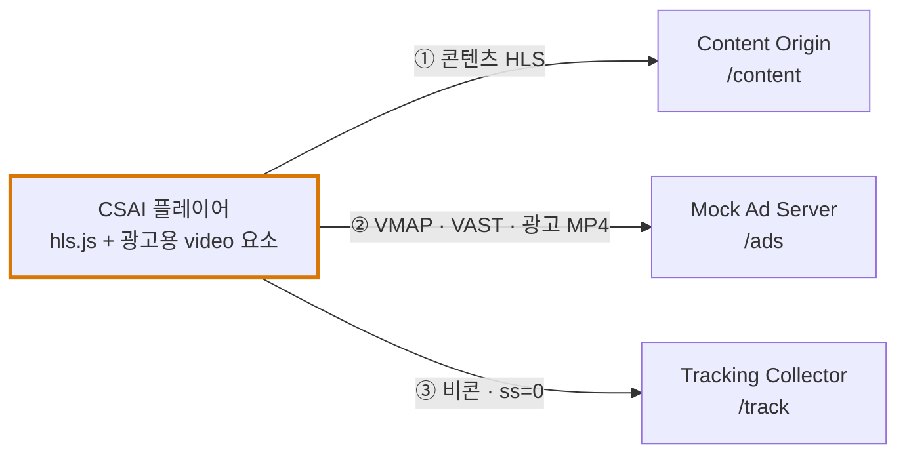
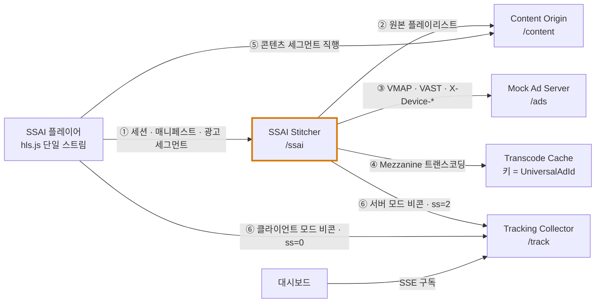
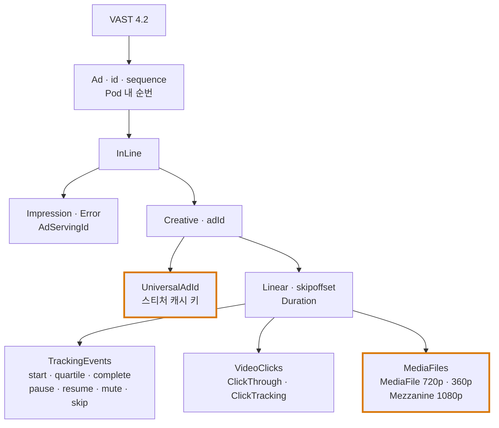
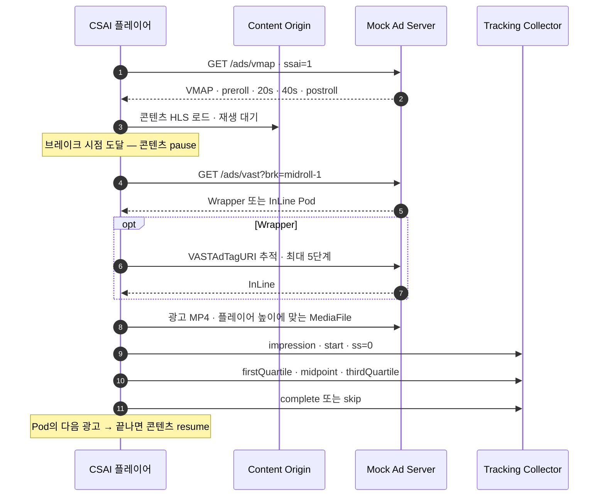
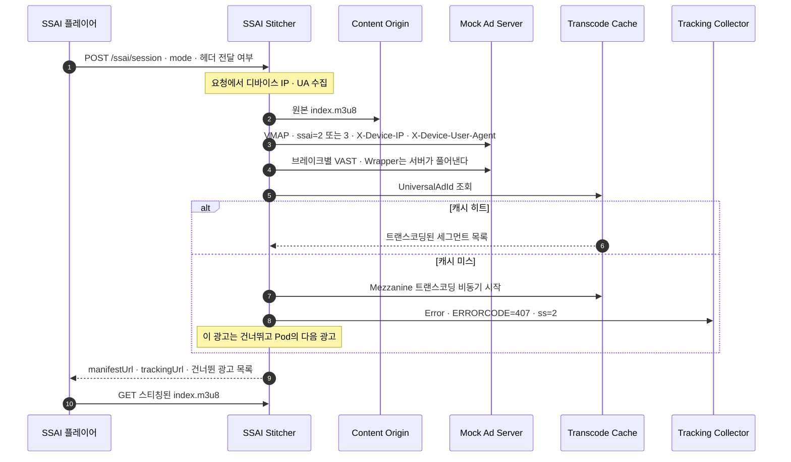
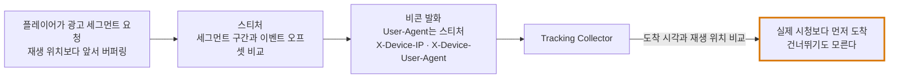
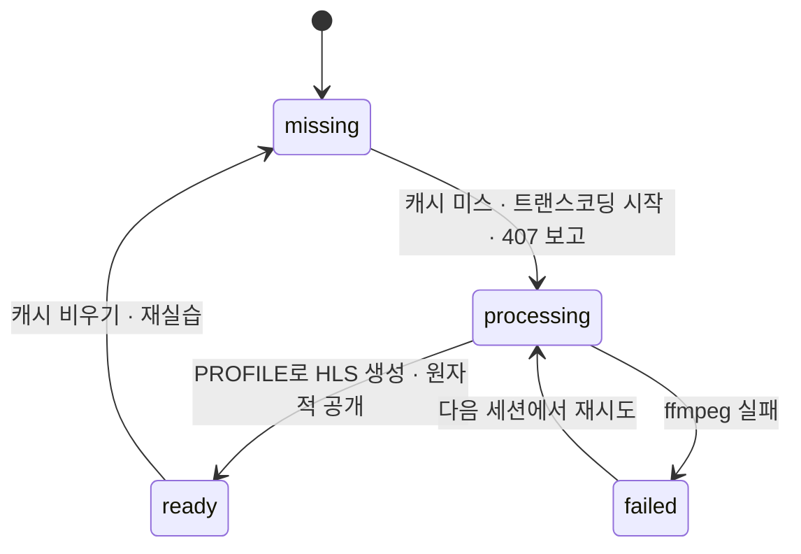
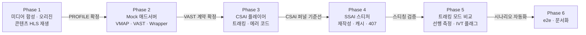

# 11. CSAI · SSAI 실습 환경 설계 — 스트리밍 + 광고 삽입

> 05에서 정리한 CSAI·SSAI 차이를 **직접 재생해 보고, 비콘이 어디서 언제 날아가는지 눈으로 확인**하기 위한 실습 환경 설계. 서버는 Kotlin으로 구현한다. **구현 전 계획 문서**다. 정리 기준일: 2026-09-26
>
> 근거 문서: [03. VAST](./03_VAST_비디오광고_표준.md) · [04. VMAP](./04_VMAP_VPAID_SIMID_OMID.md) · [05. SSAI · CSAI](./05_SSAI_CSAI_광고삽입.md) · [06. 트래킹 · 정산](./06_광고이벤트_트래킹과_정산대사.md)

---

## 0. 목표와 범위

**한 줄 목표**: 같은 콘텐츠·같은 광고 편성을 **CSAI 플레이어**와 **SSAI 플레이어**로 각각 재생하고, 트래킹 수집기에 도착한 비콘을 비교해 두 방식의 트레이드오프를 **측정값으로** 설명할 수 있게 한다.

| 구분 | 포함 | 제외 (확장 과제로 남김) |
|---|---|---|
| 스트리밍 | VOD HLS, 단일 렌디션 720p, 2초 세그먼트 | ABR 다중 렌디션, DASH, 라이브 |
| 광고 표준 | VMAP 1.0, VAST 4.2 (InLine · Wrapper · Ad Pod), 매크로, 에러 코드 | VPAID, SIMID, OMID |
| 광고 결정 | 고정 편성을 돌려주는 Mock 애드서버 | 실제 OpenRTB 경매 (→ 10의 Bidder와 연결) |
| 측정 | 비콘 수집, 중복 제거, 퍼널, IVT 의심 플래그 | 뷰어빌리티, 정산 배치 |

**외부 의존 0**: 콘텐츠와 광고 소재를 모두 ffmpeg로 합성한다. 저작권 있는 영상이나 외부 애드서버 없이 로컬에서 끝까지 돈다.

---

## 1. 전체 구성

역할이 다른 5개 모듈. 실습 편의상 한 프로세스에 띄우되 **모듈 간 호출은 HTTP로만** 한다. 포트만 나누면 그대로 별도 서비스가 된다.

| 모듈 | 경로 | 역할 | 실제 세계의 대응 |
|---|---|---|---|
| **Content Origin** | `/content` | 원본 HLS 서빙. 광고를 전혀 모른다 | CDN · 오리진 |
| **Mock Ad Server** | `/ads` | VMAP · VAST 응답, 소재 파일 서빙 | 퍼블리셔 애드서버 / SSP |
| **SSAI Stitcher** | `/ssai` | 세션 생성, VAST 해석, 트랜스코딩 캐시, 매니페스트 재작성, 서버사이드 비콘 | AWS MediaTailor, Google DAI |
| **Tracking Collector** | `/track` | 비콘 수신, 중복 제거, 퍼널, SSE 스트림 | 애드서버 이벤트 수집기 |
| **Clients** | `/` | CSAI 플레이어, SSAI 플레이어, 대시보드 | 웹 · CTV 플레이어 |

**CSAI 경로** — 플레이어가 애드서버와 직접 대화한다



**SSAI 경로** — 플레이어는 스티처만 보고, 스티처가 애드서버·트래커와 대화한다



**핵심 대비**: CSAI 플레이어는 애드서버를 안다. SSAI 플레이어는 애드서버의 존재를 모른다.

---

## 2. 미디어 설계

### 2.1. 인코딩 프로파일 — 한 곳에서 정의한다

SSAI는 광고 세그먼트를 콘텐츠 세그먼트 사이에 **물리적으로** 끼운다. 해상도·fps·GOP·코덱·오디오 샘플레이트가 하나라도 다르면 디스컨티뉴이티 경계에서 플레이어가 멈추거나 디코더를 재초기화한다 (05 §7). 그래서 프로파일을 **단일 소스**로 두고, 콘텐츠 생성과 스티처 트랜스코딩이 같은 정의를 쓴다.

| 항목 | 값 | 이유 |
|---|---|---|
| 해상도 · fps | 1280×720 · 30fps | |
| 비디오 | H.264 Main, 2.5Mbps CBR 근사 | |
| GOP | 60프레임 고정, `sc_threshold 0`, 2초마다 키프레임 강제 | **모든 세그먼트가 키프레임으로 시작**해야 경계에서 자를 수 있다 |
| 오디오 | AAC-LC 48kHz 스테레오 128k | 샘플레이트 불일치는 가장 흔한 스티칭 장애 |
| 세그먼트 | MPEG-TS 2초, VOD | 미드롤 위치를 2초 배수로 맞춘다 |

### 2.2. 합성 미디어

| 대상 | 생성 방식 | 산출물 |
|---|---|---|
| 콘텐츠 `demo` 60초 | `testsrc2` + 타임코드 `drawtext` + 1초 비프음 | `content/demo/index.m3u8` + `seg_000~029.ts` |
| 광고 소재 4종 | 단색 배경 + "AD · 소재명 · UniversalAdId · 남은 초" + 고유 톤 | 소재마다 아래 3종 |

소재 1개당 파일:

| 파일 | 용도 | 누가 쓰나 |
|---|---|---|
| `mezzanine.mp4` — **1080p** 고화질 | 트랜스코딩 입력 | SSAI 스티처 |
| `720p.mp4` · `360p.mp4` | ready-to-serve `<MediaFile>` | CSAI 플레이어 |

Mezzanine을 **일부러 콘텐츠와 다른 해상도(1080p)**로 만든다. 스티처가 그대로 못 쓰고 반드시 다시 인코딩해야 한다는 사실이 구조에 드러나게 하기 위해서다.

### 2.3. 소재 카탈로그와 편성

| 소재 | UniversalAdId | 길이 | 특징 |
|---|---|---|---|
| Brand A | `LAB-A-0015` | 15s | `skipoffset=00:00:05` — 스킵 실습 |
| Brand B | `LAB-B-0010` | 10s | 깨진 URL 옵션 대상 — 에러 401 실습 |
| Brand C | `LAB-C-0006` | 6s | 범퍼 |
| **New Campaign D** | `LAB-D-0010` | 10s | **사전 트랜스코딩 대상에서 제외** — 407 콜드 스타트 실습 |

| 브레이크 | VMAP `timeOffset` | Ad Pod |
|---|---|---|
| `preroll` | `start` | A |
| `midroll-1` | `00:00:20.000` | B → C |
| `midroll-2` | `00:00:40.000` | **D** → C |
| `postroll` | `end` | B |

---

## 3. Mock Ad Server

### 3.1. API

| 엔드포인트 | 응답 | 파라미터 |
|---|---|---|
| `GET /ads/vmap` | VMAP 1.0. 브레이크마다 `<AdTagURI templateType="vast4">` | `content`, `sid`, `ssai`, `wrapper`, `faulty` |
| `GET /ads/vast` | VAST 4.2. 브레이크의 Ad Pod | `brk`, 위와 동일, Wrapper 내부용 `only`·`seq` |
| `GET /ads/creatives/:id/*` | 소재 파일 | |

- `ssai` — OpenRTB `Imp.ssai` 신호를 그대로 받는다 (CSAI=1, SSAI 클라이언트 비콘=2, SSAI 서버 비콘=3). 로그에 남겨 대시보드에서 구분한다
- **빈 `<VAST/>`는 no-fill**이다. 에러로 취급하지 않는다
- 애드서버가 받은 **요청 자체**도 수집기에 `adRequest`로 기록한다 — SSAI면 여기에 `X-Device-*` 헤더가 실려 와야 한다

### 3.2. VAST 응답 구조



### 3.3. 트래킹 URL 설계

```
/track?ev=firstQuartile&lvl=inline&sid=…&brk=midroll-1&seq=1
      &ad=ad-1002&cr=cr-b&uaid=LAB-B-0010&asid=<AdServingId>&ssai=3
      &ss=[SERVERSIDE]&ph=[ADPLAYHEAD]&cb=[CACHEBUSTING]&ts=[TIMESTAMP]
```

| 설계 결정 | 이유 |
|---|---|
| 애드서버는 매크로를 **치환하지 않은 채** 내려준다 | 치환은 URL을 호출하는 주체의 몫. CSAI면 플레이어, SSAI면 스티처가 치환한다는 차이를 코드로 드러낸다 |
| `asid`(AdServingId)를 멱등 키로 쓴다 | `[CACHEBUSTING]`은 매번 바뀌므로 **멱등 키가 될 수 없다** (06 §중복 제거) |
| `lvl=inline|wrapper` | Wrapper의 비콘도 InLine과 **별도로 모두** 호출돼야 한다. 둘을 구분해 퍼널을 본다 |

### 3.4. 실습 스위치

| 스위치 | 동작 | 관찰할 것 |
|---|---|---|
| `wrapper=1` | 1차 응답을 Wrapper로 주고, `VASTAdTagURI`가 2차 InLine을 가리킨다 | 비콘이 wrapper/inline 두 레벨로 각각 도착하는지 |
| `faulty=1` | Brand B의 MediaFile URL을 404가 나게 깨뜨린다 | CSAI 플레이어가 에러 401을 Wrapper·InLine 모두에 보고하는지 |

---

## 4. CSAI 설계

### 4.1. 흐름



### 4.2. 플레이어 구성

- **비디오 요소 2개**: 콘텐츠용(hls.js)과 광고용(progressive MP4). 광고 중에는 광고 요소를 위에 덮고 콘텐츠 컨트롤을 숨긴다
- 이 "요소 전환"이 곧 CSAI의 약점이다 — 전환 순간 버퍼링·블랙 프레임이 생길 수 있고, 애드블록이 애드서버 도메인을 막으면 광고가 사라진다

### 4.3. 트래킹 규칙

| 이벤트 | 발화 조건 |
|---|---|
| `impression` + `start` | 광고 요소의 **첫 `playing`** — 첫 프레임 렌더링 시작 |
| quartile 3종 | `currentTime / Duration`이 0.25 · 0.5 · 0.75를 처음 넘을 때 1회 |
| `complete` | `ended` |
| `pause` / `resume` | 광고 재생 중 사용자 일시정지·재개 (끝나면서 나는 pause는 제외) |
| `mute` / `unmute` | `volumechange` |
| `skip` | `skipoffset` 경과 후 건너뛰기 버튼 |
| `ClickTracking` | "자세히 보기" — ClickThrough를 새 창으로 열고 광고 일시정지 |

매크로 치환: `[SERVERSIDE]=0`, `[ADPLAYHEAD]`, `[CONTENTPLAYHEAD]`, `[UNIVERSALADID]`, `[PODSEQUENCE]`, `[BREAKPOSITION]`(1 pre · 2 mid · 3 post), `[CACHEBUSTING]`, `[TIMESTAMP]`.

### 4.4. 에러 처리

| 상황 | VAST 에러 코드 |
|---|---|
| Wrapper 타임아웃 / 한도 초과 / Wrapper 뒤 빈 응답 | 301 / 302 / 303 |
| 재생 가능한 MediaFile 없음 | 403 |
| MediaFile 로딩 8초 타임아웃 | 402 |
| `<video>` 에러 → HEAD 확인 결과 404 | 401 |
| `<video>` 에러 → 파일은 있음 | 405 |

`<video>`의 에러 이벤트는 404와 디코딩 실패를 구분해 주지 않는다. 그래서 HEAD 요청으로 한 번 더 확인해 401과 405를 가른다.

### 4.5. 시크 정책

- 광고 중 콘텐츠 시크 불가
- 콘텐츠를 앞으로 시크해 미드롤을 여러 개 넘기면 **마지막으로 넘긴 브레이크 하나만** 재생 (나머지는 소진 처리)

---

## 5. SSAI 설계

### 5.1. 세션 생성 흐름



VOD 실습이므로 광고 결정은 **세션 시작 시 한 번** 하고 매니페스트를 고정한다. 실서비스는 매니페스트 요청마다(라이브면 갱신마다) 결정한다.

### 5.2. 매니페스트 재작성

원본 플레이리스트의 세그먼트를 순회하다가 브레이크 위치(콘텐츠 시각)에 도달하면 광고 세그먼트를 끼운다.

```m3u8
#EXTM3U
#EXT-X-TARGETDURATION:2
#EXT-X-PLAYLIST-TYPE:VOD
#EXT-X-CUE-OUT                      ← 프리롤 시작 표식
#EXTINF:2.0,
/ssai/<sid>/ad/0/0/0.ts             ← 광고 세그먼트는 스티처를 거친다
…
#EXT-X-CUE-IN
#EXT-X-DISCONTINUITY                ← 인코딩 원본이 바뀌는 경계
#EXTINF:2.0,
/content/demo/seg_000.ts            ← 콘텐츠 세그먼트는 오리진 직행
…
#EXT-X-CUE-OUT
#EXT-X-DISCONTINUITY
/ssai/<sid>/ad/1/0/0.ts             ← midroll-1 · Brand B
…
#EXT-X-DISCONTINUITY                ← Pod 안의 광고 사이도 경계다
/ssai/<sid>/ad/1/1/0.ts             ← midroll-1 · Brand C
#EXT-X-CUE-IN
#EXT-X-DISCONTINUITY
/content/demo/seg_010.ts
…
#EXT-X-ENDLIST
```

| 설계 결정 | 이유 |
|---|---|
| `EXT-X-DISCONTINUITY`를 **원본이 바뀌는 모든 경계**에 | 콘텐츠↔광고뿐 아니라 광고↔광고도 타임스탬프가 불연속이다 |
| 콘텐츠 세그먼트는 오리진 URL 그대로 | 콘텐츠는 CDN 캐시를 그대로 탄다. 스티처는 매니페스트만 개인화한다 |
| 광고 세그먼트는 `/ssai/<sid>/ad/<avail>/<ad>/<seg>.ts`로 스티처 경유 | 서버 모드에서 **세그먼트 요청 시점을 재생 진행 신호로** 쓰기 위해서다 |
| `CUE-OUT` / `CUE-IN` | SCTE-35 스타일 표식. 재생에는 영향 없고 광고 구간 식별용 |

### 5.3. 두 타임라인

SSAI에서는 **스트림 시각 ≠ 콘텐츠 시각**이다. 프리롤 15초가 붙으면 스트림 15초 = 콘텐츠 0초다.

| 스트림 시각 | 무엇 | 콘텐츠 시각 |
|---|---|---|
| 0 ~ 15 | preroll · A | 0 (정지) |
| 15 ~ 35 | 콘텐츠 | 0 ~ 20 |
| 35 ~ 51 | midroll-1 · B + C | 20 (정지) |
| 51 ~ 71 | 콘텐츠 | 20 ~ 40 |
| 71 ~ 77 | midroll-2 · C만 (D는 407로 빠짐) | 40 (정지) |
| 77 ~ 97 | 콘텐츠 | 40 ~ 60 |
| 97 ~ 107 | postroll · B | 60 |

플레이어는 트래킹 메타데이터의 avail 목록으로 두 시각을 변환해 둘 다 화면에 보여준다. "이어보기 위치를 어느 시각으로 저장할 것인가" 같은 실무 질문으로 이어진다.

### 5.4. 트래킹 모드 — 이 실습의 핵심

| 모드 | OpenRTB `Imp.ssai` | 비콘 주체 | 발화 근거 | `[SERVERSIDE]` |
|---|---|---|---|---|
| **server** | 3 | 스티처 | 광고 **세그먼트 요청**이 해당 구간을 덮을 때 | 2 (서버가 스스로 판단) |
| **client** | 2 | 플레이어 | 트래킹 메타데이터의 시각을 `currentTime`이 지날 때 | 0 |

**server 모드의 발화 규칙**: 광고 길이 D, 세그먼트가 광고 내 `[from, to)`를 덮을 때 오프셋이 그 안에 드는 이벤트를 발화한다. impression·start=0, quartile=D/4·D/2·3D/4, complete=마지막 세그먼트. 세그먼트 재요청(시크백)에 대비해 `(avail, ad, event)` 단위로 한 번만 보낸다.



플레이어 화면에서 수집기 SSE를 구독해 **"이 비콘이 재생 위치보다 몇 초 먼저 도착했는가(선행)"**를 표시한다. server 모드에서는 버퍼 길이만큼 선행이 생기고, client 모드에서는 0에 수렴한다. MRC가 서버 개시 카운팅을 인정하지 않는 이유(05 §8)를 숫자로 보여주는 장치다.

**server 모드에서도 클라이언트가 보내야 하는 것**

| 이벤트 | 이유 |
|---|---|
| 클릭 (`ClickTracking`) | 사용자 입력은 서버가 볼 수 없다 |
| 건너뛰기 (`skip`) | 마찬가지. server 모드에서는 **아예 보내지지 않는다** — 그 한계 자체를 로그로 보여준다 |

### 5.5. 서버 간 요청 헤더 (VAST 4.1+ SSAI 규약)

스티처가 애드서버·트래커를 호출할 때:

| 헤더 | 값 |
|---|---|
| `User-Agent` | 스티처 자신 (`[SERVERUA]`) |
| `X-Device-IP` | 세션 생성 요청의 클라이언트 IP |
| `X-Device-User-Agent` | 세션 생성 요청의 User-Agent |
| `X-Device-Accept-Language` | 있으면 |
| `X-Forwarded-Host` | 클라이언트가 접속한 호스트 — VAST 안의 URL을 클라이언트가 도달 가능한 주소로 만들기 위해 |

**실습 스위치 "X-Device-* 헤더 전달 끄기"**: 끄면 수집기가 서버 비콘에 `X-Device-IP 누락 — 스티처 IP로 집계되어 IVT 의심` 플래그를 단다. "모든 트래킹이 한 IP에서 온다"는 SSAI의 실무 문제(05 §3.2)를 재현한다.

### 5.6. 트랜스코딩 캐시 — 407 콜드 스타트



| 설계 결정 | 이유 |
|---|---|
| 캐시 키 = `UniversalAdId` | 스펙이 정한 시스템 간 소재 동일성 ID. 소재를 바꾸고 ID를 안 바꾸면 옛 영상이 계속 나간다 (03 §7) |
| 트랜스코딩은 비동기, 그 세션은 407로 건너뜀 | 트랜스코딩이 끝날 때까지 세션을 붙잡으면 재생 시작이 늦어진다 |
| 임시 디렉터리에 만든 뒤 rename | 반쯤 만들어진 세그먼트를 다른 세션이 집어 가지 않게 |
| 인위적 지연 (기본 8초, 환경 변수) | 합성 소재는 1초 안에 끝나 "진행 중" 상태를 관찰할 수 없다 |
| **사전 트랜스코딩 스크립트** (`warmup`) | 소재 등록 시점에 미리 돌리는 파이프라인의 축소판. D만 일부러 빼 둔다 |

### 5.7. 스냅백

SSAI에서는 광고가 스트림의 일부라 플레이어가 막지 않으면 시크로 그냥 넘어간다. 보지 않은 avail을 앞으로 넘기는 시크를 감지하면 **그 avail 시작점으로 되돌리고**, avail이 끝나면 원래 시크 목표로 보낸다.

---

## 6. Tracking Collector

| 엔드포인트 | 역할 |
|---|---|
| `GET /track` | 비콘 수신 → 1×1 GIF, `Cache-Control: no-store` |
| `GET /track/stream` | SSE — 대시보드와 SSAI 플레이어가 구독 |
| `GET /track/events?since=` | 폴링용 |
| `GET /track/summary` | 퍼널 |
| `POST /track/reset` | 초기화 |

**레코드에 남기는 것**: 이벤트, 레벨, 세션·브레이크·순번·소재·UniversalAdId·AdServingId, `ssai` 신호, `[SERVERSIDE]` 값, 에러 코드, `[ADPLAYHEAD]`, **TCP 피어 IP**, User-Agent, `X-Device-IP`, `X-Device-User-Agent`.

| 처리 | 규칙 |
|---|---|
| 중복 제거 | 키 = `AdServingId + 레벨 + 이벤트`. pause·resume·mute·click·error는 반복이 정상이라 제외 |
| IVT 의심 플래그 | 서버 발화(`ss=1|2`)인데 `X-Device-IP`나 `X-Device-User-Agent` 없음 / `[SERVERSIDE]` 미치환 |
| 퍼널 | 세션 × 브레이크 × 순번 × 소재 × 레벨 × 발화 주체(client/server)별 impression → complete, 에러 코드별 건수 |

---

## 7. 클라이언트 화면

| 화면 | 구성 |
|---|---|
| **CSAI** | 콘텐츠·광고 비디오 겹침, 광고 UI(AD n/m · 남은 초 · 건너뛰기 · 일시정지 · 음소거 · 자세히 보기), 브레이크 마커 타임라인, 옵션(Wrapper · 깨진 소재 · 음소거), 플레이어 행동 로그 |
| **SSAI** | 단일 비디오, 스트림/콘텐츠 이중 시계, avail 구간 타임라인, 옵션(비콘 모드 · 헤더 전달 · Wrapper), 세션 정보, 비콘 발화·수신 로그(선행 시간 표시) |
| **대시보드** | 실시간 비콘 테이블(주체 태그 · 피어 IP · X-Device-IP · 플래그 · 중복), 퍼널, 트랜스코딩 캐시 상태와 비우기 버튼 |

URL 파라미터(`?autostart=1&mode=client&wrapper=1` 등)로 옵션을 지정할 수 있게 해 e2e 자동화와 재현을 쉽게 한다.

---

## 8. 실습 시나리오

| # | 시나리오 | 조작 | 기대 관찰 |
|---|---|---|---|
| 1 | CSAI 기본 | CSAI 재생 | 브레이크마다 콘텐츠 정지 → 광고 요소 전환 → 비콘 `client` 태그, 피어 IP = 브라우저 |
| 2 | Wrapper 체인 | CSAI · Wrapper on | 이벤트마다 wrapper·inline 두 건. 퍼널에서 레벨별 건수 일치 |
| 3 | 소재 에러 | CSAI · 깨진 소재 on | Brand B 에러 401이 두 레벨에 보고, Pod의 다음 광고(C)는 정상 재생 |
| 4 | 스킵 | CSAI · 프리롤 5초 후 건너뛰기 | `skip` 수신, `complete` 없음 |
| 5 | SSAI 407 콜드 스타트 | 캐시 비우고 SSAI 세션 → 10초 후 새 세션 | 1차: midroll-2에 C만, 에러 407 수신. 2차: D 포함 |
| 6 | 서버 비콘 선행 | SSAI · server | 비콘이 재생 위치보다 버퍼 길이만큼 **먼저** 도착 |
| 7 | 클라이언트 비콘 | SSAI · client | 선행 ≈ 0, `ss=0`, 피어 IP = 브라우저 |
| 8 | IVT 오판 재현 | SSAI · server · 헤더 전달 off | 서버 비콘 전부에 IVT 의심 플래그, 모두 스티처 IP |
| 9 | 스냅백 | SSAI · 콘텐츠 중 미드롤 너머로 시크 | 광고 시작점으로 되돌아간 뒤 광고 종료 후 원래 위치로 |
| 10 | 서버 모드 스킵 | SSAI · server · 프리롤 건너뛰기 | skip 비콘 없음, 버퍼링된 만큼의 quartile은 이미 발화됨 |

---

## 9. 기술 선택

**서버는 Kotlin**, 클라이언트는 브라우저 JS. 서버 쪽 스택은 [10](./10_포트폴리오_구축_계획.md)의 입찰 시스템과 맞춰 두어, 확장 과제에서 Mock 애드서버를 Bidder에 연결할 때 같은 빌드·같은 관측 도구를 쓸 수 있게 한다.

### 9.1. 서버 (Kotlin)

| 영역 | 선택 | 이유 · 대안 |
|---|---|---|
| 언어 · 런타임 | **Kotlin 2.x · JDK 21** | 10과 동일. `sealed`로 캐시 상태·VAST 노드 종류를, `value class`로 `UniversalAdId`·`AdServingId`를 표현한다 |
| 프레임워크 | **Spring Boot 3 · WebFlux + 코루틴** | 스티처는 세션 하나에 VMAP·VAST·Wrapper 추적·비콘 발화 등 **아웃바운드 HTTP가 많다.** `suspend` + `WebClient`로 병렬 호출(브레이크별 VAST 동시 요청)을 자연스럽게 쓴다. MVC + 가상 스레드도 가능하나 SSE·비동기 비콘과의 궁합으로 WebFlux를 택한다 |
| 빌드 | **Gradle Kotlin DSL · 멀티 모듈** | 모듈 경계 = 서비스 경계. 처음엔 한 애플리케이션으로 묶어 띄우고, 나중에 모듈별 부트 앱으로 분리 |
| VAST/VMAP 생성 | **kotlinx.html 스타일 DSL 직접 작성** 또는 StAX `XMLStreamWriter` | 템플릿 문자열보다 이스케이프·CDATA 실수가 적다 |
| VAST/VMAP 파싱 | **StAX (`XMLStreamReader`)** 또는 Jackson XML | 네임스페이스(`vmap:`)·CDATA·반복 요소 처리를 명시적으로 통제. Jackson XML은 단일/배열 요소 판별에 주의 |
| HLS 재작성 | 직접 구현 (라인 파서) | VOD 단일 렌디션이면 수십 줄. 라이브 확장 시 라이브러리 검토 |
| 트랜스코딩 | **ffmpeg를 `ProcessBuilder`로 호출**, 코루틴 `Dispatchers.IO` 위에서 비동기 | JVM 바인딩(JavaCV)은 무겁고 CLI와 동작이 같다. 동시 작업 수는 `Semaphore`로 제한 |
| 서버 비콘 발화 | `WebClient` fire-and-forget + 타임아웃 3초 | 비콘 실패가 세그먼트 응답을 막으면 안 된다 |
| SSE | WebFlux `Flow<ServerSentEvent>` / `Sinks.Many` | 대시보드·SSAI 플레이어 구독 |
| 저장 | 인메모리 (`ConcurrentHashMap`) | 교체 지점을 인터페이스(`TrackEventRepository`, `SessionStore`)로 둬 06·08의 Redis·Kafka로 바꾼다 |
| 테스트 | **JUnit 5 + Kotest assertions**, WebTestClient | 매크로 치환, VAST 파싱·Wrapper 병합, 매니페스트 재작성, 이벤트 스케줄은 순수 함수로 두고 단위 테스트 |
| 관측 | Micrometer + Actuator | 세션 생성 지연, VAST 응답 시간, 407 비율, 비콘 실패율 |

### 9.2. 클라이언트 · 도구

| 영역 | 선택 | 이유 · 버린 대안 |
|---|---|---|
| 플레이어 | **hls.js** + 바닐라 JS 모듈 | 디스컨티뉴이티 처리가 검증돼 있고 사파리는 네이티브 HLS로 대체. video.js는 플러그인 층이 VAST 처리를 가려 학습 목적에 안 맞다 |
| CSAI VAST 처리 | **직접 구현** (DOMParser) | Wrapper 해석·매크로 치환·트래킹을 직접 짜는 것이 목적. Google IMA SDK는 확장 과제의 비교용으로 |
| 정적 파일 서빙 | Spring Boot `static/` 리소스 | 별도 프런트 빌드 없이 한 서버에서 |
| 미디어 합성 | **ffmpeg 셸 스크립트** 또는 Gradle 태스크 | 인코딩 인자는 서버의 PROFILE과 **같은 정의**를 써야 하므로, 프로파일 값을 `profile.properties` 한 곳에 두고 스크립트와 서버가 함께 읽는다 |
| e2e | **Playwright for Java** + 로컬 Chrome | 시나리오를 헤드리스로 돌려 수집기 퍼널을 검증. JVM 안에서 테스트와 함께 실행 |

### 9.3. 모듈 구조 (안)

```
ad-insertion-lab/
├── build.gradle.kts · settings.gradle.kts
├── profile.properties              # 인코딩 프로파일 단일 소스
├── scripts/
│   ├── generate-media.sh           # 콘텐츠 · 소재 합성
│   └── warmup.sh                   # 사전 트랜스코딩 (→ 스티처 관리 API 호출)
├── shared/                         # 도메인 공용 — 프레임워크 의존 없음
│   ├── vast/                       # VAST · VMAP 모델, 파서, 빌더
│   ├── macro/                      # 매크로 치환, SERVERSIDE 값, 시간 포맷
│   └── media/                      # EncodingProfile, ffmpeg 인자 생성
├── origin/                         # /content
├── adserver/                       # /ads · 카탈로그 · 편성 · VAST/VMAP 응답
├── stitcher/                       # /ssai
│   ├── session/                    # 세션 생성 · 타임라인(avail) 계산
│   ├── manifest/                   # HLS 파서 · 재작성
│   ├── resolve/                    # Wrapper 체인 해석 · 트래킹 병합
│   ├── transcode/                  # UniversalAdId 캐시 · ffmpeg 작업 큐
│   └── beacon/                     # 세그먼트 요청 → 이벤트 발화 · X-Device-* 헤더
├── tracker/                        # /track · 저장 · 중복 제거 · 퍼널 · SSE
├── app/                            # 위 모듈을 한 프로세스로 묶는 부트 앱 + static/ 클라이언트
│   └── src/main/resources/static/  # csai · ssai · dashboard 페이지, vast-client.js
└── e2e/                            # Playwright 시나리오
```

**의존 방향**: `origin`·`adserver`·`stitcher`·`tracker`는 `shared`에만 의존하고 **서로를 직접 참조하지 않는다** (HTTP로만 호출). `adserver`가 요청 로그를 `tracker`에 남기는 것도 HTTP 비콘으로 보낸다. 이 규칙을 지키면 Phase 6 이후 서비스 분리가 설정 변경만으로 끝난다.

### 9.4. 주요 타입 스케치

```kotlin
@JvmInline value class UniversalAdId(val value: String)
@JvmInline value class AdServingId(val value: String)

enum class TrackingMode(val ssaiSignal: Int) { SERVER(3), CLIENT(2) }

sealed interface CacheState {
    data class Ready(val segments: List<Segment>) : CacheState
    data class Processing(val since: Instant) : CacheState
    data class Failed(val error: String) : CacheState
    data object Missing : CacheState
}

sealed interface VastAd {
    val sequence: Int
    val tracking: TrackingSet
    data class InLine(override val sequence: Int, override val tracking: TrackingSet,
                      val creative: LinearCreative, val adServingId: AdServingId?) : VastAd
    data class Wrapper(override val sequence: Int, override val tracking: TrackingSet,
                       val vastAdTagUri: URI) : VastAd
}

data class Avail(val breakId: String, val contentOffset: Duration,
                 val streamStart: Duration, val ads: List<StitchedAd>)
```

## 10. 단계별 계획



| Phase | 완료 기준 |
|---|---|
| 1 | 콘텐츠·광고 세그먼트의 코덱·해상도·fps·샘플레이트가 ffprobe로 일치 |
| 2 | VAST가 IAB XSD 검증 통과, Wrapper → InLine 추적 시 트래킹 URL이 레벨별로 모두 모임 |
| 3 | 시나리오 1~4 통과. 퍼널에서 impression 수 = 재생 광고 수 |
| 4 | 스티칭된 매니페스트가 브라우저에서 끊김 없이 재생, 시나리오 5 통과 |
| 5 | 시나리오 6~10 통과, 서버/클라이언트 모드의 선행 시간 분포를 수치로 확보 |
| 6 | Playwright로 시나리오를 헤드리스 재현, README에 구조도·실행법·관찰 결과 |

---

## 11. 확장 과제

| 과제 | 배우는 것 |
|---|---|
| ABR 다중 렌디션 (360p · 720p · 1080p) | 렌디션마다 광고도 같은 사다리로 트랜스코딩해야 한다. 캐시 키가 `UniversalAdId × 렌디션`이 된다 |
| 라이브 SSAI | SCTE-35 신호로 브레이크 감지, 매니페스트 갱신마다 스티칭, 광고 길이 ≠ 브레이크 길이일 때 슬레이트 채우기 |
| Google IMA SDK 비교 페이지 | 직접 만든 CSAI 플레이어와 같은 VAST를 IMA로 재생해 비콘 차이 비교 |
| OMID 검증 스크립트 | `<AdVerifications>`와 클라이언트 측 측정 (04) |
| 10의 Bidder 연결 | Mock 애드서버가 고정 편성 대신 OpenRTB 요청을 보내 낙찰 소재로 VAST 생성. `Imp.ssai`·`video.podid` 등이 실제 입찰 요청에 실린다 |
| 수집 파이프라인 교체 | 인메모리 저장 → Kafka → 멱등 컨슈머 (06, 08) |

---

## 12. 포트폴리오 서술 포인트

> **Challenge.** CSAI와 SSAI의 차이는 "서버가 광고를 꿰맨다"로 요약되지만, 실무 쟁점은 삽입이 아니라 **측정**이다. 서버가 대신 보낸 비콘은 실제 시청보다 이르게 도착하고, 디바이스 정보를 빠뜨리면 무효 트래픽으로 분류된다.
>
> **Solution.** 콘텐츠 오리진·Mock 애드서버·SSAI 스티처·트래킹 수집기를 구축하고, 같은 편성을 CSAI와 SSAI 두 방식, SSAI는 다시 서버 비콘(`ssai=3`)과 클라이언트 비콘(`ssai=2`) 두 모드로 재생했다. 스티처는 UniversalAdId 기반 트랜스코딩 캐시와 407 폴백, VAST 4.1 `X-Device-*` 헤더 규약을 구현했다.
>
> **Result.** 서버 비콘이 재생 위치보다 평균 N초 먼저 도착함을 측정으로 확인했고(버퍼 길이와 일치), 헤더를 빼면 서버 비콘 전량이 IVT 의심으로 분류됨을 재현했다. 신규 소재의 첫 세션 fill 손실을 407 비율로 설명하고 사전 트랜스코딩으로 제거했다.

**면접에서 나올 질문과 이 설계가 주는 답**

| 질문 | 답의 근거 |
|---|---|
| SSAI에서 impression은 언제 세나? | 세그먼트 요청 시점은 근사일 뿐이고 MRC는 클라이언트 개시를 요구한다 → 그래서 `ssai=2` 하이브리드를 쓴다 (시나리오 6·7) |
| 광고가 끊겨 재생된다면? | 인코딩 프로파일 불일치 또는 DISCONTINUITY 누락. PROFILE 단일 소스와 경계마다 태그 삽입으로 막았다 |
| 신규 캠페인 첫날 fill이 낮다면? | 407 콜드 스타트. 소재 등록 시점 사전 트랜스코딩 (시나리오 5) |
| SSAI 트래픽이 IVT로 잡힌다면? | `X-Device-IP`·`X-Device-User-Agent` 누락 여부부터 본다 (시나리오 8) |
| 중복 비콘은 어떻게 거르나? | AdServingId 기반 멱등 키. CACHEBUSTING은 키가 될 수 없다 |

---

## 13. 관련 문서

- VAST 구조·매크로·에러 코드 → [03](./03_VAST_비디오광고_표준.md)
- VMAP → [04](./04_VMAP_VPAID_SIMID_OMID.md)
- SSAI 헤더 규약·Mezzanine·MRC → [05](./05_SSAI_CSAI_광고삽입.md)
- 중복 제거·퍼널·대사 → [06](./06_광고이벤트_트래킹과_정산대사.md)
- 입찰 시스템 포트폴리오와의 연결 → [10](./10_포트폴리오_구축_계획.md)
