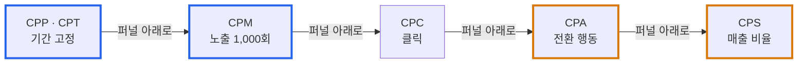
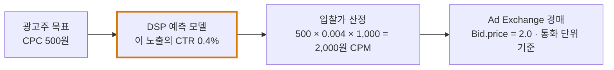

# 12. 광고 과금 방식 (Pricing Models)

> 애드테크의 과금 방식은 디지털 광고가 **노출되거나 사용자가 반응할 때** 비용을 청구하는 기준이다. 정리 기준일: 2026-09-26
>
> 관련: [01. 광고 생태계](./01_광고생태계와_프로그래매틱_기초.md) · [02. OpenRTB](./02_OpenRTB_실시간입찰_프로토콜.md) · [06. 트래킹 · 정산](./06_광고이벤트_트래킹과_정산대사.md)

---

## 1. 주요 과금 방식

| 방식 | 풀이 | 과금 시점 | 주 목적 | 성과 위험을 지는 쪽 |
|---|---|---|---|---|
| **CPM** | Cost Per Mille | 광고 **1,000회 노출**마다 | 브랜드 인지도 | 광고주 |
| **CPC** | Cost Per Click | 사용자가 광고를 **클릭**할 때마다 | 웹사이트 방문 유도 | 나눠 짐 |
| **CPA** | Cost Per Action | 회원가입·구매 등 **전환 행동**이 발생했을 때만 | 전환 확보 | 매체 · 네트워크 |
| **CPS** | Cost Per Sale | **판매 금액의 일정 비율** | 매출 (성과 보장형) | 매체 · 네트워크 |
| **CPP** | Cost Per Period | 특정 지면·기간을 **일 단위로 계약**한 고정 금액 | 지면 독점 · 대형 캠페인 | 광고주 |

### CPM — Cost Per Mille

- *Mille*는 라틴어로 1,000. 광고가 1,000회 노출될 때마다 비용을 낸다
- 클릭이나 전환과 무관하게 **보여준 것 자체**에 돈을 내므로 브랜드 인지도를 높이는 캠페인에 맞다
- 비용 = 노출 수 ÷ 1,000 × CPM 단가
  - 예) CPM 3,000원으로 200만 회 노출 → 2,000 × 3,000원 = **600만 원**

### CPC — Cost Per Click

- 사용자가 광고를 클릭할 때마다 비용을 낸다. 노출은 무료
- 웹사이트 방문(트래픽)을 유도하는 캠페인에 쓴다
- 검색 광고의 기본 과금 방식이다
- 약점: **부정 클릭**(봇, 경쟁사의 반복 클릭)이 곧 비용이 된다. 무효 클릭 필터링이 필수다

### CPA — Cost Per Action

- 회원가입, 앱 설치, 구매처럼 **구체적인 사용자 행동(전환)**이 일어났을 때만 과금한다
- 결과가 없으면 돈을 내지 않으니 **광고주의 위험 부담이 적다**. 반대로 매체는 노출·클릭을 공짜로 제공하는 위험을 떠안는다
- 무엇을 전환으로 볼지, 어느 광고의 공으로 볼지(**어트리뷰션** — 클릭 후 7일? 마지막 클릭?) 합의가 필요하다
- 앱 설치 과금은 따로 **CPI**(Cost Per Install)라고 부르기도 한다

### CPS — Cost Per Sale

- 제품 판매 금액의 **일정 비율**을 광고비로 정하는 성과 보장형 방식
  - 예) 수수료율 5%로 1,000만 원어치 판매 → 광고비 **50만 원**
- CPA의 일종이지만 고정 금액이 아니라 **매출에 비례**한다는 점이 다르다
- 제휴 마케팅(어필리에이트)·커머스 광고에서 주로 쓴다
- 주의: 반품·취소를 어떻게 처리할지(과금 확정 시점)를 미리 정해야 한다

### CPP — Cost Per Period

- 특정 지면이나 기간을 **일 단위(1일당)**로 계약하고 정해진 금액을 낸다
  - 예) 포털 메인 배너 하루 독점
- 노출 수·클릭 수와 무관하게 **지면을 통째로 산다.** 트래픽이 많은 날이면 효율이 좋고, 적으면 손해다
- 국내에서는 **CPT**(Cost Per Time)라고도 부른다
- 경매가 아닌 **직거래**라, 프로그래매틱으로 치면 보장형 거래(Programmatic Guaranteed)에 가깝다 (01 참고)

---

## 2. 성과 위험의 스펙트럼

과금 기준이 퍼널 아래(전환·매출)로 갈수록 광고주는 안전해지고, 그 위험은 매체·네트워크로 넘어간다. 그래서 퍼널 아래 방식일수록 단가가 비싸다.

- **파란 테두리** — 성과가 나오든 말든 광고주가 돈을 낸다 (광고주 위험)
- **주황 테두리** — 성과가 나와야 매체가 돈을 받는다 (매체 위험)

| 관점 | 선호하는 방식 | 이유 |
|---|---|---|
| 광고주 | CPA · CPS | 결과에만 돈을 낸다 |
| 매체(퍼블리셔) | CPM · CPP | 트래픽만 있으면 수익이 확정된다 |
| 광고 네트워크 | 혼합 | 양쪽을 중개하며 차익과 위험을 함께 관리 |

---

## 3. 서로 다른 과금 방식을 어떻게 비교하나 — eCPM

매체가 CPM 캠페인, CPC 캠페인, CPA 캠페인을 동시에 받았다면 어느 광고를 내보내야 돈이 되는가? 모두 **"노출 1,000회당 기대 수익"**으로 환산해 비교한다. 이 값이 **eCPM**(effective CPM)이다.

| 방식 | eCPM 환산 |
|---|---|
| CPM | eCPM = CPM 단가 |
| CPC | eCPM = CPC 단가 × **CTR** (클릭률) × 1,000 |
| CPA | eCPM = CPA 단가 × **노출 대비 전환율** × 1,000 |
| 사후 계산 | eCPM = 총 수익 ÷ 총 노출 × 1,000 |

**예시** — 같은 지면에 두 광고가 들어왔다

| 광고 | 조건 | eCPM |
|---|---|---|
| A | CPM 2,000원 | **2,000원** |
| B | CPC 500원, 예상 CTR 0.5% | 500 × 0.005 × 1,000 = **2,500원** |

→ 단가표만 보면 A가 확정 수익이지만, 기대값으로는 B가 낫다. 단, B는 **CTR 예측이 틀리면** 손해를 본다. 그래서 CTR·CVR 예측 모델의 정확도가 곧 수익이 된다.

---

## 4. 프로그래매틱 입찰과의 관계 — 입찰은 항상 CPM이다

OpenRTB에서는 광고주의 과금 방식과 관계없이 **입찰가를 CPM으로 표현한다.**

| 필드 | 의미 |
|---|---|
| `Bid.price` | 입찰가. **CPM으로 표현**하지만 실제 거래는 노출 1건 단위다 |
| `Imp.bidfloor` | 최저 입찰가. 역시 CPM |

그래서 CPC·CPA 목표를 가진 캠페인도 DSP 안에서는 **eCPM으로 환산해 입찰**한다.

- 과금 방식이 바뀌어도 경매는 같은 언어(CPM)로 돈다
- **요청마다 CTR·CVR을 예측**해야 입찰가가 나온다 → [10](./10_포트폴리오_구축_계획.md)에서 "`tmax` 안에서 더 정교한 입찰 판단"이 수익으로 이어지는 이유다
- CPC/CPA로 광고주에게 받고 CPM으로 매체에 내면, 예측이 틀린 만큼의 차이를 **DSP가 떠안는다** (차익 거래이자 위험)

---

## 5. 비디오 광고의 과금 단위

이 노트 시리즈가 다루는 비디오·CTV 광고에서는 아래 단위도 자주 쓴다.

| 방식 | 과금 기준 | 측정 근거 |
|---|---|---|
| **CPM** | 비디오 광고 노출 1,000회 | VAST `<Impression>` — 비디오의 공식 과금 신호 (06) |
| **CPV** (Cost Per View) | **조회** 1회. 조회의 정의는 플랫폼마다 다르다 (예: 일정 시간 이상 시청) | VAST `progress` 이벤트 오프셋 등 |
| **CPCV** (Cost Per Completed View) | **끝까지 본** 조회 1회 | VAST `complete` 이벤트 |
| **vCPM** (viewable CPM) | **뷰어블** 노출 1,000회. MRC 기준 비디오는 픽셀 50% 이상이 2초 연속 화면에 보여야 한다 | OMID · 뷰어빌리티 측정 (04, 06) |

- 스킵 가능한 광고에서 CPCV는 광고주에게 유리하다 — 건너뛴 조회에는 돈을 내지 않는다
- SSAI에서 서버가 대신 보낸 `complete`로 CPCV를 과금하면 **실제 시청보다 먼저 카운트될 수 있다** → [11](./11_CSAI_SSAI_실습환경_설계.md) 시나리오 6·10에서 직접 확인할 수 있다

---

## 6. 정산 관점에서 조심할 것

| 함정 | 설명 |
|---|---|
| 과금 이벤트 정의 불일치 | 같은 "노출"도 광고주 측 집계와 매체 측 집계가 다르다. **무엇을 기준으로 셀지 계약 전에 합의**해야 한다 (06 §정산·대사) |
| 낙찰 = 노출로 계산 | 경매에서 이겨도 노출이 안 될 수 있다. 낙찰 통지(`nurl`)로 과금하면 안 된다 (06) |
| 부정 트래픽 | CPM은 봇 노출, CPC는 부정 클릭, CPA는 가짜 설치·어트리뷰션 가로채기에 취약하다. 방식마다 공격 지점이 다르다 |
| CPS 취소·반품 | 판매 확정 전에 과금하면 환불 시 역정산이 필요하다 |
| 통화 · 단위 | `Bid.price`는 CPM 단위라 노출 1건의 실제 금액은 ÷1,000이다. 원 단위 계산에서 반올림 누적 오차를 조심한다 |

---

## 7. 한눈에 정리

- **CPM** — 보여주면 돈을 낸다. 인지도
- **CPC** — 누르면 돈을 낸다. 방문
- **CPA** — 행동하면 돈을 낸다. 전환, 광고주 위험 최소
- **CPS** — 팔리면 비율만큼 낸다. 성과 보장형
- **CPP / CPT** — 기간을 통째로 산다. 지면 독점
- 서로 다른 방식은 **eCPM**으로 환산해 비교하고, 프로그래매틱 **입찰은 항상 CPM**으로 한다
