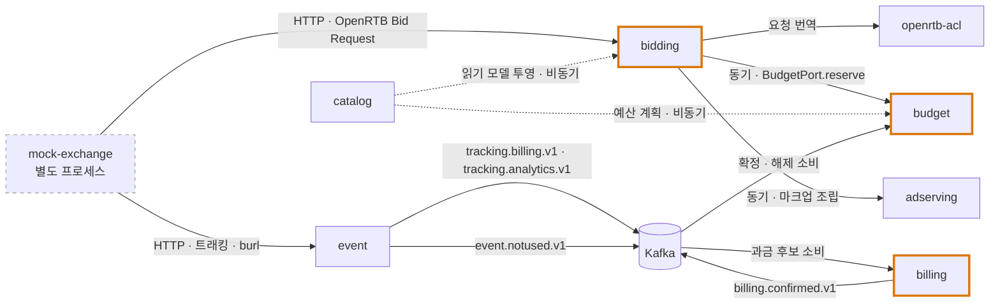
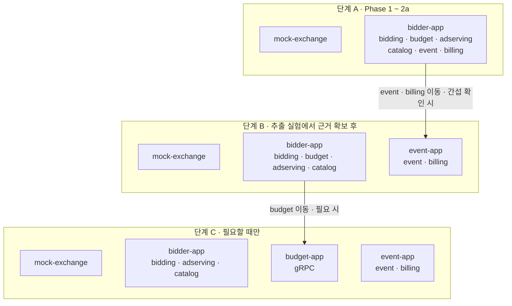

# 13. 초기 구조와 구현 계획 — 모듈러 모놀리스로 시작하기

> [09. DDD 바운디드 컨텍스트 설계](./09_DDD_바운디드_컨텍스트_설계.md)의 경계와 [10. 포트폴리오 구축 계획](./10_포트폴리오_구축_계획.md)의 Phase 계획을 **코드 구조와 착수 순서**로 옮긴 문서. 10이 "무엇을, 왜 측정하는가"라면 이 문서는 "첫 커밋부터 무엇을 어떤 모양으로 만드는가"다. **구현 전 계획 문서**다.
>
> 정리 기준일: 2026-09-28

---

## 0. 결론 먼저

- **모듈러 모놀리스로 시작한다.** 모듈 경계는 첫 커밋부터 긋고, 배포 단위는 측정 결과에 따라 나중에 나눈다
- **모든 컨텍스트를 모듈로 만들지 않는다.** 포트폴리오의 핵심인 Bidding · Budget · Event · Billing과 이를 잇는 Ad Serving만 모듈로 만들고, 관리 평면은 시드 데이터 모듈 하나로 묶는다
- **Mock Exchange만 처음부터 별도 프로세스다.** 외부 주체 역할이고 부하 생성기이기 때문이다
- **평면을 넘는 통신은 같은 프로세스 안에서도 Kafka로 한다.** 나중에 프로세스를 나눌 때 코드를 바꾸지 않기 위해서다
- **Event Ingestion 추출은 측정으로 정당화한다.** 한 프로세스에서 이벤트 폭주가 입찰 P99를 얼마나 망가뜨리는지 먼저 재고, 그 수치를 근거로 떼어낸다

---

## 1. 왜 "모놀리스 먼저"가 아니라 "모듈 먼저"인가

### 1.1. 세 가지 출발점 비교

| 기준 | 모놀리스 → 나중에 분리 | **모듈러 모놀리스** | 처음부터 MSA |
|---|---|---|---|
| 경계를 모를 때 | **유리.** 잘못 그은 경계보다 경계 없음이 싸다 | 불리 | 매우 불리 |
| 경계를 알 때 | 불리. 알면서도 결합이 먼저 생긴다 | **유리** | 유리하지만 비쌈 |
| 초기 개발 속도 | 가장 빠름 | 빠름 | 느림 (배포 · 통신 · 관측을 서비스마다) |
| 나중에 분리하는 비용 | 큼. 얽힌 호출과 테이블 조인을 풀어야 함 | **작음.** 모듈을 새 앱에 옮겨 싣는 수준 | 없음 (이미 나뉨) |
| 1인 운영 부담 | 작음 | 작음 | 큼 |
| 측정 서사 | 경계가 코드에 없어 09 설계를 보여 줄 수 없음 | **"한 프로세스에서 재고 → 근거로 분리"가 가능** | 비교 대상(한 프로세스 상태)이 없음 |

Fowler의 MonolithFirst가 말하는 핵심 근거는 **"처음에는 경계를 모른다"**이다. 이 프로젝트는 그 전제가 성립하지 않는다.

- **경계가 스펙과 도메인에서 이미 정해져 있다.** 서빙 · 관리 · 정산 평면은 지연과 일관성 요구가 자릿수 단위로 다르고(09 §0), "Impression"이 컨텍스트마다 다른 뜻을 갖는 것도 확인했다(09 §1)
- **경계 없이 시작하면 뜯어내기 어려운 결합이 먼저 생긴다.** Bidding이 Budget 테이블을 직접 조인하거나, 이벤트 처리 코드가 예산 차감을 직접 호출하는 식이다. 06 §9의 "예약 → 확정은 다른 평면의 신호로만" 같은 규칙은 **코드 구조가 강제하지 않으면 무너진다**
- **보여 줄 것이 경계 설계 자체다.** 09 문서의 설계가 코드 어디에 있는지 가리킬 수 있어야 한다

### 1.2. 그래도 경계를 모르는 부분은 합쳐 둔다

"모듈 먼저"가 "전부 나눈다"는 뜻은 아니다. **확신이 없거나 포트폴리오 범위 밖인 컨텍스트는 합치거나 가짜로 둔다.** 잘못 나눈 모듈은 잘못 그은 서비스 경계와 똑같이 비싸다.

---

## 2. 범위 — 09의 컨텍스트를 무엇으로 만드나

| 09의 컨텍스트 | 평면 | 초기 처리 | 모듈 | 이유 |
|---|---|---|---|---|
| Bidding | 서빙 | **모듈** | `bidding` | Core. Phase 4에서 입찰가 계산만 Rust로 바꾸려면 경계가 깔끔해야 한다 |
| Budget & Pacing | 서빙 | **모듈** | `budget` | Core. `reserved + spent ≤ allocated + tolerance` 불변식을 한곳에서 지킨다 |
| Ad Serving | 서빙 | **모듈 (얇게)** | `adserving` | 마크업 조립, 매크로 치환, **트래커와 `AdServingId` 주입.** 여기서 넣은 ID가 대사 조인 키가 된다(06 §6.3) |
| Event Ingestion | 분석 | **모듈** | `event` | 추출 1순위. 처음부터 경계를 가장 엄격하게 |
| Billing & Reconciliation | 정산 | **모듈 (최소)** | `billing` | 과금 대상 판정 · 원장 추가 · 확정 신호 발행까지. 대사 배치와 인보이스는 뒤로 미룬다 |
| Campaign · Creative · Inventory · Audience | 관리 | **하나로 묶음** | `catalog` | 시드 데이터 + 서빙 평면용 읽기 모델 투영만. 09 §9 "Campaign Management에 과투자하지 말 것" |
| Measurement & Verification | 분석 | 만들지 않음 | — | 뷰어빌리티 3-state 필드만 이벤트 스키마에 둔다. IVT 판정은 없음 |
| Supply Chain Trust | 횡단 | 스텁 | `bidding` 내부 | 정적 허용 목록 필터. ads.txt 크롤러는 만들지 않음 |
| Identity & Consent | 횡단 | 만들지 않음 | — | 범위 밖 |
| Reporting | — | 모듈 아님 | — | 09 §6 "Reporting은 여러 컨텍스트를 읽는 뷰". Grafana와 SQL 쿼리로 |

> [11. CSAI · SSAI 실습 환경](./11_CSAI_SSAI_실습환경_설계.md)은 비디오 재생과 비콘 관찰용 **별도 실습**이다. 이 저장소와 합치지 않는다. 다만 `event` 모듈의 이벤트 스키마는 11의 트래킹 파라미터와 맞춰 두면 나중에 수집기를 공유할 수 있다.

---

## 3. 저장소 구조 — Gradle 멀티 모듈

```
adtech-bidder/
├── build-logic/                 # Gradle convention plugin (Kotlin · 테스트 · ArchUnit 공통 설정)
├── platform/
│   ├── shared-kernel/           # Money(마이크로 단위 정수) · CampaignId · Clock 등 극소수 값 객체만
│   └── openrtb-acl/             # OpenRTB 2.6 DTO와 도메인 번역 (09 §4.1 부패 방지 계층)
├── modules/
│   ├── bidding/
│   │   ├── api/                 # 다른 모듈에 공개하는 인터페이스 · 이벤트 스키마
│   │   ├── domain/              # BidDecisionService, BidCandidate, BidPrice …
│   │   ├── application/         # 유스케이스 조립
│   │   └── infra/               # HTTP 엔드포인트, 어댑터
│   ├── budget/                  # 이하 모듈 모두 같은 4단 구조
│   ├── adserving/
│   ├── catalog/
│   ├── event/
│   └── billing/
├── apps/
│   ├── bidder-app/              # 단계 A: 모든 모듈을 조립한 Spring Boot 앱 하나
│   ├── event-app/               # 단계 B: Event Ingestion을 추출할 때 추가
│   └── mock-exchange/           # 처음부터 별도 프로세스
├── load-scenarios/              # 부하 시나리오 정의 (S0 · S1 · S2, §7 참조)
└── infra/
    └── docker-compose.yml       # Kafka · Redis · PostgreSQL · Prometheus · Grafana
```

규칙은 두 가지다.

- **모듈 밖에서는 `api`만 의존할 수 있다.** `domain`, `application`, `infra`는 모듈 안에서만 보인다
- **`apps/*`만 모듈을 조립한다.** 모듈끼리 서로의 Spring 설정을 import하지 않는다. 그래야 `bidder-app`에서 `event`를 빼고 `event-app`에 넣는 것만으로 추출이 끝난다

`shared-kernel`은 **최소한으로 유지한다.** 09 §6이 경고한 대로 `Impression`, `Campaign` 같은 도메인 개념은 여기에 넣지 않는다. 컨텍스트마다 뜻이 다르기 때문이다. 돈, 식별자, 시계처럼 **뜻이 모든 곳에서 같은 것**만 둔다.

---

## 4. 모듈 간 통신 규칙

### 4.1. 의존 지도



- **실선 동기 호출은 서빙 평면 안에서만 있다.** Bidding에서 Budget, Ad Serving으로 가는 호출이 전부다
- **서빙 평면과 분석 · 정산 평면 사이에는 Kafka만 있다.** 09 §0 "평면 사이에 동기 호출이 존재하면 안 된다"를 같은 프로세스 안에서도 지킨다
- 확정과 해제 신호의 출처는 09 §2 컨텍스트 지도와 같다. `BillableEventConfirmed`는 Billing에서, `NotUsedReceived`는 Event에서 Budget으로 간다

### 4.2. 다섯 가지 규칙

| # | 규칙 | 강제 수단 |
|---|---|---|
| 1 | 다른 모듈은 `api` 서브모듈만 의존한다 | Gradle 의존 선언 + ArchUnit |
| 2 | 모듈 사이 순환 의존 금지 | ArchUnit `slices().should().beFreeOfCycles()` |
| 3 | **테이블 소유권**: 모듈마다 PostgreSQL 스키마를 따로 두고, 다른 모듈 스키마를 조인하지 않는다. Redis 키도 모듈 접두사로 나눈다 | DB 계정을 모듈별로 분리 · 코드 리뷰 |
| 4 | **평면을 넘는 통신은 Kafka만** 쓴다. 같은 JVM이어도 메서드 호출로 우회하지 않는다 | ArchUnit: `event`, `billing` 패키지가 `budget.api`의 동기 포트를 참조하면 실패 |
| 5 | 같은 평면 안의 동기 호출은 `api`의 **포트 인터페이스**로만 한다. 구현체는 `apps/*`에서 주입한다 | 추출할 때 구현체만 gRPC 클라이언트로 교체 |

ArchUnit 규칙 예:

```kotlin
@AnalyzeClasses(packages = ["dev.superhan.adtech"])
class ModuleBoundaryTest {

    @ArchTest
    val onlyApiIsVisible = noClasses()
        .that().resideOutsideOfPackage("..budget..")
        .should().dependOnClassesThat()
        .resideInAnyPackage("..budget.domain..", "..budget.application..", "..budget.infra..")

    @ArchTest
    val noSyncCallAcrossPlanes = noClasses()
        .that().resideInAnyPackage("..event..", "..billing..")
        .should().dependOnClassesThat()
        .haveSimpleName("BudgetPort")

    @ArchTest
    val noCycles = slices()
        .matching("dev.superhan.adtech.(*)..")
        .should().beFreeOfCycles()
}
```

### 4.3. Kafka 토픽

08 §5.2의 "과금 토픽과 분석 토픽은 보장 수준을 다르게"를 처음부터 반영한다.

| 토픽 | 발행 | 소비 | 내용 | 보장 수준 |
|---|---|---|---|---|
| `tracking.billing.v1` | event | billing | impression, `burl` 수신 | 비싸게: `acks=all`, idempotence |
| `tracking.analytics.v1` | event | (집계) | quartile, viewability, 조작 이벤트 | 싸게 |
| `event.notused.v1` | event | budget | `notUsed` 수신 | 비싸게 |
| `billing.confirmed.v1` | billing | budget | 과금 확정 (예약 ID, 청산가) | 비싸게 |

- 로컬 단일 브로커라 복제 수는 의미가 없다. **프로듀서 설정과 소비 측 멱등 처리**를 실제 환경과 같게 두는 것이 목적이다
- 스키마는 초기에 JSON Schema 파일로 각 모듈의 `api`에 둔다. 스키마 레지스트리(09 §3.10)는 소비자가 늘어날 때 도입한다
- **예약 ID = `auction_id + imp_id + bid_id`로 정한다.** 06 §8.2의 `burl` 멱등 키와 같은 값이다. 그래서 `burl`에서 예약을 찾기 위한 별도 매핑 테이블이 필요 없다

### 4.4. 저장소 소유권

| 모듈 | 저장소 | 비고 |
|---|---|---|
| bidding | 프로세스 메모리 | catalog 투영으로 만든 읽기 모델. 외부 저장소 없음 (09 §3.1) |
| budget | Redis `budget:{campaign_id}:*`, PostgreSQL `budget` 스키마 | Redis Lua 원자 차감(08 §4.3). PostgreSQL은 배분과 일별 스냅샷 |
| catalog | PostgreSQL `catalog` 스키마 | 시드 데이터 |
| event | Redis `evt:*` | 멱등 키 (06 §8.2) |
| billing | PostgreSQL `billing` 스키마 | 추가만 하는 원장 테이블. 이벤트 소싱 전면 도입은 하지 않음 |

---

## 5. 배포 단위의 진화



| 단계 | 언제 | 바뀌는 것 |
|---|---|---|
| A | Phase 1 ~ Phase 2a | 앱 두 개. Event 수집 엔드포인트도 `bidder-app`에 있다 |
| B | Phase 2b 실험 결과 간섭이 판정 기준을 넘으면 | `event`, `billing` 모듈을 `event-app`으로 옮긴다. Kafka 통신이라 **코드 변경 없음**, 조립만 바뀐다 |
| C | Budget을 여러 Bidder 인스턴스가 공유하는 구조를 실험할 때 | `BudgetPort` 구현을 gRPC 클라이언트로 교체. 1인 포트폴리오에서는 **B에서 멈출 가능성이 높다**. 멈춘 이유를 기록하는 것도 결과다 |

Phase 4 Rust PoC도 같은 원리다. `bidding` 모듈 안에 `PriceEvaluator` 포트를 두고, Kotlin 구현과 Rust 구현(별도 서비스 또는 FFI, 10 §Phase 4)을 바꿔 끼운다. **경계가 있으니 교체 범위가 포트 하나로 한정된다.**

---

## 6. 착수 순서 — Phase 1 마일스톤

**얇은 전 구간을 먼저 관통시킨다(walking skeleton).** 모듈 하나를 완성하고 다음으로 넘어가면, 마지막 모듈을 붙일 때 앞 모듈의 인터페이스가 틀렸다는 걸 알게 된다.

| 마일스톤 | 만드는 것 | 완료 기준 | 10 Phase 1 완료 기준과 대응 |
|---|---|---|---|
| **M0 골격** | Gradle 멀티 모듈, 빈 모듈, ArchUnit 규칙, docker-compose, CI | 빈 모듈 상태로 빌드와 경계 테스트 통과 | — |
| **M1 관통** | Mock Exchange 최소판(OpenRTB 2.6 요청 생성, `tmax` 강제, 응답 수집), Bidder는 항상 204 | 요청 → 204 왕복, no-bid 집계 | OpenRTB 왕복 · 204 |
| **M2 입찰** | `openrtb-acl`, `catalog` 시드와 읽기 모델 투영, 단순 필터 · 타기팅 · 고정 입찰가 | unknown 필드 · enum 무시 테스트, Bid 응답 | unknown 무시 |
| **M3 예산** | `budget` Lua 예약, TTL, 입찰 시 예약과 패찰 시 해제 | 동시 예약 부하에서 `reserved + spent ≤ allocated + tolerance` 유지 | 예약 3단 상태 · Lua |
| **M4 서빙 · 이벤트** | `adserving` 마크업과 트래커 · `AdServingId` 주입, Mock Exchange가 렌더와 재생을 흉내 내 `burl` · impression · quartile 발화, `event` 수집 → Kafka → 멱등 → 단조성 검사 | 중복 전송해도 1건, quartile 역전 시 알람 | 수집 → Kafka → 멱등 |
| **M5 과금 피드백** | `billing` 과금 판정 · 원장, `billing.confirmed.v1` → 예산 확정, `notUsed` · TTL 해제, 늦게 온 `burl` 초과 지출 기록(06 §9.4) | 06 §9.2 상태 전이 전부를 테스트로 재현 | 예산 확정 피드백 |
| **M6 관측 · 하니스** | 10 §3 지표를 Prometheus로 노출, Grafana 대시보드, `load-scenarios` S0 ~ S2 | **S0 베이스라인 수치 기록.** I/O 설정은 기본값 그대로 | 하니스 · 지표 · 기본 설정 |

M6까지가 10의 Phase 1이다.

---

## 7. 추출 실험 — Event Ingestion 분리를 측정으로 정당화하기

09 §7.2는 추출 1순위를 Event Ingestion으로 잡았다. 근거는 "이벤트가 입찰보다 훨씬 많고 폭주하므로, 자원을 공유하면 이벤트 폭주가 곧 입찰 실패"다. **이 주장을 직접 재서 확인한다.**

> 08 §5.1은 "수집 계층은 입찰 경로와 물리적으로 분리"를 **목표 구조**로 제시한다. 단계 A에서 일부러 합쳐 두는 것은 그 주장을 부정하려는 게 아니라 **분리 전 상태를 비교 대상으로 남기기 위해서**다. 실험 결과 이 규모에서 간섭이 작게 나와도, 실서비스 트래픽에서 분리가 필요하다는 08의 판단은 그대로 유효하다. 그 경우 "어느 규모부터 분리가 필요해지는가"를 기록한다.

### 7.1. 10의 Phase 2 안에서의 위치

측정 대상 구성이 중간에 바뀌면 Phase 3의 비교가 오염된다. 그래서 순서를 이렇게 고정한다.

| 순서 | 구성 | 하는 일 |
|---|---|---|
| 2a | 단계 A | 입찰 경로 지연 분해 (10 §Phase 2 원래 내용). 시나리오 S0 |
| 2b | 단계 A와 B | **간섭 측정과 추출 판단.** 시나리오 S1, S2를 A와 B 양쪽에서 |
| 2c | 판단 결과 구성 | 채택한 구성으로 **베이스라인을 다시 잰다.** Phase 3는 이 수치 대비로 개선폭을 말한다 |

### 7.2. 가설과 시나리오

**가설**: 같은 JVM에서 이벤트 트래픽이 폭주하면 GC, CPU, 요청 처리 스레드 경쟁 때문에 입찰 P99와 timeout rate가 나빠진다.

| 시나리오 | 입찰 부하 | 이벤트 부하 | 흉내 내는 상황 |
|---|---|---|---|
| **S0** | 목표 QPS | 없음 | 베이스라인 |
| **S1** | 목표 QPS | 노출 1건당 6 ~ 8건 (impression, start, quartile 3종, complete, viewability) | 정상 운영 |
| **S2** | 목표 QPS | S1 + 주기적 스파이크 (평소의 수 배를 수십 초간) | SSAI 세션 종료 시점에 몰려 오는 리포팅(06 §8.4) |

### 7.3. 공정한 비교 조건

- **CPU를 같게 묶는다.** 한 머신에서 프로세스만 나누면 여전히 CPU를 나눠 쓴다. 단계 A의 `bidder-app`에 준 CPU 총량을 단계 B에서는 `bidder-app`과 `event-app`에 나눠 준다(컨테이너 `cpus` · `cpuset`). 총자원이 같아야 "분리의 효과"만 남는다
- **Mock Exchange는 다른 코어에 둔다.** 부하 생성기가 대상과 CPU를 다투면 측정이 무효다(10 §5)
- 같은 요청 셋, 워밍업 후 정상 상태, 콜드 스타트 제외 (10 §Phase 4와 같은 조건)

### 7.4. 판정 기준 — 실험 전에 정한다

아래 수치는 **예시**다. 실제 값은 M6 베이스라인을 보고 실험 전에 확정해 기록한다.

| 판정 | 조건 |
|---|---|
| **추출 채택** | 단계 A의 S2에서 입찰 timeout rate가 S0 대비 **2배 이상**이거나, P99 내부 지연이 **내부 예산 75ms**(08 §3.1)를 넘는다. 그리고 단계 B에서 그 악화가 사라진다 |
| **추출 보류** | 단계 A에서도 악화가 판정선 아래다. **보류도 결과로 기록한다.** "09에서 1순위로 잡았지만 이 규모에서는 간섭이 미미해 분리하지 않았다"는 그 자체로 좋은 판단 근거다 |
| 재설계 | 단계 B에서도 악화가 남는다. 간섭 원인이 프로세스 공유가 아니라 Redis나 Kafka 같은 공유 인프라라는 뜻이다 |

### 7.5. 기록 템플릿

| 시나리오 | 구성 | 입찰 P99 | P99.9 | timeout rate | GC pause P99 | CPU | 이벤트 유실률 |
|---|---|---|---|---|---|---|---|
| S0 | A | | | | | | — |
| S1 | A | | | | | | |
| S2 | A | | | | | | |
| S1 | B | | | | | | |
| S2 | B | | | | | | |

면접에서는 이 표 한 장이 09 §7.2의 추출 순서를 **주장에서 측정값으로** 바꿔 준다.

---

## 8. 초기에 하지 않을 것

| 하지 않을 것 | 이유 | 다시 볼 시점 |
|---|---|---|
| 모듈별 DB 인스턴스 분리 | 스키마 분리와 계정 분리로 소유권은 충분히 강제된다 | 추출한 모듈이 다른 확장 축을 가질 때 |
| Kubernetes, 서비스 메시 | 측정 대상이 아닌 운영 복잡도 | 필요 없을 가능성이 높다 |
| 스키마 레지스트리 | 소비자가 적다. JSON Schema 파일로 버전 관리 | 소비자가 셋 이상일 때 |
| 캠페인 관리 UI와 CRUD API | Supporting 영역. 시드 데이터로 충분 | 하지 않는다 |
| Measurement · IVT, Identity · Consent, ads.txt 크롤러 | 범위 밖 (§2) | 별도 주제로 |
| 대사 배치, 인보이스 | Billing은 원장까지만. 대사(06 §6.4)는 Mock Exchange 측 카운트가 생긴 뒤 | Phase 3 이후 여유가 있을 때 |
| **I/O · 커넥션 튜닝** | Phase 3의 비교 대상을 지키기 위해 **의도적으로** 하지 않는다(10 §Phase 1) | Phase 3 |

---

## 9. 관련 문서

- 경계와 추출 순서의 근거 → [09. DDD 바운디드 컨텍스트 설계](./09_DDD_바운디드_컨텍스트_설계.md)
- Phase 계획과 지표 → [10. 포트폴리오 구축 계획](./10_포트폴리오_구축_계획.md)
- Budget · Bidder 물리 설계, 토픽 분리 → [08. 저지연 · 고처리량 아키텍처](./08_저지연_고처리량_아키텍처.md)
- 멱등 키, 예산 예약 · 해제, 이벤트 흐름 → [06. 광고 이벤트 · 트래킹 · 정산과 대사](./06_광고이벤트_트래킹과_정산대사.md)
- OpenRTB ACL이 번역할 대상 → [02. OpenRTB 실시간 입찰 프로토콜](./02_OpenRTB_실시간입찰_프로토콜.md)
