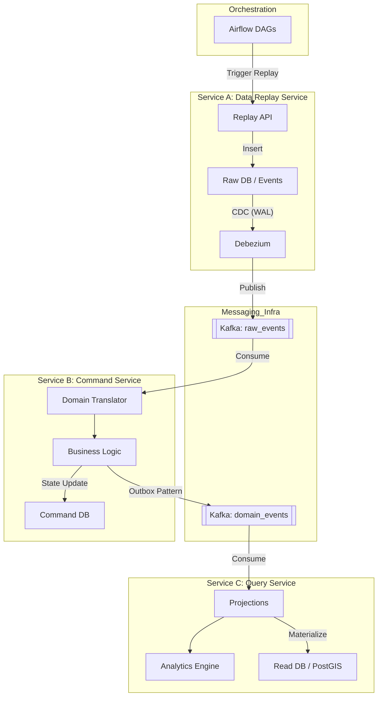

# Superhan fulfillment

## 1. 프로젝트 개요

본 프로젝트는 **Olist OMS(Order Management System)** 관점에서 과거 주문·배송 데이터를 분석하여 **고객 경험(CX)을 저해하는 병목과 비효율을 식별하고**,
이를 바탕으로 **운영 성능을 정량적으로 개선할 수 있는 인사이트와 기능 제안**을 도출하는 것을 목표로 합니다.

**과거의 주문 데이터를 리플레이(Replay)하여 물류/배송 시스템의 부하를 시뮬레이션하고, 스마트 라우팅 및 ETA(도착 예정 시간) 알고리즘을 최적화하는 인텔리전스 플랫폼입니다.**

도메인 로직은 CQRS를 기반으로 **Service B (Command/Logic)**, **Service C (Query/Analytics)** 로 구성하여 쓰기와 읽기 책임을 분리하여 확장에 유리하며 서버간 독립적인 최적화가 가능하도록 설계했습니다.

### 1.1. 프로젝트 방향 및 목적

> 데이터 시각화를 통한 Fulfillment 서비스 퀄리티 향상

olist dataset은 브라질 이커머스 서비스인 olist 스토어가 제공한 공개 데이터로 약 **100,000건의 주문(Order)** 이 포함되어 있으며, 주문 생성부터 배송 완료 및 리뷰까지의 전 과정을 추적할 수 있습니다.

데이터의 특징으로 셀러가 주문 발생이후 배송을 위한 물류 전송을 시작하기 때문에 사용자가 불편함을 느낄 정도로 지연 물건이 많았습니다. 이벤트 드리븐 아키텍처를 활용하여 지연의 문제점을 정확히 찾고 이를 시각화 함으로써 운영 인사이트를 확보하는 것을 1차적인 목표로 합니다.

나아가 재고 관리 시스템인 WMS 데이터를 추가적으로 설계하여 배송 기간을 단축 시키는 해결책까지 제안하고 WMS 도입 결과 서비스 퀄리티가 어느정도 향상되는지 피부로 느낄 수 있도록 타당성있게 데이터를 구체화하고 시각화 할 계획입니다.

또한 실제 OpenStreetMap 데이터 기반 브라질 도로 현형과 배송 루트 최적화를 통해 향상된 TMS 체계를 도입하는 것을 목적으로 합니다.

### 1.2. 사용 데이터 소개

Kaggle에서 제공하는 [Brazilian E-Commerce Public Dataset by Olist](https://www.kaggle.com/datasets/olistbr/brazilian-ecommerce) 데이터셋을 사용하며 이를 재구성하여 프로젝트를 진행했습니다.

| 파일 이름                            | 설명                                |
| ------------------------------------ | ----------------------------------- |
| **olist_orders_dataset.csv**         | 주문 단위의 상태 및 핵심 타임스탬프 |
| **olist_order_payments_dataset.csv** | 주문별 결제 정보                    |
| **olist_order_items_dataset.csv**    | 주문 내 상품 및 판매자 정보         |
| **olist_customers_dataset.csv**      | 고객 정보 및 위치                   |
| **olist_sellers_dataset.csv**        | 판매자 정보 및 위치                 |
| **olist_order_reviews_dataset.csv**  | 고객 리뷰 및 만족도                 |
| **olist_products_dataset.csv**       | 상품 정보                           |
| **olist_geolocation_dataset.csv**    | 우편번호 기반 위치 데이터           |

### 1.3. 주문·배송 플로우 정의 (OMS 관점)

다음은 실제 데이터 컬럼을 근거로 재구성한 **표준 주문 라이프사이클**입니다.

```
[ 주문 생성 (Order Created) ]
    ↓ order_purchase_timestamp

[ 결제 등록 (Payment Registered) ]
    ↳ payment_type
    ↳ payment_value

[ 결제 승인 (Payment Approved) ]
    ↓ order_approved_at

[ 셀러 처리 / 배송 준비 (Seller Fulfillment) ]
    ↓ order_delivered_carrier_date

[ 배송 완료 / 고객 수령 (Delivered to Customer) ]
    ↓ order_delivered_customer_date

[ 고객 리뷰 (Post-delivery Feedback) ]
    ↳ review_score
```

### 1.3.1 단계별 해석

- **주문 생성**: 고객이 결제를 시도한 최초 시점
- **결제 등록**: 실제 결제 수단·금액이 기록됨 (복수 결제 가능)
- **결제 승인**: PG 또는 금융기관 승인 완료 시점 → OMS 처리 시작 기준점
- **배송 준비**: 셀러가 상품을 포장하여 택배사에 인계한 시점 (OMS 핵심 성능 지표)
  - 셀러가 상품을 미리 택배사에 인계하여 재고를 미리 채워넣을 수 있는 시스템을 새롭게 구축
- **배송 완료**: 고객에게 실제 도착한 시점
- **리뷰**: 배송·상품·서비스 전반에 대한 결과 지표

### 1.4. 핵심 문제 영역(Pain Points) 가설

데이터를 통해 검증하고자 하는 OMS 관점의 문제는 다음과 같습니다.

- 1. 신뢰할 수 있는 배송시간 제공이 가능하도록 하려면 어떻게 해야하는가?
  - 1.1. 셀러별 배송 준비 시간 편차를 파악하고 배송 시간 편차를 줄여 균일한 품질의 배송 퀄리티를 낼 수 있도록 실태를 파악합니다.
  - 1.2. 배송 지연이 발생하는 단계를 파악합니다. 배송 지연구간이 셀러쪽인지 운송회사쪽인지 데이터 기반으로 식별합니다.

- 2. 상위랭커 셀러/루트 파악
  - 2.1. 빠른 배송 이력이 있는 셀러/루트와 루트 랭킹을 관리하여 상위랭커들이 제품 등록시 상위에 노출시켜 공정한 경쟁을 유도할 때 사용합니다.
  - 2.2. 주문이 들어오면 빠른 루트로 추천 서비스를 사내 서비스로 구축하다.

- 3. 고객 만족도는 배송 속도·예측 정확도와 강한 상관관계가 있는지 식별합니다.

---

## 2. 전체 아키텍처 (Architecture Overview)

아키텍처는 **MSA(Microservices Architecture)** 기반으로 설계되었으며, 데이터의 흐름을 제어 및 시각화 하기위해 Airflow를 활용하여 **Service A (Source/Replay)** 서버와 상호작용을 통해 데이터 Replay를 통해 분석 및 지속적인 테스트가 가능한 도구를 설계했습니다.



---

## 3. 서비스별 상세 역할

### 3.1. Service A: Data Replay Service (Source)

**역할:** 과거의 CSV 데이터를 실제 운영 트래픽처럼 시뮬레이션하여 시스템에 주입합니다.

- **주요 기능:**
  - **Airflow DAG:** CSV 파일을 읽어 시간 흐름에 맞춰 API 호출 (Init/Replay 모드).
  - **Raw Data 적재:** `raw_order_data`에 원본 데이터 보관.
  - **Event Sourcing (Source):** `events` 테이블에 리플레이 이벤트를 INSERT.
  - **CDC (Debezium):** `events` 테이블의 변경사항을 감지하여 Kafka `raw_events` 토픽으로 발행.
- **핵심 문서:**
  - `service-a/service_a_development_guide.md` (개발 가이드)
  - `service-a/airflow_dag_design.md` (DAG 설계)

### 3.2. Service B: Command Service (Logic)

**역할:** Raw Event를 비즈니스 의미가 담긴 Domain Event로 변환하고, 트랜잭션을 처리합니다.

- **주요 기능:**
  - **Domain Translation:** `raw_events`를 수신하여 `OrderPlaced`, `OrderApproved` 등으로 변환.
  - **비즈니스 로직:** 재고(Inventory) 확인/차감, 주문 상태(Aggregates) 관리.
  - **멱등성 보장:** `processed_events`를 통해 중복 처리 방지.
  - **Outbox Pattern:** 트랜잭션 성공 시 `outbox` 테이블에 이벤트를 저장하고, 별도 프로세서가 Kafka `domain_events`로 발행.
- **핵심 문서:**
  - `service-b/service_b_data_usage.md` (데이터 활용 흐름)
  - `service-b/service_b_Domain Event Translator_detailed_specification.md` (상세 명세)

### 3.3. Service C: Query & Analytics Service (Read)

**역할:** Domain Event를 소비하여 조회 전용 뷰(Projection)를 생성하고 실시간 분석을 수행합니다.

- **주요 기능:**
  - **Projections:** 복잡한 조인을 미리 계산하여 `order_projections` 테이블(비정규화)에 저장.
  - **Routing & ETA:** PostGIS를 활용한 경로 분석 및 예상 도착 시간 산출.
  - **Analytics:** 셀러 성과(`seller_performance`), 경로 통계(`route_statistics`) 집계.
  - **Simulation Comparison:** 리플레이 결과(As-Is vs To-Be) 비교 분석.
- **핵심 문서:**
  - `service-c/service_c_detailed_specification.md` (상세 명세)

---

## 4. 데이터 흐름 (End-to-End Data Flow)

1. **Ingestion (Airflow -> Service A)**
   - Airflow가 Olist CSV를 읽어 Service A API 호출.
   - Service A는 `raw_order_data`에 저장 후, 시뮬레이션 속도에 맞춰 `events` 테이블에 INSERT.
2. **Streaming (Service A -> Kafka -> Service B)**
   - Debezium이 `events` 테이블의 INSERT를 감지하여 `raw_events` 토픽 발행.
   - Service B가 이를 소비하여 유효성 검증(재고, 상태 전이) 수행.
3. **Processing (Service B)**
   - 검증 통과 시 `aggregates`(주문 상태) 및 `inventory`(재고) 업데이트.
   - `outbox` 테이블에 도메인 이벤트 기록 후 `domain_events` 토픽 발행.
4. **Analytics (Service B -> Kafka -> Service C)**
   - Service C가 `domain_events`를 소비.
   - `order_projections` 테이블 갱신 (CQRS).
   - 실시간 메트릭(지연율, 배송 시간) 계산하여 대시보드 제공.

---

## 5. 프로젝트 로드맵 (Roadmap)

- **Phase 1: Foundation**
  - Service A/B/C 기본 구조 설계.
  - Airflow -> DB -> CDC 파이프라인 설계.
- **Phase 2: Implementation**
  - Service A API 및 Airflow DAG 구현.
  - Service B 도메인 로직 및 Outbox 구현.
  - Service C Projection 스키마 구현.
- **Phase 3: Optimization**
  - PostGIS 기반 라우팅 알고리즘 고도화.
  - 대용량 리플레이 시 성능 튜닝 (Kafka Partitioning, DB Indexing).
- **Phase 4: Feedback Loop**
  - 실제 배송 결과(Service C)를 기반으로 ETA 알고리즘 자동 보정.
