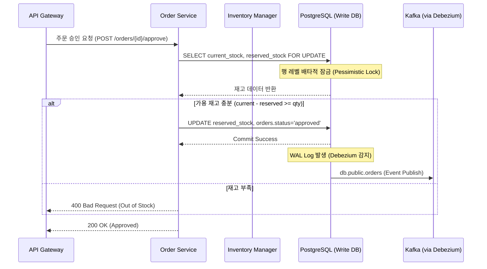

# [Project] 서비스명: OMS & WMS 통합 지능형 라우팅 시스템 (Smart Fulfillment)

데이터 기반 OMS와 WMS를 통해 제품의 재고를 관리하며, 셀러의 랭킹을 및 주문시 가장 적합한 셀러를 찾아 배송 기간을 줄이고 고객 경험을 향상시키는 것을 목표로 한다.

# 목차

1. 셀러 랭킹 시스템
   - 1단계: 배송 준비 시간의 통계적 정규화 ($Z-Score$)
   - 2단계: 최종 랭킹 점수 산출 ($Score$)

2. 재고 관리 시스템

# 1. 랭킹 시스템

## 1.1. 셀러 랭킹 산출 메커니즘

### 1단계: 배송 준비 시간의 통계적 정규화 ($Z-Score$)

특정 셀러의 배송 준비 속도가 평소보다 얼마나 지연되었는지, 다른 셀러들에 비해 얼마나 신뢰할 수 있는지 판단

$$Z = \frac{T_{actual} - \mu}{\sigma}$$

- $T_{actual}$: 이번 주문의 실제 처리 시간 (Approved to Carrier)
- $\mu$: 해당 셀러의 과거 평균 처리 시간 (Mean)
- $\sigma$: 해당 셀러의 처리 시간 표준편차 (Standard Deviation)

[판단 기준]

- $Z \le 1.0$: 매우 안정적 (정상 범위)
- $1.0 < Z < 2.0$: 지연 징후 발생 (주의)
- $Z \ge 2.0$: 심각한 지연 발생 (랭킹 강등 및 알림)

### 2단계: 최종 랭킹 점수 산출 ($Score$)

라우팅시 우선순위를 산정하는 가중치를 랭킹 점수로 사용한다.

- $R_{delivery}$: 최근 30일 배송 성공률 (0~100)
- $R_{review}$: 평균 고객 리뷰 점수 (1~5점)
- $P_{delay}$: $Z-Score$ 기반의 지연 페널티 점수
- $W_{1,2,3}$: 시스템 운영 정책에 따른 가중치 (Weights)

---

# 2. 상세 기능 목록 (Query Service - Seller Intelligence)

| 기능명                       | 설명                                                 | 데이터 소스              |
| ---------------------------- | ---------------------------------------------------- | ------------------------ |
| Performance Stats Aggregator | 매일 자정 또는 실시간으로 셀러별 μ,σ 재계산          | olist_orders_sync        |
| Real-time Z-Scoring          | CDC로 유입된 배송 시작 이벤트를 즉시 Z−Score 분석    | db.public.orders         |
| Seller Tiering               | Score를 기준으로 셀러를 Tier 1 ~ 4로 분류            | seller_performance_stats |
| Penalty Management           | 지연이 잦은 셀러에게 가중 페널티 부여 및 라우팅 제외 | delivery_delay_alerts    |

---

# 3. 실시간 통계 및 랭킹 반영 로직

셀러의 통계를 업데이트하고 랭킹을 산출하는 쿼리 구조입니다.

## 3.1. 셀러별 통계량(Mean, StdDev) 업데이트

```sql
-- 배송 완료 이벤트를 기반으로 셀러별 통계 정보 갱신 (Materialized View 또는 별도 Table)
UPDATE seller_performance_stats s
SET
    mu_prep_time_hrs = sub.avg_time,
    sigma_prep_time_hrs = sub.stddev_time,
    total_orders_analyzed = sub.order_count,
    last_computed_at = CURRENT_TIMESTAMP
FROM (
    SELECT
        seller_id,
        AVG(EXTRACT(EPOCH FROM (order_delivered_carrier_date - order_approved_at))/3600) as avg_time,
        STDDEV(EXTRACT(EPOCH FROM (order_delivered_carrier_date - order_approved_at))/3600) as stddev_time,
        COUNT(*) as order_count
    FROM olist_orders_sync
    WHERE order_status = 'shipped' OR order_status = 'delivered'
    GROUP BY seller_id
) sub
WHERE s.seller_id = sub.seller_id;

```

## 3.2. 라우팅용 랭킹 뷰 생성

시스템이 주문을 받았을 때 어떤 셀러에게 주문을 배정하는 것이 최적인가 판단하기위 한 뷰 테이블입니다.

주문 거리에서 가깝고 배송이 빠르고 고객 만족도가 높은 셀러를 뽑아내기 위한 쿼리.
셀러의 랭킹 산정시 사용한다.

```sql
CREATE OR REPLACE VIEW v_seller_routing_priority AS
SELECT
    s.seller_id,
    s.seller_zip_code_prefix,
    -- 랭킹 점수 수식 구현 (성공률 + 리뷰점수 - 지연페널티)
    (COALESCE(stat.reliability_score, 0) * 0.5 +
     COALESCE(rev.avg_score, 0) * 10 -
     CASE WHEN stat.mu_prep_time_hrs > 48 THEN 20 ELSE 0 END) as final_priority_score
FROM olist_sellers s
LEFT JOIN seller_performance_stats stat ON s.seller_id = stat.seller_id
LEFT JOIN (
    SELECT seller_id, AVG(review_score) as avg_score
    FROM olist_order_reviews_sync
    GROUP BY seller_id
) rev ON s.seller_id = rev.seller_id;

```

## 3.3. 반경 50km이내 셀러중 랭킹이 높은 셀러 찾는 쿼리

실시간 매칭시 주문이 들어왔을 때 가장 가까운 셀러중 랭킹 점수가 높은 셀러를 찾는 로직

```sql

-- Server C (Query Side)에서 실행
SELECT
    v.seller_id,
    v.final_priority_score,
    -- PostGIS 함수: 두 지점 사이의 실제 거리(m) 계산
    ST_Distance(
        customer_loc.geom_point,
        seller_loc.geom_point
    ) AS distance_meters
FROM v_seller_routing_priority v
JOIN olist_geolocation seller_loc ON v.seller_zip_code_prefix = seller_loc.geolocation_zip_code_prefix
CROSS JOIN (
    -- 현재 주문한 고객의 위치 (예시 우편번호: 01001)
    SELECT geom_point FROM olist_geolocation WHERE geolocation_zip_code_prefix = 01001 LIMIT 1
) customer_loc
WHERE
    -- PostGIS 함수: 반경 50km 이내 셀러만 필터링 (인덱스 활용)
    ST_DWithin(customer_loc.geom_point, seller_loc.geom_point, 50000)
ORDER BY
    v.final_priority_score DESC, -- 1순위: 셀러 랭킹 점수
    distance_meters ASC           -- 2순위: 거리 가깝기
LIMIT 5;
```

---

# 2. 재고 관리 시스템

## 1. 상세 기능 목록 (Functional Specifications)

| 대분류           | 소분류           | 상세 설명                                                                    |
| ---------------- | ---------------- | ---------------------------------------------------------------------------- |
| Order Management | 주문 상태 전이   | 결제 승인(approved) → 출고 준비(processing) → 배송사 인계(shipped) 흐름 제어 |
|                  | 트랜잭션 관리    | 주문 생성과 재고 예약이 원자적(Atomic)으로 처리되도록 보장                   |
| Inventory (WMS)  | 실시간 재고 예약 | 결제 승인 시 즉시 reserved_stock 증가 및 가용 재고 체크                      |
|                  | 재고 확정 차감   | 배송사 인계(carrier_delivered) 시 current_stock과 reserved_stock 동시 차감   |
|                  | 안전 재고 알림   | 가용 재고가 safety_stock 미만일 경우 Reorder 이벤트 발행                     |
| Event Pipeline   | CDC 이벤트 생성  | DB WAL(Write Ahead Log)을 통해 변경 이벤트를 Kafka로 무손실 전달             |
|                  | 스냅샷 제공      | 신규 서비스 투입 시 현재 시점의 재고/주문 마스터 데이터 스냅샷 생성          |
|                  |                  |                                                                              |

## 2. 데이터 처리 로직 및 수식 (Command Side)

Command Service에서 가장 중요한 로직은 **가용 재고(Available Stock)**의 계산과 무결성 보호입니다.

### 2.1. 가용 재고 계산 수식

주문 가능 여부를 판단할 때 사용하는 가용 재고는 다음과 같이 정의합니다.

> $$S*{available} = S*{current} - S\_{reserved}

- $S_{current}$ : 창고에 실제로 있는 물리적 재고 (Current Stock)

- $S_{reserved}$: 주문은 되었으나 아직 택배사에 인계되지 않은 예약 재고 (Reserved Stock)

### 2.2. 재고 예약 조건 (Reservation Logic)

주문 상품의 수량을 $Q_{order}$라고 할 때, 다음 조건을 만족해야 트랜잭션이 성공합니다.

> $$\text{If } (S_{available} \ge Q_{order}) \text{ then Proceed, else Reject}$$

[상태 업데이트]예약 성공 시, 예약 재고 수량을 업데이트합니다.

> $$S_{reserved\_new} = S_{reserved\_old} + Q_{order}$$

### 2.3. 재고 확정 차감 (Fulfillment Logic)

셀러가 상품을 포장하여 택배사 인계($T_{carrier}$)가 완료된 시점에는 물리적 재고와 예약 재고를 동시에 차감합니다.

[상태 업데이트]

> $$S*{current_new} = S*{current_old} - Q\_{order}

> $$S*{reserved_new} = S*{reserved_old} - Q\_{order}$$

## 3. 핵심 시퀀스 다이어그램: 재고 예약 로직



## 데이터 기반 자동 재발주 엔진

단순히 재고가 0일 때 주문하는 것이 아니라, 과거의 판매 트렌드와 배송 리드타임을 분석하여 최적의 시점에 재고를 확보합니다.

- 구현 내용: \* Dynamic Reorder Point: 과거 리플레이 데이터를 통해 상품별 주간 판매 속도(Velocity)를 계산.
  - 자동 주문: $재고 \le (판매\ 속도 \times 셀러\ 리드타임) + 안전\ 재고$ 수식에 도달하면 자동으로 공급사에 발주 요청.
- 가치: 품절로 인한 판매 기회 손실(Opportunity Cost)을 최소화합니다.

# 4. 예외 처리

## 1. 주문 취소 및 환불이 따른 보상 트랜잭션

사용자가 결제 후 마음을 바꿔 취소했을 때, reserved_stock을 다시 가용 재고로 돌려놓는 로직입니다.

Kafka를 통해 'OrderCancelled' 이벤트를 받았을 때 Inventory Manager가 수행할 동작 정의합니다.

- 보완 수식:
  - $$S_{reserved\_new} = S_{reserved\_old} - Q_{cancel}$$

## 2. 가용 재고와 실제 재고의 '동기화(Adjustment)' 로직

관리 기능의 일부로 창고 현장(WMS)에서는 파손, 분실 등으로 인해 DB 상의 current_stock과 실제 선반 위의 재고가 다를 때가 많습니다. 때문에 물리적 재고 실사를 반영하는 재고 조정 인터페이스가 필요합니다.

- /api/v1/inventory/adjust 와 같은 API를 설계하여 재고 수치를 변경하고 이력을 남기는 기능을 설계합니다.
  - 재고 실사 이력 테이블: inventory_adjustment_logs (누가, 언제, 왜 변경했는가).

## 3. '콜드 스타트(Cold Start)' 및 데이터 부족 셀러 처리

신규 셀러는 과거 데이터($\mu, \sigma$)가 없어 $Z-Score$ 계산이 불가능하거나 랭킹에서 무조건 불리해질 수 있습니다.

신입 셀러가 시스템에 진입할 수 있는 '뉴비(Newbie) 버프' 개념을 설계하여 신규 셀러에게 기회가 갈 수 있도록 한다.

설계 필요:데이터가 임계치(예: 주문 10건) 미만인 셀러에게는 카테고리 전체 평균($\mu_{total}$)을 부여하거나 고정된 랭킹 점수를 할당하는 로직.
