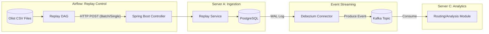

# 물류 네트워크 시뮬레이터 (Logistic Replay Simulator)

데이터를 읽어 시스템으로 흘려보내고 초기 데이터를 시각화해 비즈니스 인사이트를 얻을 수 있는 데이터를 추출하는데 사용합니다.

olist 데이터를 시스템으로 주입하는 주입구 역할을 하며 데이터를 분석하여 주문에 대한 정보들이 어느 지역에 집중되어있는지 또는 분산되어있는지 확인하는 시각화를 함께 할 수 있도록 합니다.

또한 현재 데이터가 어디로 보내지는지도 시각화할 수 있도록 데이터를 추출합니다.

이를 위해 olist 데이터를 가상 시스템에 '리플레이'하여, 특정 정책 변경 시 어떤 결과가 나올지 미리 시뮬레이션합니다.

## 1. 데이터 리플레이 전체 흐름도



## 2. 모듈별 필요 기능 및 설계

### 2.1. Airflow: Replay DAG (데이터 송신부)

과거 데이터를 읽어 정해진 속도나 로직에 따라 Spring Boot로 밀어넣는 역할을 합니다.

- 주요 기능:
  - CSV Chunk Reader: 대용량 CSV(예: olist_orders_dataset.csv)를 한 번에 메모리에 올리지 않고 분할하여 읽는 기능.

  - Rate Limiter (초당 요청 제어): 실제 운영 환경과 유사한 부하를 주기 위해 API 호출 간격을 조절하는 기능.

  - Time Simulation: 과거의 주문 시각(order_purchase_timestamp)을 현재 시점의 상대적 시간으로 변환하여 전송하는 로직.

- 사용 Operator:
  - PythonOperator: CSV 로드 및 데이터 전처리(Pandas 활용).
  - SimpleHttpOperator 또는 PythonOperator(requests) : Spring Boot API 호출.

리플레이를 한다는것은 버전을 나누겠다는 의미이며 하나의 버전별로 다른 프로젝션 스냅샷이 발생한다는 의미가 됩니다. 때문에 데이터를 송신하는 쪽에서 새로운 이벤트를 생성해서 관리해야합니다.

airflow에서 리플레이를 진행할때 event id를 발급하고 events api를 사용하여 새로운 이벤트를 등록합니다. 이벤트를 등록을 요청하면 등록된 이벤트는 테이블에 insert되어 관리되고 응답을 받은 후에 csv파일을 읽어 서버로 전송합니다.

### 2.1.1. 구현 상세

#### Step 1: Airflow - 시간 시뮬레이션 및 데이터 송신 (DAG)

과거의 주문 시간(order_purchase_timestamp)과 현재 시점의 간격(Offset)을 계산하여 리플레이 속도를 조절해야 합니다.

- Time Shift 로직: 과거 2017년의 주문을 현재 2026년에 리플레이한다면, 현재 시간과의 차이를 계산하여 상대적 간격을 두고 API를 호출합니다.
  - 수식 예시: $T_{call} = T_{now} + (T_{historical\_order} - T_{historical\_start})$
- 구현 방식 (Python): pandas로 CSV를 읽고, requests 라이브러리로 Server A에 데이터를 전송합니다.

```python
# Airflow DAG의 핵심 로직 예시
def replay_logic():
    df = pd.read_csv('olist_orders.csv').sort_values('order_purchase_timestamp')
    start_time = pd.to_datetime(df['order_purchase_timestamp'].min())

    for _, row in df.iterrows():
        # 과거 데이터의 발생 간격을 시뮬레이션 (선택 사항)
        # current_order_time = pd.to_datetime(row['order_purchase_timestamp'])
        # wait_time = (current_order_time - start_time).total_seconds() / speed_factor
        # time.sleep(wait_time)

        requests.post("http://server-a/api/v1/replay/orders", json=row.to_dict())
```

### 2.2. Spring Boot: Ingestion API (데이터 수신부)

#### 2.2.1. 전체 API 목록

- GET /replay-jobs/{replay_job_id}
  - 진행 상태 조회용 API
- POST /replay-jobs
  - Replay Job 생성 API
    - 리플레이 job 생성 시 요청
- POST /replay-jobs/{replay_job_id}/run
  - Replay 실행 (CSV → Event INSERT) API
    - CSV 파싱
    - event_id deterministic 생성
    - PostgreSQL events 테이블에 INSERT
    - CDC가 Kafka로 전파
- POST /replay-jobs/{replay_job_id}/pause
  - 중단용 API
    - 진행 중인 job을 중단할 때 사용하는 API
    - replay_job 상태를 pause 으로 변경
- POST /replay-jobs/{replay_job_id}/resume
  - 재개 용 API
    - 진행 중인 job을 재개할 때 사용하는 API
    - replay_job 상태를 resume 으로 변경
- POST /replay-jobs/{replay_job_id}/cancel
  - 취소용 API

#### 2.2.3. CRUD 테이블

| API                        | replay_jobs | csv_ingest_offsets | events      |
| -------------------------- | ----------- | ------------------ | ----------- |
| POST /replay-jobs          | W           | -                  | -           |
| GET /replay-jobs/{id}      | R           | -                  | -           |
| POST /replay-jobs/{id}/run | R/W         | R/W                | **W (CDC)** |
| POST /pause                | R/W         | -                  | -           |
| POST /resume               | R/W         | R                  | -           |
| POST /cancel               | R/W         | -                  | -           |
| GET /events-summary        | -           | -                  | R           |

#### 2.2.4. DTO 설계

```json
{
  "replay_job_id": "String(UUID)",
  "event_version": "Integer",
  "source": "String", // “olist_csv.csv”
  "time_range": {
    "from": "2017-01-01",
    "to": "2018-01-01"
  },
  "speed": "REALTIME | FAST_FORWARD",
  "status": "CREATED | RUNNING | PAUSE | RESUME"
}
```

## 3. DB 테이블 설계

### 3.1. replay_jobs (컨트롤 플레인)

```sql
CREATE TABLE replay_jobs (
    replay_job_id VARCHAR(50) PRIMARY KEY,
    source VARCHAR(30),
    event_version INT,

    from_time TIMESTAMP,
    to_time TIMESTAMP,

    speed VARCHAR(20), -- REALTIME / FAST_FORWARD
    status VARCHAR(20), -- CREATED / RUNNING / PAUSED / DONE / FAILED

    processed_rows BIGINT,
    last_processed_at TIMESTAMP,

    created_at TIMESTAMP DEFAULT now(),
    updated_at TIMESTAMP DEFAULT now()
);
```

> 절대 CDC 대상 아님

### 3.2. events (핵심, CDC 대상)

```sql
CREATE TABLE events (
    event_id UUID PRIMARY KEY,

    aggregate_type VARCHAR(30),
    aggregate_id VARCHAR(50),
    event_type VARCHAR(50),

    payload JSONB,

    occurred_at TIMESTAMP,
    event_version INT,
    replay_job_id VARCHAR(50),

    created_at TIMESTAMP DEFAULT now()
);
```

규칙:

- INSERT ONLY
- UPDATE / DELETE 금지
- CDC는 이 테이블만 물림

### 3.3. csv_ingest_offsets

중단 / 재시작을 위한 커서 테이블

- [기능]
  - 장애 후 resume
  - 병렬 CSV 처리
  - DAG 재실행 안전

```sql
CREATE TABLE csv_ingest_offsets (
    replay_job_id VARCHAR(50),
    csv_file VARCHAR(255),
    last_line BIGINT,

    PRIMARY KEY (replay_job_id, csv_file)
);
```

## 4. 전체 흐름 정리

> Event Simulator API의 단위는 “CSV”가 아니라 “시간을 가진 하나의 세계(Re-play Job)”다.

```
Airflow
  → POST /replay-jobs
  → POST /replay-jobs/{id}/run

Event Simulator
  → CSV 읽기
  → Event Mapper (v2)
  → INSERT events

PostgreSQL
  → WAL

Debezium
  → Kafka

Service C
  → Projection

```

## 5. 데이터 시각화 (추후 진행)

mapgl + grafana를 사용해서 현재 주문 데이터를 시각화 하여 사용자의 위치와 도착지를 시각화 할 수 있도록 합니다.

mapgl은 네트워크 메트릭을 활용하여 데이터 통신이 어디에서 오고 갔는지 시각화할 수 있는 라이브러리이며 좌표 체계를 활용해서도 출발지와 도착지가 있다면 이와같은 처리가 기능한 라이브러리이다. 이를 활용하여 셀러의 위치, 고객의 위치를 시각화하고 OMS 에 인사이트를 얻을 수 있는 시각화가 가능하다.

[효과]

1. 어느 지역에 주문이 몰려있는지 파악
   - 어느 지역에서 어떤 상품들이 판매되었는지 파악 가능
2. 셀러가 몰려있는 지역은 어디인지 파악
