# Service B 개요

Service B는 Service A에서 발생하는 CDC이후 Service C 로 가기 전 중간에서 발생하는 이벤트를 재해석 하는 서비스입니다.

## CDC 이후 전체 흐름

```mermaid
flowchart LR
    %% ======================
    %% External Source
    %% ======================
    CSV[("CSV Raw Data\n(Object Storage)")]

    %% ======================
    %% Service A
    %% ======================
    subgraph SA["Service A - Ingest / Event Simulator"]
        Airflow["Airflow\n(Replay Orchestration)"]
        ES["Event Simulator API\n- CSV Reader\n- Event Mapper (v1,v2)\n- Idempotency"]
        Airflow -->|Trigger Replay| ES
    end

    %% ======================
    %% Event Store
    %% ======================
    subgraph DB1["PostgreSQL - Event Store"]
        Events["events\n(append-only)"]
        Replay["replay_jobs"]
        Offsets["csv_offsets"]
    end

    %% ======================
    %% CDC & Kafka
    %% ======================
    CDC["CDC (Debezium)"]
    KafkaRaw["Kafka Topic\nraw_events"]

    %% ======================
    %% Service B
    %% ======================
    subgraph SB["Service B - Command / Domain"]
        ConsumerB["CDC Consumer"]
        Translator["Event Translator\nRaw → Domain Candidate"]
        Validator["Domain Validator\n(Aggregate Logic)"]
        CommandDB["Command DB\n- aggregates\n- processed_events\n- outbox"]
    end

    KafkaDomain["Kafka Topic\ndomain_events"]

    %% ======================
    %% Service C
    %% ======================
    subgraph SC["Service C - Read / Projection"]
        ConsumerC["Domain Event Consumer"]
        Projections["Projection Engines\n- Order Status\n- Seller Performance\n- Route ETA"]
        ReadDB["Read DB\nProjection Tables"]
    end

    %% ======================
    %% Flow
    %% ======================
    CSV --> ES
    ES -->|INSERT| Events
    ES --> Replay
    ES --> Offsets

    Events --> CDC --> KafkaRaw

    KafkaRaw --> ConsumerB
    ConsumerB --> Translator --> Validator --> CommandDB
    CommandDB --> KafkaDomain

    KafkaDomain --> ConsumerC
    ConsumerC --> Projections --> ReadDB

```

# Service B 주요 기능 목록

## 1. 이벤트 수신 및 기본 제어 (Ingestion Control)

### 1.1. CDC Consumer
- Kafka `raw_events` 토픽 구독
- Key 기준 순서 보장
- Offset Commit 제어 (At-least-once를 통한 Exactly-once 유사 패턴 구현)

### 1.2. 이벤트 메타데이터 검증
- `event_id` 존재 여부 확인
- `event_version` 지원 여부 확인
- Source (CSV / Replay / Prod) 식별
- `replay_id` 포함 여부 확인

## 2. 이벤트 변환 (Event Transformation)

### 2.1. Event Translator
- Raw Event(JSON)를 Domain Event Candidate로 변환
- CSV 스키마 변경 대응 및 이벤트 버전별 매핑 로직 분리 (예: OrderPlacedV1, OrderPlacedV2)
- 불필요한 Raw 필드 제거
- **참고**: "Raw Event는 사실을, Domain Event는 해석된 의미를 담음"

## 3. 도메인 판단 및 검증 (Domain Logic)

### 3.1. Aggregate Loader
- Aggregate Root 조회
- 최초 이벤트인 경우 신규 생성
- `aggregate_id` 기준 로딩

### 3.2. Domain Validation
- 상태 전이 검증 (예: CREATED → SHIPPED → DELIVERED)
- 중복 이벤트 방지 및 Out-of-order 이벤트 처리 정책 적용
- 시간 역행 이벤트 무시 또는 보정

### 3.3. Business Rule Enforcement
- SLA 위반 판단
- 비정상 배송 감지
- 취소/반품 조건 판정
- 경로 변경 가능 여부 판단

## 4. 멱등성 및 신뢰성 보장 (Reliability)

### 4.1. Processed Event Registry
- 이미 처리한 `event_id` 기록을 통한 재처리 방지
- CDC 재전송 대응

### 4.2. Exactly-once 유사 처리
- Aggregate 업데이트와 Outbox 저장을 단일 트랜잭션으로 처리
- Kafka 중복 소비 대비

## 5. 상태 저장 (Command DB)

### 5.1. Aggregate State Management
- 현재 도메인 상태 저장
- 검증을 위한 최소 상태만 유지 (조회용 Projection은 별도 분리)

### 5.2. Domain Event Outbox
- 검증된 Domain Event 저장
- 향후 Kafka Publish 대상 관리

## 6. 이벤트 발행 (Domain Event Publishing)

### 6.1. Domain Event Publisher
- Outbox 데이터를 Kafka `domain_events` 토픽으로 발행
- 발행 성공 시 Outbox 상태 변경
- 재시도 및 DLQ(Dead Letter Queue) 처리

## 7. 관측 및 운영 (Observability & Operations)

### 7.1. Replay Awareness
- `replay_id` 인식 및 전용 정책 적용
- 운영(Prod)과 실험(Experiment) 환경 분리

### 7.2. Metrics & Observability
- 처리 이벤트 수 및 지연 시간 모니터링
- Validation 실패율 추적
- Replay와 Prod 데이터 비율 분석

### 7.3. Dead Letter Handling
- 처리 불가 이벤트 보관 및 재처리 가능 구조 설계
