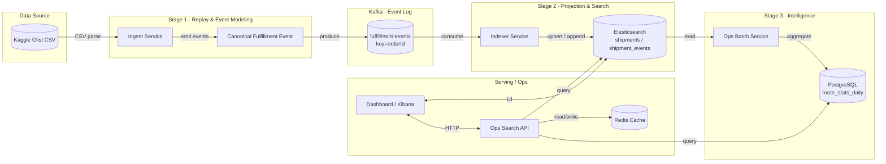
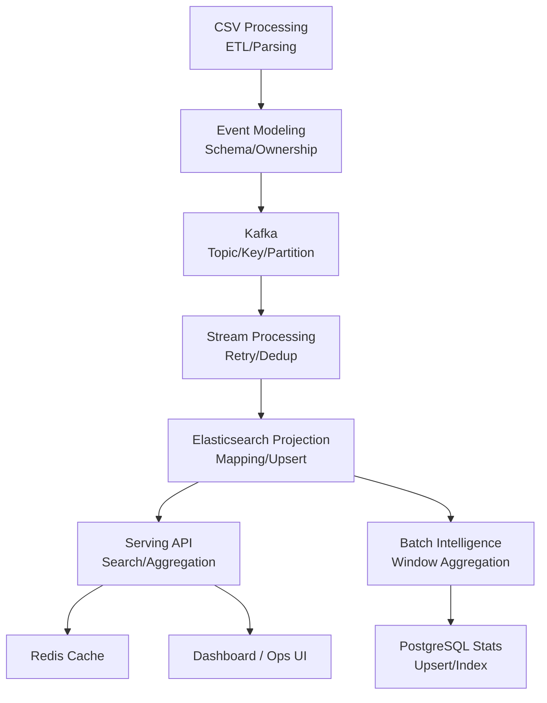

# 🏗 E-Commerce Intelligence Project (EIP)

데이터를 특정 시점까지 `Backfill`을 하고 시뮬레이터를 사용해 `SCALED TIME Replay`를 진행함으로써 데이터의 흐름을 관측할 수 있는 observability를 완성한다.

# 시뮬레이터의 기능

1. Fast backfill
2. SCALED TIME Replay (시뮬레이션)
3. WINDOW Backfill (범위)

## 데이터 교환 중심 아키텍처 (Stage 1~3 · OMS/WMS/TMS Fulfillment)

본 문서는 **데이터가 어떻게 흐르는지(data exchange)** 를 기준으로  
EIP(Stage 1~3)의 전체 아키텍처를 설명한다.

핵심 관점:

- 어떤 데이터가
- 어떤 계약(Contract)으로
- 어떤 서비스/기술 스택 사이를 이동하는가

---

## 1. 전체 아키텍처 (데이터 교환 중심)



---

## 2. 스킬셋 기준 데이터 흐름 맵

> “어떤 기술을 왜 쓰는지”를 데이터 흐름으로 정리



---

## 3. 데이터 교환 계약(Contract) 요약

| From → To       | 교환 데이터         | 형태        | 핵심 스킬셋                 |
| --------------- | ------------------- | ----------- | --------------------------- |
| CSV → Ingest    | Olist rows          | File/Stream | ETL, Parsing                |
| Ingest → Kafka  | FulfillmentEvent v1 | Kafka Msg   | Event modeling, Idempotency |
| Kafka → Indexer | FulfillmentEvent v1 | Consumer    | Retry, Dedup                |
| Indexer → ES    | Projection          | ES Bulk     | Mapping, Partial update     |
| ES → Batch      | Aggregation input   | ES Agg      | Time-window agg             |
| Batch → PG      | route_stats_daily   | SQL         | Schema/Index                |
| Ops API → ES    | Search/Agg          | DSL         | Query tuning                |
| Ops API ↔ Redis | Cache               | KV          | TTL strategy                |
| Ops API → UI    | JSON                | HTTP        | API design                  |

---

## 4. Canonical Fulfillment Event Contract (v1)

```json
{
  "eventId": "hash(orderId + eventType + eventAt)",
  "eventType": "ORDER_PLACED | ORDER_APPROVED | WAREHOUSE_ASSIGNED | HANDED_TO_CARRIER | DELIVERED | DELIVERY_DELAYED",
  "eventAt": "2020-01-01T10:00:00Z",
  "orderId": "string",
  "source": "OMS | WMS | TMS",
  "sellerRegion": "SP",
  "customerRegion": "RJ",
  "payload": {
    "estimatedDeliveryAt": "datetime|null"
  }
}
```

---

## 5. Kafka Topic 설계 옵션

### 옵션 A — 단일 토픽 (학습 최적)

- topic: fulfillment-events
- key: orderId
- source 필드로 OMS/WMS/TMS 구분

### 옵션 B — 도메인별 토픽 (실무형)

- oms-events
- wms-events
- tms-events
- Indexer가 fan-in

---

## 6. Elasticsearch Projection 개요

### shipments (Fulfillment Case Card)

- orderId
- currentStatus
- orderedAt / approvedAt / handoffAt / deliveredAt
- durations (lead time)
- isLate
- sellerRegion / customerRegion

### shipment_events (Timeline)

- orderId
- eventType
- eventAt
- source

---

## 7. 왜 이 구조가 중요한가

- Kafka는 **사실의 기록**
- Elasticsearch는 **보여주기 위한 결과**
- Batch/RDB는 **판단 근거**
- 모든 계층은 **Replay 가능성**을 전제로 설계

---

## 8. 포트폴리오 요약 문장

> Fulfillment 이벤트 스트림을 중심으로  
> CSV → Kafka → Elasticsearch Projection → KPI Batch → Ops Search까지  
> 데이터 교환 기준의 아키텍처를 설계·구현했다.
