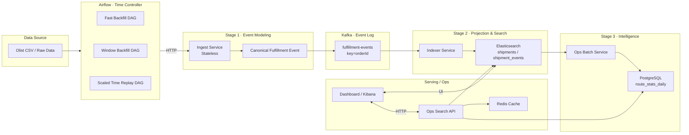

# 🏗 E-Commerce Intelligence Project EIP

본 문서는 **CSV / Raw Data 기반 Fulfillment 데이터를 Airflow를 통해 시간 제어Time Control된 이벤트 스트림으로 재생성**하고,
Kafka–Search–Batch 전 구간에서 **Backfill / Replay / Observability** 를 달성하기 위한 아키텍처를 설명한다.

핵심 변경 사항:

> **CSV → Ingest 직접 호출 구조를 제거하고, Airflow를 Time Controller로 승격하여 Backfill·Replay를 오케스트레이션한다.**

airflow 오케스트레이션으로 변경한 이유는 단순히 데이터를 밀어넣는것 뿐만이 아닌 다양한 시나리오에 따른 이벤트를 재현하고 구축될 파이프라인으로 backfill하면서 이벤트의 흐름을 파악하고 인사이트를 얻을 수 있는 데이터를 구축하기 위한 목적을 가지고 선택하였다.

---

## 🎯 설계 목표

- Fast Backfill / Window Backfill / Scaled Time Replay 지원
- Canonical Event Contract 유지
- Kafka 이후Stage 2~3 아키텍처 무변경
- Replay 가능성을 전제로 한 Observability 확보

---

## 1. 변경된 전체 아키텍처 데이터 교환 중심



---

## 2. Stage 1 상세: Airflow 기반 Replay & Backfill

### Stage 1의 책임 분리

| 컴포넌트           | 책임                                            |
| ------------------ | ----------------------------------------------- |
| **Airflow**        | 시간/범위/속도 제어 언제·어디까지·얼마나 빠르게 |
| **Ingest Service** | Row → Canonical Event 변환                      |
| **Kafka**          | Immutable Fact Log                              |

---

### Airflow DAG 구성

```text
CSV / Raw Data
 ↓
Airflow
 ├─ Fast Backfill DAG
 ├─ Window Backfill DAG
 └─ Scaled Time Replay DAG
 ↓
Ingest Service
 ↓
Canonical Fulfillment Event
 ↓
Kafka
```

---

### 2.1 Fast Backfill DAG

- 목적: 대량 과거 데이터의 빠른 이벤트 생성
- 특징:

  - sleep 없음
  - eventAt은 원본 시간 유지
  - 최대 처리량

```text
for date in full_range:
  read CSV partition
  emit events ASAP
```

---

### 2.2 Window Backfill DAG

- 목적: 특정 기간만 재처리
- 사용 예:

  - 장애 구간 재계산
  - 로직 변경 영향 범위 최소화

```text
params:
  start_date
  end_date
```

---

### 2.3 Scaled Time Replay DAG ⭐

- 목적: 실시간과 유사한 트래픽 흐름 시뮬레이션
- 특징:

  - event time 간격 유지
  - scale factor 적용

```text
scaled_delay = event_time_delta / scale_factor
sleepscaled_delay
emitevent
```

---

## 3. 데이터 교환 계약 변경 없음

### Canonical Fulfillment Event v1

```json
{
  "eventId": "hashorderId + eventType + eventAt",
  "eventType": "ORDER_PLACED | ORDER_APPROVED | WAREHOUSE_ASSIGNED | HANDED_TO_CARRIER | DELIVERED | DELIVERY_DELAYED",
  "eventAt": "2020-01-01T10:00:00Z",
  "orderId": "string",
  "source": "OMS | WMS | TMS",
  "sellerRegion": "SP",
  "customerRegion": "RJ",
  "payload": {
    "estimatedDeliveryAt": "datetime|null"
  }
}
```

> **Airflow는 이벤트를 생성하지 않는다.**
> 이벤트 계약은 오직 Ingest Service가 소유한다.

---

## 4. Kafka 이후 Stage 무변경

- Stage 2: Indexer → Elasticsearch Projection
- Stage 3: Batch Aggregation → PostgreSQL KPI

Kafka 이후 모든 Consumer는 **Replay / Live 여부를 알 필요가 없다.**

---

## 5. Observability 관점 이점

- 동일 이벤트를 다양한 속도로 재생 가능
- Kafka lag / ES indexing latency 관측
- Peak traffic 시나리오 실험
- 장애 복구 시 정확한 재처리 가능

---

## 6. 설계 요약 문장

> CSV 기반 원천 데이터를 Airflow를 통해 시간 제어된 이벤트 스트림으로 재생성하고,
> 동일한 Canonical Event 계약을 유지한 채 Kafka–Search–Batch 전 구간의
> Backfill·Replay·Observability를 확보한 Fulfillment 이벤트 아키텍처를 설계·구현했다.

---

## 7. 핵심 설계 원칙 요약

- Airflow = Time Machine
- Ingest Service = Event Factory
- Kafka = Immutable Fact Log
- Elasticsearch = Serving View
- PostgreSQL = Decision Ground Truth

---

> 모든 계층은 **Replay 가능성**을 전제로 설계된다.
