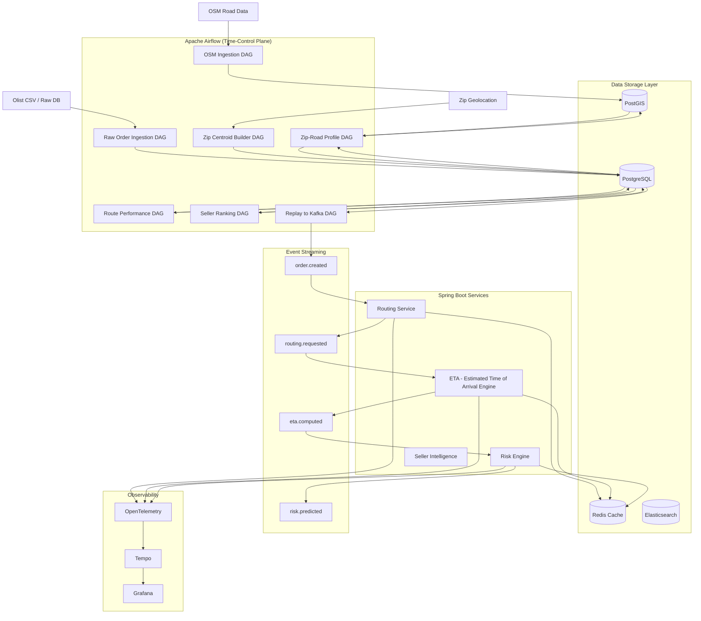

# [Project] Airflow 기반 데이터 Ingestion & Enrichment 아키텍처

## 1. Airflow의 역할 정의

이 시스템에서 Airflow는 단순한 ETL 도구가 아닙니다.

> ✅ **“과거 물류를 시간순 이벤트 스트림으로 재생성하는 컨트롤 타워”**

### Airflow가 담당하는 핵심 책임
- **외부 데이터 수집:** OSM(OpenStreetMap), CSV, Raw DB 등 이기종 데이터 통합.
- **정합성 검증 & 표준화:** 데이터 품질 관리.
- **Feature Engineering:** 도로/셀러/경로의 물리적 특성을 피처로 생성.
- **Serving Layer 갱신:** Routing Service가 조회할 Serving Table 및 Materialized View 갱신.
- **Event Replay:** Kafka로 과거 데이터를 이벤트 스트림으로 재생성 (Phase 2).

## 2. 데이터 소스 분류

### 2.1. 외부 / 정적 데이터
| 데이터 | 업데이트 주기 | 비고 |
| :--- | :--- | :--- |
| **OSM Road Data** | 월 1회 | PostGIS 적재 (도로망 그래프) |
| **Zip Geolocation** | 비정기 (거의 고정) | 우편번호 중심 좌표 |
| **셀러 메타** | 일 1회 | 셀러 상태 및 위치 변경 |

### 2.2. 운영 데이터
| 데이터 | 업데이트 주기 | 비고 |
| :--- | :--- | :--- |
| **Orders / Items** | 매시간 | 주문 및 상품 상세 정보 |
| **Reviews** | 매일 | 고객 만족도 및 불만 분석 |
| **Delivery Status** | Near-real-time | 배송 단계별 상태 (추후 연동) |

## 3. Airflow DAG 구성 전략

DAG를 역할별로 명확히 분리하여 **Backfill**, **재실행**, **모듈 교체**가 용이하도록 설계합니다.

```text
dags/
├─ ingestion/
│   ├─ ingest_osm_roads.py        # OSM 데이터 수집 및 가공
│   ├─ ingest_olist_raw.py        # Olist Raw 데이터 적재
│
├─ transform/
│   ├─ build_zip_centroids.py     # 우편번호 중심점 계산
│   ├─ build_zip_road_profile.py  # Zip-to-Zip 도로 특성 추출 (핵심)
│   ├─ build_route_performance.py # 경로별 성과 지표 집계
│
├─ serving/
│   ├─ refresh_seller_ranking.py      # 셀러 랭킹 MV 갱신
│   ├─ refresh_logistics_dashboard.py # 대시보드 데이터 갱신
│
└─ replay/
    ├─ replay_orders_to_kafka.py  # 과거 데이터 Kafka 이벤트 발행
```

## 4. 핵심 DAG 흐름 상세

### 4.1. OSM 도로 데이터 Ingestion DAG (`osm_road_ingestion_dag`)
- **Flow:** `OSM Extract` → `Geometry 정규화` → `PostGIS 적재` → `인덱스 생성`
- **Operators:** `BashOperator` (osmium 활용), `PostgresOperator`.

### 4.2. Zip-to-Zip Road Profile 생성 DAG (`zip_road_profile_builder_dag`) ⭐ 핵심
이 DAG는 전체 Smart Routing의 **물리적 근거(도로 품질 등)**를 생성합니다.
- **Task Flow:**
  1. `zip_centroids` 생성
  2. 실제 배송 경로 추출
  3. `ST_DWithin` 기반 도로 교차 분석
  4. 품질 지표(고속도로 비율, 비포장 비율 등) 계산
  5. `zip_road_profile` 테이블 Upsert

### 4.3. Seller Ranking 생성 DAG (`seller_ranking_dag`)
- **Task:** `mv_seller_ranking` Refresh (주간/일간 분리 가능).
- **특징:** 실패해도 Order Service에는 영향이 없는 **읽기 전용 Serving Table** 구조.

### 4.4. Kafka Replay DAG (`order_replay_to_kafka_dag`)
- **역할:** 과거 주문 데이터를 시간 가속 이벤트로 변환하여 Kafka로 발행.
- **로직:** `kafka_timestamp = order_purchase_timestamp * replay_speed`
- **목적:** Kafka Streams 로직 및 Risk Engine의 시뮬레이션 검증.

## 5. 전체 Ingestion & Processing 데이터 플로우



# 다음 진행
피그마 링크에 다이어그램을 그리며 설계를 구채화
https://www.figma.com/board/d1ZfCeNqN6tLwhcTVUSXgU/F-Lab-%ED%94%84%EB%A1%9C%EC%A0%9D%ED%8A%B8?node-id=0-1&p=f&t=r4Ad75r1xYmxjSQR-0