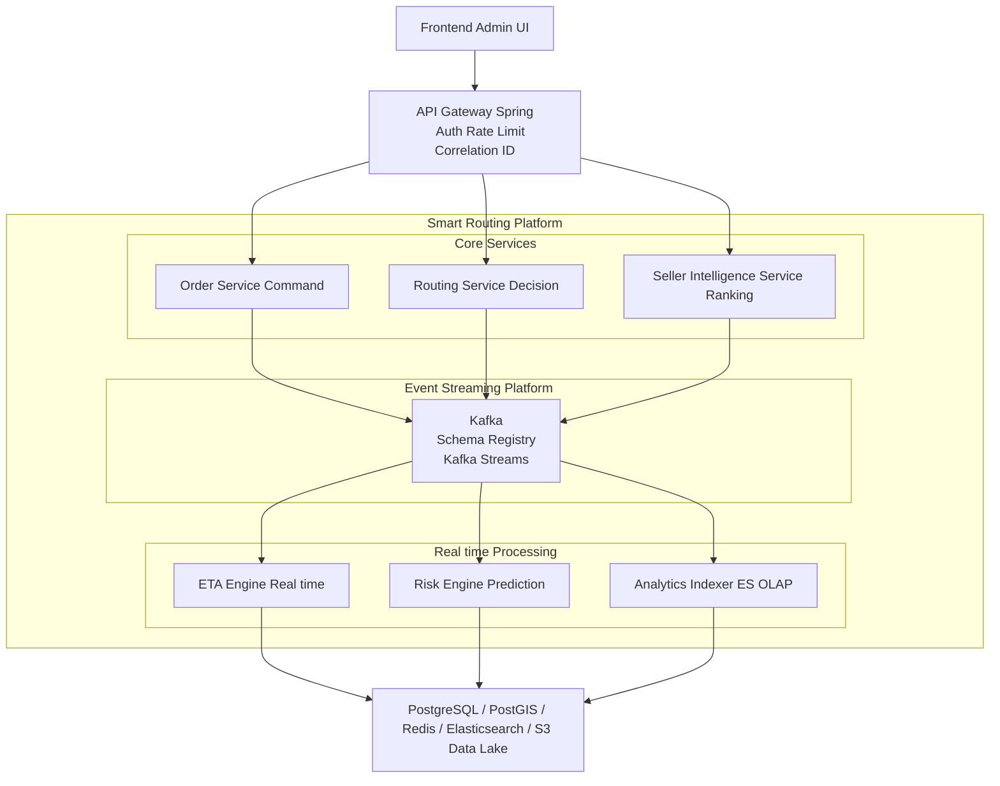

# [Project] OSM 기반 Smart Routing 시스템 아키텍처 설계

## 1. 아키텍처 설계 원칙 (Design Principles)

이 프로젝트의 핵심 철학은 다음 4가지입니다.

| 원칙 | 설명 |
| :--- | :--- |
| **이벤트 중심 (Event-Driven)** | 모든 결정(주문 생성, 셀러 배정, ETA 계산 등)은 이벤트로 기록됨 |
| **SQL 기반 진실 (Source of Truth)** | ML 이전 단계에서 완전히 설명 가능한 시스템 (Explainable System) |
| **CQRS (읽기/쓰기 분리)** | Routing, ETA, Ranking 등 조회성 작업은 읽기 최적화 모델 활용 |
| **관측 가능성 (Observability)** | “왜 지연되었는가?”를 Trace 단위로 설명할 수 있는 가시성 확보 |

## 2. 전체 시스템 구성 (Big Picture)



## 3. 핵심 마이크로서비스 설계 (Spring Boot)

### 3.1. Order Service (Command Side)
- **책임:** 주문 생성, 상태 변경, 이벤트 발행의 Single Source.
- **주요 이벤트:** `OrderCreated`, `OrderAssigned`, `OrderShipped`, `OrderDelivered`.
- **기술 스택:** Spring Boot 3.x, JPA (Write Model), Kafka Producer, OpenTelemetry.

```java
@Transactional
public Order createOrder(CreateOrderCommand cmd) {
    Order order = orderRepository.save(...);
    kafkaTemplate.send("order.created", OrderCreatedEvent.from(order));
    return order;
}
```

### 3.2. Routing Service (Decision Engine)
- **책임:** `calculate_smart_routing_score`, 최적 셀러 Top-N 선정, Confidence Level 산출.
- **기술 스택:** PostgreSQL (zip_road_profile), Redis 캐시.
- **캐시 전략:** `routing:{sellerZip}:{customerZip}` (TTL: 6~24h).

### 3.3. Seller Intelligence Service
- **책임:** `mv_seller_ranking` 관리, 셀러 티어 변경, 주간 리포트 생성.
- **특징:** Batch + Event Hybrid 방식, Kafka Consumer + Scheduler 활용.

### 3.4. ETA Engine (Real-time Compute)
- **책임:** `calculate_dynamic_eta`, 주문 시점 컨텍스트 반영 (Road Profile 등).
- **목표:** Latency < 100ms.

### 3.5. Risk Prediction Service
- **책임:** `predict_delay_risk`, 사전 알림 및 재배정 트리거 발송.
- **액션:** Slack 알림, ETA 자동 보정, 대안 셀러 재탐색.

## 4. Kafka 설계 (Event-Driven Backbone)

### 4.1. 토픽 설계
| Topic | Key | 설명 |
| :--- | :--- | :--- |
| `order.created` | `orderId` | 주문 생성 이벤트 |
| `routing.requested` | `orderId` | 라우팅 연산 요청 |
| `seller.assigned` | `orderId` | 최종 셀러 결정 및 배정 |
| `eta.computed` | `orderId` | 도착 예정 시간(ETA) 산출 완료 |
| `risk.predicted` | `orderId` | 지연 리스크 분석 결과 |

## 5. 데이터 계층 (Data Layer)

- **PostgreSQL + PostGIS:** Write Model(주문, 셀러) 및 Read Model(도로 프로파일, 랭킹) 관리.
- **Redis:** Routing Score 및 ETA 캐싱, 실시간 랭킹 스냅샷.
- **Elasticsearch (Optional):** 경로 탐색 및 위험 경로 검색, 운영용 대시보드 데이터.

## 6. 관측 가능성 (Observability)

- **OpenTelemetry:** 모든 이벤트에 `traceId` 주입 및 Kafka Header를 통한 전파.
- **Grafana Stack:** 
  - **Tempo:** 분산 트레이싱 (Trace)
  - **Prometheus:** 메트릭 (Metrics)
  - **Loki:** 로그 (Logs)
- **주요 모니터링 지표:** Routing Decision Latency, HIGH_RISK 비율, ETA Accuracy (Actual vs Predicted).

## 7. Phase별 진화 로드맵

| 단계 | 주요 내용 |
| :--- | :--- |
| **Phase 1 (현재)** | SQL 기반 Explainable Routing, Batch + Event 처리 |
| **Phase 2** | Kafka Streams 도입, 실시간 Replay 및 Backfill 지원 |
| **Phase 3** | ML (XGBoost) 도입, 기존 SQL 데이터를 Feature Store로 활용 |
| **Phase 4** | Autonomous Routing 및 Self-healing Logistics 시스템 구축 |
