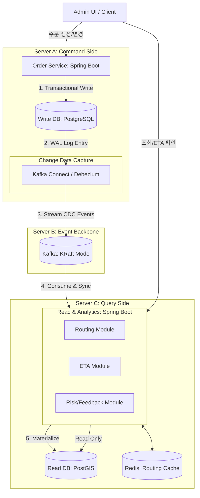
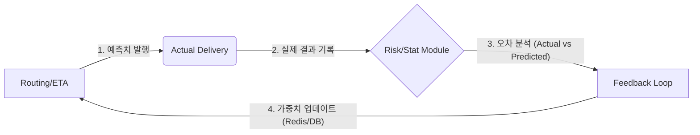

# [Project] OSM 기반 Smart Routing 시스템 아키텍처 설계

## 1. 아키텍처 설계 원칙 (Design Principles)

| 원칙                           | 설명                                                                                | 사유                                                               |
| ------------------------------ | ----------------------------------------------------------------------------------- | ------------------------------------------------------------------ |
| 느슨한 결합 (Loosely Coupled)  | Kafka를 매개체로 모듈 및 서버 간 통신, 의존성을 최소화하여 독립 배포 가능 구조 유지 | 서비스 간 결합도를 낮추고 비동기 처리를 통한 시스템 유연성 확보    |
| SQL 기반 통계 (Stat-Driven)    | PostgreSQL/PostGIS의 통계 및 공간 쿼리로 로직 구현                                  | 관리 비용 절감 및 로직의 직관적인 설명 가능성 확보                 |
| 물리적 CQRS (Physical CQRS)    | Command용 DB(RDB)와 Query용 DB(PostGIS/ES)를 물리적으로 분리                        | 쓰기 부하와 복잡한 조회/분석 부하를 격리하여 성능 및 안정성 극대화 |
| 운영 효율성 (Operational Lean) | Kafka KRaft 모드 등 인프라 구성을 최적화하여 1인 운영 가능 구조 지향                | 매니지드 서비스 없이도 감당 가능한 인프라 복잡도 유지              |

## 2. 전체 시스템 구성 (Big Picture)

## 3. 핵심 서버 및 모듈 설계

### 3.1. [Server A] Order Service (Command Side)

- 책임: 비즈니스 트랜잭션의 원자성 보장 및 원천 데이터(Source of Truth) 생성.핵심

- 로직: 더 이상 애플리케이션에서 Kafka 전송 로직을 호출하지 않습니다. DB 저장에만 집중하며, Debezium이 DB의 WAL(Write Ahead Log)을 읽어 이벤트를 발행합니다.

- 기술 스택: Spring Boot, Spring Data JPA, PostgreSQL.

- 안정성: 트랜잭션이 커밋되는 순간 데이터 정합성이 보장되며, CDC를 통해 "최소 한 번 이상의 전송(At-least-once delivery)"을 달성합니다.

### 3.2. [Server C] Query & Analytics Service (Read Side)

이 서버는 Kafka로부터 유입된 이벤트를 소비하여 조회와 분석에 최적화된 상태를 유지합니다.

#### 3.2.1. Routing & ETA Module (Decision)

- 책임: PostGIS 기반 지리 연산 및 실시간 ETA 산출.데이터
  구조: 조회 성능을 위해 정규화를 해제한(Denormalized) 테이블을 Read DB에 유지합니다.

Decision Engine: SQL 기반 가중치 점수 모델.점수 = (공간 거리 점수) + (셀러 신뢰도 가중치) + (Feedback Loop 지연 보정치).기술 스택: Spring Boot, PostGIS, Redis.

#### 3.2.2. Risk & Feedback Module (Analysis)

- 책임: 지연 이상 징후 감지 및 분석 결과를 시스템에 재투입(Feedback).알고리즘: $Z-Score$ 기반 이상치 탐지.
  Feedback Loop: 배송 완료 이벤트를 분석하여 오차율을 계산하고, 그 결과를 Read DB의 가중치 테이블이나 Redis에 즉시 반영하여 다음 ETA 계산의 정확도를 높입니다.

## 4. Kafka & CDC 설계 (Event Backbone)

### 4.1. Debezium 토픽 설계 (CDC Generated)

Debezium에 의해 자동 생성되는 토픽 구조입니다.

| Topic 명 (자동 생성)       | 설명                                         | 활용 모듈                     |
| -------------------------- | -------------------------------------------- | ----------------------------- |
| db.server_a.public.orders  | 주문 테이블의 모든 변경 이력 (Insert/Update) | RS, ETA, RISK (데이터 동기화) |
| db.server_a.public.sellers | 셀러 정보 및 상태 변경 이력                  | RS (배정 로직 반영)           |

### 4.2. 애플리케이션 발행 토픽 (Analysis Generated)

분석 모듈이 판단 후 발행하는 고수준 이벤트입니다.

| Topic          | Key     | 설명                                           |
| -------------- | ------- | ---------------------------------------------- |
| delivery.risk  | orderId | 분석 결과 지연 확정 시 알림 및 재배정 트리거용 |
| stats.feedback | routeId | 구간별 지연 가중치 보정값 (시스템 자가 치유용) |

## 5. 데이터 계층 (Data Layer)

| 구분 | Command DB (Server A)           | Read DB (Server C)                         |
| ---- | ------------------------------- | ------------------------------------------ |
| 역할 | 원천 데이터 저장 (OLTP)         | 공간 분석 및 통계 조회 (OLAP/GIS)          |
| 특징 | 정규화, 높은 트랜잭션 격리 수준 | 비정규화, PostGIS 활성화, GIST 인덱스 활용 |
| 스택 | PostgreSQL                      | PostgreSQL + PostGIS + Redis               |

## 6. Feedback Loop (Self-Correction 구조)

피드백 루프는 **"실제 배송 결과 데이터를 기반으로 다음 주문의 의사결정을 수정"**하는 것을 목표로 한다.

### 6.1. 피드백 루프 아키텍처 (Event-Driven Cycle)

### 6.2. 루프의 두 가지 유형

| 구분                   | 목적                  | 데이터 흐름                                  | 적용 주기           |
| ---------------------- | --------------------- | -------------------------------------------- | ------------------- |
| 단기 루프 (Short-term) | 실시간 지연 대응      | 지연 감지 시 즉시 ETA 보정 및 알림           | 즉시 (Event-driven) |
| 장기 루프 (Long-term)  | 셀러/경로 신뢰도 수정 | 배송 완료 후 통계를 내어 다음 배정 점수 반영 | 일일 (Batch/Stat)   |

### 6.3. 모듈별 피드백 로직 구현

#### 6.3.1. Routing Score 보정 (장기 루프)

- 로직: 특정 셀러가 최근 $N$건의 주문 중 $X$% 이상 지연을 발생시키면, Seller Intelligence에서 해당 셀러의 penalty_score를 증가.
- 데이터: PostgreSQL의 mv_seller_ranking에 가중치로 반영되어 다음번 Routing Service 호출 시 점수가 깎인 채로 계산.

#### 6.3.2. ETA 동적 보정 (단기 루프)

- 로직: Risk Module에서 특정 구간(Hub-to-Hub)의 이상 정체를 감지하면, 즉시 Redis의 route:delay:factor 값을 업데이트.
- 데이터: 이후 발생하는 모든 주문의 ETA Engine 연산 시, 기본 소요 시간에 Redis에 저장된 delay_factor가 더해져서 더 정확한 도착 시간이 산출.

## 7. 관측 가능성 (Observability: OpenTelemetry 기반)

기존의 개별 도구 의존적인 설계를 OpenTelemetry 표준 프로토콜(OTLP) 중심으로 통합하여 가시성을 확보합니다.

### 7.1. 수집 전략: OpenTelemetry Collector

통합 수집: Server A, B, C에서 발생하는 메트릭(Metrics), 트레이스(Traces), 로그(Logs)를 단일 표준(OTLP)으로 수집합니다.

표준화: 각 모듈(Order, RS, RISK)은 OpenTelemetry Java Agent를 사용하여 코드 수정 없이 자동으로 지표를 송출합니다.

### 7.2. 3대 관측 요소 (Signals)

분산 트레이싱 (Distributed Tracing):

Trace 전파: Order Service에서 생성된 traceId가 Kafka Header를 통해 Query Service까지 전파됩니다.

가시성: Debezium이 DB 로그를 읽어 Kafka로 보내는 시점부터 Query Side에서 분석을 완료하는 시점까지의 전체 구간(End-to-End) 지연 시간을 추적합니다.

표준 메트릭 (Metrics):

Infra: Kafka Lag, PostgreSQL 커넥션 풀, 서버 CPU/Memory.

Business: HIGH_RISK 주문 비율, ETA 정확도 오차 범위, 지역별 배송 지연 건수.

로그 통합 (Log Correlation):

모든 로그에 traceId와 spanId를 자동으로 삽입하여, 특정 에러 로그를 클릭하면 해당 주문의 전체 이동 경로(Trace)를 즉시 확인할 수 있게 연결합니다.

## 8. 관측 스택 구성 (오픈소스 기반)

매니지드 서비스를 사용하지 않으므로, 가장 대중적이고 가벼운 오픈소스 조합으로 구성합니다.

| 요소              | 기술 스택                | 비고                                           |
| ----------------- | ------------------------ | ---------------------------------------------- |
| Agent             | OpenTelemetry Java Agent | 자동 계측 (No-code instrumentation)            |
| Collector         | OTel Collector           | 데이터 가공 및 백엔드 전송                     |
| Storage (Trace)   | Grafana Tempo            | 가볍고 Grafana와 통합이 뛰어난 트레이스 저장소 |
| Storage (Metrics) | Prometheus               | 표준 시계열 데이터베이스                       |
| Visualization     | Grafana                  | 통합 대시보드 (Trace + Metric + Log)           |

8. Phase별 로드맵 (Refined)

| 단계                                  | 주요 내용                                                                       | 목표 및 성과 (Outcome)                                                                             |
| ------------------------------------- | ------------------------------------------------------------------------------- | -------------------------------------------------------------------------------------------------- |
| Phase 1: 인프라 및 CDC 기반 구축      | 물리적 CQRS 환경 셋업, Debezium을 통한 데이터 동기화 구현, SQL 기반 통계 라우팅 | 데이터 정합성 확보: 쓰기와 읽기 서버를 분리하고, CDC를 통해 유실 없는 이벤트 스트림 구축           |
| Phase 2: 관측 가능성 및 피드백 자동화 | OpenTelemetry(OTel) 통합, 실시간 지연 오차 측정 및 Feedback Loop(Redis/DB) 반영 | 시스템 가시성 확보: 주문부터 지연 감지까지의 End-to-End 트레이싱과 데이터 기반의 자가 보정 시작    |
| Phase 3: 데이터 파이프라인 고도화     | Kafka Streams를 이용한 실시간 이동 평균(Windowing) 및 구간별 병목 지표 산출     | 실시간성 극대화: 배치 처리가 아닌 스트림 프로세싱으로 지연 예측 정확도 향상                        |
| Phase 4: Self-healing & 지능화        | 지연 감지 시 대안 셀러/배송사 자동 재할당 로직 가동 및 모듈별 독립 스케일 아웃  | 자율 물류 구현: 운영자 개입 최소화 및 트래픽에 따른 특정 모듈(Query Side) 마이크로서비스 완벽 분리 |
|                                       |                                                                                 |                                                                                                    |

### 🚀 단계별 상세 전략

Phase 1: Foundation (기초)

- 집중: Server A(Write)와 Server C(Read)의 물리적 분리와 Debezium Connector 설정.

- 성과: 주문 로직에 Kafka 코드가 하나도 없어도 데이터가 Read DB로 실시간 복제되는 상태.

Phase 2: Intelligence & Visibility (지능 및 가시성)

- 집중: OpenTelemetry Collector를 통한 분산 트레이싱 구축.피드백 루프: 실제 도착 시간($Actual$)과 예측 시간($ETA$)의 차이를 분석하여 Redis의 가중치를 업데이트하는 Feedback Module 완성.

Phase 3: Streaming (실시간 최적화)

- 집중: 단순 SQL 통계를 넘어 Kafka Streams의 Windowing 기능을 활용해 "최근 1시간 내 특정 허브의 통과 시간" 같은 고차원 지표 생성.

- 성과: 갑작스러운 기상 악화나 사고 등의 변수를 분 단위로 ETA에 반영.

Phase 4: Autonomous (자율 운영)

- 집중: Risk Module이 발행한 이벤트를 Order Module이 구독하여, 특정 임계치 초과 시 자동으로 주문을 취소하거나 대안 경로로 재배정하는 자가 치유(Self-healing) 로직 적용.
